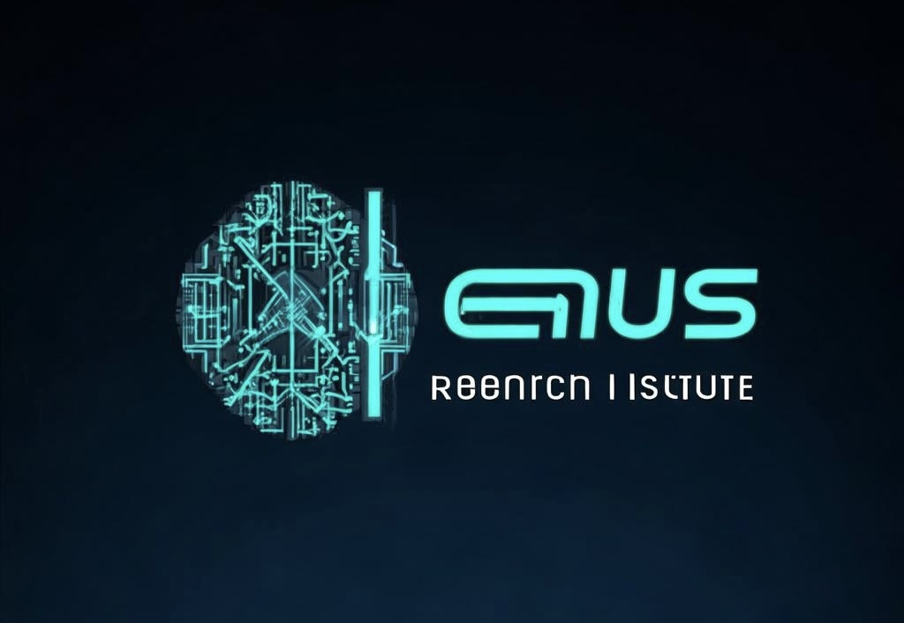

# 基于LLM的AI Agent 分析中国未来30年经济增长和投资战略

LLM-Based AI-Agent-Powered Analysis of China's Economic Growth and Investment Strategies

陈光剑 编著

AI 天才研究院 / AI Genius Institute, 2024

---

# 《基于LLM的AI Agent 分析中国未来30年经济增长和投资战略》

陈光剑 著

# 前言

# 第一部分：基础知识与技术准备

# 第1章：人工智能大模型与AI Agent概述
## 1.1 人工智能大模型的发展与现状
## 1.2 AI Agent的定义、特征与应用场景
## 1.3 AI Agent在经济分析与投资决策中的优势

# 第2章：中国经济基础知识
## 2.1 中国经济发展历程回顾
## 2.2 中国经济增长的主要驱动因素
## 2.3 中国经济面临的挑战与机遇

# 第3章：指数基金投资基础
## 3.1 指数基金的概念与特点
## 3.2 常见指数基金类型及其表现
## 3.3 指数基金投资策略概述

# 第二部分：AI Agent系统设计与开发

# 第4章：经济增长趋势分析AI Agent设计
## 4.1 数据源选择与预处理
## 4.2 经济指标体系构建
## 4.3 时间序列分析模型集成
## 4.4 情感分析与新闻事件影响评估

# 第5章：投资决策AI Agent设计
## 5.1 风险偏好与投资目标量化
## 5.2 资产配置模型设计
## 5.3 指数基金筛选与评估系统
## 5.4 市场时机选择策略

# 第6章：AI Agent系统集成与优化
## 6.1 经济分析与投资决策模块集成
## 6.2 用户交互界面设计
## 6.3 系统性能优化与扩展性考虑
## 6.4 安全性与隐私保护措施

# 第三部分：中国经济增长趋势分析

# 第7章：短期经济增长预测（1-5年）
## 7.1 后疫情时代经济复苏分析
## 7.2 产业结构调整对经济增长的影响
## 7.3 消费升级与内需扩大趋势
## 7.4 短期经济增长率预测

# 第8章：中期经济增长预测（5-15年）
## 8.1 人口结构变化对经济的影响
## 8.2 技术创新与产业升级趋势
## 8.3 绿色经济转型的经济效应
## 8.4 中期经济增长率预测

# 第9章：长期经济增长预测（15-30年）
## 9.1 全球经济格局变化与中国定位
## 9.2 人工智能与自动化对经济的深远影响
## 9.3 可持续发展目标实现对经济的塑造
## 9.4 长期经济增长率预测

# 第10章：区域经济发展趋势分析
## 10.1 京津冀协同发展前景
## 10.2 长三角一体化发展趋势
## 10.3 粤港澳大湾区经济增长潜力
## 10.4 中西部地区经济崛起分析

# 第四部分：指数基金投资策略

# 第11章：基于经济增长预测的指数基金筛选
## 11.1 宏观经济指标与指数基金相关性分析
## 11.2 行业发展趋势与相关指数基金匹配
## 11.3 区域经济热点与地区指数基金选择
## 11.4 主题投资机会识别与主题指数基金推荐

# 第12章：短期投资策略（1-5年）
## 12.1 经济复苏期的指数基金配置建议
## 12.2 政策导向型指数基金机会
## 12.3 科技创新相关指数基金分析
## 12.4 短期风险因素识别与规避

# 第13章：中期投资策略（5-15年）
## 13.1 产业升级背景下的指数基金调整
## 13.2 消费升级趋势下的指数基金布局
## 13.3 人口结构变化对指数基金影响分析
## 13.4 中期资产配置比例建议

# 第14章：长期投资策略（15-30年）
## 14.1 可持续发展主题指数基金长期价值
## 14.2 新兴产业指数基金长期增长潜力分析
## 14.3 全球化背景下的国际指数基金配置
## 14.4 长期投资组合构建与再平衡策略

# 第15章：风险管理与投资组合优化
## 15.1 宏观经济风险因素识别与应对
## 15.2 指数基金投资组合多元化策略
## 15.3 定期再平衡与风险控制方法
## 15.4 不同经济周期的投资组合调整策略

# 第五部分：实践与展望

# 第16章：案例分析
## 16.1 2020-2025年投资策略回测分析
## 16.2 基于区域经济发展的指数基金投资案例
## 16.3 主题投资在不同经济阶段的表现分析
## 16.4 长期价值投资与指数基金选择案例

# 第17章：AI Agent在经济分析与投资决策中的未来展望
## 17.1 AI技术在经济预测中的进步方向
## 17.2 个性化投资顾问AI Agent的发展前景
## 17.3 AI与人类专家协作的投资决策模式
## 17.4 AI Agent在金融科技领域的潜在应用

# 第18章：负责任的AI投资与可持续发展
## 18.1 AI投资决策的伦理考量
## 18.2 环境、社会和公司治理（ESG）因素在AI投资中的整合
## 18.3 AI Agent在促进可持续经济发展中的角色
## 18.4 监管科技与AI投资的未来平衡

# 附录
## 附录A：常用经济指标解释
## 附录B：主要指数基金列表及特征
## 附录C：AI模型技术细节
## 附录D：投资风险提示

# 参考文献

# 索引

---

# 捐赠：AI天才研究院

> Donate to AI Genius Institute:

| 微信                                                    | 支付宝                                                  |
| ------------------------------------------------------- | ------------------------------------------------------- |
|  |  |
