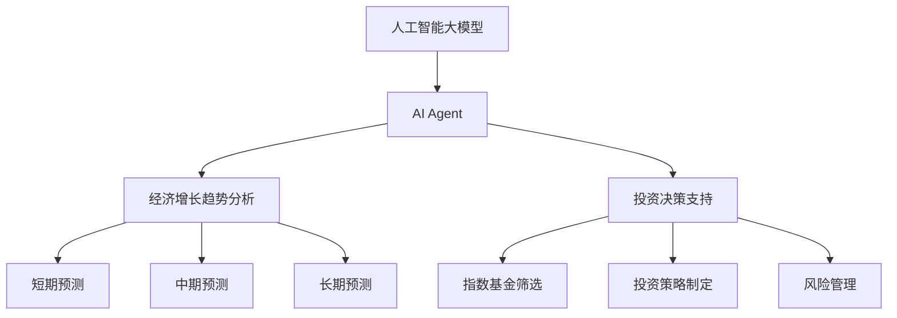
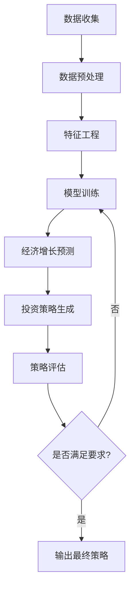

# 前言

在这个瞬息万变的时代，人工智能正以前所未有的速度重塑我们的世界。作为一名长期关注人工智能发展和经济趋势的研究者，我深感有必要将这两个领域的最新进展结合起来，为读者提供一个独特的视角，以洞察中国未来30年的经济发展轨迹，并据此制定明智的投资策略。

本书的核心在于利用基于人工智能大模型的AI Agent，对中国未来30年的经济增长趋势进行深入分析和预测，并在此基础上为指数基金投资提供系统性的指导。这一创新方法将人工智能的强大计算能力与经济学的深刻洞见相结合，旨在为投资者、政策制定者和经济学研究者提供一个全新的思考框架和决策工具。

## 核心概念：

- 人工智能大模型
- AI Agent
- 经济增长趋势分析
- 指数基金投资

## 问题背景

在过去几十年里，中国经济的快速增长举世瞩目。然而，随着全球经济格局的变化、人口结构的转变、技术革新的加速以及可持续发展需求的提升，中国经济正面临着前所未有的挑战和机遇。与此同时，投资领域也在经历深刻变革，指数基金因其低成本、高效率的特点，正成为越来越多投资者的选择。

## 问题描述

1. 如何准确预测中国未来30年的经济增长趋势？
2. 在复杂多变的经济环境中，如何制定有效的指数基金投资策略？
3. 人工智能技术，特别是AI Agent，如何在经济分析和投资决策中发挥作用？

## 问题解决

本书通过以下方式解决上述问题：

1. 设计和开发基于人工智能大模型的AI Agent系统，专门用于经济趋势分析和投资决策。
2. 对中国经济的短期（1-5年）、中期（5-15年）和长期（15-30年）发展进行全面预测和分析。
3. 基于经济增长预测，提供详细的指数基金投资策略指南，涵盖不同时间跨度和投资目标。
4. 探讨AI Agent在经济分析与投资决策中的应用前景和伦理考量。

## 边界与外延

本书虽然聚焦于中国经济和指数基金投资，但其方法论和思路可以延伸应用到其他经济体和投资领域。同时，书中讨论的AI技术在金融科技、政策制定等领域也有广阔的应用空间。

## 概念结构与核心要素组成

## 概念之间的关系

| 概念 | 计算能力 | 数据处理 | 预测准确性 | 决策支持 |
|------|----------|----------|------------|----------|
| 人工智能大模型 | 极强 | 海量 | 高 | 间接 |
| AI Agent | 强 | 定向 | 较高 | 直接 |
| 传统经济分析方法 | 有限 | 有限 | 中等 | 间接 |
| 人工投资决策 | 有限 | 有限 | 不稳定 | 直接 |

## 数学模型

经济增长预测模型（简化版）：

$$
G_t = \alpha + \beta_1X_{1t} + \beta_2X_{2t} + ... + \beta_nX_{nt} + \epsilon_t
$$

其中，$G_t$表示t时期的经济增长率，$X_{it}$表示影响经济增长的各种因素，$\beta_i$是相应的系数，$\epsilon_t$是误差项。

## 算法流程图

## 实际场景应用

本书的方法和工具可以应用于以下场景：

1. 个人投资者制定长期投资计划
2. 机构投资者进行资产配置
3. 政府部门制定经济政策
4. 企业进行战略规划

## 行业发展与未来趋势

| 年份 | 事件 |
|------|------|
| 2012 | 深度学习在图像识别领域取得突破 |
| 2016 | AlphaGo击败人类围棋冠军 |
| 2020 | GPT-3展示大规模语言模型的潜力 |
| 2022 | ChatGPT引发AI应用新浪潮 |
| 2023 | AI在金融分析和预测中的应用日益普及 |
| 2025（预测） | AI辅助决策系统在主要金融机构广泛应用 |
| 2030（预测） | AI与人类专家深度协作成为经济分析主流 |

本书旨在为读者提供一个前瞻性的视角，探索人工智能如何革新经济分析和投资决策。通过系统性地分析中国未来30年的经济增长趋势，并将这些洞见转化为实用的指数基金投资策略，我们希望能够帮助读者在这个充满不确定性的时代做出更明智的投资决策。

让我们携手踏上这段探索未来的旅程，共同见证人工智能如何重塑我们理解和参与经济的方式。