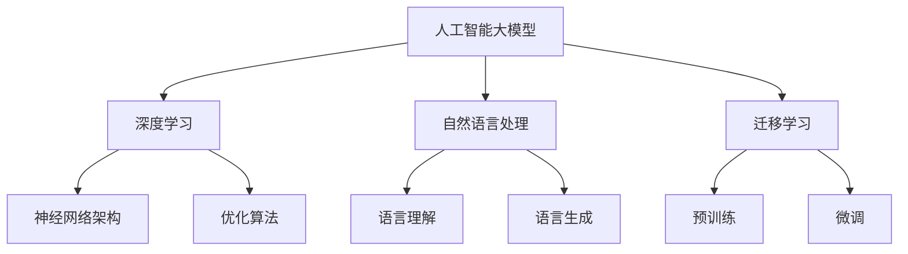
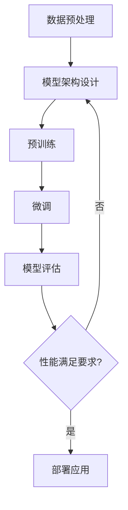
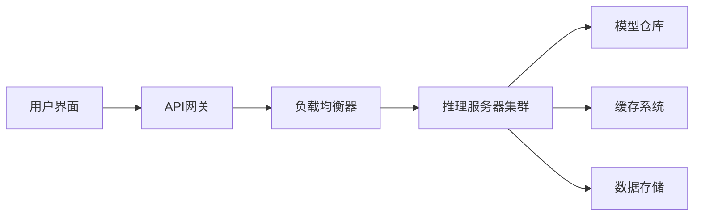
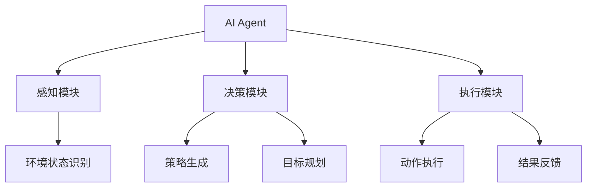
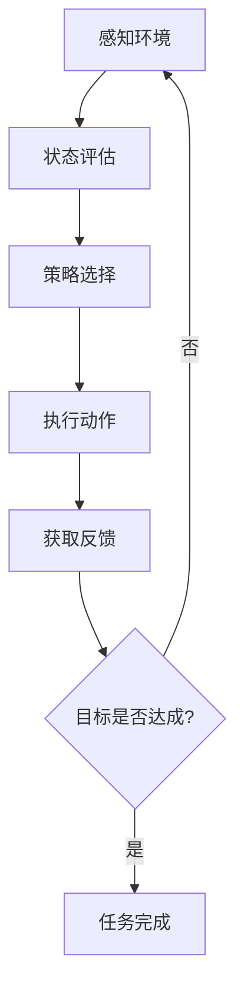
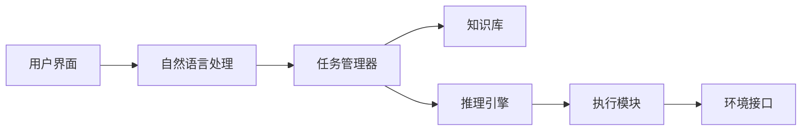
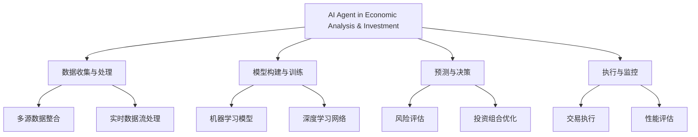
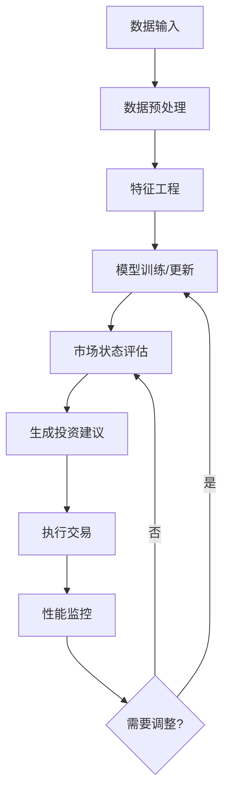
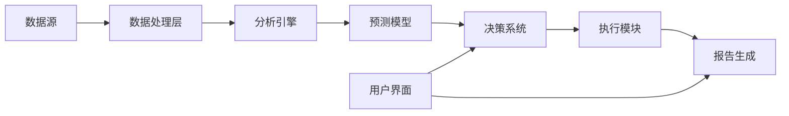

# 第一部分：基础知识与技术准备

# 第1章：人工智能大模型与AI Agent概述

## 1.1 人工智能大模型的发展与现状

人工智能大模型是当前AI领域最前沿的技术成果之一，它通过海量数据训练，能够执行各种复杂的认知任务。本节将深入探讨人工智能大模型的发展历程、技术原理及其在各领域的应用现状。

### 核心概念：
* 人工智能大模型
* 深度学习
* 自然语言处理
* 迁移学习

### 问题背景
随着计算能力的提升和数据量的爆炸性增长，传统的AI模型在处理复杂任务时显得力不从心。人工智能大模型应运而生，旨在通过更大规模的参数和更复杂的架构来模拟人类的认知能力。

### 问题描述
1. 人工智能大模型是如何发展起来的？
2. 当前人工智能大模型的技术水平如何？
3. 人工智能大模型在各领域的应用情况如何？

### 问题解决
为了全面解答上述问题，我们将从以下几个方面展开讨论：

1. 人工智能大模型的发展历程
2. 主要技术原理和架构
3. 代表性模型介绍（如GPT系列、BERT、T5等）
4. 应用领域和案例分析
5. 技术挑战和未来发展方向

### 边界与外延
虽然本节主要聚焦于人工智能大模型，但其影响已经延伸到AI的各个分支，包括计算机视觉、语音识别等。同时，大模型技术也正在影响传统行业的数字化转型过程。

### 概念结构与核心要素组成



### 概念之间的关系

| 概念 | 参数规模 | 训练数据量 | 计算复杂度 | 通用性 |
|------|----------|------------|------------|--------|
| 传统机器学习模型 | 小 | 中等 | 低 | 低 |
| 深度学习模型 | 中等 | 大 | 高 | 中等 |
| 人工智能大模型 | 极大 | 海量 | 极高 | 高 |

### 数学模型
以Transformer架构为例，其核心的自注意力机制可以用以下数学公式表示：

$$
Attention(Q, K, V) = softmax(\frac{QK^T}{\sqrt{d_k}})V
$$

其中，$Q$、$K$、$V$分别代表查询、键和值矩阵，$d_k$是键向量的维度。

### 算法流程图



### 实际场景应用
人工智能大模型在以下场景中有广泛应用：

1. 智能客服系统
2. 内容生成和创作辅助
3. 代码自动生成
4. 复杂问题求解和决策支持
5. 多模态任务处理（如图像描述生成）

### 项目介绍
以GPT-3为例，它是由OpenAI开发的大规模语言模型，拥有1750亿个参数。GPT-3能够执行各种自然语言处理任务，如文本生成、翻译、问答等，展现出惊人的语言理解和生成能力。

### 环境安装
对于大多数研究者和开发者来说，直接部署和运行完整的人工智能大模型是不现实的。然而，我们可以使用一些开源的小型版本或API服务来体验大模型的能力。以Hugging Face的Transformers库为例：

```python
pip install transformers
```

### 系统功能设计
一个基于大模型的AI系统通常包括以下功能模块：

1. 数据输入和预处理
2. 模型推理
3. 结果后处理
4. 用户交互界面
5. 性能监控和优化

### 系统架构设计



### 系统接口设计
以RESTful API为例：

1. `/predict`: POST请求，接收用户输入，返回模型预测结果
2. `/models`: GET请求，获取可用模型列表
3. `/feedback`: POST请求，接收用户反馈，用于模型改进

### 系统核心实现源代码
使用Transformers库加载和使用预训练模型的示例代码：

```python
from transformers import AutoModelForCausalLM, AutoTokenizer

# 加载预训练模型和分词器
model_name = "gpt2"
model = AutoModelForCausalLM.from_pretrained(model_name)
tokenizer = AutoTokenizer.from_pretrained(model_name)

# 生成文本
input_text = "人工智能的未来是"
input_ids = tokenizer.encode(input_text, return_tensors="pt")
output = model.generate(input_ids, max_length=100, num_return_sequences=1)

# 解码输出
generated_text = tokenizer.decode(output[0], skip_special_tokens=True)
print(generated_text)
```

### 最佳实践tips
1. 选择适合任务的预训练模型
2. 进行任务特定的微调
3. 使用模型压缩技术提高推理效率
4. 实施持续学习和模型更新机制
5. 注意隐私保护和伦理使用

### 行业发展与未来趋势

| 年份 | 事件 |
|------|------|
| 2017 | Transformer架构提出，开启大模型时代 |
| 2018 | BERT模型发布，推动NLP任务性能大幅提升 |
| 2020 | GPT-3展示大规模语言模型的潜力 |
| 2022 | ChatGPT引发全球AI应用热潮 |
| 2023 | 多模态大模型成为研究热点 |
| 2025（预测） | 领域特定大模型在各行业广泛应用 |
| 2030（预测） | 通用人工智能研究取得重大突破 |

### 本章小结
人工智能大模型作为AI技术的最新成果，正在深刻改变我们与技术交互的方式。从自然语言处理到复杂问题求解，大模型展现出前所未有的能力。然而，我们也需要正视其在计算资源、环境影响和伦理使用等方面的挑战。未来，随着技术的不断进步，我们有理由相信人工智能大模型将在更广泛的领域发挥重要作用，推动人类认知能力的进一步扩展。

## 1.2 AI Agent的定义、特征与应用场景

AI Agent是一种能够感知环境、做出决策并采取行动以实现特定目标的智能系统。在人工智能大模型的基础上，AI Agent进一步具备了自主性和交互能力，成为连接AI技术与实际应用的重要桥梁。

### 核心概念：
* AI Agent
* 自主性
* 感知-决策-行动循环
* 多Agent系统

### 问题背景
随着AI技术的发展，单纯的模型输出已经无法满足复杂场景的需求。用户和行业需要更智能、更自主的AI系统来处理动态变化的环境和任务。

### 问题描述
1. AI Agent的本质是什么？
2. AI Agent与传统AI系统有何区别？
3. AI Agent在哪些领域有潜在的应用价值？

### 问题解决
为全面解答上述问题，我们将从以下几个方面展开讨论：

1. AI Agent的定义和核心特征
2. AI Agent的工作原理和架构
3. AI Agent与人工智能大模型的关系
4. AI Agent的典型应用场景
5. AI Agent面临的挑战和未来发展方向

### 边界与外延
AI Agent的概念源于人工智能领域，但其应用已经延伸到机器人学、自动控制、智能制造等多个领域。同时，AI Agent也正在与物联网、边缘计算等技术融合，创造出新的应用可能。

### 概念结构与核心要素组成



### 概念之间的关系

| 概念 | 自主性 | 交互能力 | 学习能力 | 适应性 |
|------|--------|----------|----------|--------|
| 传统AI系统 | 低 | 有限 | 固定 | 低 |
| AI大模型 | 中等 | 强 | 强 | 中等 |
| AI Agent | 高 | 很强 | 持续 | 高 |

### 数学模型
AI Agent的决策过程可以用马尔可夫决策过程（MDP）来描述：

$$
V^\pi(s) = \mathbb{E}_\pi[\sum_{t=0}^{\infty} \gamma^t R_{t+1} | S_0 = s]
$$

其中，$V^\pi(s)$是在策略$\pi$下状态$s$的价值函数，$\gamma$是折扣因子，$R_t$是在时间步$t$获得的奖励。

### 算法流程图



### 实际场景应用
AI Agent在以下场景中有广泛应用：

1. 智能客服和虚拟助手
2. 自动驾驶系统
3. 智能家居控制
4. 金融交易和风险管理
5. 游戏AI和模拟训练

### 项目介绍
以OpenAI的GPT-3.5-turbo为基础构建的AI Agent系统为例，它能够理解用户指令，执行复杂任务，如信息检索、数据分析、代码生成等，并与用户进行自然语言交互。

### 环境安装
使用Python和OpenAI API构建简单的AI Agent：

```python
pip install openai
```

### 系统功能设计
一个基础的AI Agent系统通常包括以下功能模块：

1. 自然语言理解
2. 任务分解和规划
3. 知识检索和推理
4. 动作执行和环境交互
5. 学习和适应机制

### 系统架构设计



### 系统接口设计
RESTful API示例：

1. `/command`: POST请求，接收用户指令
2. `/status`: GET请求，获取当前任务状态
3. `/result`: GET请求，获取任务执行结果
4. `/learn`: POST请求，提交新知识或反馈

### 系统核心实现源代码
使用OpenAI API构建简单AI Agent的示例代码：

```python
import openai

openai.api_key = 'your-api-key'

class SimpleAIAgent:
    def __init__(self):
        self.conversation_history = []

    def process_command(self, user_input):
        self.conversation_history.append({"role": "user", "content": user_input})
        
        response = openai.ChatCompletion.create(
            model="gpt-3.5-turbo",
            messages=self.conversation_history
        )

        ai_response = response.choices[0].message['content']
        self.conversation_history.append({"role": "assistant", "content": ai_response})
        
        return ai_response

    def execute_task(self, task):
        # 这里可以添加具体的任务执行逻辑
        pass

agent = SimpleAIAgent()
while True:
    user_input = input("请输入您的指令：")
    if user_input.lower() == 'exit':
        break
    response = agent.process_command(user_input)
    print("AI Agent:", response)
```

### 最佳实践tips
1. 设计清晰的目标和奖励函数
2. 实现有效的环境模拟和任务抽象
3. 采用增量学习和迁移学习提高适应性
4. 注重AI Agent的可解释性和透明度
5. 建立人机协作机制，保持人类监督

### 行业发展与未来趋势

| 年份 | 事件 |
|------|------|
| 2015 | DeepMind的DQN在Atari游戏中超越人类 |
| 2017 | OpenAI开发出在DOTA2中击败职业选手的AI |
| 2020 | GPT-3展示了大规模语言模型作为AI Agent的潜力 |
| 2022 | 自动驾驶AI Agent在多个城市开始商业化测试 |
| 2023 | AI Agent在客服和个人助理领域广泛应用 |
| 2025（预测） | 多Agent协作系统在复杂任务中取得突破 |
| 2030（预测） | 通用AI Agent在日常生活中普及 |

### 本章小结
AI Agent作为人工智能技术的前沿应用，正在重新定义人机交互的方式。通过将感知、决策和执行能力整合在一个自主系统中，AI Agent能够在复杂、动态的环境中执行各种任务。尽管当前的AI Agent还存在诸如鲁棒性、泛化能力等方面的挑战，但其在提高效率、增强人类能力方面的潜力是巨大的。随着技术的不断进步，我们可以期待看到AI Agent在更多领域发挥关键作用，推动人工智能从被动响应向主动服务的转变。


## 1.3 AI Agent在经济分析与投资决策中的优势

AI Agent在经济分析与投资决策领域的应用正在迅速增长，其独特优势为传统方法带来了革命性的变革。本节将深入探讨AI Agent如何提升经济分析的准确性和投资决策的效率。

### 核心概念：
* 数据驱动决策
* 实时分析
* 多维度信息整合
* 自适应学习

### 问题背景
经济分析和投资决策长期以来依赖于人类专家的经验和直觉。然而，面对日益复杂的全球经济环境和海量的实时数据，传统方法已经难以应对。

### 问题描述
1. AI Agent如何提高经济分析的准确性和效率？
2. 在投资决策过程中，AI Agent能够发挥哪些独特优势？
3. AI Agent如何克服人类决策者的认知偏差和情绪影响？

### 问题解决
为全面解答上述问题，我们将从以下几个方面展开讨论：

1. AI Agent在数据处理和分析中的优势
2. AI Agent在模式识别和趋势预测中的能力
3. AI Agent如何实现全天候、多市场的监控和分析
4. AI Agent在投资组合优化中的应用
5. AI Agent与人类专家协作的最佳实践

### 边界与外延
虽然本节聚焦于经济分析和投资决策，但AI Agent的这些优势同样适用于其他复杂决策领域，如政策制定、企业战略规划等。

### 概念结构与核心要素组成



### 概念之间的关系

| 特性 | 传统方法 | AI Agent |
|------|----------|----------|
| 数据处理能力 | 有限 | 海量 |
| 分析速度 | 慢 | 实时 |
| 模式识别 | 依赖经验 | 数据驱动 |
| 情绪影响 | 显著 | 最小化 |
| 适应性 | 低 | 高 |

### 数学模型
以投资组合优化为例，AI Agent可以使用现代投资组合理论（MPT）并加以改进：

$$
\max_w \left( w^T\mu - \frac{\lambda}{2}w^T\Sigma w \right)
$$

其中，$w$是权重向量，$\mu$是预期收益向量，$\Sigma$是协方差矩阵，$\lambda$是风险厌恶系数。AI Agent可以动态调整$\lambda$和预测$\mu$、$\Sigma$，以适应市场变化。

### 算法流程图



### 实际场景应用
AI Agent在经济分析与投资决策中的应用场景包括：

1. 宏观经济趋势预测
2. 股票市场分析和选股
3. 高频交易策略执行
4. 风险管理和资产配置
5. 新闻和社交媒体情绪分析

### 项目介绍
以"EconoAI"为例，这是一个基于AI Agent的经济分析和投资决策支持系统。它能够实时处理全球金融市场数据、经济指标、新闻流和社交媒体信息，生成宏观经济预测和投资建议。

### 环境安装
使用Python构建基础的AI Agent经济分析系统：

```python
pip install pandas numpy scikit-learn tensorflow
```

### 系统功能设计
EconoAI系统包括以下核心功能模块：

1. 数据采集与清洗
2. 经济指标分析
3. 市场情绪评估
4. 趋势预测
5. 投资组合优化
6. 风险管理
7. 报告生成

### 系统架构设计



### 系统接口设计
RESTful API示例：

1. `/market-data`: GET请求，获取实时市场数据
2. `/economic-indicators`: GET请求，获取经济指标分析
3. `/predict`: POST请求，提交预测任务
4. `/optimize-portfolio`: POST请求，获取优化的投资组合
5. `/execute-trade`: POST请求，执行交易指令

### 系统核心实现源代码
使用Python实现简单的经济指标分析和预测：

```python
import pandas as pd
import numpy as np
from sklearn.model_selection import train_test_split
from sklearn.linear_model import LinearRegression
from sklearn.metrics import mean_squared_error

class EconomicAnalysisAgent:
    def __init__(self):
        self.model = LinearRegression()
        self.data = None

    def load_data(self, file_path):
        self.data = pd.read_csv(file_path)
        
    def preprocess_data(self):
        # 假设我们使用GDP增长率、通胀率和失业率来预测下一季度的GDP
        X = self.data[['GDP_growth', 'Inflation', 'Unemployment']]
        y = self.data['Next_quarter_GDP']
        return train_test_split(X, y, test_size=0.2, random_state=42)

    def train_model(self):
        X_train, X_test, y_train, y_test = self.preprocess_data()
        self.model.fit(X_train, y_train)
        
        # 评估模型
        y_pred = self.model.predict(X_test)
        mse = mean_squared_error(y_test, y_pred)
        print(f"Model MSE: {mse}")

    def predict(self, gdp_growth, inflation, unemployment):
        return self.model.predict([[gdp_growth, inflation, unemployment]])

# 使用示例
agent = EconomicAnalysisAgent()
agent.load_data('economic_data.csv')
agent.train_model()

# 预测下一季度GDP
prediction = agent.predict(2.5, 1.8, 5.5)
print(f"Predicted next quarter GDP growth: {prediction[0]:.2f}%")
```

### 最佳实践tips
1. 确保数据质量和实时性
2. 定期重新训练模型以适应市场变化
3. 结合多种模型和技术以提高预测准确性
4. 实施严格的风险管理措施
5. 保持人类监督，特别是在重大决策时
6. 持续监控和评估AI Agent的性能

### 行业发展与未来趋势

| 年份 | 事件 |
|------|------|
| 2010 | 高频交易算法在金融市场广泛应用 |
| 2016 | IBM Watson开始为投资决策提供支持 |
| 2020 | AI驱动的量化投资基金表现优于传统基金 |
| 2022 | 大型金融机构普遍采用AI进行风险管理 |
| 2023 | AI Agent在预测经济指标方面超越人类专家 |
| 2025（预测） | AI与区块链技术结合，革新金融市场 |
| 2030（预测） | AI Agent成为经济政策制定的核心顾问 |

### 本章小结
AI Agent在经济分析与投资决策领域展现出了巨大的潜力。通过其强大的数据处理能力、模式识别能力和自适应学习能力，AI Agent能够提供更准确、更及时的经济预测和投资建议。它们不仅能够处理传统的结构化数据，还能分析非结构化数据如新闻和社交媒体信息，从而捕捉市场情绪和潜在趋势。

然而，我们也需要认识到AI Agent的局限性。金融市场的复杂性和不可预测性意味着即使是最先进的AI系统也可能出错。因此，将AI Agent视为强大的决策支持工具，而非完全替代人类判断，这一点至关重要。

未来，随着技术的不断进步，我们可以期待看到AI Agent在经济分析和投资决策中发挥越来越重要的作用。它们将帮助我们更好地理解复杂的经济系统，做出更明智的投资决策，并可能为经济政策的制定提供宝贵的洞察。


