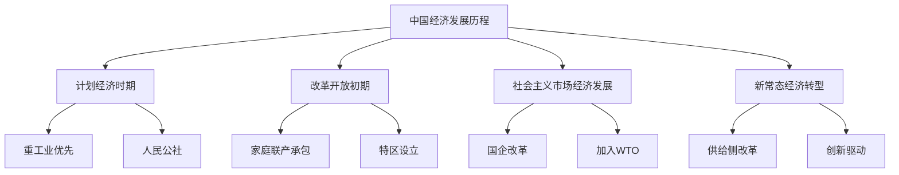
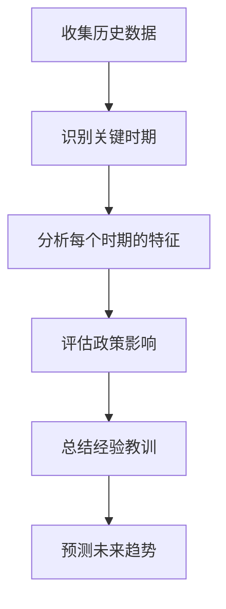
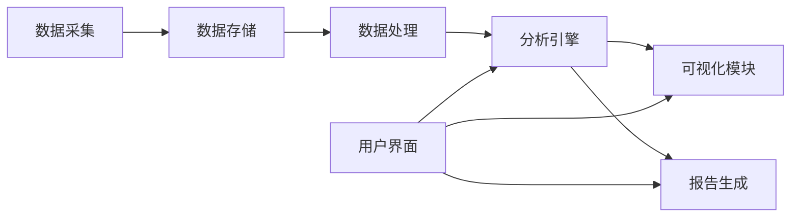
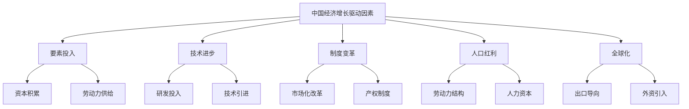
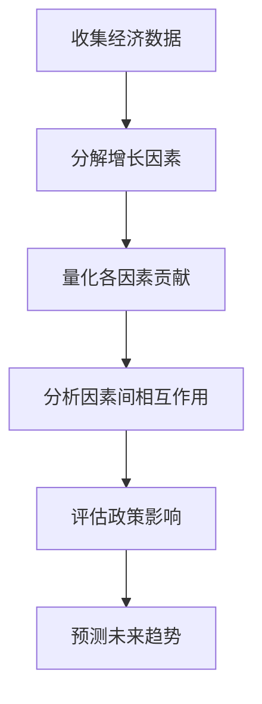
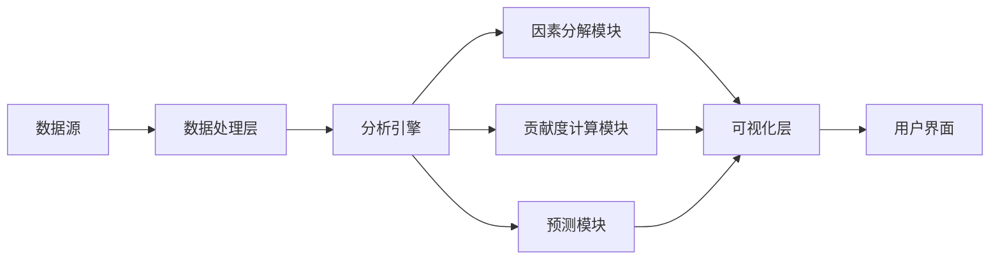
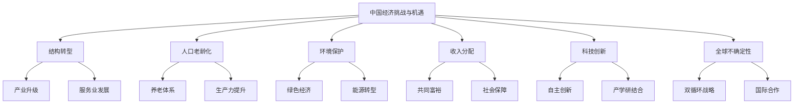
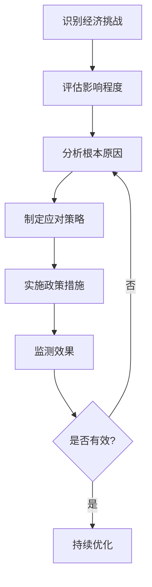
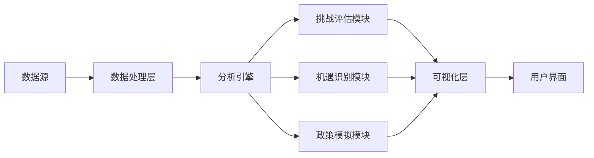

# 第2章：中国经济基础知识

## 2.1 中国经济发展历程回顾

中国经济的发展历程是一部波澜壮阔的现代化进程史。从1949年新中国成立到今天，中国经济经历了多个重要阶段，每个阶段都有其独特的特征和贡献。本节将系统回顾这一历程，为理解当前中国经济状况和预测未来趋势奠定基础。

### 核心概念：
* 计划经济
* 改革开放
* 社会主义市场经济
* 新常态

### 问题背景
中国作为世界第二大经济体，其经济发展历程对全球经济格局产生了深远影响。了解这一历程不仅有助于理解中国经济的现状，也为预测未来走向提供了重要参考。

### 问题描述
1. 中国经济发展的主要阶段有哪些？
2. 每个阶段的特征和重大政策是什么？
3. 这些历史阶段如何塑造了当前的中国经济？

### 问题解决
为全面解答上述问题，我们将从以下几个方面展开讨论：

1. 1949-1978：计划经济时期
2. 1978-1992：改革开放初期
3. 1992-2012：社会主义市场经济的确立和发展
4. 2012至今：新常态下的经济转型

### 边界与外延
虽然本节主要聚焦于经济发展，但我们也会涉及相关的政治、社会和文化因素，以全面理解中国经济发展的背景和动力。

### 概念结构与核心要素组成



### 概念之间的关系

| 时期 | 经济体制 | 主要特征 | 增长动力 | 国际关系 |
|------|----------|----------|----------|----------|
| 1949-1978 | 计划经济 | 集中管理 | 重工业投资 | 相对封闭 |
| 1978-1992 | 计划与市场并存 | 渐进改革 | 农村改革、外资引入 | 逐步开放 |
| 1992-2012 | 社会主义市场经济 | 全面市场化 | 出口导向、投资驱动 | 深度融入全球 |
| 2012至今 | 新常态 | 结构优化 | 创新、消费、服务业 | 双循环新格局 |

### 数学模型
以GDP增长率为例，我们可以使用复合年增长率（CAGR）来描述不同时期的经济增长：

$$
CAGR = \left(\frac{End Value}{Start Value}\right)^{\frac{1}{n}} - 1
$$

其中，$n$是年数。这个公式可以用来计算和比较不同历史阶段的经济增长速度。

### 算法流程图



### 实际场景应用
了解中国经济发展历程对以下场景有重要意义：

1. 制定长期经济政策
2. 进行国际比较研究
3. 预测未来经济走势
4. 制定企业发展战略
5. 进行历史经济学研究

### 项目介绍
"中国经济发展历程数据库"是一个综合性的数字化项目，旨在收集、整理和分析中国自1949年以来的经济数据、政策文件和历史事件。该数据库为研究者、政策制定者和投资者提供了宝贵的历史资料和分析工具。

### 环境安装
使用Python构建简单的历史数据分析工具：

```python
pip install pandas matplotlib numpy
```

### 系统功能设计
中国经济发展历程分析系统包括以下功能模块：

1. 历史数据收集与存储
2. 时期划分与特征提取
3. 政策影响评估
4. 经济指标可视化
5. 趋势分析与预测

### 系统架构设计



### 系统接口设计
RESTful API示例：

1. `/historical-data`: GET请求，获取特定时期的经济数据
2. `/policy-analysis`: GET请求，获取特定政策的影响分析
3. `/economic-indicators`: GET请求，获取主要经济指标的历史数据
4. `/period-comparison`: POST请求，比较不同时期的经济表现
5. `/trend-forecast`: POST请求，基于历史数据预测未来趋势

### 系统核心实现源代码
使用Python实现简单的经济数据分析和可视化：

```python
import pandas as pd
import matplotlib.pyplot as plt

class ChinaEconomicAnalyzer:
    def __init__(self):
        self.data = None

    def load_data(self, file_path):
        self.data = pd.read_csv(file_path)
        
    def plot_gdp_growth(self):
        plt.figure(figsize=(12, 6))
        plt.plot(self.data['Year'], self.data['GDP_Growth'])
        plt.title('China GDP Growth Rate (1952-2021)')
        plt.xlabel('Year')
        plt.ylabel('GDP Growth Rate (%)')
        plt.grid(True)
        plt.show()

    def analyze_period(self, start_year, end_year):
        period_data = self.data[(self.data['Year'] >= start_year) & (self.data['Year'] <= end_year)]
        avg_growth = period_data['GDP_Growth'].mean()
        print(f"Average GDP growth from {start_year} to {end_year}: {avg_growth:.2f}%")

# 使用示例
analyzer = ChinaEconomicAnalyzer()
analyzer.load_data('china_economic_data.csv')
analyzer.plot_gdp_growth()
analyzer.analyze_period(1978, 1992)  # 分析改革开放初期
```

### 最佳实践tips
1. 确保数据的准确性和一致性
2. 考虑通货膨胀因素，使用实际GDP而非名义GDP进行长期比较
3. 结合定量分析和定性分析，全面理解历史背景
4. 注意不同时期统计口径的变化，确保数据可比性
5. 在分析中考虑国际环境的影响
6. 保持客观中立的态度，避免意识形态偏见

### 行业发展与未来趋势

| 年份 | 事件 |
|------|------|
| 1952 | 开始实施第一个五年计划 |
| 1958 | 大跃进运动开始 |
| 1978 | 改革开放政策启动 |
| 1992 | 邓小平南方谈话，确立社会主义市场经济目标 |
| 2001 | 中国加入世界贸易组织（WTO） |
| 2008 | 应对全球金融危机，推出4万亿元刺激计划 |
| 2013 | 提出"一带一路"倡议 |
| 2020 | 新冠疫情下，中国成为唯一实现正增长的主要经济体 |
| 2025（预测） | 全面建成小康社会后的新发展阶段 |
| 2035（预测） | 基本实现社会主义现代化 |

### 本章小结
中国经济发展历程是一部充满挑战和成就的历史。从1949年的百废待兴到今天的经济大国，中国经历了计划经济时期的艰难探索、改革开放初期的大胆尝试、社会主义市场经济的蓬勃发展，以及新常态下的转型升级。每个阶段都有其特定的历史背景、政策取向和发展特征，共同塑造了当今中国经济的面貌。

理解这一历程对于把握中国经济的未来走向至关重要。它不仅展示了中国经济的韧性和适应能力，也揭示了深层次的结构性问题和潜在风险。随着中国进入高质量发展阶段，创新、协调、绿色、开放、共享的新发展理念将继续引领中国经济向前发展。

未来，中国经济将面临人口老龄化、环境压力、国际竞争等诸多挑战，但同时也蕴含着巨大的发展机遇。通过持续深化改革、扩大开放、推动创新，中国有望实现经济的可持续增长，并在全球经济舞台上发挥更加重要的作用。

## 2.2 中国经济增长的主要驱动因素

中国经济的快速增长是多种因素共同作用的结果。本节将深入分析推动中国经济持续增长的关键驱动力，为理解中国经济发展模式和预测未来趋势提供重要洞察。

### 核心概念：
* 要素投入
* 技术进步
* 制度变革
* 人口红利
* 全球化

### 问题背景
中国经济在过去几十年保持了高速增长，成为全球第二大经济体。理解这一增长背后的驱动因素对于评估中国经济的可持续性和预测未来发展至关重要。

### 问题描述
1. 哪些因素是推动中国经济增长的主要动力？
2. 这些驱动因素的相对重要性如何随时间变化？
3. 未来哪些因素将继续支撑中国经济增长？

### 问题解决
为全面解答上述问题，我们将从以下几个方面展开讨论：

1. 要素投入：资本积累和劳动力供给
2. 技术进步和创新
3. 制度变革和政策支持
4. 人口红利和人力资本积累
5. 全球化和对外开放

### 边界与外延
虽然本节主要聚焦于经济增长的驱动因素，但我们也会涉及这些因素对社会发展、环境影响等方面的作用，以全面理解中国经济增长的动力机制。

### 概念结构与核心要素组成



### 概念之间的关系

| 驱动因素 | 早期改革阶段 | 快速增长阶段 | 新常态阶段 | 未来趋势 |
|----------|--------------|--------------|------------|----------|
| 要素投入 | 高 | 很高 | 中 | 低 |
| 技术进步 | 低 | 中 | 高 | 很高 |
| 制度变革 | 很高 | 高 | 中 | 中 |
| 人口红利 | 高 | 很高 | 低 | 负面 |
| 全球化   | 中 | 很高 | 高 | 中 |

### 数学模型
使用索洛增长模型来描述经济增长的驱动因素：

$$
Y = A \cdot F(K, L)
$$

其中，$Y$是总产出，$A$是全要素生产率（代表技术水平），$K$是资本投入，$L$是劳动投入。这个模型可以帮助我们理解技术进步、资本积累和劳动力供给对经济增长的贡献。

### 算法流程图



### 实际场景应用
理解中国经济增长的驱动因素对以下场景有重要意义：

1. 制定产业政策
2. 进行宏观经济预测
3. 评估投资机会
4. 制定企业发展战略
5. 进行国际比较研究

### 项目介绍
"中国经济增长动力分析系统"是一个综合性的数据分析平台，旨在实时跟踪、量化和预测影响中国经济增长的各种因素。该系统整合了多源数据，运用先进的统计和机器学习方法，为政策制定者、研究者和投资者提供深入的洞察。

### 环境安装
使用Python构建经济增长因素分析工具：

```python
pip install pandas numpy scipy statsmodels scikit-learn
```

### 系统功能设计
中国经济增长动力分析系统包括以下功能模块：

1. 数据采集与预处理
2. 增长因素分解
3. 贡献度量化
4. 政策影响评估
5. 趋势预测
6. 可视化报告生成

### 系统架构设计



### 系统接口设计
RESTful API示例：

1. `/growth-factors`: GET请求，获取特定时期的经济增长因素数据
2. `/factor-contribution`: POST请求，计算各因素对经济增长的贡献度
3. `/policy-impact`: POST请求，评估特定政策对经济增长的影响
4. `/growth-forecast`: GET请求，获取未来经济增长预测
5. `/factor-trend`: GET请求，获取各增长因素的历史趋势

### 系统核心实现源代码
使用Python实现简单的经济增长因素分析：

```python
import pandas as pd
import numpy as np
from sklearn.linear_model import LinearRegression

class GrowthFactorAnalyzer:
    def __init__(self):
        self.data = None
        self.model = LinearRegression()

    def load_data(self, file_path):
        self.data = pd.read_csv(file_path)
        
    def analyze_factors(self):
        X = self.data[['Capital', 'Labor', 'Technology']]
        y = self.data['GDP_Growth']
        self.model.fit(X, y)
        
        # 计算各因素贡献度
        contributions = self.model.coef_ * X.mean() / y.mean()
        
        for factor, contribution in zip(X.columns, contributions):
            print(f"{factor} contribution to growth: {contribution:.2%}")

    def forecast_growth(self, capital, labor, technology):
        return self.model.predict([[capital, labor, technology]])[0]

# 使用示例
analyzer = GrowthFactorAnalyzer()
analyzer.load_data('china_growth_factors.csv')
analyzer.analyze_factors()

# 预测未来增长
future_growth = analyzer.forecast_growth(capital=5, labor=1, technology=2)
print(f"Predicted future growth: {future_growth:.2f}%")
```

### 最佳实践tips
1. 使用多种方法和模型进行交叉验证
2. 考虑因素间的相互作用和非线性关系
3. 定期更新数据和模型，以适应经济结构变化
4. 结合定量分析和定性分析，全面理解增长动力
5. 关注新兴驱动因素，如数字经济、绿色发展等
6. 在分析中考虑国际比较，了解中国特色和全球趋势

### 行业发展与未来趋势

| 年份 | 主要驱动因素 | 政策重点 |
|------|--------------|----------|
| 1978-1990 | 农村改革、劳动力转移 | 家庭联产承包责任制 |
| 1991-2000 | 外商投资、出口导向 | 沿海开放战略 |
| 2001-2010 | 加入WTO、重工业发展 | 西部大开发 |
| 2011-2020 | 创新驱动、消费升级 | 供给侧结构性改革 |
| 2021-2025 | 科技自立、内循环为主 | 双循环新发展格局 |
| 2026-2035（预测） | 数字经济、绿色发展 | 高质量发展 |

### 本章小结
中国经济增长的驱动因素是一个动态演变的复杂系统。在改革开放初期，制度变革、要素投入和人口红利是推动经济快速增长的主要动力。随着时间推移，技术进步、人力资本积累和全球化因素的重要性日益凸显。

要素投入，特别是资本积累，在中国经济增长中发挥了关键作用。大规模的基础设施投资和工业化进程为经济发展奠定了物质基础。然而，随着边际收益递减，单纯依靠要素投入的增长模式已经难以为继。

技术进步和创新正成为中国经济增长的新引擎。通过加大研发投入、推动产业升级和鼓励创新创业，中国正努力向创新驱动型经济转型。人工智能、5G、生物技术等新兴领域的发展为经济增长注入了新的活力。

制度变革，包括市场化改革、产权制度完善和政府职能转变，为经济增长提供了持续的制度红利。然而，进一步的改革仍然面临着挑战，需要在效率和公平之间寻找平衡。

人口红利曾经是中国经济增长的重要支撑，但随着人口老龄化加速，这一优势正在消退。提高劳动生产率和加快人力资本积累成为应对人口结构变化的关键。

全球化为中国经济带来了巨大机遇，推动了出口导向型增长和技术引进。然而，面对全球经济不确定性增加和贸易摩擦加剧，中国正在推动形成以国内大循环为主体、国内国际双循环相互促进的新发展格局。

展望未来，中国经济增长的驱动因素将继续evolve。创新、高质量发展、数字经济和绿色发展有望成为新的增长点。同时，深化改革开放、提高全要素生产率和加强人力资本投资将是保持经济长期可持续增长的关键。

理解这些驱动因素及其演变对于准确把握中国经济发展趋势、制定有效的经济政策和投资策略至关重要。随着中国经济进入新的发展阶段，增长动力的转换将为经济结构优化和发展质量提升创造新的机遇。

## 2.3 中国经济面临的挑战与机遇

中国经济在取得巨大成就的同时，也面临着一系列重大挑战。然而，这些挑战中蕴含着转型升级的机遇。本节将深入分析当前中国经济面临的主要挑战，以及这些挑战如何转化为推动经济高质量发展的动力。

### 核心概念：
* 结构性改革
* 产业升级
* 可持续发展
* 收入分配
* 科技创新

### 问题背景
随着中国经济进入新常态，传统增长模式的局限性日益显现。同时，全球经济格局的变化和新技术革命的兴起，为中国经济发展带来了新的挑战和机遇。

### 问题描述
1. 中国经济当前面临哪些主要挑战？
2. 这些挑战如何影响中国的长期经济增长？
3. 如何将这些挑战转化为推动经济高质量发展的机遇？

### 问题解决
为全面解答上述问题，我们将从以下几个方面展开讨论：

1. 经济结构转型与产业升级
2. 人口老龄化与劳动力市场变化
3. 环境保护与可持续发展
4. 收入分配不平等与社会稳定
5. 科技创新与核心技术突破
6. 全球经济不确定性与新发展格局构建

### 边界与外延
虽然本节主要聚焦于中国经济面临的挑战与机遇，但这些问题与全球经济发展趋势密切相关。我们也将探讨中国的经验对其他发展中国家的启示。

### 概念结构与核心要素组成



### 概念之间的关系

| 挑战 | 潜在影响 | 转化为机遇 | 政策方向 |
|------|----------|------------|----------|
| 结构转型 | 增长放缓 | 产业升级、新兴产业发展 | 供给侧改革 |
| 人口老龄化 | 劳动力短缺 | 自动化、养老产业 | 延迟退休、提高生产率 |
| 环境保护 | 增长成本上升 | 绿色技术、循环经济 | 碳中和、可持续发展 |
| 收入分配 | 社会矛盾 | 扩大内需、共同富裕 | 税制改革、社会保障 |
| 科技创新 | 短期投入大 | 新增长点、国际竞争力 | 加大研发投入、产学研合作 |
| 全球不确定性 | 外需波动 | 内需驱动、区域合作 | 双循环、一带一路 |

### 数学模型
使用基尼系数来衡量收入分配不平等程度：

$$
G = \frac{\sum_{i=1}^{n}\sum_{j=1}^{n}|x_i - x_j|}{2n^2\bar{x}}
$$

其中，$G$是基尼系数，$x_i$和$x_j$是个体收入，$n$是总人口，$\bar{x}$是平均收入。降低基尼系数是实现共同富裕的重要目标。

### 算法流程图



### 实际场景应用
理解中国经济面临的挑战与机遇对以下场景有重要意义：

1. 制定中长期经济发展规划
2. 设计产业政策和区域发展战略
3. 指导企业转型升级和创新
4. 评估投资风险和机会
5. 制定国际合作和对外开放政策

### 项目介绍
"中国经济挑战与机遇分析平台"是一个综合性的决策支持系统，旨在实时监测、分析和预测中国经济面临的各种挑战，并提供应对策略建议。该平台整合了多源数据，运用大数据分析和人工智能技术，为政策制定者、企业家和研究者提供深入洞察。

### 环境安装
使用Python构建经济挑战分析工具：

```python
pip install pandas numpy scipy statsmodels scikit-learn matplotlib seaborn
```

### 系统功能设计
中国经济挑战与机遇分析平台包括以下功能模块：

1. 数据采集与整合
2. 挑战识别与评估
3. 影响模拟与预测
4. 政策效果评估
5. 机遇识别与分析
6. 可视化报告生成

### 系统架构设计



### 系统接口设计
RESTful API示例：

1. `/challenges`: GET请求，获取当前主要经济挑战列表
2. `/opportunity-analysis`: POST请求，基于特定挑战进行机遇分析
3. `/policy-simulation`: POST请求，模拟特定政策的效果
4. `/impact-forecast`: GET请求，预测特定挑战的长期影响
5. `/regional-comparison`: GET请求，比较不同地区面临的挑战差异

### 系统核心实现源代码
使用Python实现简单的经济挑战影响评估：

```python
import pandas as pd
import numpy as np
from sklearn.preprocessing import MinMaxScaler
from sklearn.cluster import KMeans

class EconomicChallengeAnalyzer:
    def __init__(self):
        self.data = None
        self.scaler = MinMaxScaler()
        self.kmeans = KMeans(n_clusters=3)

    def load_data(self, file_path):
        self.data = pd.read_csv(file_path)
        
    def preprocess_data(self):
        features = ['GDP_Growth', 'Unemployment', 'Inflation', 'Debt_to_GDP']
        X = self.data[features]
        return self.scaler.fit_transform(X)

    def cluster_challenges(self):
        X_scaled = self.preprocess_data()
        self.kmeans.fit(X_scaled)
        self.data['Cluster'] = self.kmeans.labels_
        
        for cluster in range(3):
            print(f"Cluster {cluster} challenges:")
            print(self.data[self.data['Cluster'] == cluster]['Challenge'].value_counts().head())
            print()

    def analyze_opportunity(self, challenge):
        related_data = self.data[self.data['Challenge'] == challenge]
        opportunity_score = related_data['Opportunity_Score'].mean()
        print(f"Opportunity score for {challenge}: {opportunity_score:.2f}")
        print("Potential opportunities:")
        print(related_data['Opportunity'].value_counts().head())

# 使用示例
analyzer = EconomicChallengeAnalyzer()
analyzer.load_data('economic_challenges.csv')
analyzer.cluster_challenges()
analyzer.analyze_opportunity('Aging Population')
```

### 最佳实践tips
1. 采用系统思维，考虑挑战之间的相互关联
2. 结合定量分析和定性研究，全面评估挑战影响
3. 建立跨部门协作机制，制定综合应对策略
4. 重视国际经验借鉴，但注意因地制宜
5. 加强前瞻性研究，提前布局未来挑战
6. 培养创新思维，将挑战视为推动变革的动力

### 行业发展与未来趋势

| 挑战 | 当前状况 | 未来趋势 | 潜在机遇 |
|------|----------|----------|----------|
| 产业结构转型 | 进行中 | 加速 | 新兴产业、服务业升级 |
| 人口老龄化 | 日益严重 | 持续加深 | 养老产业、智能制造 |
| 环境保护 | 压力大 | 长期任务 | 绿色技术、循环经济 |
| 收入分配 | 差距较大 | 缓慢改善 | 内需扩大、社会企业 |
| 科技创新 | 快速发展 | 关键领域突破 | 新兴技术产业化 |
| 全球经济不确定性 | 高 | 波动加剧 | 区域合作、新兴市场 |

### 本章小结
中国经济面临的挑战是多方面的，既有结构性问题，也有外部环境变化带来的新挑战。产业结构转型与升级是一个长期过程，需要在保持经济稳定增长的同时，推动传统产业升级和新兴产业发展。人口老龄化带来的劳动力市场变化，要求提高劳动生产率，发展养老产业，并完善社会保障体系。

环境保护与可持续发展是中国面临的重大挑战，也是实现高质量发展的必由之路。推进绿色技术创新、发展循环经济、实现能源结构转型，不仅是应对环境挑战的需要，也蕴含着巨大的经济机遇。

收入分配不平等问题关系到社会稳定和经济可持续发展。通过深化收入分配制度改革、完善税收政策、加强社会保障，可以推动共同富裕，同时扩大内需，培育新的经济增长点。

科技创新是应对各种挑战、把握未来发展主动权的关键。加大研发投入、推动产学研深度融合、突破关键核心技术，将为中国经济发展注入新的动力。

全球经济不确定性增加，要求中国加快构建以国内大循环为主体、国内国际双循环相互促进的新发展格局。这不仅是应对外部挑战的需要，也是扩大开放、参与全球经济治理的重要机遇。

这些挑战虽然严峻，但也蕴含着转型升级的机遇。通过深化改革、推动创新、优化治理，中国有潜力将这些挑战转化为推动高质量发展的动力。未来，中国经济的发展将更加注重质量和效益，更加注重创新驱动，更加注重绿色可持续，更加注重共享发展成果。

理解和把握这些挑战与机遇，对于制定经济政策、指导企业发展、进行投资决策都具有重要意义。在全球经济格局深刻变化的背景下，中国如何应对这些挑战、抓住机遇，不仅关系到自身发展，也将对世界经济产生重要影响。

