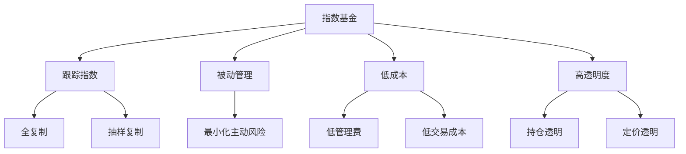
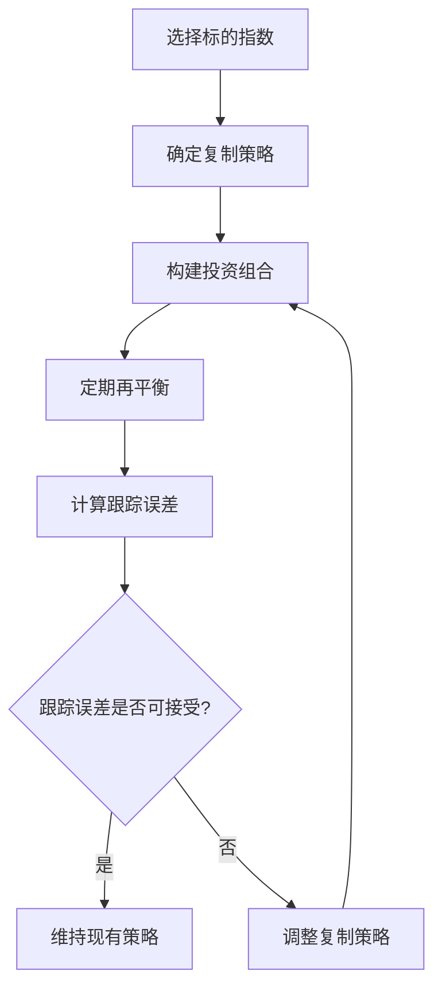
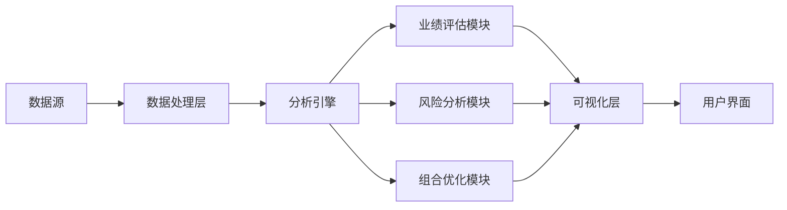
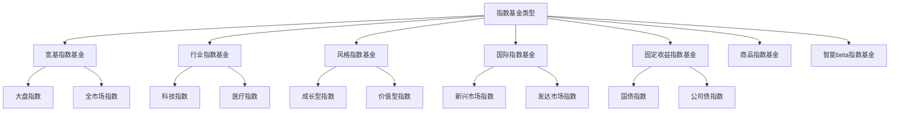
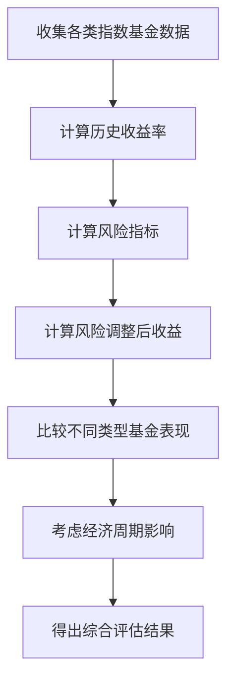
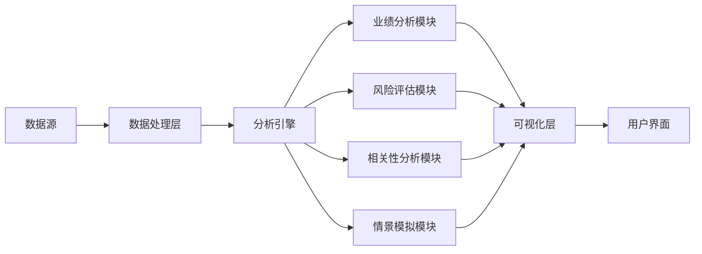
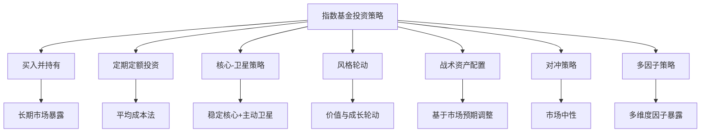
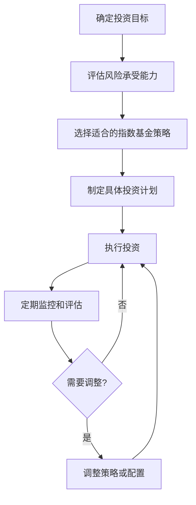
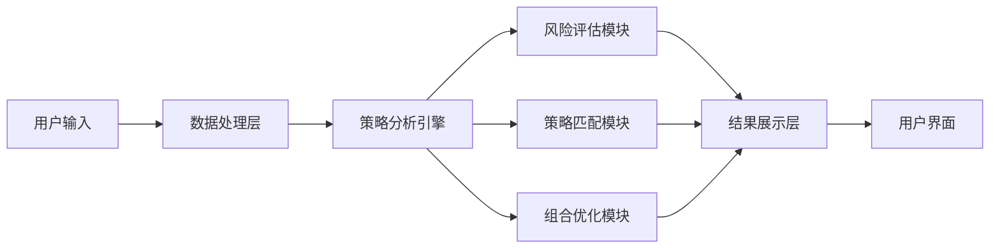

# 第3章：指数基金投资基础

## 3.1 指数基金的概念与特点

指数基金是一种旨在跟踪特定市场指数表现的投资工具，它为投资者提供了一种简单、低成本的方式来参与整体市场或特定行业的表现。本节将深入探讨指数基金的基本概念、运作原理及其在现代投资组合中的重要性。

### 核心概念：
* 指数
* 被动投资
* 跟踪误差
* ETF（交易所交易基金）
* 复制策略

### 问题背景
随着金融市场的发展和投资理念的演变，指数基金因其低成本、高效率的特点，正成为越来越多投资者的选择。理解指数基金的本质和优势，对于制定有效的投资策略至关重要。

### 问题描述
1. 什么是指数基金，它与主动管理基金有何不同？
2. 指数基金的主要类型和特点是什么？
3. 指数基金如何实现对标的指数的跟踪？

### 问题解决
为全面解答上述问题，我们将从以下几个方面展开讨论：

1. 指数基金的定义和基本原理
2. 指数基金的主要类型（如股票指数基金、债券指数基金、ETF等）
3. 指数基金的运作机制和复制策略
4. 指数基金的优势和局限性
5. 指数基金在投资组合中的作用

### 边界与外延
虽然本节主要聚焦于指数基金，但我们也会涉及相关的投资理念，如被动投资、资产配置等，以全面理解指数基金在现代投资中的地位。

### 概念结构与核心要素组成



### 概念之间的关系

| 特征 | 指数基金 | 主动管理基金 |
|------|----------|--------------|
| 投资目标 | 跟踪指数表现 | 超越市场表现 |
| 管理方式 | 被动 | 主动 |
| 费用 | 低 | 较高 |
| 透明度 | 高 | 相对较低 |
| 业绩稳定性 | 与市场一致 | 波动较大 |
| 管理难度 | 低 | 高 |

### 数学模型
使用跟踪误差来衡量指数基金的表现：

$$
TE = \sqrt{\frac{\sum_{i=1}^{n} (R_{p,i} - R_{b,i})^2}{n}}
$$

其中，$TE$是跟踪误差，$R_{p,i}$是基金在第$i$期的收益率，$R_{b,i}$是基准指数在第$i$期的收益率，$n$是观察期数。

### 算法流程图



### 实际场景应用
指数基金在以下场景中有广泛应用：

1. 长期资产配置
2. 核心-卫星投资策略
3. 行业或主题投资
4. 国际市场分散投资
5. 短期市场交易（尤其是ETF）

### 项目介绍
"智能指数基金分析器"是一个综合性的投资工具，旨在帮助投资者选择合适的指数基金，并优化其投资组合。该工具整合了市场数据、基金表现和风险指标，运用机器学习算法，为投资者提供个性化的基金推荐和投资建议。

### 环境安装
使用Python构建指数基金分析工具：

```python
pip install pandas numpy scipy matplotlib seaborn yfinance
```

### 系统功能设计
智能指数基金分析器包括以下功能模块：

1. 指数基金数据采集
2. 业绩分析与比较
3. 风险评估
4. 投资组合优化
5. 个性化推荐
6. 可视化报告生成

### 系统架构设计



### 系统接口设计
RESTful API示例：

1. `/funds`: GET请求，获取指数基金列表
2. `/fund-performance`: GET请求，获取特定基金的历史表现
3. `/compare-funds`: POST请求，比较多个基金的表现
4. `/optimize-portfolio`: POST请求，基于给定参数优化投资组合
5. `/risk-analysis`: GET请求，获取特定基金的风险指标

### 系统核心实现源代码
使用Python实现简单的指数基金分析：

```python
import yfinance as yf
import pandas as pd
import numpy as np
import matplotlib.pyplot as plt

class IndexFundAnalyzer:
    def __init__(self):
        self.funds = {}

    def add_fund(self, ticker, name):
        self.funds[ticker] = yf.Ticker(ticker)
        print(f"Added {name} ({ticker}) to the analyzer.")

    def compare_performance(self, start_date, end_date):
        performance = {}
        for ticker, fund in self.funds.items():
            hist = fund.history(start=start_date, end=end_date)
            performance[ticker] = (hist['Close'][-1] / hist['Close'][0] - 1) * 100

        df = pd.DataFrame.from_dict(performance, orient='index', columns=['Return %'])
        df.sort_values('Return %', ascending=False, inplace=True)
        return df

    def plot_performance(self, start_date, end_date):
        plt.figure(figsize=(12, 6))
        for ticker, fund in self.funds.items():
            hist = fund.history(start=start_date, end=end_date)
            plt.plot(hist.index, hist['Close'] / hist['Close'][0], label=ticker)
        
        plt.title('Index Fund Performance Comparison')
        plt.xlabel('Date')
        plt.ylabel('Normalized Price')
        plt.legend()
        plt.grid(True)
        plt.show()

# 使用示例
analyzer = IndexFundAnalyzer()
analyzer.add_fund('SPY', 'S&P 500 ETF')
analyzer.add_fund('QQQ', 'Nasdaq 100 ETF')
analyzer.add_fund('IWM', 'Russell 2000 ETF')

print(analyzer.compare_performance('2020-01-01', '2023-12-31'))
analyzer.plot_performance('2020-01-01', '2023-12-31')
```

### 最佳实践tips
1. 选择与投资目标相符的指数基金
2. 关注基金的跟踪误差和费用率
3. 定期重新平衡投资组合
4. 考虑税收效应，特别是对于ETF
5. 利用指数基金构建多元化的投资组合
6. 结合宏观经济分析，适时调整资产配置

### 行业发展与未来趋势

| 年份 | 事件 | 影响 |
|------|------|------|
| 1976 | 第一只指数基金成立 | 开创被动投资时代 |
| 1993 | 第一只ETF上市 | 提高了指数投资的灵活性 |
| 2000年代 | 智能beta策略兴起 | 结合主动和被动投资特点 |
| 2010年代 | 低成本指数基金普及 | 大幅降低投资门槛 |
| 2020年代 | ESG指数基金快速发展 | 将可持续发展纳入投资考量 |
| 未来 | AI驱动的个性化指数 | 实现更精准的资产配置 |

### 本章小结
指数基金作为一种被动投资工具，通过跟踪特定市场指数，为投资者提供了一种低成本、高效率的投资方式。其核心优势在于能够以较低的成本实现市场平均回报，同时提供高度的透明度和流动性。

指数基金的运作原理基于有效市场假说，认为长期来看，大多数主动管理型基金难以持续战胜市场。通过复制目标指数的构成，指数基金能够紧密跟踪市场表现，最小化跟踪误差。

主要类型的指数基金包括传统的开放式指数基金和交易所交易基金（ETF）。ETF因其交易灵活性和潜在的税收优势，近年来受到越来越多投资者的青睐。此外，还有债券指数基金、行业指数基金等针对特定市场segment的产品。

指数基金的优势包括低成本、高透明度、分散风险和操作简便等。然而，它也存在一些局限性，如无法规避系统性风险，在熊市中缺乏防御能力等。因此，在构建投资组合时，需要根据个人风险偏好和投资目标，合理配置指数基金。

在现代投资理论中，指数基金常被用作构建核心-卫星投资策略的核心部分，或作为资产配置中的重要工具。通过组合不同市场、行业或地区的指数基金，投资者可以实现全球化的资产配置，有效分散风险。

随着金融科技的发展，指数基金的未来趋势包括更精细化的行业主题指数、整合ESG因素的可持续发展指数，以及利用人工智能技术构建的智能指数等。这些创新将为投资者提供更多元化、更个性化的投资选择。

总的来说，指数基金为投资者参与资本市场提供了一种简单、高效的途径。理解指数基金的本质和特点，合理利用其优势，将有助于投资者构建稳健的长期投资策略，实现财富的稳定增长。

## 3.2 常见指数基金类型及其表现

指数基金的种类繁多，覆盖了全球各个市场、行业和资产类别。本节将详细介绍常见的指数基金类型，分析它们的特点和历史表现，为投资者选择合适的指数基金提供指导。

### 核心概念：
* 宽基指数基金
* 行业指数基金
* 风格指数基金
* 国际指数基金
* 固定收益指数基金

### 问题背景
随着指数投资的普及，市场上出现了越来越多类型的指数基金，投资者面临着更多的选择。了解不同类型指数基金的特点和表现，对于构建多元化投资组合至关重要。

### 问题描述
1. 主要的指数基金类型有哪些？
2. 不同类型指数基金的特点和适用场景是什么？
3. 各类指数基金的历史表现如何？

### 问题解决
为全面解答上述问题，我们将从以下几个方面展开讨论：

1. 宽基指数基金（如S&P 500、沪深300）
2. 行业指数基金（如科技、医疗、金融）
3. 风格指数基金（如成长型、价值型）
4. 国际指数基金（如新兴市场、发达市场）
5. 固定收益指数基金（如国债、公司债）
6. 商品指数基金
7. 智能beta指数基金

### 边界与外延
虽然本节主要聚焦于常见指数基金类型，但我们也会涉及一些新兴的指数基金概念，如ESG指数基金、主题指数基金等，以反映市场的最新发展趋势。

### 概念结构与核心要素组成



### 概念之间的关系

| 指数基金类型 | 风险水平 | 潜在回报 | 多元化程度 | 适用投资者 |
|--------------|----------|----------|------------|------------|
| 宽基指数基金 | 中等 | 中等 | 高 | 大多数投资者 |
| 行业指数基金 | 高 | 高 | 低 | 看好特定行业的投资者 |
| 风格指数基金 | 中等-高 | 中等-高 | 中等 | 有特定投资偏好的投资者 |
| 国际指数基金 | 中等-高 | 中等-高 | 高 | 寻求全球化配置的投资者 |
| 固定收益指数基金 | 低-中等 | 低-中等 | 中等 | 保守型投资者或寻求收益的投资者 |
| 商品指数基金 | 高 | 高 | 低 | 寻求对冲通胀的投资者 |
| 智能beta指数基金 | 中等-高 | 中等-高 | 中等 | 寻求超额回报的投资者 |

### 数学模型
使用夏普比率来评估不同类型指数基金的风险调整后收益：

$$
Sharpe Ratio = \frac{R_p - R_f}{\sigma_p}
$$

其中，$R_p$是投资组合收益率，$R_f$是无风险利率，$\sigma_p$是投资组合的标准差。

### 算法流程图



### 实际场景应用
了解不同类型指数基金的特点和表现对以下场景有重要意义：

1. 构建多元化投资组合
2. 实施核心-卫星投资策略
3. 根据经济周期调整资产配置
4. 实现特定投资主题或目标
5. 管理投资组合风险

### 项目介绍
"全球指数基金分析器"是一个综合性的投资分析工具，旨在帮助投资者比较和选择全球范围内的各类指数基金。该工具整合了全球主要指数基金的历史数据、风险指标和业绩表现，并提供智能分析和可视化功能。

### 环境安装
使用Python构建全球指数基金分析工具：

```python
pip install pandas numpy scipy matplotlib seaborn yfinance plotly
```

### 系统功能设计
全球指数基金分析器包括以下功能模块：

1. 全球指数基金数据采集
2. 多维度业绩分析
3. 风险评估与比较
4. 相关性分析
5. 情景模拟
6. 交互式可视化报告

### 系统架构设计



### 系统接口设计
RESTful API示例：

1. `/index-funds`: GET请求，获取全球指数基金列表
2. `/fund-performance`: GET请求，获取特定基金的历史表现
3. `/compare-funds`: POST请求，比较多个基金的表现
4. `/correlation-analysis`: POST请求，分析多个基金间的相关性
5. `/scenario-simulation`: POST请求，模拟特定经济情景下的基金表现

### 系统核心实现源代码
使用Python实现全球指数基金比较分析：

```python
import yfinance as yf
import pandas as pd
import numpy as np
import matplotlib.pyplot as plt
import seaborn as sns

class GlobalIndexFundAnalyzer:
    def __init__(self):
        self.funds = {}

    def add_fund(self, ticker, name, category):
        self.funds[ticker] = {'name': name, 'category': category, 'data': yf.Ticker(ticker)}
        print(f"Added {name} ({ticker}) to the analyzer.")

    def calculate_returns(self, start_date, end_date):
        returns = {}
        for ticker, fund_info in self.funds.items():
            hist = fund_info['data'].history(start=start_date, end=end_date)
            returns[ticker] = hist['Close'].pct_change()
        return pd.DataFrame(returns)

    def compare_performance(self, start_date, end_date):
        returns = self.calculate_returns(start_date, end_date)
        cumulative_returns = (1 + returns).cumprod() - 1
        return cumulative_returns.iloc[-1].sort_values(ascending=False)

    def plot_performance(self, start_date, end_date):
        returns = self.calculate_returns(start_date, end_date)
        cumulative_returns = (1 + returns).cumprod() - 1
        
        plt.figure(figsize=(12, 6))
        for ticker in cumulative_returns.columns:
            plt.plot(cumulative_returns.index, cumulative_returns[ticker], label=self.funds[ticker]['name'])
        
        plt.title('Global Index Fund Performance Comparison')
        plt.xlabel('Date')
        plt.ylabel('Cumulative Return')
        plt.legend()
        plt.grid(True)
        plt.show()

    def correlation_heatmap(self, start_date, end_date):
        returns = self.calculate_returns(start_date, end_date)
        corr_matrix = returns.corr()
        
        plt.figure(figsize=(10, 8))
        sns.heatmap(corr_matrix, annot=True, cmap='coolwarm', vmin=-1, vmax=1, center=0)
        plt.title('Correlation Heatmap of Global Index Funds')
        plt.show()

# 使用示例
analyzer = GlobalIndexFundAnalyzer()
analyzer.add_fund('SPY', 'S&P 500 ETF', 'US Large Cap')
analyzer.add_fund('EFA', 'MSCI EAFE ETF', 'International Developed')
analyzer.add_fund('EEM', 'MSCI Emerging Markets ETF', 'Emerging Markets')
analyzer.add_fund('AGG', 'US Aggregate Bond ETF', 'US Bonds')

print(analyzer.compare_performance('2018-01-01', '2023-12-31'))
analyzer.plot_performance('2018-01-01', '2023-12-31')
analyzer.correlation_heatmap('2018-01-01', '2023-12-31')
```

### 最佳实践tips
1. 根据投资目标和风险承受能力选择合适的指数基金类型
2. 考虑不同类型指数基金之间的相关性，构建多元化投资组合
3. 定期回顾和再平衡投资组合，以适应市场变化
4. 关注各类指数基金的费用率和跟踪误差
5. 考虑经济周期和市场环境，适时调整不同类型指数基金的配置比例
6. 利用国际指数基金实现地域多元化，分散风险

### 行业发展与未来趋势

| 年份 | 趋势 | 影响 |
|------|------|------|
| 2010年代初 | 智能beta指数基金兴起 | 提供了介于主动和被动之间的投资选择 |
| 2015年左右 | ESG指数基金快速发展 | 将可持续发展因素纳入投资决策 |
| 2020年代 | 主题指数基金增多 | 满足投资者对特定主题的投资需求 |
| 未来5年 | AI驱动的动态指数 | 实现更灵活、更个性化的指数构建 |
| 未来10年 | 区块链基础的去中心化指数基金 | 可能改变指数基金的运作模式 |

### 本章小结
本节详细介绍了常见的指数基金类型，包括宽基指数基金、行业指数基金、风格指数基金、国际指数基金、固定收益指数基金、商品指数基金和智能beta指数基金等。每种类型的指数基金都有其独特的特点和适用场景，为投资者提供了丰富的选择。

宽基指数基金，如跟踪S&P 500或沪深300的基金，提供了对整体市场的广泛暴露，适合作为投资组合的核心部分。行业指数基金则允许投资者针对特定行业进行投资，如科技、医疗或金融行业，这些基金通常具有较高的波动性和潜在回报。

风格指数基金分为成长型和价值型，分别适合不同的投资理念和市场环境。国际指数基金为投资者提供了全球化配置的机会，包括发达市场和新兴市场的暴露。固定收益指数基金则为寻求稳定收益和降低组合波动性的投资者提供了选择。

商品指数基金可以作为对冲通胀的工具，而智能beta指数基金则试图通过特定因子策略获得超额回报。近年来，ESG指数基金和主题指数基金的快速发展，反映了投资者对可持续发展和特定投资主题的关注。

通过分析不同类型指数基金的历史表现，我们可以看到它们在不同市场环境下的表现差异。例如，在经济扩张期，成长型和小盘指数基金可能表现更好，而在经济衰退期，大盘价值型和固定收益指数基金可能提供更好的防御性。

了解这些不同类型指数基金的特点和表现，对于构建多元化投资组合至关重要。投资者可以根据自身的投资目标、风险承受能力和市场观点，合理配置不同类型的指数基金，以实现风险分散和潜在收益的平衡。

随着金融科技的发展和投资者需求的变化，指数基金行业正在不断创新。未来，我们可能会看到更多个性化、动态调整的指数基金产品，以及利用人工智能和区块链技术的新型指数基金。这些创新将为投资者提供更多元化、更精准的投资工具，同时也可能带来新的挑战和机遇。

总的来说，理解和善用不同类型的指数基金，是现代投资者构建有效投资策略的重要基础。通过合理组合各类指数基金，投资者可以实现全球化资产配置、风险管理和潜在收益的最优平衡。

## 3.3 指数基金投资策略概述

指数基金投资策略是利用指数基金的特性来实现投资目标的系统性方法。本节将探讨主要的指数基金投资策略，分析它们的优缺点，并讨论如何在不同市场环境下选择和调整策略。

### 核心概念：
* 买入并持有策略
* 定期定额投资
* 核心-卫星策略
* 风格轮动
* 战术资产配置
* 对冲策略

### 问题背景
指数基金的低成本和广泛市场覆盖特性为投资者提供了多样化的策略选择。然而，不同的投资策略适用于不同的市场环境和投资目标，选择合适的策略对于实现长期投资成功至关重要。

### 问题描述
1. 有哪些主要的指数基金投资策略？
2. 这些策略的优缺点是什么？
3. 如何根据市场环境和个人情况选择合适的策略？

### 问题解决
为全面解答上述问题，我们将从以下几个方面展开讨论：

1. 买入并持有策略
2. 定期定额投资策略
3. 核心-卫星策略
4. 风格轮动策略
5. 战术资产配置策略
6. 对冲策略
7. 多因子策略

### 边界与外延
虽然本节主要聚焦于指数基金投资策略，但我们也会涉及这些策略与整体资产配置的关系，以及如何将指数基金策略与其他投资方法结合。

### 概念结构与核心要素组成



### 概念之间的关系

| 策略 | 适用投资者 | 操作复杂度 | 潜在收益 | 风险水平 |
|------|------------|------------|----------|----------|
| 买入并持有 | 长期投资者 | 低 | 中等 | 中等 |
| 定期定额投资 | 稳健型投资者 | 低 | 中等 | 低-中等 |
| 核心-卫星策略 | 平衡型投资者 | 中等 | 中-高 | 中等 |
| 风格轮动 | 积极型投资者 | 高 | 高 | 高 |
| 战术资产配置 | 积极型投资者 | 高 | 高 | 高 |
| 对冲策略 | 专业投资者 | 很高 | 中-高 | 中-高 |
| 多因子策略 | 平衡型投资者 | 中-高 | 中-高 | 中等 |

### 数学模型
以定期定额投资为例，计算平均成本：

$$
Average Cost = \frac{\sum_{i=1}^{n} P_i}{n}
$$

其中，$P_i$是第$i$次投资时的价格，$n$是投资次数。

### 算法流程图



### 实际场景应用
不同的指数基金投资策略适用于以下场景：

1. 长期退休规划（买入并持有、定期定额投资）
2. 积极寻求超额收益（核心-卫星、风格轮动）
3. 风险管理（对冲策略）
4. 适应不同市场周期（战术资产配置）
5. 追求多元化收益来源（多因子策略）

### 项目介绍
"智能指数基金策略优化器"是一个综合性的投资工具，旨在帮助投资者根据个人情况和市场环境选择最优的指数基金投资策略。该工具结合了机器学习算法和传统金融理论，为用户提供个性化的策略建议和投资组合优化方案。

### 环境安装
使用Python构建指数基金策略优化工具：

```python
pip install pandas numpy scipy scikit-learn matplotlib seaborn yfinance
```

### 系统功能设计
智能指数基金策略优化器包括以下功能模块：

1. 用户风险偏好评估
2. 市场环境分析
3. 策略匹配与推荐
4. 投资组合优化
5. 回测与性能评估
6. 动态策略调整

### 系统架构设计



### 系统接口设计
RESTful API示例：

1. `/risk-assessment`: POST请求，评估用户风险偏好
2. `/market-analysis`: GET请求，获取当前市场环境分析
3. `/strategy-recommendation`: POST请求，获取个性化策略建议
4. `/portfolio-optimization`: POST请求，优化投资组合配置
5. `/backtest`: POST请求，对选定策略进行历史回测

### 系统核心实现源代码
使用Python实现简单的指数基金策略比较：

```python
import yfinance as yf
import pandas as pd
import numpy as np
import matplotlib.pyplot as plt

class IndexFundStrategyAnalyzer:
    def __init__(self):
        self.data = None

    def load_data(self, ticker, start_date, end_date):
        self.data = yf.download(ticker, start=start_date, end=end_date)['Adj Close']

    def buy_and_hold(self):
        return (self.data[-1] / self.data[0]) - 1

    def dollar_cost_averaging(self, investment_amount):
        dates = pd.date_range(start=self.data.index[0], end=self.data.index[-1], freq='M')
        units_bought = [investment_amount / self.data.asof(date) for date in dates]
        total_units = sum(units_bought)
        final_value = total_units * self.data[-1]
        total_invested = investment_amount * len(dates)
        return (final_value / total_invested) - 1

    def compare_strategies(self, investment_amount):
        buy_hold_return = self.buy_and_hold()
        dca_return = self.dollar_cost_averaging(investment_amount)
        
        print(f"Buy and Hold Return: {buy_hold_return:.2%}")
        print(f"Dollar Cost Averaging Return: {dca_return:.2%}")

        plt.figure(figsize=(10, 6))
        plt.plot(self.data.index, self.data / self.data[0], label='Buy and Hold')
        plt.title('Index Fund Performance')
        plt.xlabel('Date')
        plt.ylabel('Normalized Price')
        plt.legend()
        plt.grid(True)
        plt.show()

# 使用示例
analyzer = IndexFundStrategyAnalyzer()
analyzer.load_data('SPY', '2010-01-01', '2023-12-31')
analyzer.compare_strategies(1000)  # 假设每月投资1000元
```

### 最佳实践tips
1. 根据个人风险承受能力和投资目标选择合适的策略
2. 定期重新评估和调整策略，以适应市场变化
3. 考虑结合多种策略，以实现更好的风险-收益平衡
4. 关注策略执行的成本，包括交易费用和税收影响
5. 保持长期投资视角，避免过度交易
6. 利用自动化工具执行策略，减少人为情绪干扰

### 行业发展与未来趋势

| 年份 | 趋势 | 影响 |
|------|------|------|
| 2010年代 | 被动投资策略普及 | 指数基金规模快速增长 |
| 2015年左右 | 智能beta策略兴起 | 提供了介于主动和被动之间的选择 |
| 2020年代初 | ESG因素整合 | 可持续发展成为策略考虑的重要因素 |
| 未来5年 | AI驱动的动态策略调整 | 实现更精准的市场时机选择 |
| 未来10年 | 个性化指数策略 | 满足投资者的独特需求和目标 |

### 本章小结
指数基金投资策略为投资者提供了多样化的选择，从简单的买入并持有到复杂的多因子策略，每种策略都有其独特的优势和适用场景。买入并持有策略和定期定额投资策略适合长期、稳健的投资者，它们操作简单，能够有效降低市场时机选择的风险。核心-卫星策略则允许投资者在保持稳定市场暴露的同时，通过卫星部分追求超额收益。

风格轮动和战术资产配置策略适合更积极的投资者，这些策略试图通过预测市场趋势或经济周期来调整投资组合，潜在收益较高，但也伴随着较高的风险和操作复杂度。对冲策略主要用于风险管理，通常需要专业知识和较高的操作技巧。多因子策略则试图通过暴露于多个收益因子来获得更稳定、多元化的收益。

选择合适的指数基金投资策略需要考虑多个因素，包括个人风险承受能力、投资目标、市场环境、以及个人的时间和精力投入。对于大多数个人投资者来说，结合使用几种简单策略可能是最佳选择，例如将买入并持有或定期定额投资作为核心策略，辅以适度的战术调整。

随着金融科技的发展，指数基金投资策略正变得越来越精细和个性化。人工智能和大数据分析正在被用于优化策略选择和执行，使得复杂策略的实施变得更加accessible。同时，ESG因素的整合也正在改变传统的指数基金策略，使可持续发展成为投资决策的重要考量。

展望未来，我们可能会看到更多创新的指数基金策略出现，如基于区块链技术的去中心化指数基金，或是能够实时根据个人生活状况和市场环境动态调整的AI驱动策略。这些创新将为投资者提供更多选择，但也可能带来新的挑战和风险。

总的来说，成功的指数基金投资策略需要投资者对自身情况有清晰的认识，对市场有深入的理解，并能够保持纪律性的执行。通过选择适合自己的策略并坚持长期投资，投资者可以充分利用指数基金的优势，实现长期的财富积累和财务目标。


