# 第二部分：AI Agent系统设计与开发

# 第4章：经济增长趋势分析AI Agent设计

## 4.1 数据源选择与预处理

设计一个能够分析中国未来30年经济增长趋势的AI Agent，首先需要选择合适的数据源并进行有效的预处理。本节将详细探讨如何选择和处理相关数据，为后续的分析和预测奠定基础。

### 核心概念：
* 宏观经济指标
* 时间序列数据
* 数据清洗
* 特征工程
* 数据标准化

### 问题背景
经济增长趋势分析需要大量高质量、多维度的数据支持。然而，经济数据往往存在不完整、不一致、噪声大等问题，如何选择合适的数据源并进行有效预处理是构建可靠AI Agent的关键步骤。

### 问题描述
1. 哪些数据源对于分析中国经济增长趋势最为关键？
2. 如何处理经济数据中的缺失值、异常值和季节性因素？
3. 如何将不同来源、不同尺度的数据整合为一个统一的数据集？

### 问题解决
为全面解答上述问题，我们将从以下几个方面展开讨论：

1. 关键经济指标的选择
2. 数据源的评估和选择
3. 数据清洗和预处理技术
4. 特征工程和数据转换
5. 时间序列数据的特殊处理
6. 数据整合和标准化

### 边界与外延
虽然本节主要聚焦于中国经济数据，但我们也会考虑全球经济数据的影响，以及如何整合定性信息（如政策变化、国际关系等）到定量分析中。

### 概念结构与核心要素组成

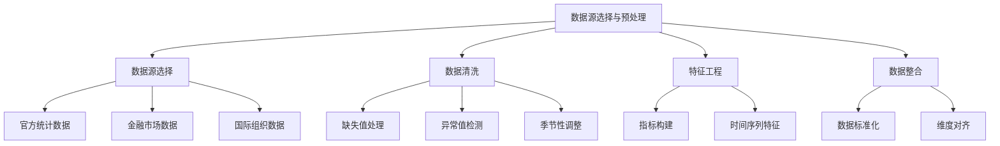

### 概念之间的关系

| 数据处理步骤 | 输入 | 输出 | 主要技术 |
|--------------|------|------|----------|
| 数据源选择 | 原始数据源 | 初步数据集 | 数据质量评估、相关性分析 |
| 数据清洗 | 初步数据集 | 清洗后数据 | 插值、异常检测、时间序列分解 |
| 特征工程 | 清洗后数据 | 特征数据集 | 指标构建、滞后特征、移动平均 |
| 数据整合 | 多源特征数据 | 统一数据集 | 标准化、主成分分析、数据融合 |

### 数学模型
使用Z-score标准化方法处理不同尺度的经济指标：

$$
z = \frac{x - \mu}{\sigma}
$$

其中，$z$是标准化后的值，$x$是原始值，$\mu$是均值，$\sigma$是标准差。

### 算法流程图

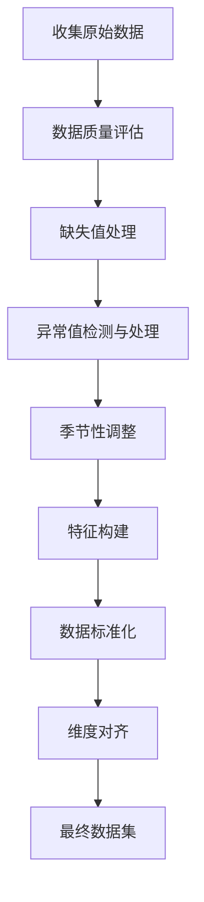

### 实际场景应用
数据源选择与预处理在以下场景中至关重要：

1. 宏观经济预测模型构建
2. 政策影响评估
3. 跨国经济比较研究
4. 行业发展趋势分析
5. 投资风险评估

### 项目介绍
"中国经济数据预处理平台"是一个综合性的数据处理工具，旨在为经济分析和预测提供高质量、标准化的数据集。该平台集成了多源数据采集、清洗、转换和整合功能，能够自动化处理大量经济时间序列数据，为后续的AI分析提供可靠的数据基础。

### 环境安装
使用Python构建数据预处理平台：

```python
pip install pandas numpy scipy statsmodels scikit-learn matplotlib seaborn
```

### 系统功能设计
中国经济数据预处理平台包括以下功能模块：

1. 多源数据采集
2. 数据质量评估
3. 缺失值和异常值处理
4. 季节性调整
5. 特征工程
6. 数据标准化和整合
7. 数据可视化和报告生成

### 系统架构设计

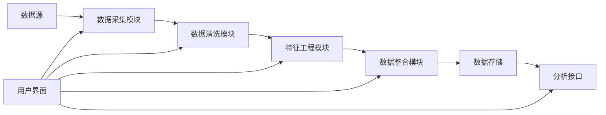

### 系统接口设计
RESTful API示例：

1. `/data-sources`: GET请求，获取可用数据源列表
2. `/raw-data`: GET请求，获取特定指标的原始数据
3. `/clean-data`: POST请求，执行数据清洗操作
4. `/feature-engineering`: POST请求，执行特征工程
5. `/integrated-dataset`: GET请求，获取最终处理后的数据集

### 系统核心实现源代码
使用Python实现基本的经济数据预处理流程：

```python
import pandas as pd
import numpy as np
from sklearn.impute import SimpleImputer
from sklearn.preprocessing import StandardScaler
from statsmodels.tsa.seasonal import seasonal_decompose

class EconomicDataPreprocessor:
    def __init__(self):
        self.data = None
        self.scaler = StandardScaler()

    def load_data(self, file_path):
        self.data = pd.read_csv(file_path, index_col='Date', parse_dates=True)
        print(f"Data loaded. Shape: {self.data.shape}")

    def handle_missing_values(self):
        imputer = SimpleImputer(strategy='mean')
        self.data = pd.DataFrame(imputer.fit_transform(self.data), 
                                 columns=self.data.columns, 
                                 index=self.data.index)
        print("Missing values handled.")

    def remove_outliers(self, threshold=3):
        z_scores = np.abs((self.data - self.data.mean()) / self.data.std())
        self.data = self.data[(z_scores < threshold).all(axis=1)]
        print("Outliers removed.")

    def perform_seasonal_adjustment(self, column):
        result = seasonal_decompose(self.data[column], model='additive', period=12)
        self.data[f'{column}_seasonally_adjusted'] = result.trend + result.resid
        print(f"Seasonal adjustment performed for {column}.")

    def create_lagged_features(self, column, lags):
        for lag in lags:
            self.data[f'{column}_lag_{lag}'] = self.data[column].shift(lag)
        print(f"Lagged features created for {column}.")

    def standardize_data(self):
        self.data = pd.DataFrame(self.scaler.fit_transform(self.data), 
                                 columns=self.data.columns, 
                                 index=self.data.index)
        print("Data standardized.")

    def get_processed_data(self):
        return self.data.dropna()

# 使用示例
preprocessor = EconomicDataPreprocessor()
preprocessor.load_data('economic_indicators.csv')
preprocessor.handle_missing_values()
preprocessor.remove_outliers()
preprocessor.perform_seasonal_adjustment('GDP_Growth')
preprocessor.create_lagged_features('GDP_Growth', [1, 2, 4])
preprocessor.standardize_data()
processed_data = preprocessor.get_processed_data()
print(processed_data.head())
```

### 最佳实践tips
1. 优先选择权威、可靠的数据源，如国家统计局、世界银行等
2. 对数据质量进行全面评估，包括完整性、一致性和准确性
3. 使用多种方法处理缺失值，如插值、回归估计等
4. 在去除异常值时要谨慎，某些"异常"可能包含重要信息
5. 考虑经济指标之间的相关性和因果关系，构建复合指标
6. 保留原始数据的备份，确保数据处理过程可追溯和可重复
7. 定期更新和维护数据集，确保分析基于最新信息

### 行业发展与未来趋势

| 年份 | 趋势 | 影响 |
|------|------|------|
| 2010年代 | 大数据技术应用 | 提高了数据处理能力和效率 |
| 2015年左右 | 机器学习在数据清洗中应用 | 提高了异常检测和数据修复的准确性 |
| 2020年代初 | 实时数据流处理 | 使经济分析更加及时和动态 |
| 未来5年 | AI驱动的自动化数据整合 | 可能大幅提高数据预处理的效率和质量 |
| 未来10年 | 区块链在数据验证中的应用 | 有望提高经济数据的可信度和透明度 |

### 本章小结
数据源选择与预处理是构建经济增长趋势分析AI Agent的基础和关键步骤。通过careful的数据源选择、系统的数据清洗、有针对性的特征工程和科学的数据整合，我们可以为后续的分析和预测提供高质量的数据输入。

在数据源选择方面，我们需要综合考虑数据的权威性、时效性和全面性。对于中国经济增长趋势分析，关键数据源包括国家统计局、中国人民银行、世界银行、国际货币基金组织等。同时，也要考虑将金融市场数据、企业调查数据等辅助信息纳入分析范围。

数据清洗过程中，重点解决缺失值、异常值和季节性因素等问题。对于缺失值，可以根据数据特性选择合适的插补方法，如均值插补、回归插补或多重插补。异常值检测需要结合统计方法和领域知识，谨慎处理可能包含重要信息的"异常"数据。季节性调整对于许多经济时间序列数据尤为重要，可以使用如X-12-ARIMA等成熟的方法。

特征工程是提升模型性能的关键环节。对于经济数据，常用的特征工程技术包括构建复合指标、创建滞后特征、计算增长率和移动平均等。这些技术可以帮助捕捉经济指标之间的复杂关系和时间动态。

数据整合和标准化是处理多源异构数据的必要步骤。通过标准化处理，可以消除不同指标间的尺度差异，使得模型能够公平地评估各个特征的重要性。同时，需要注意对齐不同频率的数据，如将月度数据聚合为季度数据。

随着技术的发展，数据预处理领域正在经历深刻变革。大数据和人工智能技术的应用正在提高数据处理的效率和质量。未来，我们可能会看到更多自动化、智能化的数据预处理工具，这将大大降低数据科学家的工作负担，使他们能够将更多精力投入到模型设计和结果解释中。

总的来说，高质量的数据预处理是确保AI Agent能够做出准确、可靠预测的关键。通过系统化、标准化的数据处理流程，我们可以为经济增长趋势分析提供坚实的数据基础，从而支持更加精准的决策制定和策略规划。

## 4.2 经济指标体系构建

构建一个全面而有效的经济指标体系是分析和预测中国未来30年经济增长趋势的关键。本节将详细探讨如何设计和构建适合长期经济增长分析的指标体系，为AI Agent提供可靠的输入数据结构。

### 核心概念：
* 宏观经济指标
* 先行指标
* 同步指标
* 滞后指标
* 复合指标

### 问题背景
经济增长是一个复杂的过程，涉及多个维度和因素。设计一个能够全面反映经济状况并具有预测能力的指标体系，对于准确分析和预测长期经济趋势至关重要。

### 问题描述
1. 哪些经济指标对长期经济增长趋势分析最为关键？
2. 如何构建能够反映经济多个方面的综合指标体系？
3. 如何平衡指标的全面性和模型的可解释性？

### 问题解决
为全面解答上述问题，我们将从以下几个方面展开讨论：

1. 核心经济指标的选择
2. 先行、同步和滞后指标的识别
3. 复合指标的构建方法
4. 指标体系的层次结构设计
5. 指标权重的确定方法
6. 指标体系的动态调整机制

### 边界与外延
虽然本节主要聚焦于经济增长相关指标，但我们也会考虑社会发展、环境可持续性等相关因素，以构建一个更全面的指标体系。

### 概念结构与核心要素组成

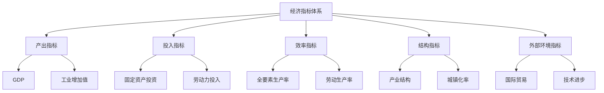

### 概念之间的关系

| 指标类型 | 示例 | 特点 | 在分析中的作用 |
|----------|------|------|-----------------|
| 先行指标 | 采购经理指数（PMI） | 预示经济未来走向 | 预测转折点 |
| 同步指标 | 工业增加值 | 反映当前经济状况 | 评估当前经济表现 |
| 滞后指标 | 失业率 | 滞后于经济周期 | 确认经济趋势 |
| 复合指标 | 经济景气指数 | 综合多个单项指标 | 全面反映经济状况 |

### 数学模型
使用主成分分析（PCA）构建复合经济指标：

$$
Y = w_1X_1 + w_2X_2 + ... + w_nX_n
$$

其中，$Y$是复合指标，$X_i$是标准化后的单项指标，$w_i$是对应的权重，由PCA确定。

### 算法流程图

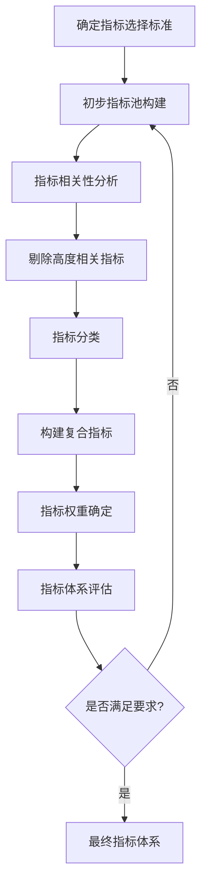

### 实际场景应用
经济指标体系在以下场景中有重要应用：

1. 宏观经济政策制定
2. 经济增长预测模型构建
3. 区域经济发展评估
4. 国际经济比较研究
5. 投资决策支持

### 项目介绍
"智能经济指标体系构建器"是一个创新性的分析工具，旨在帮助经济学家和政策制定者快速构建和优化经济指标体系。该工具结合了机器学习算法和经济学理论，能够自动化地从大量经济数据中筛选关键指标，构建复合指标，并动态调整指标权重。

### 环境安装
使用Python构建经济指标体系工具：

```python
pip install pandas numpy scipy scikit-learn statsmodels matplotlib seaborn
```

### 系统功能设计
智能经济指标体系构建器包括以下功能模块：

1. 指标数据库管理
2. 指标相关性分析
3. 自动化指标筛选
4. 复合指标构建
5. 指标权重优化
6. 指标体系可视化
7. 动态调整和反馈机制

### 系统架构设计

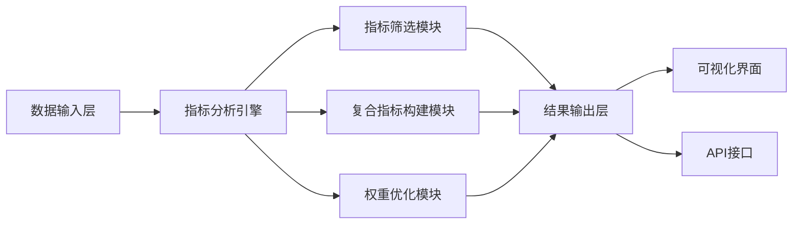

### 系统接口设计
RESTful API示例：

1. `/indicators`: GET请求，获取可用经济指标列表
2. `/correlation-analysis`: POST请求，执行指标相关性分析
3. `/composite-indicator`: POST请求，构建复合指标
4. `/optimize-weights`: POST请求，优化指标权重
5. `/indicator-system`: GET请求，获取完整的指标体系结构

### 系统核心实现源代码
使用Python实现基本的经济指标体系构建流程：

```python
import pandas as pd
import numpy as np
from sklearn.preprocessing import StandardScaler
from sklearn.decomposition import PCA
from sklearn.cluster import KMeans

class EconomicIndicatorSystemBuilder:
    def __init__(self):
        self.data = None
        self.scaler = StandardScaler()
        self.pca = PCA()

    def load_data(self, file_path):
        self.data = pd.read_csv(file_path, index_col='Date', parse_dates=True)
        print(f"Data loaded. Shape: {self.data.shape}")

    def preprocess_data(self):
        self.data_scaled = pd.DataFrame(self.scaler.fit_transform(self.data), 
                                        columns=self.data.columns, 
                                        index=self.data.index)
        print("Data preprocessed and scaled.")

    def analyze_correlations(self):
        corr_matrix = self.data_scaled.corr()
        print("Correlation matrix computed.")
        return corr_matrix

    def select_indicators(self, correlation_threshold=0.8):
        corr_matrix = self.analyze_correlations()
        to_drop = set()
        for i in range(len(corr_matrix.columns)):
            for j in range(i):
                if abs(corr_matrix.iloc[i, j]) > correlation_threshold:
                    to_drop.add(corr_matrix.columns[i])
        self.selected_indicators = self.data_scaled.drop(columns=to_drop)
        print(f"Selected {len(self.selected_indicators.columns)} indicators.")

    def build_composite_indicator(self, n_components=3):
        self.pca.fit(self.selected_indicators)
        loadings = pd.DataFrame(self.pca.components_.T, 
                                columns=[f'PC{i+1}' for i in range(n_components)],
                                index=self.selected_indicators.columns)
        print("Composite indicators built using PCA.")
        return loadings

    def cluster_indicators(self, n_clusters=5):
        kmeans = KMeans(n_clusters=n_clusters, random_state=42)
        clusters = kmeans.fit_predict(self.selected_indicators.T)
        clustered_indicators = pd.Series(clusters, index=self.selected_indicators.columns)
        print(f"Indicators clustered into {n_clusters} groups.")
        return clustered_indicators

# 使用示例
builder = EconomicIndicatorSystemBuilder()
builder.load_data('economic_indicators.csv')
builder.preprocess_data()
builder.select_indicators()
composite_loadings = builder.build_composite_indicator()
indicator_clusters = builder.cluster_indicators()

print("\nComposite Indicator Loadings:")
print(composite_loadings)
print("\nIndicator Clusters:")
print(indicator_clusters)
```

### 最佳实践tips
1. 确保指标的全面性，覆盖经济的各个关键方面
2. 注意指标之间的相关性，避免信息冗余
3. 平衡领先、同步和滞后指标，提高体系的预测能力
4. 定期评估和更新指标体系，以适应经济结构变化
5. 考虑指标的可获得性和更新频率，确保实际可操作性
6. 结合定性和定量方法确定指标权重
7. 保持指标体系的稳定性，避免频繁大幅调整

### 行业发展与未来趋势

| 年份 | 趋势 | 影响 |
|------|------|------|
| 2010年代 | 大数据在经济分析中的应用 | 扩展了可用指标的范围和精度 |
| 2015年左右 | 机器学习技术在指标选择中的应用 | 提高了指标筛选的效率和准确性 |
| 2020年代初 | 实时经济指标的兴起 | 增强了经济分析的时效性 |
| 未来5年 | AI驱动的动态指标体系 | 可能实现指标体系的自动优化和调整 |
| 未来10年 | 跨学科指标的整合 | 有望构建更全面的社会经济发展评估体系 |

### 本章小结
构建一个全面、有效的经济指标体系是分析和预测中国未来30年经济增长趋势的基础。一个良好的指标体系应该能够全面反映经济的各个方面，包括产出、投入、效率、结构和外部环境等维度。

在指标选择过程中，我们需要考虑指标的代表性、可获得性、时效性和预测能力。核心指标通常包括GDP、工业增加值、固定资产投资、就业率、全要素生产率等。同时，也要关注新兴的指标，如创新指数、数字经济指标等，以反映经济结构的变化。

指标体系的构建应遵循层次化的原则。可以将指标分为先行指标、同步指标和滞后指标，或者按照经济领域分类。这种结构化的方法有助于理解不同指标之间的关系和各自在经济分析中的作用。

复合指标的构建是提高指标体系效率的重要方法。通过主成分分析、因子分析等统计方法，可以将多个相关指标综合成一个复合指标，既减少了指标数量，又保留了关键信息。

指标权重的确定是一个复杂的问题，需要结合统计方法和专家判断。常用的方法包括等权重法、主观赋权法（如德尔菲法）和客观赋权法（如熵值法）。在实际应用中，往往需要综合使用多种方法来确定最终权重。

指标体系的动态调整机制也很重要。随着经济结构的变化和新数据的可用性，指标体系需要定期评估和更新。这个过程应该是谨慎和渐进的，以保持指标体系的稳定性和连续性。

随着技术的发展，经济指标体系的构建和应用正在经历深刻变革。大数据和人工智能技术的应用使得我们能够处理更多维度的数据，发现更细微的经济关系。实时经济指标的出现提高了经济分析的时效性。未来，我们可能会看到更加智能化、动态化的指标体系，能够自动适应经济环境的变化。

总的来说，构建一个科学、全面的经济指标体系是一项复杂而持续的工作。它需要经济学理论、统计方法和领域专业知识的结合。一个优秀的指标体系不仅能够准确反映当前经济状况，还能为未来经济走势提供有力的预测支持，从而为政策制定和经济决策提供可靠的依据。

## 4.3 时间序列分析模型集成

时间序列分析是预测中国未来30年经济增长趋势的核心方法之一。本节将探讨如何集成多种时间序列分析模型，以提高预测的准确性和稳健性。

### 核心概念：
* ARIMA模型
* 指数平滑法
* 向量自回归（VAR）模型
* 状态空间模型
* 机器学习时间序列模型
* 模型集成方法

### 问题背景
经济时间序列数据通常具有复杂的模式，包括趋势、季节性、周期性和不规则波动。单一模型往往难以捕捉所有这些特征，因此集成多种模型成为提高预测性能的有效方法。

### 问题描述
1. 如何选择适合经济增长预测的时间序列模型？
2. 如何有效地集成不同类型的时间序列模型？
3. 如何评估和优化集成模型的性能？

### 问题解决
为全面解答上述问题，我们将从以下几个方面展开讨论：

1. 常用时间序列分析模型的特点和适用场景
2. 模型集成的方法（如bagging、boosting、stacking）
3. 模型权重的动态调整机制
4. 长期预测中的误差累积问题及其解决方案
5. 模型性能评估指标的选择
6. 集成模型在经济增长预测中的应用案例

### 边界与外延
虽然本节主要聚焦于时间序列分析模型，但我们也会考虑如何将结构化经济模型和机器学习方法纳入集成框架，以提高预测的全面性和准确性。

### 概念结构与核心要素组成

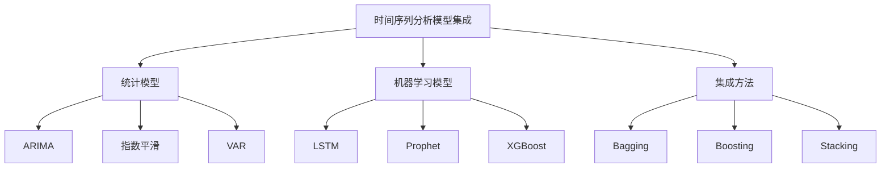

### 概念之间的关系

| 模型类型 | 优势 | 劣势 | 适用场景 |
|----------|------|------|----------|
| ARIMA | 处理线性时间序列 | 难以捕捉非线性关系 | 短期预测 |
| VAR | 考虑多变量交互 | 参数较多，易过拟合 | 中期预测，多指标分析 |
| 指数平滑 | 简单，计算快速 | 不适合复杂模式 | 短期趋势预测 |
| LSTM | 捕捉长期依赖关系 | 需要大量数据，训练复杂 | 长期非线性预测 |
| Prophet | 自动处理季节性和节假日效应 | 可解释性较差 | 具有强季节性的预测 |

### 数学模型
以简单的加权平均集成为例：

$$
\hat{y}_t = \sum_{i=1}^{n} w_i \hat{y}_{i,t}
$$

其中，$\hat{y}_t$是集成模型的预测值，$\hat{y}_{i,t}$是第$i$个单一模型的预测值，$w_i$是对应的权重。

### 算法流程图

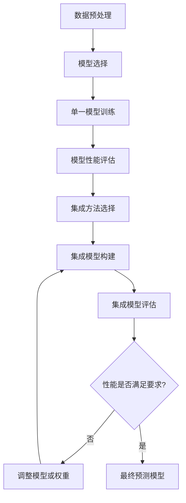

### 实际场景应用
时间序列模型集成在以下场景中有重要应用：

1. GDP增长率预测
2. 通货膨胀率预测
3. 失业率预测
4. 股市指数预测
5. 产业结构变化预测

### 项目介绍
"EconoForecast Pro"是一个先进的经济预测平台，专门设计用于长期经济增长趋势分析。该平台集成了多种时间序列分析模型和机器学习算法，能够自动选择最佳模型组合，并提供动态权重调整。它还包含了专家知识库，可以结合定量分析和定性判断，提供全面的经济预测报告。

### 环境安装
使用Python构建时间序列模型集成系统：

```python
pip install pandas numpy scipy statsmodels sklearn prophet tensorflow xgboost
```

### 系统功能设计
EconoForecast Pro包括以下功能模块：

1. 数据预处理和特征工程
2. 多模型训练和评估
3. 自动模型选择
4. 集成模型构建
5. 动态权重调整
6. 长期预测误差控制
7. 可视化和报告生成

### 系统架构设计

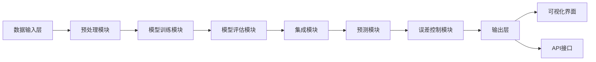

### 系统接口设计
RESTful API示例：

1. `/train`: POST请求，训练单一模型或集成模型
2. `/predict`: POST请求，使用训练好的模型进行预测
3. `/evaluate`: GET请求，获取模型性能评估结果
4. `/optimize`: POST请求，优化模型参数或集成权重
5. `/forecast`: GET请求，获取长期经济增长预测结果

### 系统核心实现源代码
使用Python实现基本的时间序列模型集成：

```python
import pandas as pd
import numpy as np
from statsmodels.tsa.arima.model import ARIMA
from statsmodels.tsa.holtwinters import ExponentialSmoothing
from prophet import Prophet
from sklearn.metrics import mean_squared_error
from sklearn.model_selection import train_test_split

class TimeSeriesEnsemble:
    def __init__(self):
        self.models = {}
        self.weights = {}

    def add_model(self, name, model):
        self.models[name] = model

    def train_models(self, data):
        for name, model in self.models.items():
            if name == 'ARIMA':
                model_fit = model.fit()
                self.models[name] = model_fit
            elif name == 'Prophet':
                df = pd.DataFrame({'ds': data.index, 'y': data.values})
                model.fit(df)
            else:
                model.fit(data)

    def make_predictions(self, data, forecast_horizon):
        predictions = {}
        for name, model in self.models.items():
            if name == 'ARIMA':
                pred = model.forecast(steps=forecast_horizon)
            elif name == 'Prophet':
                future = model.make_future_dataframe(periods=forecast_horizon)
                forecast = model.predict(future)
                pred = forecast.tail(forecast_horizon)['yhat']
            else:
                pred = model.forecast(forecast_horizon)
            predictions[name] = pred
        return predictions

    def evaluate_models(self, true_values, predictions):
        mse = {}
        for name, pred in predictions.items():
            mse[name] = mean_squared_error(true_values, pred)
        return mse

    def set_weights(self, mse):
        total_error = sum(1/error for error in mse.values())
        for name, error in mse.items():
            self.weights[name] = (1/error) / total_error

    def ensemble_forecast(self, predictions):
        ensemble_pred = np.zeros(len(next(iter(predictions.values()))))
        for name, pred in predictions.items():
            ensemble_pred += self.weights[name] * pred
        return ensemble_pred

# 使用示例
data = pd.read_csv('economic_data.csv', index_col='Date', parse_dates=True)
train, test = train_test_split(data, test_size=0.2, shuffle=False)

ensemble = TimeSeriesEnsemble()
ensemble.add_model('ARIMA', ARIMA(train, order=(1,1,1)))
ensemble.add_model('ETS', ExponentialSmoothing(train))
ensemble.add_model('Prophet', Prophet())

ensemble.train_models(train)

forecast_horizon = len(test)
predictions = ensemble.make_predictions(train, forecast_horizon)
mse = ensemble.evaluate_models(test.values, predictions)
ensemble.set_weights(mse)

ensemble_forecast = ensemble.ensemble_forecast(predictions)

print("Ensemble Forecast:")
print(ensemble_forecast)
print("\nModel Weights:")
print(ensemble.weights)
```

### 最佳实践tips
1. 选择diverse的模型进行集成，以捕捉不同的数据特征
2. 定期重新训练和评估模型，以适应经济环境的变化
3. 使用滚动预测方法来评估长期预测性能
4. 考虑引入外部因素（如政策变化、全球经济事件）来增强预测
5. 结合定性分析来解释和验证模型预测结果
6. 对于长期预测，关注趋势而非具体数值，并提供预测区间
7. 建立预警机制，当预测显著偏离实际时及时调整模型

### 行业发展与未来趋势

| 年份 | 趋势 | 影响 |
|------|------|------|
| 2010年代 | 深度学习在时间序列分析中的应用 | 提高了处理非线性关系的能力 |
| 2015年左右 | 集成学习方法的普及 | 显著提升了预测准确性 |
| 2020年代初 | 因果推断方法在经济预测中的应用 | 增强了模型的解释性和可靠性 |
| 未来5年 | 自动化机器学习（AutoML）在时间序列预测中的应用 | 可能实现模型选择和集成的自动化 |
| 未来10年 | 量子计算在复杂经济系统模拟中的应用 | 有望突破传统计算限制，实现更精确的长期预测 |

### 本章小结
时间序列分析模型集成是提高经济增长趋势预测准确性的有效方法。通过结合多种模型的优势，集成方法能够捕捉经济数据中的复杂模式和关系，从而产生更稳健、更可靠的预测结果。

在本节中，我们讨论了几种常用的时间序列模型，包括ARIMA、VAR、指数平滑、LSTM和Prophet等。每种模型都有其特定的优势和适用场景。例如，ARIMA适合处理线性时间序列，而LSTM则擅长捕捉长期依赖关系。通过集成这些不同类型的模型，我们可以综合利用它们的优势，弥补单一模型的不足。

模型集成的方法主要包括bagging、boosting和stacking。Bagging方法通过对数据进行重采样，训练多个同类模型，然后取平均值作为最终预测。Boosting方法则是通过迭代训练一系列弱学习器，每次聚焦于前一个模型的错误。Stacking是一种更高级的集成方法，它使用另一个模型来学习如何最佳地组合基础模型的预测。

在实际应用中，模型权重的动态调整非常重要。我们可以基于各个模型的历史表现来动态调整它们在集成中的权重。这种方法允许系统适应经济环境的变化，始终保持最佳的预测性能。

长期经济预测面临的一个主要挑战是误差累积问题。随着预测时间跨度的增加，误差往往会迅速累积。为了解决这个问题，我们可以采用分段预测、定期重新校准等方法。同时，对于长期预测，关注整体趋势而非具体数值，并提供预测区间而不是点估计，这些做法都有助于提高预测的可靠性。

在评估模型性能时，除了传统的均方误差（MSE）、平均绝对误差（MAE）等指标外，还应考虑使用方向准确性、预测区间覆盖率等指标。这些指标能更全面地反映模型在经济预测中的实际表现。

随着技术的发展，时间序列分析和预测领域正在经历深刻的变革。深度学习方法的应用使得我们能够处理更复杂的非线性关系。因果推断方法的引入增强了模型的解释性，这在经济政策制定中尤为重要。未来，自动化机器学习（AutoML）可能会革新模型选择和集成的过程，而量子计算的应用则有望突破传统计算的限制，实现更精确的长期经济预测。

总的来说，时间序列模型集成为经济增长趋势预测提供了一个强大的工具。通过合理选择和集成多种模型，结合专家知识和定性分析，我们可以构建出更加准确、稳健的预测系统。这不仅有助于政策制定者制定长期经济策略，也为投资者和企业提供了宝贵的决策支持。然而，我们也必须认识到，即使是最先进的模型集成方法也无法完全消除长期经济预测的不确定性。经济系统的复杂性、外部冲击的不可预测性以及结构性变化的可能性都是需要考虑的因素。因此，在使用这些模型时，我们需要保持谨慎和灵活，并将其视为决策支持工具，而不是绝对准确的预言。

## 4.4 情感分析与新闻事件影响评估

在经济增长趋势分析中，除了传统的经济指标和时间序列数据外，新闻事件和市场情绪也扮演着越来越重要的角色。本节将探讨如何将情感分析和新闻事件影响评估纳入AI Agent的分析框架，以提高预测的全面性和准确性。

### 核心概念：
* 自然语言处理（NLP）
* 情感分析
* 事件抽取
* 市场情绪指标
* 新闻影响量化

### 问题背景
经济活动受到多种因素的影响，包括政策变化、国际事件、市场情绪等。这些因素往往通过新闻媒体和社交平台传播，对经济产生直接或间接的影响。将这些非结构化信息纳入分析框架，可以显著增强经济预测模型的预测能力。

### 问题描述
1. 如何有效地从海量新闻和社交媒体数据中提取与经济相关的信息？
2. 如何量化新闻事件和市场情绪对经济指标的影响？
3. 如何将情感分析和事件影响评估结果整合到经济预测模型中？

### 问题解决
为全面解答上述问题，我们将从以下几个方面展开讨论：

1. 经济相关新闻和社交媒体数据的采集和预处理
2. 基于NLP的情感分析技术
3. 事件抽取和分类方法
4. 市场情绪指标的构建
5. 新闻事件影响的量化模型
6. 情感和事件数据与经济指标的融合方法
7. 案例分析：重大事件对经济预测的影响

### 边界与外延
虽然本节主要聚焦于新闻和社交媒体数据的分析，但我们也会探讨如何将这些分析结果与传统经济指标和时间序列模型相结合，以构建更全面的经济预测系统。

### 概念结构与核心要素组成

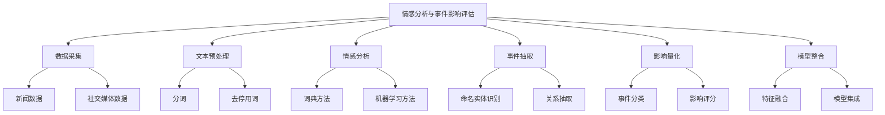

### 概念之间的关系

| 分析步骤 | 输入 | 输出 | 主要技术 |
|----------|------|------|----------|
| 数据采集 | 新闻源、社交媒体 | 原始文本数据 | 网络爬虫、API接口 |
| 文本预处理 | 原始文本 | 清洗后的文本 | NLP库（如NLTK、spaCy） |
| 情感分析 | 预处理后文本 | 情感得分 | 词典方法、深度学习 |
| 事件抽取 | 预处理后文本 | 结构化事件数据 | 命名实体识别、关系抽取 |
| 影响量化 | 事件数据 | 影响得分 | 专家系统、机器学习 |
| 模型整合 | 情感得分、影响得分 | 增强的预测模型 | 特征工程、集成学习 |

### 数学模型
使用简单的加权模型来整合情感分析和事件影响：

$$
EconomicImpact_t = \alpha \cdot SentimentScore_t + \beta \cdot EventScore_t + \gamma \cdot EconomicIndicators_t
$$

其中，$\alpha$、$\beta$和$\gamma$是权重参数，需要通过历史数据训练得到。

### 算法流程图

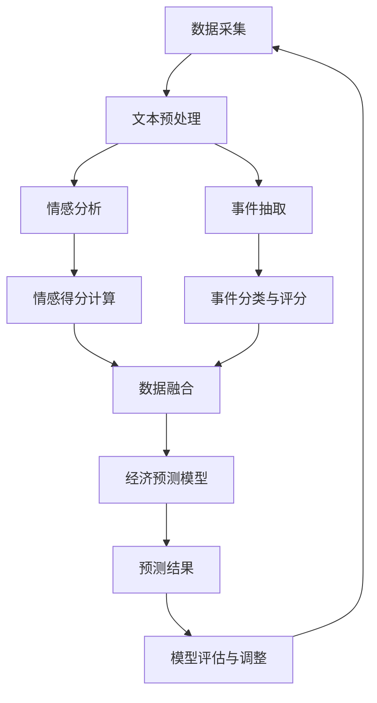

### 实际场景应用
情感分析和新闻事件影响评估在以下场景中有重要应用：

1. 短期经济波动预测
2. 政策效果评估
3. 市场风险预警
4. 投资策略制定
5. 消费者信心指数预测

### 项目介绍
"EconoSentiment Analyzer"是一个创新性的经济分析工具，专门设计用于整合新闻情感和事件影响到经济预测模型中。该工具使用先进的NLP技术实时分析海量新闻和社交媒体数据，提取经济相关的情感和事件信息，并将这些信息转化为可量化的指标，用于增强传统经济预测模型的性能。

### 环境安装
使用Python构建情感分析和事件影响评估系统：

```python
pip install pandas numpy scipy sklearn nltk spacy transformers torch
```

### 系统功能设计
EconoSentiment Analyzer包括以下功能模块：

1. 数据采集与存储
2. 文本预处理
3. 情感分析引擎
4. 事件抽取与分类
5. 影响量化模型
6. 数据融合与模型整合
7. 可视化与报告生成

### 系统架构设计

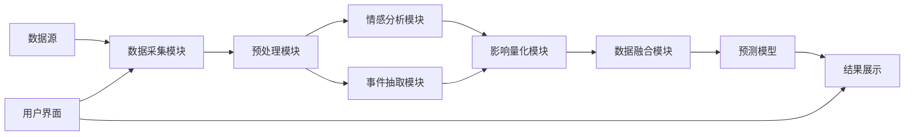

### 系统接口设计
RESTful API示例：

1. `/collect-data`: POST请求，触发数据采集任务
2. `/analyze-sentiment`: POST请求，对给定文本进行情感分析
3. `/extract-events`: POST请求，从文本中抽取经济相关事件
4. `/quantify-impact`: POST请求，量化事件对经济的潜在影响
5. `/economic-forecast`: GET请求，获取整合了情感和事件数据的经济预测

### 系统核心实现源代码
使用Python实现基本的情感分析和事件影响评估：

```python
import pandas as pd
import numpy as np
from sklearn.feature_extraction.text import CountVectorizer
from sklearn.naive_bayes import MultinomialNB
from sklearn.model_selection import train_test_split
import nltk
from nltk.sentiment import SentimentIntensityAnalyzer

class EconoSentimentAnalyzer:
    def __init__(self):
        self.vectorizer = CountVectorizer()
        self.classifier = MultinomialNB()
        self.sia = SentimentIntensityAnalyzer()
        nltk.download('vader_lexicon')

    def train_classifier(self, texts, labels):
        X = self.vectorizer.fit_transform(texts)
        self.classifier.fit(X, labels)

    def classify_text(self, text):
        X = self.vectorizer.transform([text])
        return self.classifier.predict(X)[0]

    def analyze_sentiment(self, text):
        return self.sia.polarity_scores(text)

    def extract_events(self, text):
        # 简单的关键词匹配示例，实际应用中应使用更复杂的NER和关系抽取
        economic_keywords = ['GDP', 'inflation', 'unemployment', 'stock market', 'interest rate']
        events = [keyword for keyword in economic_keywords if keyword in text.lower()]
        return events

    def quantify_impact(self, sentiment, events):
        # 简化的影响量化模型
        sentiment_impact = sentiment['compound']
        event_impact = len(events) * 0.1  # 假设每个事件有0.1的基础影响
        return sentiment_impact + event_impact

    def analyze_text(self, text):
        sentiment = self.analyze_sentiment(text)
        events = self.extract_events(text)
        impact = self.quantify_impact(sentiment, events)
        return {
            'text': text,
            'sentiment': sentiment,
            'events': events,
            'impact': impact
        }

# 使用示例
analyzer = EconoSentimentAnalyzer()

# 假设我们有一些带标签的训练数据
train_texts = ["The economy is booming", "Unemployment rate hits new low", "Stock market crashes"]
train_labels = ["positive", "positive", "negative"]
analyzer.train_classifier(train_texts, train_labels)

# 分析新的文本
sample_text = "GDP growth exceeds expectations, but inflation concerns linger"
result = analyzer.analyze_text(sample_text)

print("Analysis Result:")
print(f"Text: {result['text']}")
print(f"Sentiment: {result['sentiment']}")
print(f"Events: {result['events']}")
print(f"Estimated Impact: {result['impact']}")
```

### 最佳实践tips
1. 使用领域特定的词典和语料库来提高情感分析的准确性
2. 定期更新事件分类模型，以适应新的经济热点和趋势
3. 考虑事件的时效性，给予近期事件更高的权重
4. 结合专家知识来调整和验证影响量化模型
5. 使用多源数据交叉验证，提高分析结果的可靠性
6. 建立实时监控机制，及时捕捉重大经济事件
7. 定期评估和调整模型，以适应不断变化的经济环境

### 行业发展与未来趋势

| 年份 | 趋势 | 影响 |
|------|------|------|
| 2010年代 | 社交媒体数据在经济分析中的应用 | 提供了更实时的市场情绪指标 |
| 2015年左右 | 深度学习在NLP中的广泛应用 | 显著提高了文本分析的准确性 |
| 2020年代初 | 大规模预训练语言模型（如BERT）的应用 | 增强了对复杂语境的理解能力 |
| 未来5年 | 多模态分析（文本、图像、视频）的整合 | 有望提供更全面的事件影响评估 |
| 未来10年 | 实时、全球化的经济事件监控系统 | 可能实现更精准的经济预测和风险预警 |

### 本章小结
情感分析与新闻事件影响评估为经济增长趋势分析提供了一个新的维度。通过整合这些非结构化数据，我们能够捕捉到传统经济指标可能忽视的市场情绪和突发事件的影响，从而提高经济预测的准确性和及时性。

本节讨论了从数据采集到影响量化的完整流程。首先，我们需要建立有效的数据采集机制，从各种新闻源和社交媒体平台获取实时数据。文本预处理是下一个关键步骤，包括分词、去停用词等，为后续分析奠定基础。

在情感分析方面，我们探讨了词典方法和机器学习方法。词典方法简单直接，适用于一般场景，而机器学习方法（特别是深度学习模型）则能够处理更复杂的语言表达和上下文。事件抽取涉及到命名实体识别和关系抽取技术，这些技术能够从非结构化文本中识别出与经济相关的重要事件。

影响量化是一个复杂的任务，需要结合情感分析结果、事件类型、事件规模等多个因素。我们提出了一个简单的加权模型作为起点，但在实际应用中，可能需要更复杂的模型，如时间序列模型或机器学习模型，来准确捕捉事件对经济的短期和长期影响。

将情感和事件数据与传统经济指标整合是另一个挑战。我们讨论了特征融合和模型集成两种方法。特征融合将情感得分和事件影响作为额外特征加入到经济预测模型中，而模型集成则是将基于情感和事件的预测与传统经济模型的预测结合起来。

随着技术的发展，我们看到了一些令人兴奋的趋势。大规模预训练语言模型的应用大大提高了文本理解的准确性。多模态分析的发展使得我们能够从更多维度理解经济事件的影响。未来，我们可能会看到更加全面和实时的全球经济事件监控系统的出现，这将为经济预测和风险管理提供前所未有的洞察力。

然而，将情感分析和事件影响评估纳入经济预测模型也面临着一些挑战。首先是数据质量和代表性的问题。社交媒体数据可能存在偏差，不能完全代表整体经济参与者的情绪。其次，在解释模型结果时需要格外谨慎，因为情感和事件的影响可能是短暂的，不应过度外推到长期经济趋势。

此外，伦理和隐私问题也需要认真考虑。在收集和分析大量个人和企业数据时，必须确保遵守相关法律法规，保护个人隐私和商业机密。

尽管存在这些挑战，情感分析和新闻事件影响评估无疑为经济增长趋势分析提供了宝贵的补充视角。通过不断改进技术、完善方法，我们有望构建出更加全面、准确的经济预测系统，为政策制定者、投资者和企业决策者提供更有价值的洞察。
