# 第5章：投资决策AI Agent设计

## 5.1 风险偏好与投资目标量化

在设计用于指数基金投资的AI Agent时，准确量化投资者的风险偏好和投资目标是至关重要的第一步。本节将探讨如何将抽象的风险偏好和投资目标转化为可量化、可操作的指标，为后续的投资决策提供基础。

### 核心概念：
* 风险偏好
* 投资目标
* 效用函数
* 风险承受能力
* 投资期限
* 流动性需求

### 问题背景
每个投资者都有独特的风险偏好和投资目标，这些因素直接影响着适合他们的投资策略。然而，这些概念往往是主观和抽象的，需要通过科学的方法转化为客观、可量化的指标。

### 问题描述
1. 如何准确评估投资者的风险偏好？
2. 如何将多维度的投资目标转化为可量化的指标？
3. 如何在量化过程中考虑投资者的个人情况和市场环境？

### 问题解决
为全面解答上述问题，我们将从以下几个方面展开讨论：

1. 风险偏好评估方法
2. 投资目标的多维度分解
3. 效用函数的构建与应用
4. 风险承受能力的客观评估
5. 投资期限与流动性需求的量化
6. 个人财务状况对风险偏好的影响
7. 动态调整机制的设计

### 边界与外延
虽然本节主要聚焦于指数基金投资，但所讨论的方法和原则也可以应用于更广泛的投资领域。我们还将探讨如何将行为金融学的洞见纳入量化过程。

### 概念结构与核心要素组成

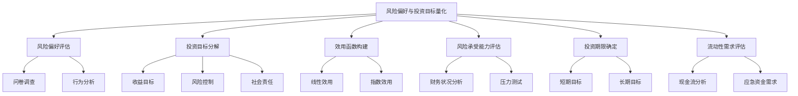

### 概念之间的关系

| 评估维度 | 评估方法 | 量化指标 | 应用场景 |
|----------|----------|----------|----------|
| 风险偏好 | 问卷调查、行为分析 | 风险承受度得分 | 资产配置决策 |
| 投资目标 | 多维度分解 | 目标权重向量 | 投资组合优化 |
| 效用函数 | 数学建模 | 效用曲线参数 | 决策理论应用 |
| 风险承受能力 | 财务分析、压力测试 | 最大可承受损失 | 风险管理 |
| 投资期限 | 目标分析 | 时间权重分布 | 策略选择 |
| 流动性需求 | 现金流分析 | 流动性比率 | 资产选择 |

### 数学模型
使用指数效用函数来表示风险偏好：

$$
U(W) = \frac{1 - e^{-AW}}{A}
$$

其中，$U(W)$是效用，$W$是财富，$A$是风险厌恶系数。较大的$A$值表示更高的风险厌恶度。

### 算法流程图

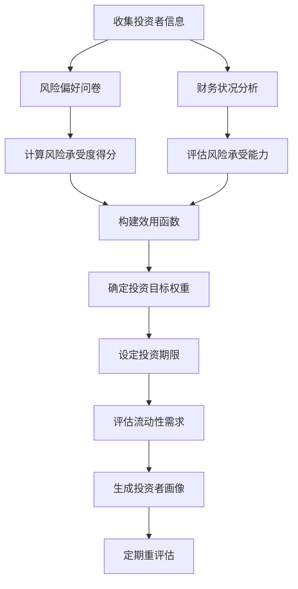

### 实际场景应用
风险偏好与投资目标量化在以下场景中有重要应用：

1. 个人理财规划
2. 机构投资组合管理
3. 智能投顾系统
4. 退休基金管理
5. 保险产品设计

### 项目介绍
"InvestorDNA"是一个智能化的投资者画像系统，专门设计用于精确量化投资者的风险偏好和投资目标。该系统结合了先进的问卷设计、行为金融学原理和机器学习算法，能够全面评估投资者的风险态度、财务状况和投资目标，生成详细的投资者画像，为后续的投资决策提供精准指导。

### 环境安装
使用Python构建风险偏好与投资目标量化系统：

```python
pip install pandas numpy scipy sklearn psychopy matplotlib seaborn
```

### 系统功能设计
InvestorDNA包括以下功能模块：

1. 智能问卷系统
2. 行为分析模块
3. 财务状况评估器
4. 效用函数生成器
5. 投资目标分解器
6. 风险承受能力计算器
7. 投资期限与流动性分析器
8. 投资者画像生成器
9. 动态调整机制

### 系统架构设计

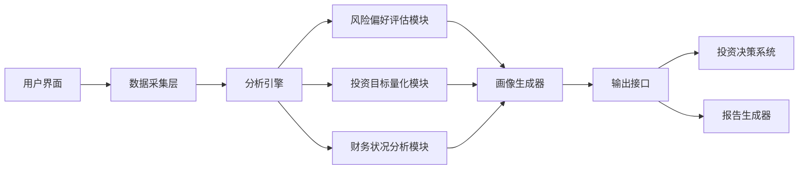

### 系统接口设计
RESTful API示例：

1. `/risk-assessment`: POST请求，提交风险评估问卷答案
2. `/financial-analysis`: POST请求，提交财务状况数据
3. `/investment-goals`: POST请求，设定投资目标
4. `/generate-profile`: GET请求，生成完整的投资者画像
5. `/update-profile`: PUT请求，更新投资者信息和偏好

### 系统核心实现源代码
使用Python实现基本的风险偏好评估和投资目标量化：

```python
import numpy as np
from scipy.optimize import minimize_scalar

class InvestorProfiler:
    def __init__(self):
        self.risk_score = None
        self.financial_status = None
        self.investment_goals = None
        self.utility_function = None

    def assess_risk_preference(self, questionnaire_results):
        # 简化的风险评分计算
        self.risk_score = sum(questionnaire_results) / len(questionnaire_results)
        return self.risk_score

    def analyze_financial_status(self, income, assets, liabilities):
        self.financial_status = {
            'net_worth': assets - liabilities,
            'income': income,
            'debt_ratio': liabilities / assets if assets > 0 else float('inf')
        }
        return self.financial_status

    def set_investment_goals(self, return_target, risk_tolerance, time_horizon):
        self.investment_goals = {
            'return_target': return_target,
            'risk_tolerance': risk_tolerance,
            'time_horizon': time_horizon
        }
        return self.investment_goals

    def calculate_risk_capacity(self):
        if not self.financial_status:
            raise ValueError("Financial status not set")
        
        net_worth = self.financial_status['net_worth']
        income = self.financial_status['income']
        debt_ratio = self.financial_status['debt_ratio']
        
        # 简化的风险承受能力计算
        risk_capacity = (net_worth * 0.05 + income * 0.1) * (1 - min(debt_ratio, 1))
        return risk_capacity

    def generate_utility_function(self):
        if self.risk_score is None:
            raise ValueError("Risk preference not assessed")
        
        # 使用指数效用函数
        A = 1 - self.risk_score  # 风险厌恶系数
        self.utility_function = lambda W: (1 - np.exp(-A * W)) / A
        return self.utility_function

    def optimize_portfolio_allocation(self, expected_returns, covariance_matrix):
        if not self.utility_function:
            self.generate_utility_function()
        
        def negative_utility(weights):
            portfolio_return = np.dot(weights, expected_returns)
            portfolio_volatility = np.sqrt(np.dot(weights.T, np.dot(covariance_matrix, weights)))
            return -self.utility_function(portfolio_return - 0.5 * self.risk_score * portfolio_volatility**2)

        n_assets = len(expected_returns)
        constraints = ({'type': 'eq', 'fun': lambda x: np.sum(x) - 1})
        bounds = tuple((0, 1) for _ in range(n_assets))
        
        result = minimize(negative_utility, n_assets * [1./n_assets], method='SLSQP', bounds=bounds, constraints=constraints)
        return result.x

    def generate_investor_profile(self):
        if None in (self.risk_score, self.financial_status, self.investment_goals):
            raise ValueError("Incomplete information for profile generation")
        
        profile = {
            'risk_preference': self.risk_score,
            'risk_capacity': self.calculate_risk_capacity(),
            'financial_status': self.financial_status,
            'investment_goals': self.investment_goals
        }
        return profile

# 使用示例
profiler = InvestorProfiler()

# 评估风险偏好
risk_score = profiler.assess_risk_preference([3, 4, 2, 5, 3])  # 示例问卷结果

# 分析财务状况
financial_status = profiler.analyze_financial_status(income=100000, assets=500000, liabilities=200000)

# 设置投资目标
investment_goals = profiler.set_investment_goals(return_target=0.08, risk_tolerance=0.15, time_horizon=10)

# 生成投资者画像
investor_profile = profiler.generate_investor_profile()
print("Investor Profile:", investor_profile)

# 优化投资组合配置（示例）
expected_returns = np.array([0.1, 0.15, 0.05, 0.12])
covariance_matrix = np.array([
    [0.05, 0.03, 0.02, 0.04],
    [0.03, 0.08, 0.01, 0.03],
    [0.02, 0.01, 0.03, 0.02],
    [0.04, 0.03, 0.02, 0.06]
])

optimal_allocation = profiler.optimize_portfolio_allocation(expected_returns, covariance_matrix)
print("Optimal Portfolio Allocation:", optimal_allocation)
```

### 最佳实践tips
1. 使用多维度问卷，结合情景模拟来评估风险偏好
2. 考虑投资者的心理因素，如损失厌恶、过度自信等
3. 定期重新评估风险偏好和投资目标，以适应生活变化
4. 使用压力测试来评估投资者在极端市场条件下的反应
5. 考虑投资者的专业知识水平，调整风险评估的复杂度
6. 结合客观财务数据和主观风险态度来确定最终的风险承受能力
7. 提供教育资源，帮助投资者理解风险和回报的关系

### 行业发展与未来趋势

| 年份 | 趋势 | 影响 |
|------|------|------|
| 2010年代 | 行为金融学在投资决策中的应用 | 更好地理解投资者的非理性行为 |
| 2015年左右 | 智能投顾平台的兴起 | 大规模个性化投资建议成为可能 |
| 2020年代初 | AI和机器学习在风险评估中的应用 | 提高了风险评估的准确性和动态性 |
| 未来5年 | 神经科学在投资决策研究中的应用 | 可能带来对投资者决策过程的深入理解 |
| 未来10年 | 量子计算在投资组合优化中的应用 | 有望突破传统优化方法的限制，实现更精确的资产配置 |

### 本章小结
风险偏好与投资目标的量化是设计有效的投资决策AI Agent的基础。通过科学的方法将这些抽象概念转化为可操作的数值指标，我们能够为每个投资者定制最适合的投资策略。

本节讨论了评估风险偏好的多种方法，包括问卷调查、行为分析和财务状况评估。问卷调查是最直接的方法，但需要精心设计以避免偏差。行为分析通过观察投资者的实际决策来推断其风险态度，这种方法更加客观，但实施难度较大。财务状况评估则提供了风险承受能力的客观基础，是风险偏好评估不可或缺的组成部分。

投资目标的量化涉及多个维度，包括期望回报、风险容忍度、投资期限和流动性需求等。我们提出了使用目标权重向量来表示多维度投资目标的方法，这种方法允许在后续的投资组合优化中灵活权衡不同目标。

效用函数的构建是连接风险偏好和投资决策的关键桥梁。我们介绍了常用的指数效用函数，并讨论了如何根据投资者的风险态度调整函数参数。效用函数不仅能够量化投资者对不同结果的偏好，还可以用于投资组合的优化。

风险承受能力的评估需要综合考虑投资者的财务状况、收入稳定性和负债水平等因素。我们提出了一个简化的风险承受能力计算模型，并强调了进行压力测试的重要性，以评估投资者在极端市场条件下的抗风险能力。

投资期限和流动性需求的量化对于制定合适的投资策略至关重要。我们讨论了如何通过分析投资者的短期和长期财务目标来确定适当的投资期限，以及如何通过现金流分析来评估流动性需求。

动态调整机制的设计确保了投资者画像能够随时间变化而更新。我们建议定期重新评估投资者的风险偏好和投资目标，并根据市场环境的变化调整投资策略。

随着技术的发展，风险偏好和投资目标量化的方法也在不断演进。人工智能和机器学习的应用使得我们能够处理更复杂的数据模式，提供更精准的个性化评估。神经科学的进展可能会带来对投资决策过程的新见解，而量子计算的应用有望在投资组合优化方面取得突破性进展。

然而，我们也必须认识到，量化方法虽然强大，但并非万能。投资者的情感、直觉和个人价值观等难以量化的因素仍然在投资决策中扮演重要角色。因此，在设计AI Agent时，我们需要在定量分析和定性判断之间找到平衡，确保系统能够提供既科学又人性化的投资建议。

总的来说，准确量化投资者的风险偏好和投资目标是构建成功的投资决策AI Agent的关键一步。通过综合运用金融理论、行为科学和先进技术，我们能够为每个投资者创建独特的投资者画像，为后续的资产配置和投资组合管理奠定坚实基础。

## 5.2 资产配置模型设计

资产配置是投资组合管理的核心环节，对于实现投资者的长期目标至关重要。本节将探讨如何设计一个适用于指数基金投资的智能资产配置模型，以优化风险收益特征，满足投资者的个性化需求。

### 核心概念：
* 现代投资组合理论
* 战略资产配置
* 战术资产配置
* 风险平价
* 因子投资
* 黑天鹅事件

### 问题背景
在指数基金投资中，合理的资产配置可以显著影响投资组合的整体表现。然而，面对复杂多变的市场环境和投资者的个性化需求，设计一个既稳健又灵活的资产配置模型是一个挑战。

### 问题描述
1. 如何设计一个能够平衡风险和收益的资产配置模型？
2. 如何在模型中整合投资者的风险偏好和投资目标？
3. 如何使资产配置模型能够适应不同的市场环境？

### 问题解决
为全面解答上述问题，我们将从以下几个方面展开讨论：

1. 现代投资组合理论的应用与局限
2. 战略资产配置vs战术资产配置
3. 风险平价模型的设计与实现
4. 因子投资在资产配置中的应用
5. 动态资产配置策略
6. 极端事件风险管理
7. 多目标优化方法

### 边界与外延
虽然本节主要聚焦于指数基金的资产配置，但所讨论的方法和原则也可以扩展到更广泛的资产类别。我们还将探讨如何将宏观经济预测和市场情绪分析纳入资产配置决策。

### 概念结构与核心要素组成

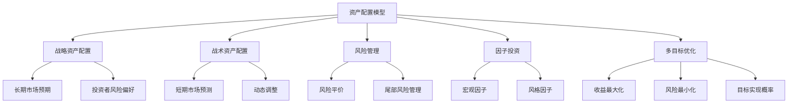

### 概念之间的关系

| 配置方法 | 时间范围 | 主要目标 | 适用场景 |
|----------|----------|----------|----------|
| 战略资产配置 | 长期 | 实现长期投资目标 | 基础配置 |
| 战术资产配置 | 短中期 | 捕捉市场机会 | 市场波动较大时 |
| 风险平价 | 长期 | 平衡风险贡献 | 追求稳定性 |
| 因子投资 | 中长期 | 捕捉特定因子收益 | 寻求超额收益 |
| 动态资产配置 | 全周期 | 适应市场变化 | 复杂多变市场 |

### 数学模型
使用均值-方差优化模型进行资产配置：

$$
\max_w \quad w^T \mu - \frac{\lambda}{2} w^T \Sigma w
$$
$$
\text{s.t.} \quad w^T 1 = 1, \quad w_i \geq 0
$$

其中，$w$是权重向量，$\mu$是预期收益向量，$\Sigma$是协方差矩阵，$\lambda$是风险厌恶系数。

### 算法流程图

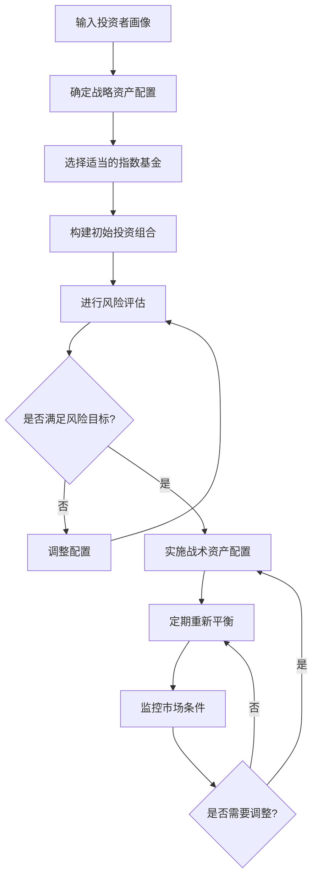

### 实际场景应用
智能资产配置模型在以下场景中有重要应用：

1. 个人退休投资规划
2. 机构投资组合管理
3. 目标日期基金设计
4. 多元资产基金管理
5. 风险平价基金运作

### 项目介绍
"SmartAllocator"是一个先进的智能资产配置系统，专门为指数基金投资设计。该系统结合了现代投资组合理论、机器学习算法和行为金融学洞见，能够根据投资者的风险偏好、投资目标和市场条件，自动生成和动态调整最优的资产配置方案。

### 环境安装
使用Python构建智能资产配置系统：

```python
pip install pandas numpy scipy sklearn cvxpy yfinance matplotlib seaborn
```

### 系统功能设计
SmartAllocator包括以下功能模块：

1. 投资者画像分析
2. 战略资产配置生成器
3. 指数基金筛选器
4. 风险平价优化器
5. 因子暴露分析器
6. 动态调整引擎
7. 回测与性能评估
8. 报告生成器

### 系统架构设计

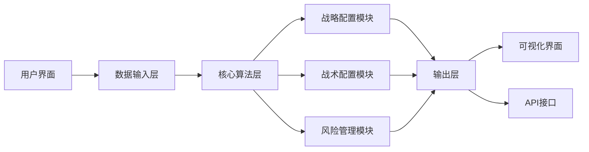

### 系统接口设计
RESTful API示例：

1. `/strategic-allocation`: POST请求，生成战略资产配置方案
2. `/tactical-adjustment`: POST请求，进行战术性资产调整
3. `/risk-analysis`: GET请求，获取当前投资组合的风险分析
4. `/factor-exposure`: GET请求，分析投资组合的因子暴露
5. `/rebalance`: PUT请求，执行投资组合再平衡操作

### 系统核心实现源代码
使用Python实现基本的资产配置模型：

```python
import numpy as np
import pandas as pd
import cvxpy as cp
import yfinance as yf

class AssetAllocator:
    def __init__(self, risk_aversion):
        self.risk_aversion = risk_aversion

    def get_historical_data(self, tickers, start_date, end_date):
        data = yf.download(tickers, start=start_date, end=end_date)['Adj Close']
        returns = data.pct_change().dropna()
        return returns

    def calculate_expected_returns(self, returns):
        return returns.mean() * 252  # 假设252个交易日

    def calculate_covariance_matrix(self, returns):
        return returns.cov() * 252

    def optimize_portfolio(self, expected_returns, covariance_matrix):
        n = len(expected_returns)
        w = cp.Variable(n)
        ret = w.T @ expected_returns
        risk = cp.quad_form(w, covariance_matrix)
        objective = cp.Maximize(ret - self.risk_aversion * risk)
        constraints = [cp.sum(w) == 1, w >= 0]
        
        problem = cp.Problem(objective, constraints)
        problem.solve()
        
        return w.value

    def allocate(self, tickers, start_date, end_date):
        returns = self.get_historical_data(tickers, start_date, end_date)
        expected_returns = self.calculate_expected_returns(returns)
        covariance_matrix = self.calculate_covariance_matrix(returns)
        weights = self.optimize_portfolio(expected_returns, covariance_matrix)
        
        allocation = pd.Series(weights, index=tickers)
        return allocation

    def risk_parity_allocation(self, covariance_matrix):
        n = covariance_matrix.shape[0]
        w = cp.Variable(n)
        risk_contributions = cp.multiply(w, covariance_matrix @ w)
        objective = cp.Minimize(cp.sum(cp.square(risk_contributions - cp.sum(risk_contributions) / n)))
        constraints = [cp.sum(w) == 1, w >= 0]
        
        problem = cp.Problem(objective, constraints)
        problem.solve()
        
        return w.value

    def dynamic_allocation(self, tickers, start_date, end_date, rebalance_frequency='M'):
        full_data = self.get_historical_data(tickers, start_date, end_date)
        allocations = []
        
        for end in pd.date_range(start=full_data.index[252], end=full_data.index[-1], freq=rebalance_frequency):
            data = full_data.loc[:end]
            expected_returns = self.calculate_expected_returns(data.tail(252))
            covariance_matrix = self.calculate_covariance_matrix(data.tail(252))
            weights = self.optimize_portfolio(expected_returns, covariance_matrix)
            allocations.append(pd.Series(weights, index=tickers, name=end))
        
        return pd.DataFrame(allocations)

# 使用示例
allocator = AssetAllocator(risk_aversion=2)
tickers = ['SPY', 'AGG', 'GLD', 'VNQ']
start_date = '2010-01-01'
end_date = '2023-12-31'

# 静态配置
static_allocation = allocator.allocate(tickers, start_date, end_date)
print("Static Allocation:")
print(static_allocation)

# 动态配置
dynamic_allocation = allocator.dynamic_allocation(tickers, start_date, end_date)
print("\nDynamic Allocation (last 5 periods):")
print(dynamic_allocation.tail())

# 风险平价配置
returns = allocator.get_historical_data(tickers, start_date, end_date)
cov_matrix = allocator.calculate_covariance_matrix(returns)
risk_parity_weights = allocator.risk_parity_allocation(cov_matrix)
risk_parity_allocation = pd.Series(risk_parity_weights, index=tickers)
print("\nRisk Parity Allocation:")
print(risk_parity_allocation)
```

### 最佳实践tips
1. 定期重新评估战略资产配置，以适应长期市场变化
2. 在进行战术调整时，设置阈值以避免过度交易
3. 考虑使用多种优化方法，如均值-方差、最小方差和风险平价
4. 纳入宏观经济指标和市场情绪因素来增强动态配置能力
5. 实施严格的风险管理措施，包括压力测试和尾部风险管理
6. 考虑投资者的税收情况和流动性需求
7. 定期与投资者沟通，确保配置方案持续符合其目标和偏好

### 行业发展与未来趋势

| 年份 | 趋势 | 影响 |
|------|------|------|
| 2010年代 | 风险平价策略的兴起 | 提供了新的资产配置视角 |
| 2015年左右 | 因子投资的普及 | 增强了资产配置的精细化管理 |
| 2020年代初 | AI和机器学习在资产配置中的应用 | 提高了动态配置的效率和准确性 |
| 未来5年 | 替代数据在资产配置中的应用 | 可能带来更全面的市场洞察 |
| 未来10年 | 量子计算在投资组合优化中的应用 | 有望解决更复杂的多目标优化问题 |

### 本章小结
智能资产配置模型的设计是构建有效投资决策AI Agent的核心环节。通过整合现代投资组合理论、风险管理技术和先进的优化算法，我们能够为投资者提供个性化、动态的资产配置方案，以实现其长期投资目标。

本节讨论了资产配置的多个关键方面。首先，我们探讨了战略资产配置和战术资产配置的区别与联系。战略配置为投资组合提供了长期稳定的框架，而战术配置则允许我们根据短期市场变化进行灵活调整。

在模型设计中，我们强调了将投资者的风险偏好和投资目标纳入考虑的重要性。通过调整风险厌恶系数和设置适当的约束条件，我们可以确保资产配置方案与投资者的个性化需求相匹配。

风险管理是资产配置模型的另一个关键组成部分。我们介绍了风险平价方法，该方法通过平衡各资产类别的风险贡献来构建投资组合，这在某些市场环境下可能比传统的均值-方差优化更为稳健。此外，我们还讨论了如何应对极端市场事件，强调了多元化和动态风险管理的重要性。

因子投资为资产配置提供了新的视角。通过识别和暴露于特定的风险因子（如价值、动量、质量等），我们可以构建更加精细和有针对性的投资组合。这种方法不仅可以提高收益潜力，还可以更好地控制风险。

动态资产配置策略的设计是本节的另一个重点。我们探讨了如何利用市场预测、经济指标和情绪分析来调整投资组合，以适应不断变化的市场环境。这种方法需要在及时反应和过度交易之间找到平衡。

多目标优化是资产配置中的一个复杂问题。我们讨论了如何在追求高收益、控制风险和实现特定投资目标之间进行权衡。这通常需要使用更复杂的优化算法和计算技术。

随着技术的发展，资产配置模型正在经历深刻的变革。人工智能和机器学习的应用使得我们能够处理更复杂的数据模式，提供更精准的市场预测。替代数据的使用为资产配置决策提供了新的信息来源。未来，量子计算的应用可能会彻底改变投资组合优化的方式，使我们能够解决当前计算能力无法处理的复杂问题。

然而，我们也必须认识到，即使是最先进的模型也无法完全消除投资的不确定性。市场的复杂性和不可预测性意味着我们需要持续监控和调整资产配置策略。此外，与投资者保持良好的沟通，确保他们理解并接受所采用的策略，也是成功实施资产配置方案的关键。

总的来说，智能资产配置模型的设计是一个综合性的任务，需要平衡理论与实践、稳定性与灵活性、风险与收益。通过不断创新和优化，我们可以为投资者提供更加智能、个性化和有效的资产配置解决方案，帮助他们在复杂多变的市场环境中实现长期投资目标。

## 5.3 指数基金筛选与评估系统

在实施资产配置策略时，选择合适的指数基金是关键环节。本节将探讨如何设计一个智能化的指数基金筛选与评估系统，以支持投资决策AI Agent的运作。

### 核心概念：
* 跟踪误差
* 费用率
* 流动性
* 基金规模
* 复制策略
* 税收效率

### 问题背景
市场上存在大量指数基金，它们在跟踪指数、费用、流动性等方面存在差异。为了实现最优的资产配置，需要一个系统化的方法来筛选和评估这些基金。

### 问题描述
1. 如何设计一个全面的指数基金评估框架？
2. 如何平衡多个评估指标，选出最适合的指数基金？
3. 如何将指数基金的特性与投资者的需求相匹配？

### 问题解决
为全面解答上述问题，我们将从以下几个方面展开讨论：

1. 指数基金评估指标体系的构建
2. 跟踪误差的计算与分析
3. 费用率对长期收益的影响评估
4. 流动性和交易成本的考量
5. 基金规模与稳定性分析
6. 复制策略的评估（全复制vs优化复制）
7. 税收效率的考虑
8. 多因素评分模型的设计

### 边界与外延
虽然本节主要聚焦于指数基金，但所讨论的方法也可以扩展到ETF和其他被动投资工具的评估。我们还将探讨如何将ESG（环境、社会和公司治理）因素纳入评估框架。

### 概念结构与核心要素组成

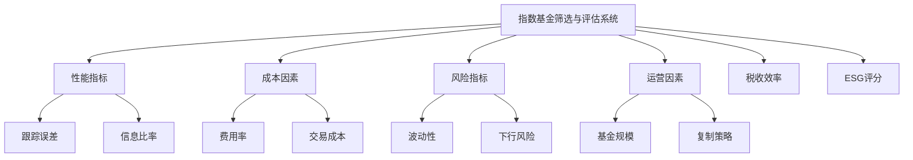

### 概念之间的关系

| 评估维度 | 关键指标 | 重要性 | 考虑因素 |
|----------|----------|--------|----------|
| 跟踪性能 | 跟踪误差 | 高 | 越低越好，但需考虑成本 |
| 成本 | 费用率 | 高 | 直接影响长期收益 |
| 流动性 | 日均交易量 | 中 | 影响交易执行效率 |
| 规模 | 资产管理规模 | 中 | 影响稳定性和流动性 |
| 复制策略 | 全复制vs优化复制 | 中 | 影响跟踪精度和成本 |
| 税收效率 | 周转率、分红政策 | 中 | 影响税后收益 |
| ESG | ESG评分 | 视投资者而定 | 满足特定投资需求 |

### 数学模型
使用多因素评分模型来综合评估指数基金：

$$
Score = \sum_{i=1}^{n} w_i \cdot \frac{x_i - \min(x_i)}{\max(x_i) - \min(x_i)}
$$

其中，$w_i$是第$i$个因素的权重，$x_i$是该因素的原始值，分子部分实现了数值的标准化。

### 算法流程图

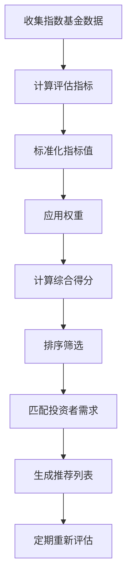

### 实际场景应用
指数基金筛选与评估系统在以下场景中有重要应用：

1. 构建多元化投资组合
2. 实施核心-卫星投资策略
3. 定期投资组合再平衡
4. 主题投资实施
5. 税收优化投资策略

### 项目介绍
"IndexFundExpert"是一个智能化的指数基金筛选与评估平台，专为投资决策AI Agent设计。该平台整合了多维度的评估指标，运用机器学习算法，能够根据投资者的具体需求和市场条件，快速筛选出最适合的指数基金。它还提供实时监控和动态调整建议，确保投资组合始终保持最优状态。

### 环境安装
使用Python构建指数基金筛选与评估系统：

```python
pip install pandas numpy scipy sklearn yfinance matplotlib seaborn
```

### 系统功能设计
IndexFundExpert包括以下功能模块：

1. 数据采集与更新
2. 性能指标计算
3. 成本分析器
4. 风险评估
5. 流动性分析
6. ESG评分整合
7. 多因素评分引擎
8. 个性化推荐系统
9. 实时监控与报告

### 系统架构设计

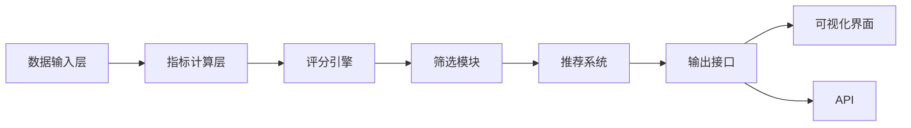

### 系统接口设计
RESTful API示例：

1. `/funds`: GET请求，获取符合条件的指数基金列表
2. `/evaluate`: POST请求，对特定指数基金进行评估
3. `/compare`: POST请求，比较多个指数基金
4. `/recommend`: POST请求，基于用户需求生成推荐
5. `/monitor`: GET请求，获取已选基金的实时监控数据

### 系统核心实现源代码
使用Python实现基本的指数基金筛选与评估系统：

```python
import pandas as pd
import numpy as np
import yfinance as yf

class IndexFundEvaluator:
    def __init__(self):
        self.funds_data = {}

    def load_fund_data(self, ticker, start_date, end_date):
        fund = yf.Ticker(ticker)
        hist = fund.history(start=start_date, end=end_date)
        self.funds_data[ticker] = hist
        return hist

    def calculate_tracking_error(self, fund_ticker, index_ticker):
        fund_data = self.funds_data[fund_ticker]
        index_data = self.load_fund_data(index_ticker, fund_data.index[0], fund_data.index[-1])
        
        fund_returns = fund_data['Close'].pct_change()
        index_returns = index_data['Close'].pct_change()
        
        tracking_diff = fund_returns - index_returns
        tracking_error = np.sqrt(np.sum(tracking_diff**2) / (len(tracking_diff) - 1))
        return tracking_error

    def calculate_expense_ratio(self, ticker):
        fund = yf.Ticker(ticker)
        try:
            return fund.info['annualReportExpenseRatio']
        except KeyError:
            return None

    def calculate_liquidity_score(self, ticker):
        fund_data = self.funds_data[ticker]
        avg_volume = fund_data['Volume'].mean()
        return np.log(avg_volume)  # 使用对数来处理大数值差异

    def calculate_fund_size_score(self, ticker):
        fund = yf.Ticker(ticker)
        try:
            aum = fund.info['totalAssets']
            return np.log(aum)  # 使用对数来处理大数值差异
        except KeyError:
            return None

    def evaluate_fund(self, fund_ticker, index_ticker):
        self.load_fund_data(fund_ticker, "2020-01-01", "2023-12-31")
        
        tracking_error = self.calculate_tracking_error(fund_ticker, index_ticker)
        expense_ratio = self.calculate_expense_ratio(fund_ticker)
        liquidity_score = self.calculate_liquidity_score(fund_ticker)
        size_score = self.calculate_fund_size_score(fund_ticker)
        
        return {
            "Ticker": fund_ticker,
            "Tracking Error": tracking_error,
            "Expense Ratio": expense_ratio,
            "Liquidity Score": liquidity_score,
            "Size Score": size_score
        }

    def rank_funds(self, fund_tickers, index_ticker):
        evaluations = []
        for ticker in fund_tickers:
            eval_result = self.evaluate_fund(ticker, index_ticker)
            evaluations.append(eval_result)
        
        df = pd.DataFrame(evaluations)
        df['Total Score'] = (
            df['Tracking Error'].rank(ascending=True) +
            df['Expense Ratio'].rank(ascending=True) +
            df['Liquidity Score'].rank(ascending=False) +
            df['Size Score'].rank(ascending=False)
        )
        return df.sort_values('Total Score')

# 使用示例
evaluator = IndexFundEvaluator()
fund_tickers = ['SPY', 'IVV', 'VOO']  # S&P 500指数基金
index_ticker = '^GSPC'  # S&P 500指数

ranked_funds = evaluator.rank_funds(fund_tickers, index_ticker)
print(ranked_funds)
```

### 最佳实践tips
1. 定期更新评估数据，确保决策基于最新信息
2. 考虑使用滚动时间窗口来计算指标，以捕捉近期表现
3. 在评估跟踪误差时，考虑不同市场环境下的表现
4. 关注基金公司的声誉和运营历史
5. 考虑指数基金的税收效率，特别是对高净值投资者
6. 在评估中纳入ESG因素，满足可持续投资需求
7. 定期审查和调整评估指标的权重，以适应市场变化

### 行业发展与未来趋势

| 年份 | 趋势 | 影响 |
|------|------|------|
| 2010年代 | 智能beta指数基金的兴起 | 扩展了指数投资的范围和策略 |
| 2015年左右 | ESG指数基金的快速发展 | 将可持续发展因素纳入被动投资 |
| 2020年代初 | AI驱动的指数构建和基金管理 | 提高了指数基金的效率和个性化程度 |
| 未来5年 | 区块链技术在指数基金中的应用 | 可能提高透明度和降低成本 |
| 未来10年 | 量子计算在投资组合优化中的应用 | 有望实现更精细的指数复制和风险管理 |

### 本章小结
指数基金筛选与评估系统是投资决策AI Agent的重要组成部分，它为资产配置策略的实施提供了具体的工具选择。通过综合考虑多个关键因素，我们可以为投资者选择最适合的指数基金，从而优化整体投资组合的表现。

本节讨论了指数基金评估的多个关键维度。跟踪误差是评估指数基金性能的核心指标，它衡量了基金与其跟踪指数的偏离程度。较低的跟踪误差通常意味着基金能够更好地复制指数表现，但也需要考虑到降低跟踪误差可能带来的额外成本。

费用率是另一个至关重要的因素，因为它直接影响投资者的长期回报。在评估中，我们不仅要考虑明示的管理费用，还要关注隐性成本，如交易成本和税收影响。流动性是确保投资策略可执行性的重要考量，特别是对于大额交易或频繁再平衡的策略。

基金规模影响到基金的稳定性和运营效率。较大的基金可能享有规模经济，但也可能面临灵活性下降的问题。复制策略（全复制vs优化复制）的选择影响到基金的跟踪精度和成本结构，需要在评估中加以考虑。

税收效率是指数基金选择中常被忽视的因素。对于应税账户，低周转率和税收管理效率高的基金可能会带来更好的税后回报。此外，随着可持续投资理念的普及，将ESG因素纳入评估框架变得越来越重要。

在设计多因素评分模型时，我们需要根据投资者的具体需求和市场环境来确定各项指标的权重。这个过程应该是动态的，允许根据新的信息和市场变化进行调整。

随着技术的发展，指数基金的评估和筛选正在变得更加精细和个性化。人工智能和机器学习算法的应用使得我们能够处理更复杂的数据模式，提供更精准的评估结果。未来，区块链技术可能会提高指数基金运作的透明度，而量子计算有望在投资组合优化和风险管理方面带来突破。

然而，我们也必须认识到，即使是最先进的评估系统也无法完全预测未来的表现。市场条件的变化、监管环境的调整以及新技术的出现都可能影响指数基金的表现。因此，持续监控和定期重新评估是必要的。

此外，在使用自动化系统进行指数基金筛选和评估时，我们不应忽视人为判断的价值。专业投资者的经验和洞察力可以补充定量分析，特别是在处理异常市场事件或评估新型指数基金时。

总的来说，一个有效的指数基金筛选与评估系统应该是全面、灵活且持续更新的。它不仅要考虑传统的性能指标，还要适应不断变化的投资环境和投资者需求。通过结合先进的数据分析技术和深入的金融知识，我们可以为投资者提供更精准、更个性化的指数基金选择，从而支持更优化的投资决策。

## 5.4 市场时机选择策略

在指数基金投资中，虽然长期持有通常是推荐的策略，但适度的市场时机选择可能会提高投资组合的整体表现。本节将探讨如何设计一个智能的市场时机选择策略，以优化指数基金的买入和卖出时机。

### 核心概念：
* 技术分析
* 宏观经济指标
* 市场情绪分析
* 动量策略
* 均值回归
* 波动率交易

### 问题背景
虽然指数基金投资强调长期持有，但市场的周期性波动为主动时机选择提供了潜在机会。然而，准确预测市场短期走势是极其困难的，不当的时机选择可能导致显著的损失。

### 问题描述
1. 如何设计一个既能捕捉市场机会又能控制风险的时机选择策略？
2. 如何整合多种信号源来提高时机选择的准确性？
3. 如何在指数基金的长期投资策略中合理应用市场时机选择？

### 问题解决
为全面解答上述问题，我们将从以下几个方面展开讨论：

1. 技术分析指标在时机选择中的应用
2. 宏观经济指标与市场走势的关系分析
3. 市场情绪指标的构建与使用
4. 动量策略和均值回归策略的设计
5. 波动率预测与风险管理
6. 多因子时机选择模型的构建
7. 机器学习在市场时机预测中的应用

### 边界与外延
虽然本节主要聚焦于指数基金的时机选择，但所讨论的方法也可以应用于更广泛的资产类别。我们还将探讨如何将时机选择策略与长期投资策略相结合，以及如何控制过度交易的风险。

### 概念结构与核心要素组成

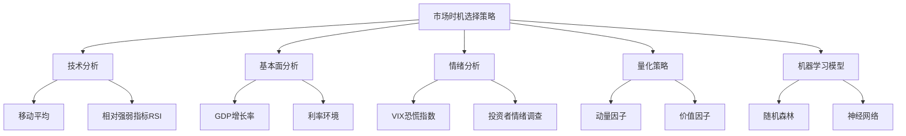

### 概念之间的关系

| 分析方法 | 主要指标 | 优势 | 局限性 |
|----------|----------|------|--------|
| 技术分析 | 移动平均、RSI | 简单直观，易于实施 | 可能产生虚假信号 |
| 基本面分析 | GDP、利率、通胀率 | 基于经济基本面，较为可靠 | 滞后性强，难以把握短期机会 |
| 情绪分析 | VIX、情绪调查 | 能捕捉市场非理性行为 | 情绪指标波动大，难以量化 |
| 量化策略 | 动量、价值因子 | 系统化、可回测 | 依赖历史数据，难以预测regime change |
| 机器学习 | 集成模型、深度学习 | 可处理复杂非线性关系 | 需要大量数据，存在过拟合风险 |

### 数学模型
使用简单的动量策略作为示例：

$$
Signal_t = \frac{P_t - P_{t-n}}{P_{t-n}}
$$

其中，$P_t$是当前价格，$P_{t-n}$是n个时间单位之前的价格。当$Signal_t$大于某个阈值时买入，小于某个阈值时卖出。

### 算法流程图

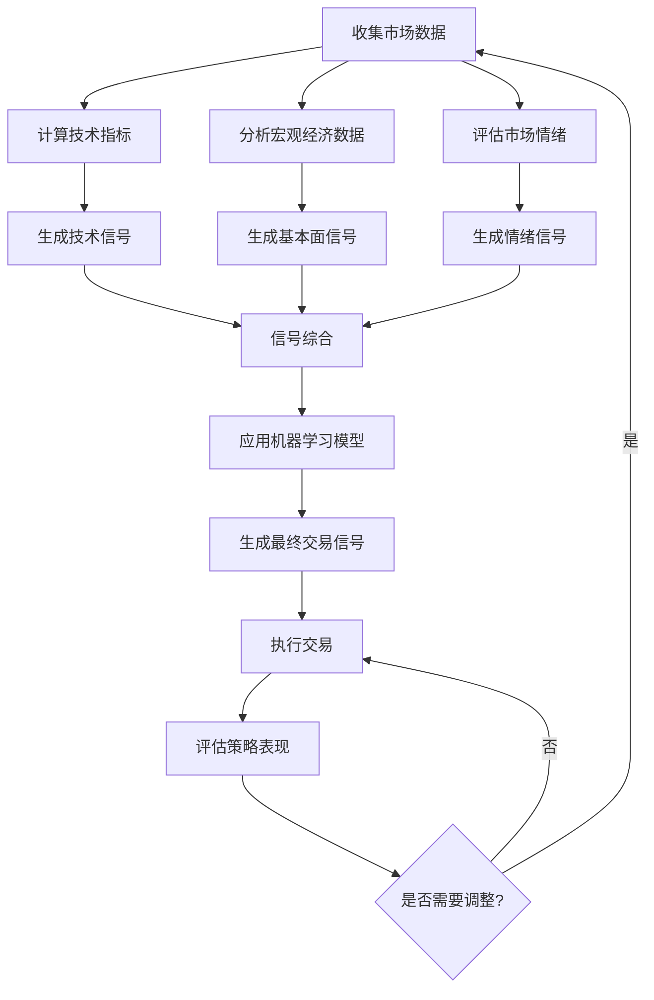

### 实际场景应用
市场时机选择策略在以下场景中有重要应用：

1. 指数基金定期再平衡
2. 战术资产配置调整
3. 风险管理和下行保护
4. 提高现金管理效率
5. 捕捉特殊市场事件机会

### 项目介绍
"MarketTimingMaster"是一个智能化的市场时机选择系统，专为指数基金投资设计。该系统整合了多种分析方法和数据源，运用先进的机器学习算法，能够实时生成市场时机信号。它不仅考虑了传统的技术和基本面因素，还纳入了市场情绪和宏观经济指标，旨在提供更全面、更准确的市场时机判断。

### 环境安装
使用Python构建市场时机选择系统：

```python
pip install pandas numpy scipy sklearn tensorflow yfinance ta statsmodels matplotlib seaborn
```

### 系统功能设计
MarketTimingMaster包括以下功能模块：

1. 数据采集与预处理
2. 技术指标计算
3. 宏观经济数据分析
4. 市场情绪评估
5. 多因子信号生成
6. 机器学习模型训练与预测
7. 交易信号生成
8. 回测与性能评估
9. 实时监控与报告

### 系统架构设计


### 系统接口设计
RESTful API示例：

1. `/market-data`: GET请求，获取最新市场数据
2. `/technical-indicators`: GET请求，获取技术指标分析结果
3. `/sentiment-analysis`: GET请求，获取市场情绪评估
4. `/generate-signal`: POST请求，生成交易信号
5. `/backtest`: POST请求，对策略进行回测
6. `/performance`: GET请求，获取策略性能报告

### 系统核心实现源代码
使用Python实现基本的市场时机选择策略：

```python
import pandas as pd
import numpy as np
import yfinance as yf
from ta import add_all_ta_features
from sklearn.ensemble import RandomForestClassifier
from sklearn.model_selection import train_test_split
from sklearn.metrics import accuracy_score

class MarketTimingStrategy:
    def __init__(self, symbol, start_date, end_date):
        self.symbol = symbol
        self.start_date = start_date
        self.end_date = end_date
        self.data = None
        self.model = RandomForestClassifier(n_estimators=100, random_state=42)

    def fetch_data(self):
        self.data = yf.download(self.symbol, start=self.start_date, end=self.end_date)
        self.data = add_all_ta_features(
            self.data, open="Open", high="High", low="Low", close="Close", volume="Volume"
        )

    def prepare_features(self):
        self.data['Returns'] = self.data['Close'].pct_change()
        self.data['Target'] = (self.data['Returns'].shift(-1) > 0).astype(int)
        self.data = self.data.dropna()

        features = [col for col in self.data.columns if col.startswith(('momentum', 'trend', 'volatility', 'volume'))]
        X = self.data[features]
        y = self.data['Target']

        return train_test_split(X, y, test_size=0.2, random_state=42)

    def train_model(self):
        X_train, X_test, y_train, y_test = self.prepare_features()
        self.model.fit(X_train, y_train)
        
        y_pred = self.model.predict(X_test)
        accuracy = accuracy_score(y_test, y_pred)
        print(f"Model Accuracy: {accuracy:.2f}")

    def generate_signals(self):
        features = [col for col in self.data.columns if col.startswith(('momentum', 'trend', 'volatility', 'volume'))]
        X = self.data[features]
        self.data['Signal'] = self.model.predict(X)

    def backtest(self):
        self.data['Strategy_Returns'] = self.data['Signal'].shift(1) * self.data['Returns']
        cumulative_returns = (1 + self.data['Strategy_Returns']).cumprod()
        total_return = cumulative_returns.iloc[-1] - 1
        sharpe_ratio = np.sqrt(252) * self.data['Strategy_Returns'].mean() / self.data['Strategy_Returns'].std()
        
        print(f"Total Return: {total_return:.2%}")
        print(f"Sharpe Ratio: {sharpe_ratio:.2f}")

        return cumulative_returns

# 使用示例
strategy = MarketTimingStrategy("SPY", "2010-01-01", "2023-12-31")
strategy.fetch_data()
strategy.train_model()
strategy.generate_signals()
cumulative_returns = strategy.backtest()

# 绘制累积收益图
import matplotlib.pyplot as plt

plt.figure(figsize=(12, 6))
plt.plot(cumulative_returns.index, cumulative_returns, label='Strategy')
plt.plot(strategy.data.index, (1 + strategy.data['Returns']).cumprod(), label='Buy and Hold')
plt.title('Market Timing Strategy vs Buy and Hold')
plt.xlabel('Date')
plt.ylabel('Cumulative Returns')
plt.legend()
plt.show()
```

### 最佳实践tips
1. 使用多种信号源，不要过度依赖单一指标
2. 设置适当的交易阈值，避免过度交易
3. 定期重新训练模型，适应市场变化
4. 考虑交易成本和税收影响
5. 结合风险管理策略，如止损和头寸管理
6. 持续监控和评估策略表现，及时调整
7. 保持谦逊，认识到市场时机选择的困难性

### 行业发展与未来趋势

| 年份 | 趋势 | 影响 |
|------|------|------|
| 2010年代 | 量化交易策略的普及 | 提高了市场效率，增加了策略复杂度 |
| 2015年左右 | 机器学习在金融预测中的应用 | 增强了模型处理复杂非线性关系的能力 |
| 2020年代初 | 替代数据在市场分析中的应用 | 提供了新的信息源，增强了预测能力 |
| 未来5年 | 强化学习在交易策略中的应用 | 可能带来更智能、自适应的交易系统 |
| 未来10年 | 量子计算在金融建模中的应用 | 有望突破传统计算限制，实现更复杂的市场模拟 |

### 本章小结
市场时机选择策略在指数基金投资中扮演着微妙而重要的角色。虽然长期持有通常是推荐的方法，但适度的时机选择可能会提高投资组合的整体表现，特别是在市场波动较大的时期。

本节讨论了多种市场时机选择的方法和技术。技术分析提供了基于价格和交易量的信号，如移动平均和相对强弱指标（RSI）。这些指标简单直观，但可能产生虚假信号，需要谨慎使用。基本面分析关注宏观经济指标，如GDP增长率、利率环境等，这些因素对长期市场趋势有重要影响，但可能难以捕捉短期机会。

市场情绪分析是一个相对新兴的领域，它试图量化投资者的心理状态。VIX恐慌指数和投资者情绪调查等工具可以提供有价值的洞察，但这些指标往往波动较大，需要结合其他分析方法使用。

量化策略，如动量和价值因子，提供了系统化的方法来识别市场机会。这些策略可以被严格定义和回测，但它们也依赖于历史模式的持续性，在市场结构发生重大变化时可能失效。

机器学习模型，如随机森林和神经网络，为市场时机选择带来了新的可能性。这些模型能够处理复杂的非线性关系，整合多种数据源，潜在地提高预测准确性。然而，它们也面临过拟合和"黑箱"决策的挑战，需要谨慎使用和持续验证。

在设计市场时机选择策略时，我们需要平衡多个目标。首先是准确性，即策略能够正确预测市场走势的能力。其次是稳健性，策略应该在不同市场环境下保持相对稳定的表现。再次是实用性，策略应该考虑交易成本、流动性和执行难度等实际因素。最后是风险控制，策略应该包含适当的风险管理措施，以防止重大损失。

实施市场时机选择策略时，需要注意以下几点：

1. 频率控制：过度交易可能导致高昂的成本和税收负担，侵蚀收益。策略应该设置适当的交易阈值，避免对小幅市场波动做出反应。

2. 部分配置：考虑只将投资组合的一部分用于时机选择策略，保留大部分资产进行长期持有。这种方法可以平衡主动管理和被动投资的优势。

3. 持续监控和调整：市场条件不断变化，成功的策略今天可能在明天失效。定期评估策略表现，并根据需要进行调整是必要的。

4. 结合基本面分析：纯粹的技术或量化策略可能忽视重要的经济和公司基本面因素。将基本面分析纳入决策过程可以提供更全面的市场视角。

5. 心理因素管理：市场时机选择可能带来情绪压力，特别是在策略表现不佳时。投资者需要保持纪律，严格遵守预定策略，避免情绪化决策。

随着技术的发展，市场时机选择策略正在经历深刻的变革。大数据和人工智能的应用使得我们能够处理更复杂的市场模式，提供更精准的预测。替代数据的使用，如卫星图像、信用卡交易数据等，为市场分析提供了新的维度。未来，量子计算可能会彻底改变金融建模和预测的方式，使我们能够模拟更复杂的市场动态。

然而，我们也必须保持谨慎和现实。市场是一个复杂的适应性系统，受到无数因素的影响，其中许多因素是不可预测的。即使是最先进的模型也无法完全消除市场的不确定性。因此，市场时机选择策略应该被视为投资工具箱中的一个补充工具，而不是唯一的决策依据。

总的来说，智能的市场时机选择策略可以为指数基金投资增添价值，特别是在提高风险调整后收益和管理下行风险方面。通过结合多种分析方法、利用先进技术，并保持审慎和纪律，投资者可以构建更加稳健和灵活的投资组合。然而，重要的是要记住，没有任何策略是完美的，长期的财务规划、多元化和风险管理仍然是成功投资的基石。
