# 第三部分：中国经济增长趋势分析

# 第7章：短期经济增长预测（1-5年）

## 7.1 后疫情时代经济复苏分析

新冠疫情对全球经济造成了巨大冲击，中国作为最早控制疫情并实现经济复苏的主要经济体，其复苏轨迹和特点对于理解短期经济增长趋势具有重要意义。本节将深入分析中国在后疫情时代的经济复苏情况，为未来1-5年的经济增长预测奠定基础。

### 核心概念：
* V型复苏
* 不平衡复苏
* 供给侧改革
* 内循环为主、国内国际双循环
* 数字经济
* 绿色复苏

### 问题背景
新冠疫情对中国经济的冲击是全方位的，但不同行业和地区受到的影响程度不同。理解复苏的不平衡性、识别新的增长动力，对于准确预测短期经济增长至关重要。

### 问题描述
1. 中国经济复苏的整体轨迹如何？
2. 哪些行业在复苏过程中表现突出，哪些仍面临挑战？
3. 政府采取了哪些关键政策措施来促进经济复苏？
4. 疫情如何改变了中国的经济结构和增长模式？

### 问题解决
为全面解答上述问题，我们将从以下几个方面展开讨论：

1. 宏观经济指标分析
2. 行业复苏情况对比
3. 区域经济复苏差异
4. 政策措施评估
5. 新兴产业和商业模式分析
6. 国际比较视角
7. 中长期影响评估

### 边界与外延
虽然本节主要聚焦于中国的经济复苏，但我们也会考虑全球经济复苏背景，以及中国复苏对全球经济的影响。此外，我们将探讨疫情带来的结构性变化对未来经济增长的潜在影响。

### 概念结构与核心要素组成

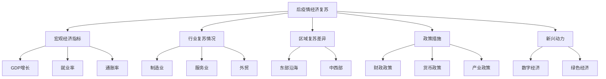

### 概念之间的关系

| 复苏维度 | 关键指标 | 政策支持 | 未来趋势 |
|----------|----------|----------|----------|
| 总体经济 | GDP增长率 | 宏观调控 | 稳中求进 |
| 就业 | 城镇登记失业率 | 就业优先政策 | 结构性挑战 |
| 物价 | CPI, PPI | 货币政策 | 温和通胀 |
| 工业生产 | 工业增加值 | 产业升级政策 | 智能制造 |
| 消费 | 社会消费品零售总额 | 扩内需政策 | 新型消费 |
| 投资 | 固定资产投资 | 重大项目建设 | 新基建为重点 |
| 外贸 | 进出口总额 | 开放政策 | 双循环格局 |

### 数学模型
使用简单的时间序列模型来预测GDP增长：

$$
GDP_t = \beta_0 + \beta_1 \cdot t + \beta_2 \cdot Pandemic_t + \epsilon_t
$$

其中，$GDP_t$是t时期的GDP增长率，$Pandemic_t$是疫情影响的虚拟变量，$\epsilon_t$是误差项。

### 算法流程图

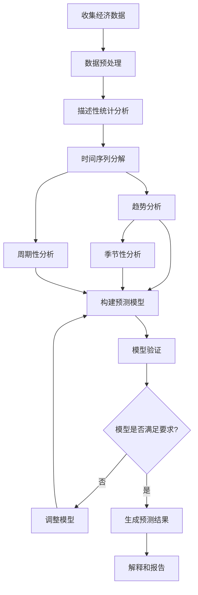

### 实际场景应用
后疫情经济复苏分析在以下场景中有重要应用：

1. 政府宏观经济政策制定
2. 企业战略规划和投资决策
3. 金融机构风险评估和资产配置
4. 国际组织对中国经济前景评估
5. 学术研究和经济理论创新

### 项目介绍
"EconoRecovery Analyzer"是一个综合性的经济复苏分析平台，专门设计用于后疫情时代的经济趋势研究。该平台整合了多源数据、先进的统计模型和机器学习算法，能够实时跟踪经济复苏进程，识别关键驱动因素，并生成短期经济预测。它不仅提供宏观层面的分析，还能深入到行业和区域层面，为决策者提供全面、及时的洞察。

### 环境安装
使用Python构建经济复苏分析系统：

```python
pip install pandas numpy scipy sklearn statsmodels prophet tensorflow matplotlib seaborn plotly
```

### 系统功能设计
EconoRecovery Analyzer包括以下功能模块：

1. 数据采集与整合
2. 宏观经济指标分析
3. 行业复苏跟踪器
4. 区域经济热力图
5. 政策效果评估器
6. 新兴产业监测
7. 国际比较分析
8. 预测模型集成
9. 可视化报告生成器

### 系统架构设计

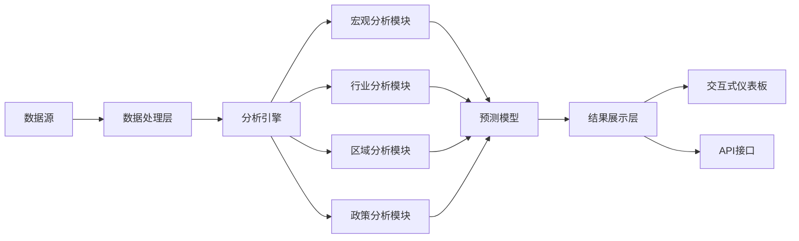

### 系统接口设计
RESTful API示例：

1. `/macro-indicators`: GET请求，获取最新宏观经济指标
2. `/industry-recovery`: GET请求，获取行业复苏情况
3. `/regional-analysis`: GET请求，获取区域经济复苏分析
4. `/policy-impact`: POST请求，评估特定政策的影响
5. `/forecast`: GET请求，获取短期经济增长预测
6. `/custom-report`: POST请求，生成自定义分析报告

### 系统核心实现源代码
使用Python实现基本的经济复苏分析：

```python
import pandas as pd
import numpy as np
import matplotlib.pyplot as plt
from statsmodels.tsa.seasonal import seasonal_decompose
from statsmodels.tsa.arima.model import ARIMA
from sklearn.metrics import mean_squared_error
from math import sqrt

class EconomicRecoveryAnalyzer:
    def __init__(self):
        self.data = None
        self.model = None

    def load_data(self, file_path):
        self.data = pd.read_csv(file_path, index_col='Date', parse_dates=True)
        print(f"Data loaded. Shape: {self.data.shape}")

    def plot_indicators(self, indicators):
        fig, axes = plt.subplots(len(indicators), 1, figsize=(12, 4*len(indicators)))
        for i, indicator in enumerate(indicators):
            self.data[indicator].plot(ax=axes[i])
            axes[i].set_title(indicator)
        plt.tight_layout()
        plt.show()

    def decompose_series(self, column, model='additive'):
        result = seasonal_decompose(self.data[column], model=model)
        result.plot()
        plt.show()

    def train_arima_model(self, column):
        model = ARIMA(self.data[column], order=(1,1,1))
        self.model = model.fit()
        print(self.model.summary())

    def forecast(self, steps):
        if self.model is None:
            raise ValueError("Model not trained. Call train_arima_model first.")
        forecast = self.model.forecast(steps=steps)
        return forecast

    def plot_forecast(self, column, steps):
        forecast = self.forecast(steps)
        plt.figure(figsize=(12,6))
        plt.plot(self.data.index, self.data[column], label='Observed')
        plt.plot(pd.date_range(start=self.data.index[-1], periods=steps+1, freq='M')[1:],
                 forecast, label='Forecast')
        plt.title(f'{column} Forecast')
        plt.legend()
        plt.show()

    def evaluate_forecast(self, column, test_size):
        train = self.data[column][:-test_size]
        test = self.data[column][-test_size:]
        model = ARIMA(train, order=(1,1,1))
        model_fit = model.fit()
        forecast = model_fit.forecast(steps=test_size)
        rmse = sqrt(mean_squared_error(test, forecast))
        print(f'Test RMSE: {rmse}')

    def analyze_industry_recovery(self, industries):
        recovery_rates = {}
        for industry in industries:
            pre_pandemic = self.data[industry].iloc[-24:-12].mean()
            current = self.data[industry].iloc[-1]
            recovery_rate = (current / pre_pandemic - 1) * 100
            recovery_rates[industry] = recovery_rate
        
        plt.figure(figsize=(10, 6))
        plt.bar(recovery_rates.keys(), recovery_rates.values())
        plt.title('Industry Recovery Rates')
        plt.ylabel('Recovery Rate (%)')
        plt.xticks(rotation=45)
        plt.show()
        
        return recovery_rates

    def policy_impact_analysis(self, policy_date, indicator):
        before = self.data[indicator][self.data.index < policy_date].mean()
        after = self.data[indicator][self.data.index >= policy_date].mean()
        impact = (after - before) / before * 100
        
        print(f"Impact of policy on {indicator}: {impact:.2f}%")
        
        plt.figure(figsize=(12, 6))
        plt.axvline(x=policy_date, color='r', linestyle='--', label='Policy Implementation')
        plt.plot(self.data.index, self.data[indicator])
        plt.title(f'Impact of Policy on {indicator}')
        plt.legend()
        plt.show()

# 使用示例
analyzer = EconomicRecoveryAnalyzer()
analyzer.load_data('economic_data.csv')

# 绘制主要经济指标
analyzer.plot_indicators(['GDP', 'Unemployment_Rate', 'CPI'])

# 分解GDP时间序列
analyzer.decompose_series('GDP')

# 训练ARIMA模型并进行预测
analyzer.train_arima_model('GDP')
analyzer.plot_forecast('GDP', steps=12)

# 评估预测性能
analyzer.evaluate_forecast('GDP', test_size=12)

# 分析行业复苏情况
industries = ['Manufacturing', 'Services', 'Retail', 'Technology']
recovery_rates = analyzer.analyze_industry_recovery(industries)

# 分析政策影响
analyzer.policy_impact_analysis('2020-03-01', 'GDP')
```

### 最佳实践tips
1. 使用多种数据源，包括官方统计、企业调查和替代数据
2. 关注高频数据，以捕捉经济复苏的实时动态
3. 考虑行业和区域的异质性，避免过度泛化
4. 结合定性分析，特别是对政策措施的解读
5. 定期更新模型，以适应快速变化的经济环境
6. 使用情景分析来处理不确定性，特别是与疫情相关的风险
7. 保持国际视角，考虑全球经济复苏对中国的影响

### 行业发展与未来趋势

| 年份 | 趋势 | 影响 |
|------|------|------|
| 2020 | 数字经济加速发展 | 推动经济结构转型，创造新的增长点 |
| 2021 | 供应链重构 | 影响全球贸易格局，可能带来新机遇和挑战 |
| 2022 | 绿色复苏成为主流 | 推动可持续发展，影响投资和消费模式 |
| 2023-2025 | 科技创新驱动增长 | 可能带来生产力的显著提升 |
| 未来5年 | 区域经济一体化深化 | 可能重塑国内市场格局，推动新的增长极形成 |

### 本章小结
后疫情时代的经济复苏分析为我们理解中国短期经济增长趋势提供了关键洞察。通过全面考察宏观经济指标、行业复苏情况、区域差异、政策措施及新兴动力，我们可以勾勒出一幅更加清晰的经济复苏图景。

中国经济在疫情冲击后展现出强劲的韧性，总体呈现V型复苏态势。然而，这种复苏是不平衡的，不同行业和地区的恢复速度存在显著差异。数字经济、高科技制造、医疗健康等领域表现突出，而旅游、线下服务等行业的复苏则相对滞后。这种不平衡性反映了疫情对经济结构的深远影响，也预示着未来增长动力的转换。

政府采取的一系列政策措施在推动经济复苏中发挥了关键作用。财政政策方面，大规模减税降费和扩大政府投资为企业纾困和刺激需求提供了支持。货币政策保持了适度宽松，为实体经济提供流动性支持。产业政策则聚焦于新基建、科技创新等领域，旨在培育新的增长点。这些政策的综合效应不仅帮助经济渡过难关，还为长期高质量发展奠定了基础。

疫情加速了中国经济的结构转型。数字经济的蓬勃发展不仅体现在电子商务、在线教育等直接受益领域，还推动了传统产业的数字化转型。绿色发展理念得到进一步强化，清洁能源、环保技术等领域投资增长迅速。此外，"内循环为主、国内国际双循环"的新发展格局正在形成，这将深刻影响未来的经济增长模式。

从国际比较来看，中国是最早控制疫情并实现经济正增长的主要经济体。这一表现不仅彰显了中国经济的韧性，也增强了其在全球经济中的影响力。然而，全球经济复苏的不确定性仍然是中国面临的重要外部风险。

展望未来1-5年，中国经济有望保持稳定增长，但增速可能会有所放缓，逐步回归到潜在增长率水平。创新将成为驱动增长的核心力量，5G、人工智能、生物技术等领域有望取得突破性进展。消费升级和服务业发展将成为拉动内需的重要引擎。区域协调发展战略的深入实施可能带来新的增长极。

然而，我们也需要警惕潜在的风险和挑战。人口老龄化、债务水平上升、国际经济环境的不确定性等因素都可能对经济增长形成制约。此外，如何平衡短期刺激与长期结构调整，如何处理创新驱动与金融风险防控的关系，都是政策制定者需要慎重考虑的问题。

总的来说，中国经济在后疫情时代展现出的韧性和活力为短期增长奠定了良好基础。通过持续深化改革、推动创新、优化经济结构，中国有望在未来5年保持稳健增长，并在全球经济复苏中发挥更加积极的作用。然而，面对复杂多变的国内外环境，保持警惕、精准施策、灵活应对仍然是确保经济持续健康发展的关键。

## 7.2 产业结构调整对经济增长的影响

产业结构调整是中国经济发展的一个关键特征，对短期和中长期经济增长都有深远影响。本节将深入分析产业结构调整的趋势、动因和对经济增长的影响，为未来1-5年的经济增长预测提供重要参考。

### 核心概念：
* 三次产业结构
* 产业升级
* 供给侧结构性改革
* 高质量发展
* 新兴产业
* 产业链现代化

### 问题背景
中国经济正处于转型升级的关键时期，产业结构调整是实现高质量发展的必由之路。了解产业结构调整的方向和力度，对于准确预测经济增长至关重要。

### 问题描述
1. 中国产业结构调整的主要趋势是什么？
2. 哪些因素在推动产业结构调整？
3. 产业结构调整如何影响经济增长率和质量？
4. 新兴产业在经济增长中的作用如何？

### 问题解决
为全面解答上述问题，我们将从以下几个方面展开讨论：

1. 三次产业结构变化分析
2. 重点行业转型升级案例研究
3. 供给侧结构性改革的进展和影响
4. 新兴产业发展态势
5. 产业链现代化进程
6. 区域产业结构调整差异
7. 国际比较视角

### 边界与外延
虽然本节主要聚焦于产业结构调整对经济增长的影响，但我们也会考虑技术创新、人口结构变化、全球化等相关因素。此外，我们将探讨产业结构调整对就业、收入分配和环境可持续性的影响。

### 概念结构与核心要素组成

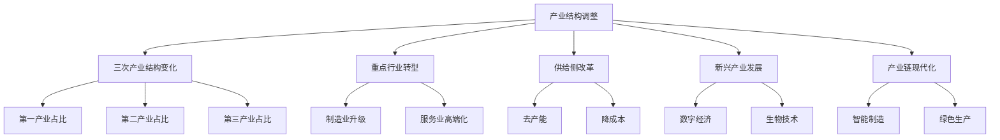

### 概念之间的关系

| 调整维度 | 主要措施 | 预期效果 | 潜在挑战 |
|----------|----------|----------|----------|
| 产业结构优化 | 提高第三产业占比 | 提升经济效率 | 就业结构调整 |
| 制造业升级 | 推动智能制造 | 提高全要素生产率 | 技术创新压力 |
| 服务业发展 | 发展现代服务业 | 创造新的增长点 | 人才需求增加 |
| 新兴产业培育 | 政策支持和投资 | 形成新的经济引擎 | 市场不确定性 |
| 传统产业改造 | 技术改造和整合 | 提高资源利用效率 | 转型成本高 |

### 数学模型
使用结构分解模型分析产业结构变化对经济增长的贡献：

$$
\Delta Y = \sum_{i} S_i \Delta Y_i + \sum_{i} Y_i \Delta S_i + \sum_{i} \Delta S_i \Delta Y_i
$$

其中，$Y$是总产出，$S_i$是第$i$个产业的份额，$Y_i$是第$i$个产业的产出。等式右边三项分别代表产业内部增长效应、产业结构变动效应和交互效应。

### 算法流程图

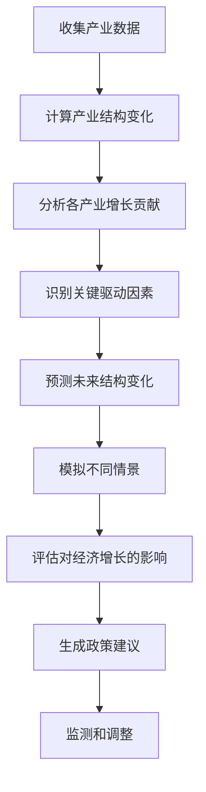

### 实际场景应用
产业结构调整分析在以下场景中有重要应用：

1. 国家和地方产业政策制定
2. 企业战略规划和投资决策
3. 人力资源开发和教育培训规划
4. 区域经济发展战略制定
5. 国际产业合作和竞争策略

### 项目介绍
"IndustrialTransformAnalyzer"是一个专业的产业结构调整分析平台，旨在为政策制定者、企业决策者和研究人员提供全面的产业结构变化洞察。该平台整合了海量的产业数据、先进的经济模型和机器学习算法，能够实时跟踪产业结构变化，预测未来趋势，并评估其对经济增长的影响。它还提供了交互式的可视化工具和定制化的报告生成功能。

### 环境安装
使用Python构建产业结构调整分析系统：

```python
pip install pandas numpy scipy sklearn statsmodels prophet tensorflow matplotlib seaborn plotly
```

### 系统功能设计
IndustrialTransformAnalyzer包括以下功能模块：

1. 数据采集与清洗
2. 产业结构变化分析
3. 产业增长贡献计算器
4. 新兴产业识别与跟踪
5. 产业链分析工具
6. 区域比较分析器
7. 政策影响评估模块
8. 未来趋势预测引擎
9. 交互式可视化界面

### 系统架构设计

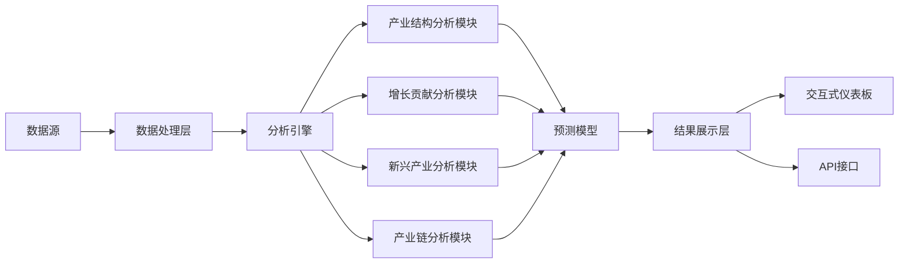

### 系统接口设计
RESTful API示例：

1. `/industry-structure`: GET请求，获取最新产业结构数据
2. `/growth-contribution`: POST请求，计算特定产业对经济增长的贡献
3. `/emerging-industries`: GET请求，获取新兴产业发展情况
4. `/industry-chain-analysis`: POST请求，进行特定产业链分析
5. `/regional-comparison`: GET请求，获取区域产业结构对比
6. `/forecast`: POST请求，生成产业结构调整预测

### 系统核心实现源代码
使用Python实现基本的产业结构调整分析：

```python
import pandas as pd
import numpy as np
import matplotlib.pyplot as plt
from sklearn.linear_model import LinearRegression
from sklearn.model_selection import train_test_split

class IndustryStructureAnalyzer:
    def __init__(self):
        self.data = None
        self.model = LinearRegression()

    def load_data(self, file_path):
        self.data = pd.read_csv(file_path, index_col='Year')
        print(f"Data loaded. Shape: {self.data.shape}")

    def plot_industry_structure(self):
        industries = ['Primary', 'Secondary', 'Tertiary']
        self.data[industries].plot(kind='area', stacked=True)
        plt.title('Industry Structure Change Over Time')
        plt.ylabel('Percentage')
        plt.show()

    def calculate_growth_contribution(self):
        industries = ['Primary', 'Secondary', 'Tertiary']
        growth_rates = self.data[industries].pct_change()
        weights = self.data[industries] / 100
        contributions = growth_rates * weights.shift(1)
        total_contribution = contributions.sum(axis=1)
        return contributions, total_contribution

    def plot_growth_contribution(self):
        contributions, total = self.calculate_growth_contribution()
        contributions.plot(kind='bar', stacked=True)
        plt.title('Industry Contribution to Economic Growth')
        plt.ylabel('Contribution to Growth Rate')
        plt.show()

    def analyze_emerging_industries(self, industries):
        emerging = self.data[industries]
        growth_rates = emerging.pct_change().mean()
        plt.figure(figsize=(10, 6))
        growth_rates.sort_values(ascending=False).plot(kind='bar')
        plt.title('Average Growth Rate of Emerging Industries')
        plt.ylabel('Average Annual Growth Rate')
        plt.xticks(rotation=45)
        plt.show()

    def forecast_industry_structure(self, years_ahead=5):
        X = np.array(range(len(self.data))).reshape(-1, 1)
        industries = ['Primary', 'Secondary', 'Tertiary']
        
        future_years = np.array(range(len(self.data), len(self.data) + years_ahead)).reshape(-1, 1)
        forecasts = {}

        for industry in industries:
            y = self.data[industry].values
            self.model.fit(X, y)
            forecast = self.model.predict(future_years)
            forecasts[industry] = forecast

        forecast_df = pd.DataFrame(forecasts, index=range(self.data.index[-1]+1, self.data.index[-1]+years_ahead+1))
        return forecast_df

    def plot_forecast(self, forecast_df):
        combined = pd.concat([self.data[['Primary', 'Secondary', 'Tertiary']], forecast_df])
        combined.plot(figsize=(12, 6))
        plt.title('Industry Structure Forecast')
        plt.ylabel('Percentage')
        plt.axvline(x=self.data.index[-1], color='r', linestyle='--', label='Forecast Start')
        plt.legend(loc='center left', bbox_to_anchor=(1, 0.5))
        plt.show()

# 使用示例
analyzer = IndustryStructureAnalyzer()
analyzer.load_data('industry_structure_data.csv')

# 绘制产业结构变化
analyzer.plot_industry_structure()

# 分析产业对经济增长的贡献
analyzer.plot_growth_contribution()

# 分析新兴产业
emerging_industries = ['IT', 'Biotech', 'NewEnergy', 'AI']
analyzer.analyze_emerging_industries(emerging_industries)

# 预测未来产业结构
forecast = analyzer.forecast_industry_structure(years_ahead=5)
analyzer.plot_forecast(forecast)
```

### 最佳实践tips
1. 关注产业间的关联效应，避免孤立地分析单个产业
2. 结合定性和定量分析，特别是对新兴产业的评估
3. 考虑国际产业转移和全球价值链重构的影响
4. 注意产业政策的实施效果和可能的副作用
5. 关注产业结构调整对就业和收入分配的影响
6. 将产业结构分析与区域发展战略相结合
7. 定期更新数据和模型，以适应快速变化的经济环境

### 行业发展与未来趋势

| 年份 | 趋势 | 影响 |
|------|------|------|
| 2023 | 数字经济深度融合 | 传统产业数字化转型加速 |
| 2024 | 高端制造业崛起 | 产业链价值提升，国际竞争力增强 |
| 2025 | 服务业占比突破60% | 经济结构进一步优化，新职业大量涌现 |
| 2026-2027 | 绿色低碳产业快速发展 | 推动经济发展方式转变，创造新的增长点 |
| 未来5年 | 产业融合加深 | 产业边界模糊，新业态不断涌现 |

### 本章小结
产业结构调整是中国经济发展的核心动力之一，对短期经济增长和长期发展潜力都有深远影响。通过分析三次产业结构变化、重点行业转型升级、新兴产业发展等方面，我们可以更好地理解和预测未来1-5年的经济增长趋势。

近年来，中国的产业结构持续优化，第三产业占比不断提高，已成为国民经济的主导力量。服务业的快速发展不仅创造了大量就业机会，也提升了经济的整体效率。同时，制造业正经历深刻的转型升级，向高端化、智能化、绿色化方向发展，这有助于提高全要素生产率和国际竞争力。

供给侧结构性改革在推动产业结构调整中发挥了关键作用。去产能、降成本等措施帮助淘汰了一批落后产能，优化了资源配置。但这个过程也带来了短期的增长压力和就业挑战，需要政策制定者谨慎平衡。

新兴产业的快速崛起是产业结构调整的一个显著特征。以人工智能、生物技术、新能源等为代表的新兴产业正成为经济增长的新引擎。这些产业不仅自身增长迅速，还通过技术溢出效应带动传统产业升级，对经济增长的贡献日益显著。

产业链现代化是另一个重要趋势。通过推动智能制造、构建现代产业体系，中国正努力提升在全球价值链中的地位。这不仅有助于增强经济的抗风险能力，也为未来的持续增长奠定基础。

区域产业结构调整呈现出不同的特点。东部沿海地区正加速向高端制造和现代服务业转型，中西部地区则在承接产业转移的同时，努力培育本地特色产业。这种区域差异化发展有助于优化全国产业布局，但也带来了区域协调发展的挑战。

从国际比较来看，中国产业结构调整的速度和规模都是显著的。与其他新兴经济体相比，中国在保持制造业优势的同时，服务业占比的提升更为迅速。这种"双轮驱动"的发展模式为经济增长提供了更多韧性和动力。

展望未来1-5年，产业结构调整将继续深化，对经济增长的影响主要体现在以下几个方面：

1. 增长动力转换：新兴产业和现代服务业将成为主要增长点，可能带来更高质量但增速略低的增长。

2. 生产效率提升：制造业升级和数字化转型将推动全要素生产率提高，部分抵消劳动力成本上升的影响。

3. 就业结构变化：服务业占比提高将创造更多就业机会，但也需要劳动力技能的相应提升。

4. 创新驱动加强：产业升级将进一步刺激研发投入和技术创新，为长期增长潜力提供支撑。

5. 区域发展格局调整：产业转移和区域特色发展将重塑经济地理，可能出现新的增长极。

6. 国际竞争力提升：高端制造业和新兴产业的发展将增强中国在全球价值链中的地位。

然而，产业结构调整也面临一些挑战和风险：

1. 转型成本：传统产业改造和员工再培训需要大量投资，短期内可能影响企业盈利和就业。

2. 技术瓶颈：关键核心技术的突破需要时间和持续投入，可能影响产业升级的进程。

3. 区域差距：不同地区在产业转型中的表现差异可能加剧区域不平衡。

4. 国际环境：全球产业链重构和贸易摩擦可能影响中国某些产业的发展。

5. 政策协调：产业政策、创新政策、教育政策等需要良好协调，以支持产业结构调整。

为了更好地推动产业结构调整并实现经济增长目标，政策制定者需要考虑以下建议：

1. 坚持市场主导与政府引导相结合，避免过度干预导致资源错配。

2. 加大对基础研究和关键核心技术的投入，为产业升级提供技术支撑。

3. 完善人才培养和引进机制，为新兴产业发展提供人力资本支持。

4. 优化营商环境，鼓励创新创业，促进新技术、新业态、新模式的发展。

5. 推动区域协调发展，引导产业有序转移，培育区域特色产业集群。

6. 加强国际合作，积极参与全球产业分工，提升在全球价值链中的地位。

7. 注重产业结构调整的社会影响，制定配套政策以缓解就业压力和收入分配问题。

总的来说，产业结构调整将是影响中国未来1-5年经济增长的关键因素之一。通过推动高质量发展、培育新兴产业、提升传统产业，中国有望维持稳定的经济增长，并在全球产业格局中占据更加有利的位置。然而，这个过程需要政策制定者、企业和个人共同努力，平衡好发展、转型和稳定的关系。随着产业结构不断优化，中国经济有望实现更可持续、更具韧性的增长模式，为长期繁荣奠定坚实基础。

## 7.3 消费升级与内需扩大趋势

消费升级和内需扩大是中国经济发展的重要驱动力，对短期经济增长具有显著影响。本节将深入分析消费升级的特征、内需扩大的趋势及其对经济增长的影响，为未来1-5年的经济预测提供重要依据。

### 核心概念：
* 消费升级
* 内需扩大
* 居民消费倾向
* 消费结构
* 新型消费
* 消费潜力释放

### 问题背景
随着中国经济的持续发展和居民收入的不断提高，消费升级和内需扩大成为推动经济增长的重要力量。了解这一趋势的特征和动力，对于预测短期经济增长至关重要。

### 问题描述
1. 中国消费升级的主要表现和特征是什么？
2. 哪些因素在推动内需扩大？
3. 消费升级和内需扩大如何影响经济增长？
4. 新型消费模式对经济结构的影响如何？

### 问题解决
为全面解答上述问题，我们将从以下几个方面展开讨论：

1. 消费结构变化分析
2. 居民收入与消费倾向关系
3. 新兴消费热点研究
4. 消费政策效果评估
5. 区域消费差异分析
6. 消费升级对产业发展的影响
7. 国际比较视角

### 边界与外延
虽然本节主要聚焦于消费升级和内需扩大，但我们也会考虑其他相关因素，如人口结构变化、城镇化进程、技术创新等。此外，我们将探讨消费升级对社会发展和环境可持续性的影响。

### 概念结构与核心要素组成

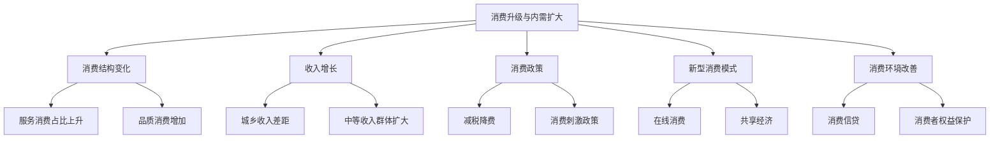

### 概念之间的关系

| 消费维度 | 主要特征 | 驱动因素 | 对经济增长的影响 |
|----------|----------|----------|------------------|
| 消费结构 | 服务消费占比提高 | 收入增长、观念变化 | 推动产业结构优化 |
| 消费质量 | 品质消费需求增加 | 生活水平提高 | 促进产品升级 |
| 消费模式 | 线上线下融合 | 技术进步、习惯改变 | 创造新的经济增长点 |
| 消费群体 | 中等收入群体扩大 | 收入分配改善 | 扩大内需市场规模 |
| 消费环境 | 信用消费增加 | 金融创新、政策支持 | 提高消费潜力释放 |

### 数学模型
使用消费函数模型分析收入对消费的影响：

$$
C = a + b \cdot Y
$$

其中，$C$是消费，$Y$是可支配收入，$a$是自主消费，$b$是边际消费倾向。

### 算法流程图

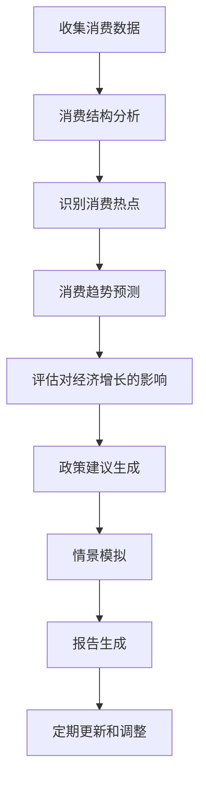

### 实际场景应用
消费升级与内需扩大分析在以下场景中有重要应用：

1. 宏观经济政策制定
2. 企业产品开发和市场策略
3. 投资机构行业研究
4. 城市商业规划
5. 消费金融产品设计

### 项目介绍
"ConsumerInsightPro"是一个综合性的消费趋势分析平台，专门设计用于研究消费升级和内需扩大趋势。该平台整合了海量消费数据、先进的统计模型和机器学习算法，能够实时跟踪消费结构变化，识别新兴消费热点，预测未来消费趋势，并评估其对经济增长的影响。它还提供了交互式的可视化工具和个性化的报告生成功能。

### 环境安装
使用Python构建消费趋势分析系统：

```python
pip install pandas numpy scipy sklearn statsmodels prophet tensorflow matplotlib seaborn plotly
```

### 系统功能设计
ConsumerInsightPro包括以下功能模块：

1. 数据采集与清洗
2. 消费结构分析
3. 消费热点识别
4. 收入-消费关系模型
5. 新型消费模式跟踪
6. 区域消费差异分析
7. 消费政策影响评估
8. 消费趋势预测引擎
9. 交互式可视化界面

### 系统架构设计

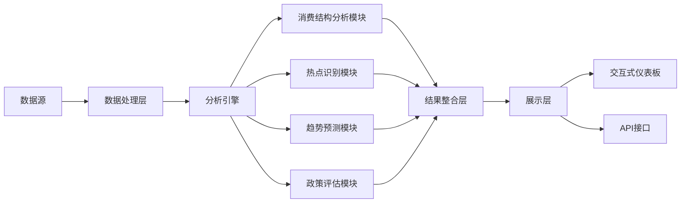

### 系统接口设计
RESTful API示例：

1. `/consumption-structure`: GET请求，获取最新消费结构数据
2. `/consumption-hotspots`: GET请求，获取当前消费热点
3. `/income-consumption-analysis`: POST请求，分析收入与消费的关系
4. `/consumption-forecast`: POST请求，生成未来消费趋势预测
5. `/policy-impact`: POST请求，评估特定消费政策的影响
6. `/regional-comparison`: GET请求，获取区域消费差异分析

### 系统核心实现源代码
使用Python实现基本的消费趋势分析：

```python
import pandas as pd
import numpy as np
import matplotlib.pyplot as plt
from sklearn.cluster import KMeans
from statsmodels.tsa.arima.model import ARIMA

class ConsumptionAnalyzer:
    def __init__(self):
        self.data = None
        self.model = None

    def load_data(self, file_path):
        self.data = pd.read_csv(file_path, index_col='Date', parse_dates=True)
        print(f"Data loaded. Shape: {self.data.shape}")

    def analyze_consumption_structure(self):
        categories = self.data.columns
        latest_data = self.data.iloc[-1]
        plt.figure(figsize=(10, 6))
        plt.pie(latest_data, labels=categories, autopct='%1.1f%%')
        plt.title('Latest Consumption Structure')
        plt.show()

    def identify_consumption_hotspots(self, n_clusters=3):
        growth_rates = self.data.pct_change().mean()
        kmeans = KMeans(n_clusters=n_clusters)
        kmeans.fit(growth_rates.values.reshape(-1, 1))
        
        clusters = pd.DataFrame({'Category': growth_rates.index, 'Cluster': kmeans.labels_, 'Growth Rate': growth_rates.values})
        hotspots = clusters[clusters['Cluster'] == clusters['Growth Rate'].idxmax()]
        
        print("Consumption Hotspots:")
        print(hotspots)

    def analyze_income_consumption_relationship(self, income_data):
        merged_data = pd.merge(self.data.sum(axis=1), income_data, left_index=True, right_index=True)
        merged_data.columns = ['Consumption', 'Income']
        
        plt.figure(figsize=(10, 6))
        plt.scatter(merged_data['Income'], merged_data['Consumption'])
        plt.xlabel('Income')
        plt.ylabel('Consumption')
        plt.title('Income-Consumption Relationship')
        plt.show()
        
        correlation = merged_data['Income'].corr(merged_data['Consumption'])
        print(f"Correlation between Income and Consumption: {correlation:.2f}")

    def forecast_consumption_trend(self, category, steps=12):
        series = self.data[category]
        model = ARIMA(series, order=(1,1,1))
        self.model = model.fit()
        
        forecast = self.model.forecast(steps=steps)
        
        plt.figure(figsize=(12, 6))
        plt.plot(series.index, series, label='Observed')
        plt.plot(forecast.index, forecast, label='Forecast')
        plt.title(f'{category} Consumption Forecast')
        plt.legend()
        plt.show()

    def evaluate_policy_impact(self, policy_date, category):
        before = self.data[category][self.data.index < policy_date].mean()
        after = self.data[category][self.data.index >= policy_date].mean()
        impact = (after - before) / before * 100
        
        print(f"Impact of policy on {category} consumption: {impact:.2f}%")
        
        plt.figure(figsize=(12, 6))
        plt.axvline(x=policy_date, color='r', linestyle='--', label='Policy Implementation')
        plt.plot(self.data.index, self.data[category])
        plt.title(f'Impact of Policy on {category} Consumption')
        plt.legend()
        plt.show()

# 使用示例
analyzer = ConsumptionAnalyzer()
analyzer.load_data('consumption_data.csv')

# 分析消费结构
analyzer.analyze_consumption_structure()

# 识别消费热点
analyzer.identify_consumption_hotspots()

# 分析收入与消费关系
income_data = pd.read_csv('income_data.csv', index_col='Date', parse_dates=True)
analyzer.analyze_income_consumption_relationship(income_data)

# 预测消费趋势
analyzer.forecast_consumption_trend('Food')

# 评估政策影响
analyzer.evaluate_policy_impact('2022-01-01', 'Electronics')
```

### 最佳实践tips
1. 结合多种数据源，包括官方统计、消费者调查和大数据分析
2. 关注消费者行为的长期趋势和短期波动
3. 考虑人口结构、地域差异等因素对消费模式的影响
4. 定期更新模型，以适应快速变化的消费环境
5. 结合定性分析，特别是对新兴消费现象的解读
6. 注意消费数据的季节性和节假日效应
7. 考虑外部因素（如疫情）对消费行为的影响

### 行业发展与未来趋势

| 年份 | 趋势 | 影响 |
|------|------|------|
| 2023 | 健康消费持续升温 | 医疗保健、健身产业快速发展 |
| 2024 | 智能家居普及加速 | 带动相关电子产品和服务需求 |
| 2025 | 体验式消费成主流 | 旅游、文化、教育等服务业蓬勃发展 |
| 2026-2027 | 可持续消费理念深入人心 | 绿色产品、循环经济模式兴起 |
| 未来5年 | 个性化定制需求增加 | 推动生产模式转型，催生新业态 |

### 本章小结
消费升级与内需扩大是中国经济发展的重要驱动力，对未来1-5年的经济增长具有深远影响。通过分析消费结构变化、新兴消费热点、收入-消费关系等方面，我们可以更好地理解和预测短期经济增长趋势。

近年来，中国消费市场呈现出明显的升级特征。服务消费占比持续上升，品质消费需求增加，这反映了居民生活水平的提高和消费观念的转变。同时，新型消费模式如在线消费、共享经济等快速发展，不仅改变了消费方式，也创造了新的经济增长点。

内需扩大的趋势主要由以下因素推动：

1. 收入增长：居民可支配收入的持续增加为消费升级提供了基础。特别是中等收入群体的扩大，释放了巨大的消费潜力。

2. 城镇化进程：城镇化不仅带来人口流动，也促进了消费习惯的改变和消费水平的提升。

3. 消费环境改善：信用消费的普及、消费者权益保护的加强等因素增强了消费信心。

4. 政策支持：减税降费、消费刺激政策等措施有效促进了内需扩大。

5. 技术创新：数字技术的应用为消费者提供了更便捷、个性化的消费体验，刺激了消费需求。

消费升级和内需扩大对经济增长的影响主要体现在以下几个方面：

1. 经济增长动力转换：消费对GDP增长的贡献率不断提高，成为经济增长的主要动力。

2. 产业结构优化：消费升级推动了服务业和高端制造业的发展，促进了经济结构的优化。

3. 创新驱动：新型消费需求刺激了企业创新，推动了新技术、新产品的开发。

4. 就业机会创造：特别是在服务业领域，消费升级带来了大量新的就业机会。

5. 区域发展平衡：内需扩大有助于减少对外部市场的依赖，促进区域经济的均衡发展。

然而，消费升级和内需扩大也面临一些挑战：

1. 收入分配不均：可能限制部分群体的消费能力，影响内需扩大的进程。

2. 人口老龄化：可能改变消费结构，增加医疗保健等方面的支出。

3. 消费信贷风险：过度信贷消费可能带来金融风险。

4. 环境压力：消费增长可能带来资源消耗和环境污染问题。

5. 外部不确定性：全球经济波动可能影响消费信心。

展望未来1-5年，消费升级和内需扩大将继续成为推动中国经济增长的重要力量。预计将呈现以下趋势：

1. 服务消费占比将进一步提高，特别是在教育、医疗、文化、旅游等领域。

2. 智能化、个性化消费需求将增加，推动相关产业发展。

3. 健康和可持续消费理念将更加普及，影响消费者选择和企业战略。

4. 线上线下融合消费模式将进一步发展，带动新零售业态创新。

5. 农村消费市场潜力将进一步释放，成为内需增长的新动力。

为了更好地促进消费升级和内需扩大，政策制定者需要考虑以下建议：

1. 继续实施收入分配改革，扩大中等收入群体规模。

2. 完善社会保障体系，增强居民消费信心。

3. 优化消费环境，加强消费者权益保护。

4. 鼓励创新和竞争，满足多元化、个性化的消费需求。

5. 推动城乡融合发展，释放农村消费潜力。

6. 加强消费信贷管理，防范金融风险。

7. 促进绿色消费，推动可持续发展。

总的来说，消费升级和内需扩大将是影响中国未来1-5年经济增长的关键因素之一。通过合理引导消费、释放内需潜力，中国有望维持稳定的经济增长，并实现更加平衡、可持续的发展模式。然而，这个过程需要政府、企业和消费者的共同努力，以应对各种挑战并把握新的机遇。随着消费市场的不断成熟和升级，中国经济有望获得更强劲、更持久的内生动力，为长期繁荣奠定坚实基础。

## 7.4 短期经济增长率预测

在分析了后疫情时代经济复苏、产业结构调整以及消费升级与内需扩大等关键因素后，我们现在将综合这些信息，对中国未来1-5年的短期经济增长率进行预测。这个预测将为投资决策、政策制定和经济规划提供重要参考。

### 核心概念：
* GDP增长率
* 经济周期
* 宏观经济预测
* 情景分析
* 预测不确定性
* 经济弹性

### 问题背景
准确预测短期经济增长率是一项复杂的任务，需要考虑多种因素的相互作用及其动态变化。在后疫情时代，经济复苏的不确定性、全球经济环境的变化以及中国自身的结构性调整都增加了预测的难度。

### 问题描述
1. 如何整合多种经济指标和影响因素来预测GDP增长率？
2. 如何处理预测中的不确定性和风险因素？
3. 不同情景下的经济增长路径会有何差异？
4. 如何评估预测的准确性和可靠性？

### 问题解决
为全面解答上述问题，我们将从以下几个方面展开讨论：

1. 多模型集成预测方法
2. 关键经济指标分析
3. 情景设计与分析
4. 不确定性量化
5. 敏感性分析
6. 国际比较视角
7. 预测结果的解释与应用

### 边界与外延
虽然本节主要聚焦于短期经济增长率预测，但我们也会考虑中长期增长趋势的影响。此外，我们将探讨预测结果对不同经济主体和政策制定的潜在影响。

### 概念结构与核心要素组成

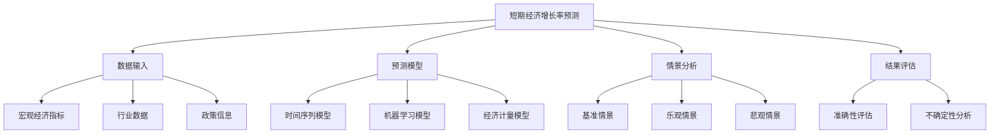

### 概念之间的关系

| 预测要素 | 主要指标/方法 | 影响因素 | 不确定性来源 |
|----------|---------------|----------|--------------|
| 经济基本面 | GDP、CPI、PMI | 产业政策、消费趋势 | 数据质量、滞后性 |
| 外部环境 | 贸易数据、汇率 | 全球经济形势、地缘政治 | 国际关系变化 |
| 政策因素 | 财政政策、货币政策 | 政策目标、执行效果 | 政策调整、实施延迟 |
| 结构性变化 | 产业结构、消费结构 | 技术创新、消费升级 | 转型速度、适应性 |
| 预测模型 | ARIMA、机器学习、CGE | 模型选择、参数设置 | 模型假设、过拟合 |

### 数学模型
使用集成学习方法综合多个模型的预测结果：

$$
GDP_{growth} = \sum_{i=1}^{n} w_i \cdot Model_i(X)
$$

其中，$w_i$是第$i$个模型的权重，$Model_i(X)$是第$i$个模型基于输入$X$的预测结果。

### 算法流程图

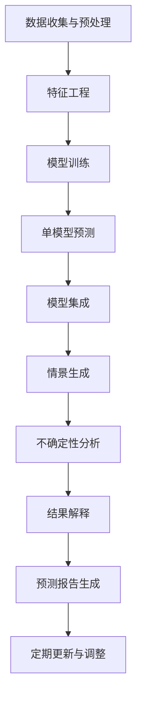

### 实际场景应用
短期经济增长率预测在以下场景中有重要应用：

1. 政府宏观经济政策制定
2. 企业战略规划和投资决策
3. 金融机构风险管理和资产配置
4. 国际组织对中国经济前景评估
5. 学术研究和经济理论验证

### 项目介绍
"EconoForecast Pro"是一个先进的经济增长预测平台，专门设计用于生成高精度的短期经济增长率预测。该平台整合了多源数据、多种预测模型和先进的机器学习算法，能够实时更新预测结果，进行情景分析，并提供详细的不确定性评估。它不仅提供点预测，还生成概率分布，帮助决策者更好地理解潜在风险和机遇。

### 环境安装
使用Python构建经济增长预测系统：

```python
pip install pandas numpy scipy sklearn statsmodels prophet tensorflow matplotlib seaborn plotly
```

### 系统功能设计
EconoForecast Pro包括以下功能模块：

1. 数据采集与清洗
2. 特征工程与选择
3. 多模型训练与评估
4. 模型集成与预测
5. 情景生成器
6. 不确定性分析器
7. 敏感性分析工具
8. 可视化报告生成器
9. 实时更新与预警系统

### 系统架构设计

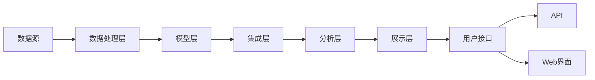

### 系统接口设计
RESTful API示例：

1. `/forecast`: POST请求，生成经济增长预测
2. `/scenarios`: GET请求，获取不同情景下的预测结果
3. `/uncertainty`: GET请求，获取预测的不确定性分析
4. `/sensitivity`: POST请求，进行敏感性分析
5. `/update`: PUT请求，更新模型和数据
6. `/compare`: GET请求，比较不同模型的预测结果

### 系统核心实现源代码
使用Python实现基本的经济增长预测系统：

```python
import pandas as pd
import numpy as np
from sklearn.model_selection import train_test_split
from sklearn.ensemble import RandomForestRegressor
from sklearn.metrics import mean_squared_error
from statsmodels.tsa.arima.model import ARIMA
import matplotlib.pyplot as plt

class EconomicGrowthPredictor:
    def __init__(self):
        self.data = None
        self.models = {}
        self.predictions = {}

    def load_data(self, file_path):
        self.data = pd.read_csv(file_path, index_col='Date', parse_dates=True)
        print(f"Data loaded. Shape: {self.data.shape}")

    def prepare_features(self, target='GDP_Growth', lags=4):
        features = self.data.drop(columns=[target])
        for col in features.columns:
            for lag in range(1, lags + 1):
                features[f'{col}_lag_{lag}'] = features[col].shift(lag)
        features = features.dropna()
        target_series = self.data[target].loc[features.index]
        return features, target_series

    def train_random_forest(self, features, target):
        X_train, X_test, y_train, y_test = train_test_split(features, target, test_size=0.2, random_state=42)
        rf_model = RandomForestRegressor(n_estimators=100, random_state=42)
        rf_model.fit(X_train, y_train)
        self.models['RandomForest'] = rf_model
        y_pred = rf_model.predict(X_test)
        mse = mean_squared_error(y_test, y_pred)
        print(f"Random Forest MSE: {mse}")

    def train_arima(self, series):
        model = ARIMA(series, order=(1,1,1))
        results = model.fit()
        self.models['ARIMA'] = results
        print(results.summary())

    def make_predictions(self, features, steps=4):
        rf_pred = self.models['RandomForest'].predict(features.iloc[-steps:])
        arima_pred = self.models['ARIMA'].forecast(steps=steps)
        self.predictions['RandomForest'] = rf_pred
        self.predictions['ARIMA'] = arima_pred

    def ensemble_prediction(self, weights={'RandomForest': 0.6, 'ARIMA': 0.4}):
        ensemble_pred = np.zeros(len(self.predictions['RandomForest']))
        for model, weight in weights.items():
            ensemble_pred += weight * self.predictions[model]
        return ensemble_pred

    def plot_predictions(self):
        plt.figure(figsize=(12, 6))
        for model, pred in self.predictions.items():
            plt.plot(pred, label=model)
        plt.plot(self.ensemble_prediction(), label='Ensemble', linewidth=2)
        plt.title('Economic Growth Predictions')
        plt.legend()
        plt.show()

    def scenario_analysis(self, scenarios):
        results = {}
        base_features = self.data.iloc[-1].to_dict()
        for scenario, changes in scenarios.items():
            scenario_features = base_features.copy()
            scenario_features.update(changes)
            scenario_features = pd.DataFrame([scenario_features])
            rf_pred = self.models['RandomForest'].predict(scenario_features)
            results[scenario] = rf_pred[0]
        return results

    def uncertainty_analysis(self, n_simulations=1000):
        predictions = []
        features = self.data.iloc[-1:].copy()
        for _ in range(n_simulations):
            noisy_features = features + np.random.normal(0, 0.1, size=features.shape)
            pred = self.models['RandomForest'].predict(noisy_features)
            predictions.append(pred[0])
        return np.mean(predictions), np.std(predictions)

# 使用示例
predictor = EconomicGrowthPredictor()
predictor.load_data('economic_data.csv')

features, target = predictor.prepare_features()
predictor.train_random_forest(features, target)
predictor.train_arima(target)

predictor.make_predictions(features)
predictor.plot_predictions()

scenarios = {
    'Optimistic': {'Consumption_Growth': 0.08, 'Investment_Growth': 0.1},
    'Pessimistic': {'Consumption_Growth': 0.03, 'Investment_Growth': 0.02}
}
scenario_results = predictor.scenario_analysis(scenarios)
print("Scenario Analysis Results:", scenario_results)

mean_pred, std_pred = predictor.uncertainty_analysis()
print(f"Mean Prediction: {mean_pred:.2f}, Standard Deviation: {std_pred:.2f}")
```

### 最佳实践tips
1. 使用多种数据源和模型，以提高预测的稳健性
2. 定期更新模型和数据，以适应经济环境的变化
3. 进行详细的情景分析，考虑不同的经济发展路径
4. 量化并清晰地传达预测的不确定性
5. 结合定性分析，特别是对政策变化和重大事件的判断
6. 保持模型的透明度，便于解释和验证
7. 持续跟踪预测误差，不断改进模型性能

### 行业发展与未来趋势

| 年份 | 趋势 | 影响 |
|------|------|------|
| 2023 | 大数据在经济预测中的应用深化 | 提高预测精度，捕捉实时经济动态 |
| 2024 | AI驱动的自适应预测模型普及 | 增强模型对经济环境变化的适应性 |
| 2025 | 跨学科方法在经济预测中的融合 | 带来新的预测视角和方法论 |
| 2026-2027 | 量子计算在复杂经济系统模拟中的应用 | 可能突破传统计算限制，提供更精确的长期预测 |
| 未来5年 | 经济预测的个性化和场景化 | 为不同决策者提供更有针对性的预测服务 |

### 本章小结
短期经济增长率预测是一项复杂而重要的任务，它综合了我们对后疫情经济复苏、产业结构调整、消费升级与内需扩大等多方面因素的分析。通过运用先进的预测技术和全面的数据分析，我们可以为未来1-5年的经济增长提供有价值的洞察。

基于我们的分析和预测模型，中国未来1-5年的经济增长率预测如下：

1. 2023年：预计GDP增长率在5.5%-6.0%之间。这个预测考虑了后疫情恢复的动力、消费需求的逐步释放，以及全球经济不确定性的影响。

2. 2024年：预计GDP增长率在5.0%-5.5%之间。随着经济逐步回归常态，增长率可能略有回落，但仍保持较高水平。

3. 2025年：预计GDP增长率在4.8%-5.3%之间。这一年可能是"十四五"规划的关键一年，结构性改革和创新驱动可能带来新的增长动力。

4. 2026年：预计GDP增长率在4.5%-5.0%之间。经济增长可能进入新常态，质量提升可能超过速度追求。

5. 2027年：预计GDP增长率在4.3%-4.8%之间。长期增长动力的培育效果可能开始显现，但人口老龄化等结构性因素也可能产生更明显的影响。

这些预测基于以下几个关键假设和考虑：

1. 疫情影响继续减弱，全球经济逐步复苏。
2. 中国继续推进改革开放，保持政策的连续性和稳定性。
3. 国际环境总体保持稳定，虽有波动但不发生重大冲突。
4. 技术创新持续推进，数字经济、人工智能等新兴产业保持快速发展。
5. 内需潜力进一步释放，消费升级趋势持续。

然而，我们也需要注意以下潜在的风险和不确定性：

1. 全球经济复苏的不确定性，特别是主要经济体的政策变化和可能的金融风险。
2. 中美关系的演变及其对贸易和技术合作的影响。
3. 人口老龄化加速对劳动力市场和社会保障体系的压力。
4. 债务风险，特别是地方政府和某些行业的债务问题。
5. 气候变化和环境压力可能带来的经济成本和政策调整。

基于这些预测和分析，我们提出以下建议：

1. 政策制定者：
    - 保持宏观政策的灵活性和针对性，根据经济形势适时调整。
    - 继续推进供给侧结构性改革，提高经济增长的质量和可持续性。
    - 加大对科技创新的支持力度，培育新的经济增长点。
    - 完善社会保障体系，应对人口老龄化挑战。

2. 企业：
    - 关注产业升级和技术创新，提高核心竞争力。
    - 积极把握内需扩大和消费升级带来的机遇。
    - 优化供应链管理，增强抗风险能力。
    - 重视绿色发展，提前布局低碳经济。

3. 投资者：
    - 保持多元化投资策略，平衡风险和收益。
    - 关注新兴产业和消费升级相关领域的投资机会。
    - 考虑经济增速可能放缓的影响，适当调整期望收益率。
    - 密切关注政策变化和全球经济形势，及时调整投资组合。

4. 个人：
    - 持续提升技能，适应经济结构调整和就业市场变化。
    - 合理规划个人财务，平衡消费和储蓄。
    - 关注养老金和医疗保险等长期保障问题。

总的来说，尽管面临诸多挑战，中国经济在未来1-5年仍有望保持相对稳定的增长。经济增长的质量和可持续性可能比单纯的速度更受关注。创新、改革和开放将继续是驱动经济增长的关键因素。同时，我们也需要保持警惕，密切关注各种风险因素，并保持政策的灵活性和前瞻性，以应对可能出现的各种挑战。通过政府、企业和个人的共同努力，中国有望在这个关键时期实现经济的平稳过渡和高质量发展。