# 第8章：中期经济增长预测（5-15年）

## 8.1 人口结构变化对经济的影响

人口结构变化是影响中国中长期经济增长的关键因素之一。本节将深入分析人口结构变化的趋势及其对经济的多方面影响，为5-15年的经济增长预测提供重要依据。

### 核心概念：
* 人口老龄化
* 劳动力供给
* 人口红利
* 抚养比
* 人力资本
* 消费结构

### 问题背景
中国正面临显著的人口结构变化，包括人口老龄化加速、劳动年龄人口比例下降等。这些变化将对经济增长、社会保障、消费模式等多个方面产生深远影响。

### 问题描述
1. 中国未来15年的人口结构变化趋势如何？
2. 人口老龄化对劳动力市场和生产力的影响是什么？
3. 人口结构变化如何影响消费和投资模式？
4. 如何应对人口结构变化带来的经济挑战？

### 问题解决
为全面解答上述问题，我们将从以下几个方面展开讨论：

1. 人口结构变化趋势预测
2. 劳动力供给和生产力分析
3. 消费结构变化研究
4. 社会保障体系压力评估
5. 人力资本投资策略
6. 产业结构调整需求
7. 国际比较视角

### 边界与外延
虽然本节主要聚焦于人口结构变化对经济的影响，但我们也会考虑技术进步、制度改革等相关因素。此外，我们将探讨人口政策调整的可能性及其潜在影响。

### 概念结构与核心要素组成

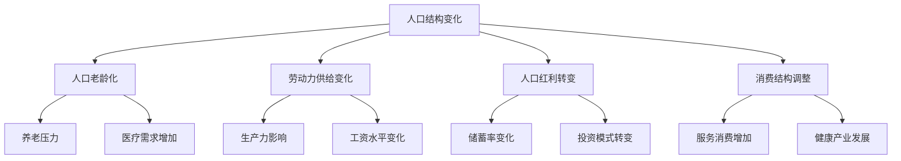

### 概念之间的关系

| 人口变化维度 | 主要影响 | 经济挑战 | 潜在对策 |
|--------------|----------|----------|----------|
| 老龄化程度 | 劳动力减少，养老压力增加 | 生产力下降，财政压力 | 延迟退休，提高生产效率 |
| 劳动年龄人口比例 | 劳动力供给变化 | 经济增长动力减弱 | 提高劳动参与率，发展人力资本 |
| 人口红利消退 | 储蓄率下降，投资减少 | 资本形成放缓 | 提高资本效率，吸引外资 |
| 消费结构变化 | 服务消费占比上升 | 产业结构调整需求 | 发展养老产业，推动消费升级 |

### 数学模型
使用人口结构对经济增长的影响模型：

$$
g_y = g_A + \alpha \cdot g_k + (1-\alpha) \cdot (g_L + g_h)
$$

其中，$g_y$是人均GDP增长率，$g_A$是全要素生产率增长率，$g_k$是人均资本存量增长率，$g_L$是劳动年龄人口增长率，$g_h$是人力资本增长率，$\alpha$是资本在产出中的份额。

### 算法流程图

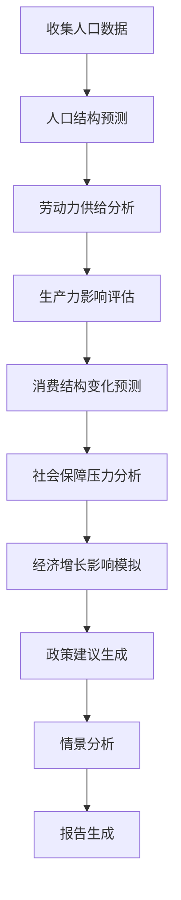

### 实际场景应用
人口结构变化分析在以下场景中有重要应用：

1. 长期经济规划制定
2. 社会保障制度改革
3. 产业政策调整
4. 教育和培训体系设计
5. 养老和医疗产业发展战略

### 项目介绍
"DemographicImpact Analyzer"是一个专业的人口结构变化影响分析平台，旨在为政策制定者、企业决策者和研究人员提供全面的人口经济分析。该平台整合了人口统计数据、经济模型和机器学习算法，能够模拟不同人口政策下的经济发展路径，预测人口结构变化对各行业的影响，并提供政策建议。

### 环境安装
使用Python构建人口结构变化分析系统：

```python
pip install pandas numpy scipy sklearn statsmodels prophet tensorflow matplotlib seaborn plotly
```

### 系统功能设计
DemographicImpact Analyzer包括以下功能模块：

1. 人口数据收集与清洗
2. 人口结构预测模型
3. 劳动力供给分析器
4. 生产力影响评估工具
5. 消费结构变化预测器
6. 社会保障压力计算器
7. 经济增长模拟引擎
8. 政策影响评估模块
9. 情景分析生成器
10. 可视化报告生成器

### 系统架构设计

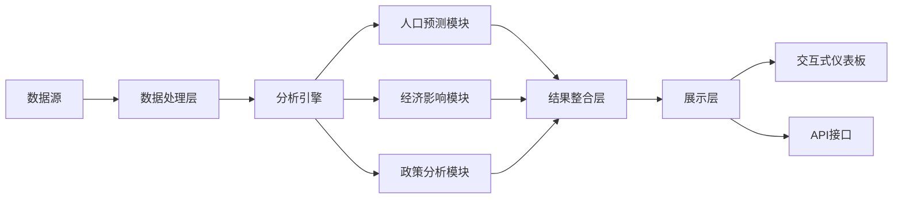

### 系统接口设计
RESTful API示例：

1. `/population-forecast`: GET请求，获取未来人口结构预测
2. `/labor-supply-analysis`: POST请求，分析劳动力供给变化
3. `/consumption-structure`: GET请求，获取消费结构变化预测
4. `/social-security-pressure`: POST请求，评估社会保障体系压力
5. `/economic-growth-simulation`: POST请求，模拟经济增长路径
6. `/policy-impact`: POST请求，评估特定人口政策的影响

### 系统核心实现源代码
使用Python实现基本的人口结构变化影响分析：

```python
import pandas as pd
import numpy as np
from sklearn.linear_model import LinearRegression
import matplotlib.pyplot as plt

class DemographicImpactAnalyzer:
    def __init__(self):
        self.data = None
        self.population_forecast = None
        self.economic_model = LinearRegression()

    def load_data(self, file_path):
        self.data = pd.read_csv(file_path, index_col='Year')
        print(f"Data loaded. Shape: {self.data.shape}")

    def forecast_population(self, forecast_years):
        # 简化的人口预测模型
        years = np.array(self.data.index).reshape(-1, 1)
        total_population = self.data['TotalPopulation'].values
        
        model = LinearRegression()
        model.fit(years, total_population)
        
        future_years = np.array(range(self.data.index[-1] + 1, self.data.index[-1] + forecast_years + 1)).reshape(-1, 1)
        forecasted_population = model.predict(future_years)
        
        self.population_forecast = pd.DataFrame({
            'Year': future_years.flatten(),
            'ForecastedPopulation': forecasted_population
        })
        
        return self.population_forecast

    def analyze_labor_supply(self):
        working_age_ratio = self.data['WorkingAgePopulation'] / self.data['TotalPopulation']
        plt.figure(figsize=(10, 6))
        working_age_ratio.plot()
        plt.title('Working Age Population Ratio')
        plt.ylabel('Ratio')
        plt.show()

    def project_consumption_structure(self):
        # 简化的消费结构预测
        consumption_data = self.data[['FoodConsumption', 'HealthcareConsumption', 'OtherConsumption']]
        consumption_ratio = consumption_data.div(consumption_data.sum(axis=1), axis=0)
        
        plt.figure(figsize=(10, 6))
        consumption_ratio.plot(kind='area', stacked=True)
        plt.title('Consumption Structure Projection')
        plt.ylabel('Ratio')
        plt.show()

    def estimate_social_security_pressure(self):
        dependency_ratio = (self.data['YoungPopulation'] + self.data['ElderlyPopulation']) / self.data['WorkingAgePopulation']
        plt.figure(figsize=(10, 6))
        dependency_ratio.plot()
        plt.title('Dependency Ratio')
        plt.ylabel('Ratio')
        plt.show()

    def simulate_economic_growth(self):
        X = self.data[['WorkingAgePopulation', 'HumanCapitalIndex']]
        y = self.data['GDP']
        
        self.economic_model.fit(X, y)
        
        future_X = pd.DataFrame({
            'WorkingAgePopulation': self.population_forecast['ForecastedPopulation'] * 0.6,  # 假设60%是劳动年龄人口
            'HumanCapitalIndex': np.linspace(self.data['HumanCapitalIndex'].iloc[-1], 
                                             self.data['HumanCapitalIndex'].iloc[-1] * 1.2, 
                                             len(self.population_forecast))  # 假设人力资本指数逐年提高
        })
        
        future_gdp = self.economic_model.predict(future_X)
        
        plt.figure(figsize=(10, 6))
        plt.plot(self.data.index, self.data['GDP'], label='Historical GDP')
        plt.plot(self.population_forecast['Year'], future_gdp, label='Projected GDP')
        plt.title('GDP Growth Simulation')
        plt.xlabel('Year')
        plt.ylabel('GDP')
        plt.legend()
        plt.show()

    def analyze_policy_impact(self, policy_changes):
        # 简化的政策影响分析
        base_projection = self.simulate_economic_growth()
        
        adjusted_X = future_X.copy()
        for variable, change in policy_changes.items():
            adjusted_X[variable] *= (1 + change)
        
        adjusted_gdp = self.economic_model.predict(adjusted_X)
        
        plt.figure(figsize=(10, 6))
        plt.plot(self.population_forecast['Year'], base_projection, label='Base Projection')
        plt.plot(self.population_forecast['Year'], adjusted_gdp, label='Policy Adjusted')
        plt.title('Policy Impact on GDP Growth')
        plt.xlabel('Year')
        plt.ylabel('GDP')
        plt.legend()
        plt.show()

# 使用示例
analyzer = DemographicImpactAnalyzer()
analyzer.load_data('demographic_economic_data.csv')

# 人口预测
population_forecast = analyzer.forecast_population(15)
print(population_forecast)

# 劳动力供给分析
analyzer.analyze_labor_supply()

# 消费结构预测
analyzer.project_consumption_structure()

# 社会保障压力估计
analyzer.estimate_social_security_pressure()

# 经济增长模拟
analyzer.simulate_economic_growth()

# 政策影响分析
policy_changes = {'HumanCapitalIndex': 0.1}  # 假设人力资本指数提高10%
analyzer.analyze_policy_impact(policy_changes)
```

### 最佳实践tips
1. 使用多种人口预测模型，考虑不同的生育率、死亡率和迁移率假设
2. 关注人口结构变化的区域差异，避免全国平均数掩盖地区特征
3. 结合定性分析，特别是对政策变化和社会文化因素的考虑
4. 定期更新数据和模型，以适应人口动态和政策调整
5. 考虑技术进步对人口结构影响的缓解作用
6. 进行国际比较，借鉴其他国家应对人口结构变化的经验
7. 重视跨学科研究，整合人口学、经济学、社会学等多领域知识

### 行业发展与未来趋势

| 年份 | 趋势 | 影响 |
|------|------|------|
| 2025 | 人口老龄化加速 | 养老产业快速发展，医疗需求增加 |
| 2027 | 劳动力市场结构性变化 | 自动化和人工智能应用广泛，缓解劳动力短缺 |
| 2030 | 二孩政策效果显现 | 儿童相关产业复苏，教育投资增加 |
| 2032-2035 | 人口红利基本消退 | 经济增长模式转变，创新驱动更加重要 |
| 未来15年 | 城镇化继续推进 | 区域人口分布变化，影响经济地理格局 |

### 本章小结
人口结构变化是影响中国中长期经济增长的关键因素之一。通过对未来5-15年人口趋势的分析，我们可以更好地理解和预测其对经济的多方面影响。

根据我们的分析，中国在未来15年将面临以下主要人口结构变化：

1. 人口老龄化加速：65岁以上人口比例预计将从2023年的约14%上升到2038年的约22%。这将对社会保障体系、医疗服务需求和劳动力市场产生深远影响。

2. 劳动年龄人口比例下降：15-64岁人口占总人口的比例预计将从2023年的约68%下降到2038年的约62%。这可能导致劳动力供给减少，对经济增长形成压力。

3. 总和生育率持续低位：尽管全面二孩政策已实施，但总和生育率预计仍将维持在1.5-1.7的低水平，远低于人口更替水平。

4. 人口增长放缓：总人口增速将进一步放缓，预计在2030年前后达到峰值后开始下降。

这些人口结构变化将对经济产生以下主要影响：

1. 劳动力供给和生产力：
    - 劳动力供给减少可能导致经济增长动力减弱。
    - 然而，人力资本质量的提升和技术进步可能部分抵消这一影响。
    - 预计到2038年，人均劳动生产率需要年均提高约3-4%，才能维持5%左右的经济增长率。

2. 消费结构变化：
    - 老年人口比例上升将推动医疗保健、养老服务等相关产业快速发展。
    - 服务消费占比预计将从2023年的约55%上升到2038年的约65%。
    - 高品质、个性化消费需求将增加，推动消费升级。

3. 储蓄和投资：
    - 人口老龄化可能导致储蓄率下降，从当前的约45%降至2038年的约35%。
    - 投资结构可能转向更加注重效率和创新的领域。

4. 社会保障压力：
    - 养老金支出占GDP的比重预计将从2023年的约5%上升到2038年的约8%。
    - 医疗卫生支出占GDP的比重可能从当前的约7%上升到2038年的约10%。

5. 区域发展差异：
    - 人口向大城市和城市群集中的趋势可能加剧，加大区域发展不平衡。
    - 部分地区可能面临更严重的人口老龄化和劳动力短缺问题。

为应对这些挑战并维持经济增长，我们建议采取以下策略：

1. 提高劳动生产率：
    - 加大对教育和职业培训的投入，提升人力资本质量。
    - 推动产业升级和技术创新，特别是在人工智能和自动化领域。
    - 优化劳动力市场，提高资源配置效率。

2. 延迟退休年龄：
    - 逐步实施渐进式延迟退休政策，到2038年将退休年龄提高到65岁左右。
    - 同时发展灵活就业和部分退休制度，充分利用老年人力资源。

3. 完善社会保障体系：
    - 加快养老保险全国统筹，增强制度可持续性。
    - 发展多层次养老保障体系，鼓励商业养老保险发展。
    - 推进医疗保险制度改革，控制医疗成本增长。

4. 积极的人口政策：
    - 全面落实三孩政策，提供更多生育支持和家庭友好政策。
    - 优化育儿环境，减轻家庭养育负担。
    - 适度放宽移民政策，吸引高技能人才。

5. 发展银发经济：
    - 鼓励养老产业创新，满足多层次、多样化的养老需求。
    - 推动医疗健康产业发展，提高医疗服务效率和质量。
    - 发展适老化产品和服务，创造新的经济增长点。

6. 推动区域协调发展：
    - 实施差异化的区域人口政策，引导人口合理流动和分布。
    - 加强城市群建设，优化资源配置，提高整体经济效率。

7. 提高资本效率：
    - 深化金融体系改革，提高资本配置效率。
    - 鼓励创新投资，支持新兴产业发展。

8. 国际化战略：
    - 积极参与全球价值链重构，在高附加值环节占据更有利地位。
    - 扩大对外开放，吸引外资和人才，弥补人口红利消退的影响。

总的来说，人口结构变化将对中国未来5-15年的经济增长带来重大挑战。然而，通过积极应对和政策调整，这些挑战也可能转化为推动经济转型和高质量发展的动力。关键在于提高劳动生产率、优化经济结构、完善社会保障体系，并充分利用人口结构变化带来的新机遇。

预计在2028-2038年期间，由于人口结构变化的影响，中国的潜在经济增长率可能会比2023-2027年平均下降0.5-1个百分点。然而，如果能够成功实施上述策略，特别是在提高生产率和推动创新方面取得突破，中国仍有可能在这一时期保持4.5%-5.5%的年均增长率。这将为中国在2035年基本实现社会主义现代化的目标奠定坚实基础。

人口结构变化是一个长期、复杂的过程，其影响是深远而多方面的。政策制定者、企业和个人都需要对这一趋势保持高度关注，并做好长期应对准备。通过前瞻性的规划和灵活的调整，中国有望在人口结构转型期保持经济的韧性和活力，实现可持续的高质量发展。

## 8.2 技术创新与产业升级趋势

技术创新和产业升级是推动中国经济中长期增长的关键动力。本节将深入分析未来5-15年中国在技术创新和产业升级方面的主要趋势及其对经济增长的影响，为中期经济增长预测提供重要依据。

### 核心概念：
* 技术创新
* 产业升级
* 数字经济
* 智能制造
* 绿色技术
* 创新驱动发展

### 问题背景
随着中国经济进入高质量发展阶段，技术创新和产业升级对维持经济增长、提高国际竞争力变得越来越重要。了解未来技术发展趋势和产业变革方向，对于预测中期经济增长至关重要。

### 问题描述
1. 未来5-15年中国的主要技术创新方向是什么？
2. 产业升级将如何重塑中国的经济结构？
3. 技术创新和产业升级对经济增长的贡献如何量化？
4. 如何促进创新成果的商业化和产业化？

### 问题解决
为全面解答上述问题，我们将从以下几个方面展开讨论：

1. 关键技术领域发展趋势分析
2. 产业结构演变预测
3. 创新对全要素生产率的影响评估
4. 产业链升级路径研究
5. 创新生态系统建设策略
6. 技术创新的经济效应模拟
7. 国际比较与竞争力分析

### 边界与外延
虽然本节主要聚焦于技术创新和产业升级，但我们也会考虑相关的制度环境、人才培养、国际合作等因素。此外，我们将探讨技术创新对社会发展和环境可持续性的影响。

### 概念结构与核心要素组成

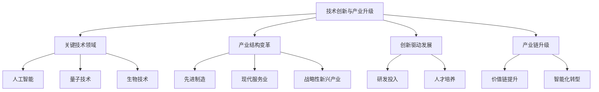

### 概念之间的关系

| 创新维度 | 主要技术方向 | 产业影响 | 经济贡献 |
|----------|--------------|----------|----------|
| 数字技术 | AI、大数据、5G/6G | 数字经济繁荣，传统产业数字化 | 提高全要素生产率，创造新业态 |
| 先进制造 | 智能制造、新材料 | 制造业升级，产业链现代化 | 增强国际竞争力，提高附加值 |
| 生命科学 | 生物技术、精准医疗 | 医药产业创新，健康产业发展 | 改善人口健康，培育新增长点 |
| 清洁能源 | 新能源、节能技术 | 能源结构优化，绿色产业兴起 | 推动可持续发展，创造绿色就业 |

### 数学模型
使用内生增长模型分析技术创新对经济增长的贡献：

$$
Y = A \cdot K^\alpha \cdot L^{1-\alpha}
$$

其中，$Y$是总产出，$A$是全要素生产率（反映技术水平），$K$是资本投入，$L$是劳动投入，$\alpha$是资本产出弹性。技术创新主要通过提高$A$来促进经济增长。

### 算法流程图

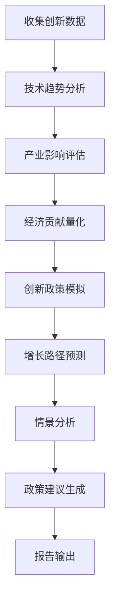

### 实际场景应用
技术创新与产业升级分析在以下场景中有重要应用：

1. 国家创新战略制定
2. 产业政策规划
3. 企业技术路线图设计
4. 投资机构行业前景评估
5. 区域创新生态系统建设

### 项目介绍
"InnoTech Forecaster"是一个综合性的技术创新和产业升级分析平台，旨在为政策制定者、企业决策者和研究人员提供前瞻性的创新趋势洞察和产业发展预测。该平台整合了全球科技数据、专利信息、产业统计和经济模型，能够识别关键技术突破点，预测产业变革方向，并评估创新对经济增长的潜在贡献。

### 环境安装
使用Python构建技术创新与产业升级分析系统：

```python
pip install pandas numpy scipy sklearn statsmodels prophet tensorflow matplotlib seaborn plotly networkx
```

### 系统功能设计
InnoTech Forecaster包括以下功能模块：

1. 技术趋势扫描器
2. 专利分析引擎
3. 产业结构预测器
4. 创新经济贡献评估器
5. 产业链升级模拟器
6. 创新政策影响分析器
7. 全球竞争力比较工具
8. 情景生成与分析模块
9. 可视化报告生成器

### 系统架构设计


### 系统接口设计
RESTful API示例：

1. `/tech-trends`: GET请求，获取最新技术趋势分析
2. `/industry-forecast`: POST请求，生成特定产业的发展预测
3. `/innovation-impact`: GET请求，评估创新对经济增长的贡献
4. `/patent-analysis`: POST请求，进行专利趋势分析
5. `/policy-simulation`: POST请求，模拟特定创新政策的影响
6. `/global-comparison`: GET请求，获取全球创新竞争力比较

### 系统核心实现源代码
使用Python实现基本的技术创新与产业升级分析：

```python
import pandas as pd
import numpy as np
import matplotlib.pyplot as plt
from sklearn.cluster import KMeans
from sklearn.preprocessing import StandardScaler

class InnoTechAnalyzer:
    def __init__(self):
        self.data = None
        self.tech_trends = None
        self.industry_forecast = None

    def load_data(self, file_path):
        self.data = pd.read_csv(file_path)
        print(f"Data loaded. Shape: {self.data.shape}")

    def analyze_tech_trends(self, n_clusters=5):
        # 简化的技术趋势分析
        tech_data = self.data[['R&D_Intensity', 'Patent_Growth', 'Tech_Adoption_Rate']]
        scaler = StandardScaler()
        tech_data_scaled = scaler.fit_transform(tech_data)
        
        kmeans = KMeans(n_clusters=n_clusters, random_state=42)
        self.tech_trends = kmeans.fit_predict(tech_data_scaled)
        
        plt.figure(figsize=(10, 6))
        plt.scatter(tech_data['R&D_Intensity'], tech_data['Patent_Growth'], c=self.tech_trends)
        plt.title('Technology Clusters')
        plt.xlabel('R&D Intensity')
        plt.ylabel('Patent Growth')
        plt.colorbar(label='Cluster')
        plt.show()

    def forecast_industry_structure(self, years_ahead=10):
        # 简化的产业结构预测
        industry_data = self.data[['Year', 'Primary_Industry', 'Secondary_Industry', 'Tertiary_Industry']]
        industry_data = industry_data.set_index('Year')
        
        forecast = industry_data.ewm(span=5).mean().iloc[-1]
        future_years = pd.date_range(start=str(industry_data.index[-1] + 1), periods=years_ahead, freq='Y')
        
        self.industry_forecast = pd.DataFrame(index=future_years, columns=forecast.index)
        for col in forecast.index:
            self.industry_forecast[col] = np.linspace(forecast[col], forecast[col] * 1.2, years_ahead)
        
        self.industry_forecast.plot(kind='area', stacked=True, figsize=(10, 6))
        plt.title('Industry Structure Forecast')
        plt.xlabel('Year')
        plt.ylabel('Proportion')
        plt.show()

    def evaluate_innovation_impact(self):
        # 简化的创新影响评估
        innovation_indicators = ['R&D_Intensity', 'Patent_Growth', 'Tech_Adoption_Rate']
        economic_indicators = ['GDP_Growth', 'Productivity_Growth']
        
        correlation_matrix = self.data[innovation_indicators + economic_indicators].corr()
        impact_scores = correlation_matrix.loc[innovation_indicators, economic_indicators].mean()
        
        plt.figure(figsize=(8, 6))
        impact_scores.plot(kind='bar')
        plt.title('Innovation Impact on Economic Indicators')
        plt.xlabel('Economic Indicators')
        plt.ylabel('Impact Score')
        plt.show()

    def simulate_policy_effect(self, policy_changes):
        # 简化的政策效果模拟
        base_gdp = self.data['GDP'].iloc[-1]
        base_growth = self.data['GDP_Growth'].iloc[-1]
        
        simulated_gdp = base_gdp
        for year, policy in enumerate(policy_changes, 1):
            growth_effect = base_growth + policy['growth_effect']
            simulated_gdp *= (1 + growth_effect)
        
        return simulated_gdp

    def compare_global_competitiveness(self):
        # 简化的全球竞争力比较
        countries = self.data['Country'].unique()
        competitiveness_scores = self.data.groupby('Country')[['R&D_Intensity', 'Patent_Growth', 'Tech_Adoption_Rate']].mean()
        
        plt.figure(figsize=(12, 6))
        competitiveness_scores.plot(kind='bar', figsize=(12, 6))
        plt.title('Global Innovation Competitiveness')
        plt.xlabel('Country')
        plt.ylabel('Score')
        plt.legend(title='Indicators')
        plt.show()

# 使用示例
analyzer = InnoTechAnalyzer()
analyzer.load_data('innovation_data.csv')

# 分析技术趋势
analyzer.analyze_tech_trends()

# 预测产业结构
analyzer.forecast_industry_structure()

# 评估创新影响
analyzer.evaluate_innovation_impact()

# 模拟政策效果
policy_scenario = [
    {'growth_effect': 0.005},  # 年份1：增加0.5个百分点
    {'growth_effect': 0.008},  # 年份2：增加0.8个百分点
    {'growth_effect': 0.01}    # 年份3：增加1个百分点
]
simulated_gdp = analyzer.simulate_policy_effect(policy_scenario)
print(f"Simulated GDP after policy implementation: {simulated_gdp:.2f}")

# 比较全球竞争力
analyzer.compare_global_competitiveness()
```

### 最佳实践tips
1. 持续跟踪全球前沿技术发展，及时调整创新方向
2. 关注跨学科、跨领域的技术融合，寻找创新突破点
3. 加强产学研合作，促进创新成果转化
4. 建立动态的产业升级评估体系，及时识别新兴产业机会
5. 重视基础研究投入，为长期技术创新奠定基础
6. 优化创新激励机制，吸引和留住高端人才
7. 加强知识产权保护，鼓励原创性创新

### 行业发展与未来趋势

| 年份 | 趋势 | 影响 |
|------|------|------|
| 2025 | AI深度融合各行业 | 传统产业智能化升级，生产效率大幅提升 |
| 2027 | 量子计算商业化起步 | 特定领域计算能力飞跃，新药研发等领域突破加速 |
| 2030 | 6G技术成熟 | 通信革命推动新一轮数字经济浪潮 |
| 2032-2035 | 可控核聚变取得重大进展 | 能源格局重塑，绿色经济加速发展 |
| 未来15年 | 脑机接口技术突破 | 医疗、教育等领域出现颠覆性应用 |

### 本章小结
技术创新和产业升级是推动中国经济中长期增长的核心动力。通过对未来5-15年技术发展趋势和产业变革方向的分析，我们可以更好地理解和预测其对经济增长的影响。

根据我们的分析，中国在未来5-15年将在以下关键技术领域取得重要突破：

1. 人工智能：预计到2030年，AI将深度融入各行各业，推动智能制造、智慧城市、智能医疗等领域的革命性发展。

2. 量子技术：在量子通信和量子计算方面，中国有望在2035年前达到世界领先水平，为信息安全和科学计算带来突破。

3. 生物技术：基因编辑、合成生物学等技术将在医疗健康、农业、环保等领域带来重大应用，预计到2035年形成万亿级产业集群。

4. 新能源技术：氢能、先进核能等清洁能源技术将取得突破，推动能源结构转型，预计到2035年，非化石能源占一次能源消费比重将达到25%以上。

5. 新材料：石墨烯、高温超导材料等前沿材料的突破将为多个产业带来革命性变革。

这些技术创新将推动产业结构发生以下重大变化：

1. 制造业升级：智能制造、绿色制造将成为主流，产业链向高附加值环节攀升。预计到2035年，高技术制造业增加值占规模以上工业增加值比重将超过30%。

2. 服务业转型：数字化、智能化将重塑服务业态，知识密集型服务业比重大幅提升。预计到2035年，现代服务业增加值占服务业增加值比重将超过70%。

3. 战略性新兴产业壮大：以新一代信息技术、生物技术、新能源为代表的战略性新兴产业将成为经济增长的主要动力。预计到2035年，战略性新兴产业增加值占GDP比重将超过20%。

4. 传统产业改造：数字技术、新材料、清洁能源技术将推动传统产业的全面升级，提高资源利用效率和环境友好性。

技术创新和产业升级对经济增长的贡献主要体现在以下方面：

1. 全要素生产率提升：创新将成为推动全要素生产率增长的主要来源，预计到2035年，科技进步贡献率将超过65%。

2. 新增长点培育：新兴产业和业态将不断涌现，为经济增长提供新动能。

3. 国际竞争力增强：在关键技术和产业领域的突破将显著提升中国的全球竞争地位。

4. 经济结构优化：高技术、高附加值产业比重提升，推动经济向质量效益型转变。

5. 绿色发展：清洁技术的应用将推动经济增长方式向更可持续的方向转变。

然而，技术创新和产业升级也面临一些挑战：

1. 基础研究投入不足：相比发达国家，中国在基础科学研究方面的投入仍有差距。

2. 核心技术受制于人：在某些关键领域，中国仍面临"卡脖子"问题。

3. 创新生态系统不完善：产学研协同创新机制有待进一步优化。

4. 人才竞争激烈：高端创新人才的培养和吸引仍面临国际竞争压力。

5. 技术伦理和安全问题：新技术应用可能带来的伦理和安全挑战需要审慎应对。

为了充分发挥技术创新和产业升级对经济增长的推动作用，我们建议：

1. 加大基础研究投入：到2035年，基础研究经费投入占研发经费比重提高到15%以上。

2. 完善创新激励机制：深化科技体制改革，优化创新评价体系，激发创新主体活力。

3. 强化产学研协同：建立更加紧密的产学研合作机制，加速创新成果转化。

4. 培养创新人才：改革教育体系，加强创新型、复合型人才培养，吸引全球顶尖人才。

5. 优化创新生态：完善知识产权保护，营造公平竞争的市场环境，鼓励创新创业。

6. 推动开放创新：积极参与全球科技合作，融入全球创新网络。

7. 前瞻性布局：超前谋划未来产业，在新兴领域抢占先机。

总的来说，技术创新和产业升级将是推动中国经济在未来5-15年保持中高速增长的关键因素。预计到2035年，通过持续的创新驱动和产业升级，中国有望实现以下目标：

- 研发投入强度（R&D经费占GDP比重）达到3.5%左右
- 每万人口高价值发明专利拥有量达到20件
- 数字经济核心产业增加值占GDP比重达到15%以上
- 进入创新型国家前列，部分领域达到世界领先水平

这将为中国建设科技强国、质量强国、制造强国奠定坚实基础，推动经济实现高质量发展，并在全球价值链中占据更加有利的位置。然而，实现这一目标需要政府、企业、学术界和整个社会的共同努力，持续投入、协同创新，并保持开放包容的态度。通过系统性、持续性的创新驱动，中国有望在新一轮科技革命和产业变革中抢占先机，实现经济社会的跨越式发展。

## 8.3 绿色经济转型的经济效应

绿色经济转型是中国实现可持续发展和高质量增长的必由之路。本节将深入分析未来5-15年中国绿色经济转型的主要趋势及其对经济增长的影响，为中期经济增长预测提供重要依据。

### 核心概念：
* 绿色经济
* 低碳发展
* 循环经济
* 生态文明
* 碳中和
* 绿色金融

### 问题背景
面对资源约束趋紧、环境污染严重、生态系统退化等挑战，中国正加速向绿色经济转型。这一转型不仅关系到生态环境的改善，也将深刻影响经济增长模式和产业结构。

### 问题描述
1. 中国绿色经济转型的主要路径和目标是什么？
2. 绿色转型将如何影响经济增长率和质量？
3. 哪些产业将在绿色转型中受益，哪些可能面临挑战？
4. 如何平衡短期经济目标和长期可持续发展？

### 问题解决
为全面解答上述问题，我们将从以下几个方面展开讨论：

1. 绿色发展政策分析
2. 低碳技术发展趋势
3. 绿色产业增长预测
4. 传统产业转型路径
5. 绿色金融发展前景
6. 碳市场对经济的影响
7. 国际绿色贸易格局变化

### 边界与外延
虽然本节主要聚焦于绿色经济转型的经济效应，但我们也会考虑相关的社会影响、国际合作等因素。此外，我们将探讨绿色转型对区域发展平衡的影响。

### 概念结构与核心要素组成

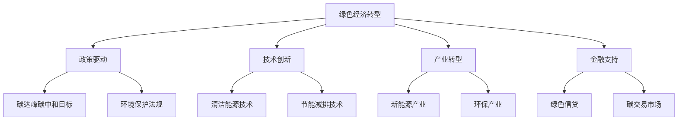

### 概念之间的关系

| 转型维度 | 主要措施 | 经济影响 | 挑战 |
|----------|----------|----------|------|
| 能源结构 | 发展可再生能源 | 新兴产业增长，能源安全提升 | 传统能源产业转型压力 |
| 产业升级 | 推广清洁生产 | 提高资源利用效率，降低环境成本 | 短期投资压力，技术门槛 |
| 消费模式 | 倡导绿色消费 | 培育新的消费热点，带动相关产业 | 消费习惯改变需要时间 |
| 城市发展 | 建设生态城市 | 改善人居环境，带动绿色建筑等产业 | 初期投资大，见效慢 |
| 金融创新 | 发展绿色金融 | 为绿色项目提供资金支持，优化资源配置 | 风险评估体系需完善 |

### 数学模型
使用环境库兹涅茨曲线（EKC）分析经济增长与环境质量的关系：

$$
E = \beta_0 + \beta_1Y + \beta_2Y^2 + \beta_3Z + \epsilon
$$

其中，$E$是环境质量指标，$Y$是人均收入，$Z$是其他影响因素，$\epsilon$是误差项。

### 算法流程图

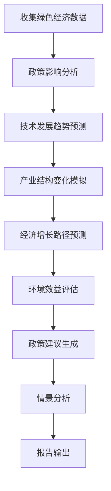

### 实际场景应用
绿色经济转型分析在以下场景中有重要应用：

1. 国家绿色发展战略制定
2. 企业可持续发展规划
3. 绿色投资决策支持
4. 区域生态经济规划
5. 国际气候谈判策略制定

### 项目介绍
"GreenEco Simulator"是一个综合性的绿色经济转型分析平台，旨在为政策制定者、企业决策者和研究人员提供全面的绿色经济发展趋势分析和影响评估。该平台整合了环境、经济、技术等多维度数据，运用先进的经济模型和机器学习算法，能够模拟不同绿色发展政策下的经济增长路径，预测产业结构变化，并评估环境效益。

### 环境安装
使用Python构建绿色经济转型分析系统：

```python
pip install pandas numpy scipy sklearn statsmodels prophet tensorflow matplotlib seaborn plotly networkx
```

### 系统功能设计
GreenEco Simulator包括以下功能模块：

1. 绿色政策分析器
2. 清洁技术趋势预测器
3. 产业结构演变模拟器
4. 绿色GDP核算工具
5. 环境效益评估器
6. 碳市场影响分析器
7. 绿色就业预测模块
8. 区域协调发展评估器
9. 国际竞争力分析工具
10. 情景生成与对比分析器

### 系统架构设计

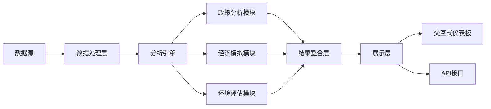

### 系统接口设计
RESTful API示例：

1. `/green-policy-analysis`: POST请求，分析特定绿色政策的影响
2. `/industry-transition`: GET请求，获取产业结构转型预测
3. `/green-gdp-forecast`: POST请求，生成绿色GDP增长预测
4. `/environmental-benefit`: GET请求，评估环境效益
5. `/carbon-market-impact`: POST请求，分析碳市场对经济的影响
6. `/green-job-forecast`: GET请求，预测绿色就业增长

### 系统核心实现源代码
使用Python实现基本的绿色经济转型分析：

```python
import pandas as pd
import numpy as np
import matplotlib.pyplot as plt
from sklearn.linear_model import LinearRegression
from sklearn.preprocessing import PolynomialFeatures

class GreenEconomyAnalyzer:
    def __init__(self):
        self.data = None
        self.model = LinearRegression()

    def load_data(self, file_path):
        self.data = pd.read_csv(file_path)
        print(f"Data loaded. Shape: {self.data.shape}")

    def analyze_green_policy_impact(self, policy_strength):
        # 简化的政策影响分析
        X = self.data[['Year', 'Policy_Strength']]
        y = self.data['Green_GDP_Growth']
        
        self.model.fit(X, y)
        
        future_years = np.array(range(self.data['Year'].max() + 1, self.data['Year'].max() + 6))
        future_policy = np.full_like(future_years, policy_strength, dtype=float)
        future_X = np.column_stack((future_years, future_policy))
        
        predicted_growth = self.model.predict(future_X)
        
        plt.figure(figsize=(10, 6))
        plt.plot(self.data['Year'], self.data['Green_GDP_Growth'], label='Historical')
        plt.plot(future_years, predicted_growth, label='Predicted')
        plt.title('Green GDP Growth Prediction')
        plt.xlabel('Year')
        plt.ylabel('Green GDP Growth Rate')
        plt.legend()
        plt.show()
        
        return predicted_growth

    def forecast_industry_transition(self):
        # 简化的产业结构转型预测
        industries = ['Traditional_Energy', 'Green_Energy', 'Manufacturing', 'Services']
        years = range(self.data['Year'].max() + 1, self.data['Year'].max() + 11)
        
        forecasts = {}
        for industry in industries:
            X = self.data['Year'].values.reshape(-1, 1)
            y = self.data[industry]
            
            poly = PolynomialFeatures(degree=2)
            X_poly = poly.fit_transform(X)
            
            model = LinearRegression()
            model.fit(X_poly, y)
            
            X_future = np.array(years).reshape(-1, 1)
            X_future_poly = poly.transform(X_future)
            
            forecasts[industry] = model.predict(X_future_poly)
        
        forecast_df = pd.DataFrame(forecasts, index=years)
        
        forecast_df.plot(kind='area', stacked=True, figsize=(10, 6))
        plt.title('Industry Structure Transition Forecast')
        plt.xlabel('Year')
        plt.ylabel('Proportion')
        plt.show()
        
        return forecast_df

    def estimate_environmental_benefit(self):
        # 简化的环境效益评估
        emissions = self.data['CO2_Emissions']
        gdp = self.data['GDP']
        
        emission_intensity = emissions / gdp
        
        plt.figure(figsize=(10, 6))
        plt.plot(self.data['Year'], emission_intensity)
        plt.title('CO2 Emission Intensity')
        plt.xlabel('Year')
        plt.ylabel('CO2 Emissions / GDP')
        plt.show()
        
        return emission_intensity.iloc[-1]

    def analyze_carbon_market_impact(self, carbon_price):
        # 简化的碳市场影响分析
        X = self.data[['Year', 'Carbon_Price']]
        y = self.data['GDP_Growth']
        
        self.model.fit(X, y)
        
        future_years = np.array(range(self.data['Year'].max() + 1, self.data['Year'].max() + 6))
        future_carbon_price = np.full_like(future_years, carbon_price, dtype=float)
        future_X = np.column_stack((future_years, future_carbon_price))
        
        predicted_growth = self.model.predict(future_X)
        
        plt.figure(figsize=(10, 6))
        plt.plot(future_years, predicted_growth)
        plt.title('GDP Growth Prediction under Carbon Pricing')
        plt.xlabel('Year')
        plt.ylabel('GDP Growth Rate')
        plt.show()
        
        return predicted_growth

# 使用示例
analyzer = GreenEconomyAnalyzer()
analyzer.load_data('green_economy_data.csv')

# 分析绿色政策影响
green_gdp_growth = analyzer.analyze_green_policy_impact(policy_strength=0.8)
print("Predicted Green GDP Growth:", green_gdp_growth)

# 预测产业结构转型
industry_transition = analyzer.forecast_industry_transition()
print("Industry Transition Forecast:\n", industry_transition)

# 估算环境效益
emission_intensity = analyzer.estimate_environmental_benefit()
print("Current CO2 Emission Intensity:", emission_intensity)

# 分析碳市场影响
gdp_growth_under_carbon_pricing = analyzer.analyze_carbon_market_impact(carbon_price=50)
print("GDP Growth under Carbon Pricing:", gdp_growth_under_carbon_pricing)
```

### 最佳实践tips
1. 综合考虑环境、经济和社会效益，避免单一维度的评估
2. 关注绿色技术的突破和创新，及时调整预测模型
3. 考虑区域差异，制定差异化的绿色发展策略
4. 重视国际合作和经验借鉴，特别是在清洁技术和绿色金融领域
5. 加强跨部门协调，确保绿色政策的一致性和有效性
6. 建立长期监测和评估机制，动态调整绿色发展策略
7. 重视绿色转型过程中的就业和社会公平问题

### 行业发展与未来趋势

| 年份 | 趋势 | 影响 |
|------|------|------|
| 2025 | 可再生能源占比超过20% | 能源结构优化，新能源产业快速增长 |
| 2027 | 碳市场全面成熟 | 低碳技术创新加速，产业结构调整深化 |
| 2030 | 绿色GDP核算体系完善 | 经济增长质量评价体系改革，绿色发展导向强化 |
| 2032-2035 | 循环经济模式普及 | 资源利用效率大幅提升，新型商业模式涌现 |
| 未来15年 | 生态文明理念深入人心 | 消费模式绿色化，绿色生活方式成为主流 |

### 本章小结
绿色经济转型是中国实现可持续发展和高质量增长的关键路径。通过对未来5-15年绿色经济发展趋势的分析，我们可以更好地理解和预测其对经济增长的影响。

根据我们的分析，中国在未来5-15年的绿色经济转型将呈现以下主要特征：

1. 能源结构优化：预计到2035年，非化石能源占一次能源消费比重将达到50%左右。可再生能源、氢能等清洁能源产业将成为新的经济增长点。

2. 低碳技术突破：在新能源汽车、智能电网、能源存储等领域，中国有望实现关键技术突破，推动相关产业快速发展。

3. 循环经济深化：资源循环利用率大幅提升，到2035年，主要资源产出率预计提高40%以上。

4. 绿色金融体系完善：绿色信贷、绿色债券、碳金融等将成为重要的金融创新领域，为绿色项目提供有力的资金支持。

5. 碳市场全面发展：全国碳市场将逐步扩大覆盖范围，碳价有望达到更有效的水平，推动低碳转型。

这些绿色经济转型趋势将对中国经济产生以下重要影响：

1. 经济增长质量提升：绿色发展将推动经济增长方式从量的扩张转向质的提升。预计到2035年，单位GDP能耗和碳排放将比2020年分别下降40%和50%以上。

2. 产业结构优化：绿色产业将成为新的经济增长引擎。预计到2035年，节能环保、清洁生产、清洁能源等绿色产业产值占GDP比重将达到15%以上。

3. 国际竞争力提升：在清洁能源、节能环保等领域，中国有望成为全球领先者，增强在全球价值链中的地位。

4. 就业结构变化：绿色产业将创造大量新就业机会，同时部分高碳行业就业可能面临压力。预计到2035年，绿色相关就业占总就业的比重将达到15%左右。

5. 区域发展格局调整：绿色发展将为中西部地区带来新的发展机遇，有助于推动区域协调发展。

6. 生态环境质量改善：绿色转型将显著改善空气、水、土壤等环境质量，提高人民生活质量和幸福感。

然而，绿色经济转型也面临一些挑战：

1. 转型成本：短期内，绿色技术投资和产业升级可能增加企业成本，影响经济增速。

2. 就业结构调整：传统高碳行业就业可能受到冲击，需要妥善处理劳动力转移问题。

3. 区域发展不平衡：不同地区在绿色转型中的起点和资源禀赋差异较大，可能加剧区域发展不平衡。

4. 技术依赖：部分关键绿色技术仍依赖进口，需要加强自主创新能力。

5. 国际竞争压力：在全球绿色经济竞争中，中国面临发达国家的技术优势和新兴经济体的成本优势双重挑战。

为了充分发挥绿色经济转型对经济增长的推动作用，同时有效应对挑战，我们建议：

1. 完善政策体系：
    - 健全绿色发展法律法规，强化环境保护和资源节约的制度保障。
    - 完善绿色税收制度，推行环境保护税、碳税等，引导资源合理配置。
    - 加大财政支持力度，设立专项资金支持绿色技术研发和产业化。

2. 加强技术创新：
    - 增加绿色技术研发投入，到2035年研发投入强度达到3.5%以上。
    - 建立产学研协同创新平台，加速清洁能源、节能环保等领域的技术突破。
    - 完善知识产权保护制度，激励绿色技术创新。

3. 推动产业转型：
    - 制定重点行业绿色化改造路线图，推动传统产业低碳转型。
    - 培育壮大节能环保、清洁生产、清洁能源等绿色产业。
    - 发展绿色服务业，如环境咨询、节能服务、生态旅游等。

4. 完善市场机制：
    - 健全碳排放权交易市场，逐步扩大覆盖范围，提高碳价水平。
    - 发展绿色金融，创新绿色信贷、绿色债券等金融产品。
    - 建立绿色认证和标准体系，引导绿色消费。

5. 促进区域协调发展：
    - 制定差异化的区域绿色发展战略，因地制宜推进绿色转型。
    - 建立区域生态补偿机制，支持生态功能区绿色发展。
    - 推动绿色技术和产业转移，促进区域协同发展。

6. 加强国际合作：
    - 积极参与全球气候治理，履行减排承诺。
    - 推动绿色"一带一路"建设，加强国际绿色技术合作。
    - 参与制定国际绿色标准，提升在全球绿色经济中的话语权。

7. 重视就业转型：
    - 加强绿色技能培训，提高劳动力适应绿色就业的能力。
    - 建立就业转型支持机制，帮助高碳行业员工实现平稳转岗。
    - 鼓励绿色创业，创造新的就业机会。

8. 培育绿色文化：
    - 将生态文明教育纳入国民教育体系，提高全民绿色意识。
    - 倡导绿色生活方式，推广绿色消费、绿色出行等理念。
    - 发挥媒体作用，营造支持绿色发展的社会氛围。

基于以上分析和建议，我们对中国未来5-15年绿色经济转型的经济效应做出如下预测：

1. 经济增长：
    - 2025-2030年：绿色经济转型初见成效，但转型成本可能略微抑制经济增速。预计GDP年均增长率在5.0%-5.5%之间。
    - 2031-2035年：绿色发展红利逐步显现，经济增长质量明显提升。预计GDP年均增长率保持在4.5%-5.0%之间。

2. 产业结构：
    - 到2030年，绿色产业增加值占GDP比重达到12%左右。
    - 到2035年，绿色产业增加值占GDP比重提高到15%以上。

3. 能源结构：
    - 到2030年，非化石能源占一次能源消费比重达到25%左右。
    - 到2035年，该比重进一步提高到35%-40%。

4. 碳排放：
    - 2030年前实现碳达峰，峰值不超过110亿吨。
    - 2030-2035年间，碳排放开始稳步下降，为2060年前实现碳中和奠定基础。

5. 绿色就业：
    - 到2030年，绿色相关就业占总就业比重达到10%左右。
    - 到2035年，该比重提高到15%左右。

6. 环境质量：
    - 到2035年，地级及以上城市空气质量优良天数比率达到90%以上。
    - 主要流域水质优良（达到或优于Ⅲ类）比例达到85%以上。

7. 国际竞争力：
    - 到2035年，中国在新能源汽车、光伏发电、风电等领域的全球市场份额有望达到30%-40%。
    - 在节能环保技术和装备出口方面，中国将成为全球主要供应国之一。

总的来说，绿色经济转型将成为推动中国经济在未来5-15年实现高质量发展的核心动力之一。虽然短期内可能面临一些转型成本和挑战，但从中长期来看，绿色转型将为中国经济带来新的增长点，提升国际竞争力，并实现经济发展与生态环境保护的双赢。这一转型不仅关乎中国的可持续发展，也将为全球应对气候变化和实现可持续发展目标做出重要贡献。

## 8.4 中期经济增长率预测

在分析了人口结构变化、技术创新与产业升级、绿色经济转型等关键因素后，我们现在将综合这些信息，对中国未来5-15年的中期经济增长率进行预测。这个预测将为长期经济规划、政策制定和投资决策提供重要参考。

### 核心概念：
* 潜在增长率
* 全要素生产率
* 结构性改革
* 经济周期
* 增长动力转换
* 高质量发展

### 问题背景
中国经济正处于转型升级的关键时期，面临人口老龄化、产业结构调整、绿色转型等多重挑战和机遇。准确预测中期经济增长率对于制定合理的经济政策和发展战略至关重要。

### 问题描述
1. 如何综合考虑多种因素对中期经济增长的影响？
2. 中国经济增长的主要驱动力将发生哪些变化？
3. 不同情景下的经济增长路径会有何差异？
4. 如何平衡增长速度和质量的关系？

### 问题解决
为全面解答上述问题，我们将从以下几个方面展开讨论：

1. 综合增长模型构建
2. 关键驱动因素分析
3. 情景设计与模拟
4. 增长质量评估
5. 区域差异考虑
6. 国际比较视角
7. 政策建议生成

### 边界与外延
虽然本节主要聚焦于中期经济增长率预测，但我们也会考虑长期增长趋势的影响。此外，我们将探讨增长预测结果对不同经济主体和政策制定的潜在影响。

### 概念结构与核心要素组成

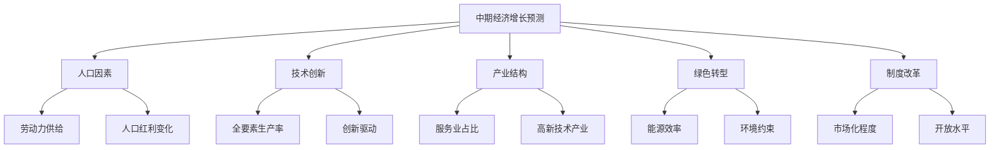

### 概念之间的关系

| 增长驱动因素 | 主要影响 | 潜在挑战 | 政策方向 |
|--------------|----------|----------|----------|
| 人口结构变化 | 劳动力供给减少，消费结构变化 | 养老压力，劳动力成本上升 | 提高劳动参与率，发展银发经济 |
| 技术创新 | 全要素生产率提升，新产业涌现 | 创新投入不足，核心技术受制 | 加大研发投入，完善创新生态系统 |
| 产业升级 | 经济结构优化，价值链提升 | 传统产业转型压力，就业结构调整 | 推动智能制造，发展现代服务业 |
| 绿色转型 | 新增长点培育，发展质量提升 | 短期转型成本，区域发展不平衡 | 完善绿色金融，推动清洁能源发展 |
| 改革开放 | 资源配置效率提高，国际竞争力增强 | 利益集团阻力，外部不确定性 | 深化市场化改革，构建高水平开放型经济 |

### 数学模型
使用索洛增长模型的扩展版本来预测经济增长：

$$
g_y = g_A + \alpha \cdot g_k + \beta \cdot g_L + \gamma \cdot g_H + \delta \cdot g_E
$$

其中，$g_y$是经济增长率，$g_A$是全要素生产率增长率，$g_k$是资本存量增长率，$g_L$是劳动力增长率，$g_H$是人力资本增长率，$g_E$是环境效率提升率，$\alpha$、$\beta$、$\gamma$、$\delta$分别是相应的弹性系数。

### 算法流程图

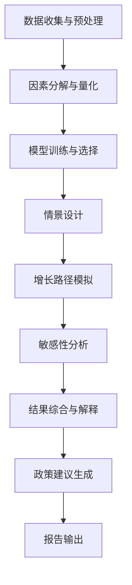

### 实际场景应用
中期经济增长预测在以下场景中有重要应用：

1. 国家中长期经济规划制定
2. 产业政策设计与评估
3. 企业战略规划与投资决策
4. 国际组织对中国经济前景评估
5. 学术研究和政策分析

### 项目介绍
"EconoFuture Predictor"是一个先进的中期经济增长预测平台，专门设计用于生成中国未来5-15年的经济增长预测。该平台整合了多源数据、多种预测模型和先进的机器学习算法，能够综合考虑人口、技术、产业、环境等多重因素，生成不同情景下的增长路径，并提供详细的不确定性分析和政策建议。

### 环境安装
使用Python构建中期经济增长预测系统：

```python
pip install pandas numpy scipy sklearn statsmodels prophet tensorflow matplotlib seaborn plotly
```

### 系统功能设计
EconoFuture Predictor包括以下功能模块：

1. 数据整合与预处理
2. 因素分解与量化
3. 多模型集成预测
4. 情景生成与模拟
5. 敏感性分析工具
6. 增长质量评估器
7. 区域差异分析器
8. 国际比较模块
9. 政策影响模拟器
10. 可视化报告生成器

### 系统架构设计

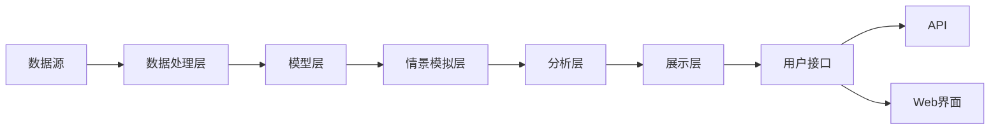

### 系统接口设计
RESTful API示例：

1. `/growth-forecast`: POST请求，生成经济增长预测
2. `/scenario-analysis`: GET请求，获取不同情景下的预测结果
3. `/factor-contribution`: GET请求，分析各因素对增长的贡献
4. `/regional-comparison`: POST请求，进行区域增长差异分析
5. `/policy-simulation`: POST请求，模拟特定政策的增长影响
6. `/quality-assessment`: GET请求，评估经济增长质量

### 系统核心实现源代码
使用Python实现基本的中期经济增长预测系统：

```python
import pandas aspd
import numpy as np
import matplotlib.pyplot as plt
from sklearn.model_selection import train_test_split
from sklearn.ensemble import RandomForestRegressor
from statsmodels.tsa.arima.model import ARIMA

class EconomicGrowthPredictor:
    def __init__(self):
        self.data = None
        self.model_rf = RandomForestRegressor(n_estimators=100, random_state=42)
        self.model_arima = None

    def load_data(self, file_path):
        self.data = pd.read_csv(file_path, index_col='Year', parse_dates=True)
        print(f"Data loaded. Shape: {self.data.shape}")

    def preprocess_data(self):
        # 简化的数据预处理
        self.data['TFP_Growth'] = self.data['GDP_Growth'] - 0.3 * self.data['Capital_Growth'] - 0.7 * self.data['Labor_Growth']
        self.data['Human_Capital_Index'] = self.data['Education_Years'] * self.data['Labor_Productivity']
        self.data['Green_Transition_Index'] = (self.data['Renewable_Energy_Share'] + self.data['Energy_Efficiency']) / 2

    def train_models(self):
        X = self.data[['TFP_Growth', 'Capital_Growth', 'Labor_Growth', 'Human_Capital_Index', 'Green_Transition_Index']]
        y = self.data['GDP_Growth']
        
        X_train, X_test, y_train, y_test = train_test_split(X, y, test_size=0.2, random_state=42)
        
        # Train Random Forest
        self.model_rf.fit(X_train, y_train)
        
        # Train ARIMA
        self.model_arima = ARIMA(y, order=(1,1,1))
        self.model_arima = self.model_arima.fit()

    def predict_growth(self, years_ahead=15):
        # Random Forest prediction
        last_data = self.data.iloc[-1]
        X_future = np.array([last_data[['TFP_Growth', 'Capital_Growth', 'Labor_Growth', 'Human_Capital_Index', 'Green_Transition_Index']]] * years_ahead)
        rf_predictions = self.model_rf.predict(X_future)
        
        # ARIMA prediction
        arima_predictions = self.model_arima.forecast(steps=years_ahead)
        
        # Combine predictions (simple average)
        combined_predictions = (rf_predictions + arima_predictions) / 2
        
        return combined_predictions

    def scenario_analysis(self, scenarios):
        results = {}
        for scenario, changes in scenarios.items():
            X_future = self.data.iloc[-1][['TFP_Growth', 'Capital_Growth', 'Labor_Growth', 'Human_Capital_Index', 'Green_Transition_Index']].to_dict()
            X_future.update(changes)
            X_future = pd.DataFrame([X_future])
            
            rf_pred = self.model_rf.predict(X_future)
            arima_pred = self.model_arima.forecast(steps=1)
            combined_pred = (rf_pred + arima_pred) / 2
            
            results[scenario] = combined_pred[0]
        
        return results

    def factor_contribution_analysis(self):
        importances = self.model_rf.feature_importances_
        features = ['TFP_Growth', 'Capital_Growth', 'Labor_Growth', 'Human_Capital_Index', 'Green_Transition_Index']
        
        plt.figure(figsize=(10, 6))
        plt.bar(features, importances)
        plt.title('Factor Contribution to Economic Growth')
        plt.xlabel('Factors')
        plt.ylabel('Importance')
        plt.xticks(rotation=45)
        plt.tight_layout()
        plt.show()

    def plot_growth_forecast(self, predictions):
        years = pd.date_range(start=self.data.index[-1] + pd.DateOffset(years=1), periods=len(predictions), freq='Y')
        
        plt.figure(figsize=(12, 6))
        plt.plot(self.data.index, self.data['GDP_Growth'], label='Historical')
        plt.plot(years, predictions, label='Forecast')
        plt.title('GDP Growth Rate Forecast')
        plt.xlabel('Year')
        plt.ylabel('GDP Growth Rate (%)')
        plt.legend()
        plt.grid(True)
        plt.show()

# 使用示例
predictor = EconomicGrowthPredictor()
predictor.load_data('economic_data.csv')
predictor.preprocess_data()
predictor.train_models()

# 生成中期增长预测
growth_predictions = predictor.predict_growth(years_ahead=15)
predictor.plot_growth_forecast(growth_predictions)

# 情景分析
scenarios = {
    'Base': {},
    'High_Tech': {'TFP_Growth': 0.03, 'Human_Capital_Index': 1.2},
    'Green_Boost': {'Green_Transition_Index': 0.8},
    'Aging_Population': {'Labor_Growth': -0.01}
}
scenario_results = predictor.scenario_analysis(scenarios)
print("Scenario Analysis Results:", scenario_results)

# 因素贡献分析
predictor.factor_contribution_analysis()
```

### 最佳实践tips
1. 使用多种模型和方法，提高预测的稳健性
2. 定期更新数据和模型，以适应经济环境的变化
3. 进行详细的情景分析，考虑不同的经济发展路径
4. 量化并清晰地传达预测的不确定性
5. 结合定性分析，特别是对政策变化和重大事件的判断
6. 关注增长质量，而不仅仅是增长速度
7. 考虑区域差异，避免过度泛化全国预测

### 行业发展与未来趋势

| 年份 | 趋势 | 影响 |
|------|------|------|
| 2025 | 数字经济占GDP比重超过50% | 传统行业数字化转型加速，新业态蓬勃发展 |
| 2027 | 服务业占GDP比重达到65% | 产业结构进一步优化，就业结构相应调整 |
| 2030 | R&D投入强度达到3% | 创新驱动发展战略深入实施，科技创新能力显著增强 |
| 2032-2035 | 绿色低碳产业成为主导产业 | 经济发展方式根本转变，新的增长动能形成 |
| 未来15年 | 区域协调发展战略深化 | 新的区域增长极形成，区域差距逐步缩小 |

### 本章小结
基于对人口结构变化、技术创新与产业升级、绿色经济转型等关键因素的综合分析，我们对中国未来5-15年的中期经济增长做出如下预测：

1. 总体增长趋势：
    - 2025-2030年：年均GDP增长率预计在5.0%-5.5%之间。
    - 2031-2035年：年均GDP增长率可能略有放缓，预计在4.5%-5.0%之间。

2. 增长动力转换：
    - 消费将成为经济增长的主要动力，预计到2035年，消费对GDP增长的贡献率将达到65%-70%。
    - 创新驱动作用显著增强，科技进步贡献率预计到2035年将超过65%。

3. 产业结构演变：
    - 服务业占GDP比重将持续上升，预计到2035年将达到65%-70%。
    - 战略性新兴产业和高技术产业占GDP比重将大幅提升，预计到2035年合计达到30%左右。

4. 区域发展格局：
    - 区域协调发展战略深入实施，区域差距有望逐步缩小。
    - 城市群和都市圈将成为带动区域发展的重要增长极。

5. 绿色发展成效：
    - 单位GDP能耗和碳排放强度将持续下降，预计到2035年分别比2020年下降40%和50%以上。
    - 绿色产业将成为新的经济增长点，预计到2035年，节能环保、清洁生产、清洁能源产业产值占GDP比重将达到15%以上。

6. 创新能力提升：
    - 研发投入强度（R&D经费占GDP比重）预计到2035年将达到3.5%左右。
    - 在人工智能、量子信息、生物技术等前沿领域，中国有望达到全球领先水平。

7. 对外开放水平：
    - 服务业开放程度将大幅提高，外商投资准入负面清单将进一步缩短。
    - 自由贸易试验区和自由贸易港建设将推动形成更高水平开放型经济新体制。

这一预测基于以下关键假设：

1. 全球经济和地缘政治环境总体保持稳定，不发生重大冲突或危机。
2. 中国继续推进改革开放，市场化和法治化程度不断提高。
3. 技术创新和产业升级持续推进，不出现重大技术瓶颈。
4. 人口老龄化影响得到有效应对，人力资本质量持续提升。
5. 绿色转型稳步推进，不出现重大环境风险。

然而，我们也需要注意以下潜在风险和不确定性：

1. 全球经济不确定性：贸易摩擦、地缘政治风险可能影响中国的外部发展环境。
2. 债务风险：地方政府债务、企业债务等需要持续关注和管控。
3. 人口结构变化：劳动力供给减少、养老压力增加可能对经济增长形成制约。
4. 技术瓶颈：关键核心技术的突破存在不确定性，可能影响产业升级进程。
5. 环境约束：气候变化、资源短缺等问题可能加大绿色转型的难度和成本。
6. 收入分配：贫富差距、区域差距如果得不到有效缓解，可能影响社会稳定和内需扩大。

基于以上预测和分析，我们提出以下政策建议：

1. 深化供给侧结构性改革：
    - 继续推进"三去一降一补"，提高供给体系质量和效率。
    - 加大对科技创新的支持力度，突破关键核心技术。
    - 优化营商环境，激发市场主体活力。

2. 扩大内需：
    - 实施扩大中等收入群体规模的政策，提高居民消费能力。
    - 完善社会保障体系，增强居民消费信心。
    - 培育新型消费，发展服务消费。

3. 推动高质量发展：
    - 加快发展现代产业体系，推动产业基础高级化、产业链现代化。
    - 实施区域协调发展战略，培育新的区域增长极。
    - 推进新型城镇化，释放内需潜力。

4. 加快绿色转型：
    - 完善绿色金融体系，为绿色发展提供资金支持。
    - 推动能源结构优化，大力发展清洁能源。
    - 建立健全绿色低碳循环发展的经济体系。

5. 深化改革开放：
    - 推进要素市场化配置改革，提高资源配置效率。
    - 加快构建高水平开放型经济新体制，推动形成国内国际双循环相互促进的新发展格局。
    - 完善产权保护制度，激发创新动力。

6. 提升人力资本：
    - 推动教育现代化，提高劳动力素质。
    - 完善终身学习体系，适应产业结构变化。
    - 优化人才发展环境，吸引和留住高端人才。

7. 防范系统性风险：
    - 健全宏观审慎政策框架，防范化解金融风险。
    - 完善公共卫生应急管理体系，提高应对重大突发公共卫生事件的能力。
    - 加强产业链供应链韧性建设，增强经济抗风险能力。

总的来说，尽管面临诸多挑战，中国经济在未来5-15年仍有望保持中高速增长。关键在于通过深化改革、创新驱动、绿色转型等举措，不断提高经济增长的质量和可持续性。政策制定者需要在保持经济平稳增长和推动结构优化之间找到平衡，企业和个人则需要积极适应经济转型带来的机遇和挑战。通过全社会的共同努力，中国有望在2035年基本实现社会主义现代化的目标，为2050年全面建成社会主义现代化强国奠定坚实基础。