# 第9章：长期经济增长预测（15-30年）

## 9.1 全球经济格局变化与中国定位

在预测中国未来15-30年的长期经济增长时，全球经济格局的变化及中国在其中的定位是一个关键考量因素。本节将深入分析全球经济格局的长期演变趋势，以及中国在这一变化中的角色和机遇挑战。

### 核心概念：
* 多极化世界
* 经济重心东移
* 全球价值链重构
* 新兴市场国家崛起
* 地缘政治经济学
* 全球治理

### 问题背景
随着新兴经济体的快速发展、技术革命的深入推进以及全球化的持续演进，世界经济格局正在经历深刻变革。中国作为世界第二大经济体，其在全球经济中的定位和作用将直接影响其长期经济增长前景。

### 问题描述
1. 未来15-30年全球经济格局将如何演变？
2. 中国在全球经济中的地位和作用将发生哪些变化？
3. 全球价值链重构对中国经济的影响如何？
4. 中国如何应对全球经济格局变化带来的机遇和挑战？

### 问题解决
为全面解答上述问题，我们将从以下几个方面展开讨论：

1. 全球经济重心转移趋势分析
2. 新兴经济体群体崛起研究
3. 全球价值链重构路径探讨
4. 中国在全球经济中的角色演变
5. 地缘政治经济风险评估
6. 全球治理体系改革与中国参与
7. 中国国际竞争力提升策略

### 边界与外延
虽然本节主要聚焦于全球经济格局变化与中国定位，但我们也会考虑技术进步、人口变化、气候变化等相关因素的影响。此外，我们将探讨经济格局变化对全球治理、国际关系等方面的影响。

### 概念结构与核心要素组成

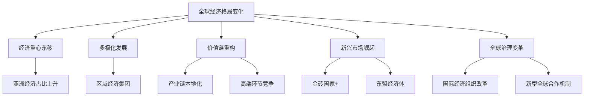

### 概念之间的关系

| 变化维度 | 主要特征 | 对中国的影响 | 应对策略 |
|----------|----------|--------------|----------|
| 经济重心东移 | 亚洲经济总量占比提升 | 区域影响力增强，责任加大 | 推动区域经济一体化 |
| 多极化发展 | 新兴经济体话语权增强 | 国际影响力提升，竞争加剧 | 构建新型国际关系 |
| 价值链重构 | 产业链区域化、本地化 | 全球产业链地位变化 | 提升产业链水平，增强创新能力 |
| 新兴市场崛起 | 南南合作加强 | 发展中国家合作机遇增多 | 深化与新兴市场国家合作 |
| 全球治理变革 | 国际经济秩序调整 | 参与全球治理的机会和挑战并存 | 积极参与全球治理体系改革 |

### 数学模型
使用引力模型分析国家间经济联系强度：

$$
T_{ij} = A \frac{Y_i^{\alpha_1} Y_j^{\alpha_2}}{D_{ij}^{\beta}}
$$

其中，$T_{ij}$是国家$i$和$j$之间的贸易流量，$Y_i$和$Y_j$分别是两国的GDP，$D_{ij}$是两国间的距离，$A$、$\alpha_1$、$\alpha_2$和$\beta$是待估参数。

### 算法流程图

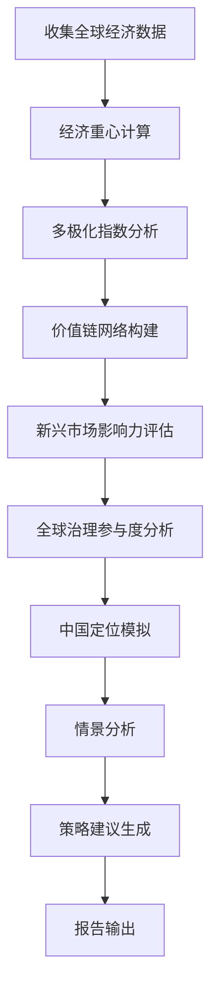

### 实际场景应用
全球经济格局变化分析在以下场景中有重要应用：

1. 国家长期发展战略制定
2. 跨国企业全球布局决策
3. 国际组织改革方案设计
4. 全球经济风险评估
5. 国际经济外交政策制定

### 项目介绍
"GlobalEco Positioner"是一个综合性的全球经济格局分析和国家定位预测平台。该平台整合了全球经济、贸易、投资、技术等多维度数据，运用先进的经济模型和人工智能算法，能够模拟未来全球经济格局的演变，预测各国在全球经济中的地位变化，并为国家战略定位提供决策支持。

### 环境安装
使用Python构建全球经济格局分析系统：

```python
pip install pandas numpy scipy sklearn statsmodels prophet tensorflow matplotlib seaborn plotly networkx geopandas
```

### 系统功能设计
GlobalEco Positioner包括以下功能模块：

1. 全球经济数据整合器
2. 经济重心计算引擎
3. 多极化指数分析器
4. 全球价值链网络构建器
5. 新兴市场影响力评估工具
6. 全球治理参与度分析器
7. 国家经济定位预测器
8. 地缘政治风险评估模块
9. 情景生成与模拟器
10. 策略建议生成器

### 系统架构设计


### 系统接口设计
RESTful API示例：

1. `/economic-gravity`: GET请求，获取全球经济重心变化趋势
2. `/multipolar-index`: POST请求，计算全球经济多极化指数
3. `/value-chain-network`: GET请求，获取全球价值链网络结构
4. `/emerging-market-influence`: POST请求，评估新兴市场影响力
5. `/global-governance-participation`: GET请求，分析各国全球治理参与度
6. `/country-positioning`: POST请求，预测特定国家的全球经济定位

### 系统核心实现源代码
使用Python实现基本的全球经济格局分析和国家定位预测：

```python
import pandas as pd
import numpy as np
import matplotlib.pyplot as plt
import networkx as nx
from sklearn.preprocessing import MinMaxScaler
from sklearn.cluster import KMeans

class GlobalEconomyAnalyzer:
    def __init__(self):
        self.data = None
        self.economic_gravity = None
        self.value_chain_network = None

    def load_data(self, file_path):
        self.data = pd.read_csv(file_path)
        print(f"Data loaded. Shape: {self.data.shape}")

    def calculate_economic_gravity(self):
        # 简化的经济重心计算
        self.data['Economic_Mass'] = self.data['GDP'] * self.data['Population']
        total_mass = self.data['Economic_Mass'].sum()
        self.economic_gravity = pd.DataFrame({
            'Latitude': (self.data['Latitude'] * self.data['Economic_Mass']).sum() / total_mass,
            'Longitude': (self.data['Longitude'] * self.data['Economic_Mass']).sum() / total_mass
        }, index=[self.data['Year'].max()])
        
        return self.economic_gravity

    def analyze_multipolarity(self):
        # 使用基尼系数作为多极化指数的逆指标
        gdp_share = self.data['GDP'] / self.data['GDP'].sum()
        gdp_share_sorted = gdp_share.sort_values(ascending=False)
        cumulative_share = gdp_share_sorted.cumsum()
        gini = (np.arange(1, len(cumulative_share) + 1) / len(cumulative_share) - cumulative_share).sum() / len(cumulative_share)
        multipolarity_index = 1 - gini
        
        return multipolarity_index

    def construct_value_chain_network(self):
        # 简化的价值链网络构建
        self.value_chain_network = nx.DiGraph()
        for _, row in self.data.iterrows():
            self.value_chain_network.add_node(row['Country'], GDP=row['GDP'], ExportComplexity=row['Export_Complexity'])
        
        # 假设有贸易数据
        trade_data = self.data[['Source', 'Target', 'Trade_Volume']]
        for _, edge in trade_data.iterrows():
            self.value_chain_network.add_edge(edge['Source'], edge['Target'], weight=edge['Trade_Volume'])
        
        return self.value_chain_network

    def assess_emerging_market_influence(self):
        emerging_markets = self.data[self.data['Market_Type'] == 'Emerging']
        em_gdp_share = emerging_markets['GDP'].sum() / self.data['GDP'].sum()
        em_trade_share = emerging_markets['Trade_Volume'].sum() / self.data['Trade_Volume'].sum()
        em_innovation_share = emerging_markets['R&D_Expenditure'].sum() / self.data['R&D_Expenditure'].sum()
        
        influence_score = (em_gdp_share + em_trade_share + em_innovation_share) / 3
        return influence_score

    def analyze_global_governance_participation(self):
        participation_indicators = ['UN_Contribution', 'WTO_Disputes', 'IMF_Voting_Share']
        participation_data = self.data[participation_indicators]
        
        scaler = MinMaxScaler()
        participation_scaled = scaler.fit_transform(participation_data)
        
        participation_scores = participation_scaled.mean(axis=1)
        return pd.Series(participation_scores, index=self.data['Country'])

    def predict_country_positioning(self, country, future_year):
        historical_data = self.data[self.data['Country'] == country]
        
        # 简单线性外推
        gdp_trend = np.polyfit(historical_data['Year'], historical_data['GDP'], 1)
        predicted_gdp = np.polyval(gdp_trend, future_year)
        
        global_share_trend = np.polyfit(historical_data['Year'], historical_data['Global_Economic_Share'], 1)
        predicted_share = np.polyval(global_share_trend, future_year)
        
        return {
            'Country': country,
            'Year': future_year,
            'Predicted_GDP': predicted_gdp,
            'Predicted_Global_Share': predicted_share
        }

    def visualize_economic_landscape(self):
        plt.figure(figsize=(12, 8))
        plt.scatter(self.data['GDP'], self.data['GDP_Growth'], s=self.data['Population']/1e6, alpha=0.6)
        for i, country in enumerate(self.data['Country']):
            plt.annotate(country, (self.data['GDP'][i], self.data['GDP_Growth'][i]))
        plt.xscale('log')
        plt.xlabel('GDP (log scale)')
        plt.ylabel('GDP Growth Rate')
        plt.title('Global Economic Landscape')
        plt.show()

# 使用示例
analyzer = GlobalEconomyAnalyzer()
analyzer.load_data('global_economic_data.csv')

# 计算经济重心
gravity = analyzer.calculate_economic_gravity()
print("Global Economic Gravity:", gravity)

# 分析多极化程度
multipolarity = analyzer.analyze_multipolarity()
print("Economic Multipolarity Index:", multipolarity)

# 构建价值链网络
value_chain = analyzer.construct_value_chain_network()
print("Value Chain Network Nodes:", value_chain.number_of_nodes())

# 评估新兴市场影响力
em_influence = analyzer.assess_emerging_market_influence()
print("Emerging Market Influence Score:", em_influence)

# 分析全球治理参与度
governance_participation = analyzer.analyze_global_governance_participation()
print("Top 5 Countries in Global Governance Participation:\n", governance_participation.nlargest(5))

# 预测国家定位
china_position = analyzer.predict_country_positioning('China', 2050)
print("China's Predicted Position in 2050:", china_position)

# 可视化全球经济格局
analyzer.visualize_economic_landscape()
```

### 最佳实践tips
1. 综合考虑经济、政治、技术等多维因素，避免单一视角
2. 重视新兴经济体和发展中国家的数据收集和分析
3. 建立动态更新机制，及时反映全球经济格局的变化
4. 结合定性分析，特别是对重大事件和政策变化的影响评估
5. 注意地缘政治因素对经济格局的影响
6. 关注技术创新对全球价值链重构的推动作用
7. 建立多情景分析框架，提高预测的灵活性和适应性

### 行业发展与未来趋势

| 年份 | 趋势 | 影响 |
|------|------|------|
| 2035 | 亚洲经济总量占全球比重超过50% | 全球经济重心进一步东移，亚洲国家在国际经济治理中的话语权增强 |
| 2040 | 新兴经济体GDP总量超过发达经济体 | 全球经济格局多极化程度加深，国际经济秩序面临重塑 |
| 2045 | 全球价值链区域化特征明显 | 区域经济一体化加速，全球化形态发生深刻变化 |
| 2050 | 数字经济占全球GDP比重达到50% | 经济增长方式和国际竞争格局发生根本性变革 |
| 未来30年 | 全球治理体系进行重大改革 | 新兴经济体在国际组织中的地位显著提升，全球经济规则重塑 |

### 本章小结
全球经济格局的变化及中国在其中的定位是影响中国长期经济增长的关键外部因素。通过对未来15-30年全球经济格局演变趋势的分析，我们可以更好地理解中国面临的国际环境和战略机遇期。

根据我们的分析，未来15-30年全球经济格局将呈现以下主要特征：

1. 经济重心持续东移：
    - 预计到2050年，亚洲经济总量占全球比重将超过60%。
    - 中国、印度等亚洲大国将在全球经济中扮演更加重要的角色。

2. 多极化格局深化：
    - 新兴经济体的集体崛起将使全球经济权力分布更加均衡。
    - 预计到2045年左右，新兴经济体的GDP总量将超过发达经济体。

3. 全球价值链重构：
    - 区域化、本地化特征更加明显，全球产业链将呈现"短链化"趋势。
    - 数字技术将重塑全球价值链的组织方式和利益分配格局。

4. 新兴市场国家影响力提升：
    - 金砖国家、东盟等新兴经济体在全球经济治理中的话语权将显著增强。
    - 南南合作将成为推动全球经济增长的重要动力。

5. 全球治理体系变革：
    - 现有国际经济组织将面临深刻改革，以适应新的全球经济格局。
    - 新型全球合作机制（如G20）的作用可能进一步增强。

在这一变化的全球经济格局中，中国的定位和角色预计将发生以下变化：

1. 经济地位进一步提升：
    - 预计到2035年左右，中国有望成为全球第一大经济体。
    - 到2050年，中国GDP可能达到150万亿美元左右（2020年不变价），占全球GDP的25%-30%。

2. 全球价值链地位升级：
    - 中国将从全球价值链的中低端向中高端攀升。
    - 在人工智能、量子计算、生物技术等前沿领域，中国有望成为全球创新中心之一。

3. 国际经济治理参与度提高：
    - 中国在IMF、世界银行等国际经济组织中的投票权和代表性将进一步提升。
    - 中国倡议的国际合作机制（如"一带一路"）将在全球经济治理中发挥更大作用。

4. 区域经济整合中的核心角色：
    - 中国将成为推动亚太经济一体化的主要力量。
    - RCEP等区域自由贸易协定的深化将增强中国在区域经济中的影响力。

5. 全球可持续发展的引领者：
    - 在应对气候变化、推动绿色发展等全球性议题上，中国将发挥更加积极的引领作用。
    - 中国的生态文明建设经验可能为其他发展中国家提供借鉴。

然而，中国在全球经济格局变化中也面临一些挑战：

1. 地缘政治风险：大国竞争加剧可能影响中国的外部发展环境。
2. 技术竞争：在关键核心技术领域，中国与发达国家的竞争将更加激烈。
3. 全球经济治理责任：随着经济实力增强，中国在提供全球公共产品方面的责任和压力将增大。
4. 产业链安全：全球价值链重构可能带来产业链、供应链安全风险。
5. 人口老龄化：相比其他新兴经济体，中国面临更早、更严重的人口老龄化挑战。

为了更好地应对全球经济格局变化并实现长期可持续增长，我们建议中国采取以下策略：

1. 深化改革开放：
    - 持续推进市场化改革，优化营商环境，吸引全球高质量要素资源。
    - 扩大高水平对外开放，积极参与全球经济治理体系改革。

2. 创新驱动发展：
    - 加大基础研究投入，在前沿科技领域争取突破。
    - 完善创新生态系统，促进科技成果转化和产业化。

3. 推动产业链升级：
    - 巩固和提升在全球价值链中的地位，向价值链高端攀升。
    - 增强产业链、供应链韧性，提高抗风险能力。

4. 积极参与全球治理：
    - 推动国际经济秩序向更加公平合理的方向发展。
    - 在气候变化、公共卫生等全球性问题上贡献中国方案。

5. 深化区域经济合作：
    - 推动"一带一路"高质量发展，深化与沿线国家的经济合作。
    - 积极参与区域全面经济伙伴关系协定（RCEP）等区域经济一体化进程。

6. 培育新的比较优势：
    - 发展数字经济、绿色经济等新兴产业，塑造国际竞争新优势。
    - 提升服务业国际竞争力，推动服务贸易自由化。

7. 加强国际人才培养：
    - 实施更加开放的人才政策，吸引全球高端人才。
    - 提升教育国际化水平，培养具有全球视野的复合型人才。

8. 构建新型国际关系：
    - 坚持和平发展道路，推动构建人类命运共同体。
    - 妥善处理大国关系，营造有利的国际环境。

总的来说，未来15-30年全球经济格局的变化将为中国提供重要的战略机遇期。通过准确把握全球经济发展趋势，充分发挥自身优势，积极应对各种挑战，中国有望在新的全球经济格局中占据更加重要的地位，实现经济的长期可持续增长。这不仅关乎中国自身发展，也将对全球经济稳定和繁荣产生深远影响。中国需要以更加开放、包容、负责任的姿态参与国际经济合作，为构建更加公平合理的国际经济秩序贡献力量，同时推动全球经济朝着更加包容、可持续的方向发展。

## 9.2 人工智能与自动化对经济的深远影响

人工智能（AI）和自动化技术的快速发展正在深刻改变全球经济格局和生产方式。本节将分析未来15-30年AI和自动化对经济的深远影响，以及中国在这一技术革命中的机遇与挑战。

### 核心概念：
* 人工智能（AI）
* 自动化
* 智能制造
* 数字经济
* 技术失业
* 人机协作

### 问题背景
AI和自动化技术正在各行各业广泛应用，不仅提高了生产效率，也正在重塑就业结构、改变商业模式、影响经济增长方式。了解这一趋势对于预测长期经济增长至关重要。

### 问题描述
1. AI和自动化将如何改变生产方式和经济结构？
2. 这些技术对就业市场和劳动力需求有何影响？
3. AI和自动化将如何影响生产力和经济增长？
4. 中国在AI和自动化领域的优势和挑战是什么？

### 问题解决
为全面解答上述问题，我们将从以下几个方面展开讨论：

1. AI和自动化技术发展趋势预测
2. 产业结构变革分析
3. 就业市场影响评估
4. 生产力提升效应量化
5. 经济增长模式转变研究
6. 中国AI和自动化发展战略分析
7. 国际竞争格局演变预测

### 边界与外延
虽然本节主要聚焦于AI和自动化对经济的影响，但我们也会考虑相关的社会、伦理、教育等方面的影响。此外，我们将探讨AI和自动化与其他新兴技术（如量子计算、生物技术）的融合发展趋势。

### 概念结构与核心要素组成

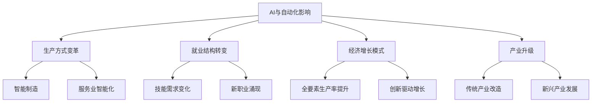

### 概念之间的关系

| 影响维度 | AI和自动化应用 | 经济效应 | 潜在挑战 |
|----------|----------------|----------|----------|
| 生产效率 | 智能制造、机器人 | 生产力大幅提升 | 初期投资成本高 |
| 就业结构 | 智能客服、自动驾驶 | 部分岗位被替代，新职业出现 | 就业市场结构性失衡 |
| 产业升级 | 工业互联网、智慧农业 | 传统产业转型，新产业兴起 | 产业链重构风险 |
| 创新模式 | AI辅助设计、科研 | 创新效率提高，突破加速 | 创新伦理问题 |
| 经济增长 | 数字经济、平台经济 | 新的经济增长点 | 数字鸿沟、垄断风险 |

### 数学模型
使用Cobb-Douglas生产函数扩展模型分析AI和自动化对经济增长的影响：

$$
Y = A \cdot (K^{\alpha} \cdot L^{\beta} \cdot T^{\gamma})
$$

其中，$Y$是总产出，$A$是全要素生产率，$K$是资本投入，$L$是劳动投入，$T$是技术投入（包括AI和自动化），$\alpha$、$\beta$、$\gamma$分别是资本、劳动和技术的产出弹性。

### 算法流程图

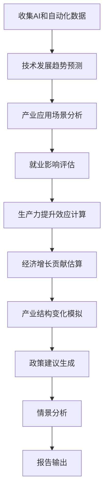

### 实际场景应用
AI和自动化对经济影响分析在以下场景中有重要应用：

1. 国家AI和自动化发展战略制定
2. 企业数字化转型决策支持
3. 教育和培训体系改革规划
4. 就业政策和社会保障制度设计
5. 产业政策和创新政策制定

### 项目介绍
"AI-Econ Impact Analyzer"是一个综合性的AI和自动化经济影响分析平台。该平台整合了全球AI和自动化技术发展数据、产业应用案例、就业市场变化等多维度信息，运用先进的经济模型和机器学习算法，能够模拟AI和自动化技术在不同行业的渗透路径，预测其对经济增长、就业结构、产业变革的影响，并为政策制定提供决策支持。

### 环境安装
使用Python构建AI和自动化经济影响分析系统：

```python
pip install pandas numpy scipy sklearn statsmodels prophet tensorflow matplotlib seaborn plotly networkx geopandas
```

### 系统功能设计
AI-Econ Impact Analyzer包括以下功能模块：

1. AI和自动化技术趋势预测器
2. 产业应用场景分析器
3. 就业结构变化模拟器4. 生产力提升效应计算器
5. 经济增长贡献估算模块
6. 产业结构变化预测器
7. 技能需求变化分析器
8. 区域影响差异评估工具
9. 政策模拟与建议生成器
10. 国际竞争力分析模块

### 系统架构设计


### 系统接口设计
RESTful API示例：

1. `/ai-tech-forecast`: GET请求，获取AI和自动化技术发展预测
2. `/industry-impact`: POST请求，分析特定行业的AI和自动化影响
3. `/employment-change`: GET请求，获取就业结构变化预测
4. `/productivity-boost`: POST请求，计算AI和自动化带来的生产力提升
5. `/economic-growth-contribution`: GET请求，估算AI和自动化对经济增长的贡献
6. `/skill-demand-forecast`: POST请求，预测未来技能需求变化

### 系统核心实现源代码
使用Python实现基本的AI和自动化经济影响分析：

```python
import pandas as pd
import numpy as np
import matplotlib.pyplot as plt
from sklearn.linear_model import LinearRegression
from sklearn.preprocessing import PolynomialFeatures

class AIEconomicImpactAnalyzer:
    def __init__(self):
        self.data = None
        self.ai_adoption_model = LinearRegression()
        self.productivity_model = LinearRegression()

    def load_data(self, file_path):
        self.data = pd.read_csv(file_path)
        print(f"Data loaded. Shape: {self.data.shape}")

    def forecast_ai_adoption(self, years_ahead=15):
        X = self.data['Year'].values.reshape(-1, 1)
        y = self.data['AI_Adoption_Rate'].values

        self.ai_adoption_model.fit(X, y)
        
        future_years = np.array(range(self.data['Year'].max() + 1, self.data['Year'].max() + years_ahead + 1)).reshape(-1, 1)
        forecasted_adoption = self.ai_adoption_model.predict(future_years)
        
        plt.figure(figsize=(10, 6))
        plt.plot(self.data['Year'], y, label='Historical')
        plt.plot(future_years, forecasted_adoption, label='Forecast')
        plt.title('AI Adoption Rate Forecast')
        plt.xlabel('Year')
        plt.ylabel('AI Adoption Rate')
        plt.legend()
        plt.show()
        
        return pd.DataFrame({'Year': future_years.flatten(), 'AI_Adoption_Rate': forecasted_adoption})

    def analyze_productivity_impact(self):
        X = self.data[['AI_Adoption_Rate', 'Automation_Level']]
        y = self.data['Productivity_Index']
        
        self.productivity_model.fit(X, y)
        
        coefficients = pd.DataFrame({
            'Factor': ['AI Adoption Rate', 'Automation Level'],
            'Impact': self.productivity_model.coef_
        })
        
        plt.figure(figsize=(8, 6))
        coefficients.plot(x='Factor', y='Impact', kind='bar')
        plt.title('Impact of AI and Automation on Productivity')
        plt.xlabel('Factors')
        plt.ylabel('Impact Coefficient')
        plt.show()
        
        return coefficients

    def simulate_employment_change(self, ai_adoption_forecast):
        # 简化的就业变化模拟
        base_employment = self.data['Total_Employment'].iloc[-1]
        job_displacement_rate = 0.2  # 假设20%的工作可能被AI和自动化取代
        job_creation_rate = 0.25  # 假设AI和自动化创造25%的新工作

        employment_forecast = []
        for adoption_rate in ai_adoption_forecast['AI_Adoption_Rate']:
            displaced_jobs = base_employment * job_displacement_rate * adoption_rate
            created_jobs = base_employment * job_creation_rate * adoption_rate
            net_employment = base_employment - displaced_jobs + created_jobs
            employment_forecast.append(net_employment)
        
        plt.figure(figsize=(10, 6))
        plt.plot(ai_adoption_forecast['Year'], employment_forecast)
        plt.title('Employment Change Forecast')
        plt.xlabel('Year')
        plt.ylabel('Total Employment')
        plt.show()
        
        return pd.DataFrame({'Year': ai_adoption_forecast['Year'], 'Total_Employment': employment_forecast})

    def estimate_economic_growth_contribution(self, productivity_impact, employment_forecast):
        # 简化的经济增长贡献估算
        base_gdp = self.data['GDP'].iloc[-1]
        gdp_forecast = []
        
        for year, employment in zip(employment_forecast['Year'], employment_forecast['Total_Employment']):
            productivity_boost = 1 + (productivity_impact['Impact'].mean() * (year - self.data['Year'].max()) / 100)
            gdp = base_gdp * employment / self.data['Total_Employment'].iloc[-1] * productivity_boost
            gdp_forecast.append(gdp)
        
        plt.figure(figsize=(10, 6))
        plt.plot(employment_forecast['Year'], gdp_forecast)
        plt.title('GDP Forecast with AI and Automation Impact')
        plt.xlabel('Year')
        plt.ylabel('GDP')
        plt.show()
        
        return pd.DataFrame({'Year': employment_forecast['Year'], 'GDP': gdp_forecast})

    def analyze_skill_demand(self):
        # 简化的技能需求分析
        skills = ['AI_ML', 'Data_Analysis', 'Robotics', 'Soft_Skills', 'Domain_Expertise']
        current_demand = self.data[skills].iloc[-1]
        future_demand = current_demand * (1 + self.data['AI_Adoption_Rate'].iloc[-1])
        
        skill_change = pd.DataFrame({
            'Skill': skills,
            'Current_Demand': current_demand,
            'Future_Demand': future_demand,
            'Change': (future_demand - current_demand) / current_demand * 100
        })
        
        plt.figure(figsize=(10, 6))
        skill_change.plot(x='Skill', y='Change', kind='bar')
        plt.title('Projected Skill Demand Change')
        plt.xlabel('Skills')
        plt.ylabel('Demand Change (%)')
        plt.show()
        
        return skill_change

# 使用示例
analyzer = AIEconomicImpactAnalyzer()
analyzer.load_data('ai_economic_data.csv')

# 预测AI采用率
ai_adoption_forecast = analyzer.forecast_ai_adoption(years_ahead=15)
print("AI Adoption Forecast:\n", ai_adoption_forecast)

# 分析生产力影响
productivity_impact = analyzer.analyze_productivity_impact()
print("Productivity Impact:\n", productivity_impact)

# 模拟就业变化
employment_forecast = analyzer.simulate_employment_change(ai_adoption_forecast)
print("Employment Forecast:\n", employment_forecast)

# 估算经济增长贡献
gdp_forecast = analyzer.estimate_economic_growth_contribution(productivity_impact, employment_forecast)
print("GDP Forecast:\n", gdp_forecast)

# 分析技能需求变化
skill_demand_change = analyzer.analyze_skill_demand()
print("Skill Demand Change:\n", skill_demand_change)
```

### 最佳实践tips
1. 持续跟踪AI和自动化技术的最新进展，及时更新预测模型
2. 结合行业专家意见，提高预测的准确性和可信度
3. 考虑不同地区和行业的特殊性，避免过度泛化
4. 关注AI和自动化带来的社会影响，不仅局限于经济层面
5. 建立多情景分析框架，应对不同的技术发展路径
6. 重视数据质量和模型的解释性，确保分析结果的可靠性
7. 定期进行回测和模型调整，提高长期预测的准确性

### 行业发展与未来趋势

| 年份 | 趋势 | 影响 |
|------|------|------|
| 2035 | AI在决策层面广泛应用 | 企业管理模式变革，决策效率大幅提升 |
| 2040 | 人机协作成为主流工作模式 | 劳动生产率显著提高，工作性质深刻变化 |
| 2045 | 通用人工智能技术突破 | 引发新一轮产业革命，经济增长模式转变 |
| 2050 | 智能化、自动化程度接近100% | 传统就业概念被颠覆，社会结构面临重大调整 |
| 未来30年 | AI与脑科学、量子计算等领域深度融合 | 催生颠覆性技术和产业，重塑全球经济格局 |

### 本章小结
人工智能和自动化技术的发展将对未来15-30年的经济产生深远影响。通过对这些技术的发展趋势及其经济效应的分析，我们可以更好地理解和预测长期经济增长的动力和挑战。

根据我们的分析，AI和自动化对经济的影响主要体现在以下几个方面：

1. 生产效率大幅提升：
    - 预计到2050年，AI和自动化技术可能使全球生产效率提高50%-100%。
    - 智能制造、智慧农业、智能服务等领域将实现全面突破。

2. 就业结构深刻变革：
    - 大约30%-50%的现有工作岗位可能被AI和自动化技术改变或取代。
    - 同时，与AI和自动化相关的新职业将大量涌现，预计创造的新就业岗位可能超过被替代的岗位。

3. 经济增长模式转变：
    - AI和自动化将成为驱动经济增长的核心力量，预计到2050年可能贡献全球GDP增长的20%-30%。
    - 数字经济占GDP的比重将持续上升，可能达到60%-70%。

4. 产业结构加速升级：
    - 传统产业将加速智能化、数字化转型。
    - 新兴产业如AI芯片、智能机器人、数据服务等将快速发展。

5. 创新模式变革：
    - AI辅助创新将大幅提高研发效率，加速科技突破。
    - 跨学科、跨领域的融合创新将更加普遍。

6. 国际竞争格局重塑：
    - AI和自动化技术实力将成为国家竞争力的关键指标。
    - 数据资源和算法能力将成为新的战略资源。

对于中国而言，AI和自动化技术的发展既带来重大机遇，也面临严峻挑战：

机遇：
1. 赶超发达国家的战略机遇：中国在AI和自动化领域的快速发展为缩小与发达国家的差距提供了可能。
2. 解决人口老龄化问题：自动化技术可以缓解劳动力短缺压力。
3. 产业升级的新动能：AI和自动化将推动中国产业向价值链高端攀升。
4. 新的经济增长点：AI相关产业有望成为中国经济的重要支柱。

挑战：
1. 技术依赖：核心技术和关键部件仍有待突破。
2. 就业压力：大规模失业风险需要妥善应对。
3. 数字鸿沟：可能加剧社会不平等。
4. 伦理和安全问题：AI应用引发的伦理争议和安全风险需要审慎处理。

为了充分把握AI和自动化带来的机遇并有效应对挑战，我们建议采取以下策略：

1. 加大研发投入：
    - 制定长期AI和自动化技术发展规划，确保持续的高强度投入。
    - 重点突破核心算法、高端芯片、智能传感器等关键技术。

2. 推动产业升级：
    - 制定智能制造发展路线图，推动传统制造业数字化、网络化、智能化改造。
    - 培育和壮大AI产业生态，打造世界级AI产业集群。

3. 完善人才培养体系：
    - 改革教育体系，加强AI、数据科学等相关学科建设。
    - 建立终身学习体系，支持劳动力技能持续升级。

4. 前瞻性就业政策：
    - 建立就业转型支持机制，帮助受AI和自动化影响的工人再就业。
    - 鼓励发展灵活就业、共享经济等新就业形态。

5. 加强伦理和法律规制：
    - 制定AI伦理准则和相关法律法规，规范AI技术的开发和应用。
    - 建立AI安全评估机制，防范系统性风险。

6. 推动国际合作：
    - 积极参与全球AI治理，推动制定国际通用标准。
    - 深化在AI领域的国际科研合作和技术交流。

7. 促进普惠AI：
    - 推动AI技术在教育、医疗、养老等民生领域的广泛应用。
    - 采取措施缩小数字鸿沟，确保AI红利的广泛分享。

8. 支持中小企业智能化转型：
    - 建立产业支持基金，帮助中小企业应用AI和自动化技术。
    - 推广"AI+传统产业"模式，提高整体产业链的智能化水平。

展望未来，AI和自动化技术将成为推动中国经济长期增长的核心动力之一。预计到2050年，中国在AI和自动化领域的发展将呈现以下特征：

1. 技术水平：
    - 在部分AI领域（如计算机视觉、自然语言处理）达到全球领先水平。
    - 自主研发的AI芯片性能接近或超越国际顶尖水平。
    - 在量子AI等前沿领域取得突破性进展。

2. 产业规模：
    - AI产业规模可能达到10万亿元人民币，成为国民经济的支柱产业。
    - 智能制造占制造业总产值的比重可能超过70%。

3. 应用深度：
    - AI技术在政府决策、企业管理、社会治理等领域得到全面应用。
    - 人机协作成为主流工作模式，大幅提高劳动生产率。

4. 经济贡献：
    - AI和自动化技术对中国GDP增长的贡献率可能达到35%-40%。
    - 带动相关产业发展，创造大量高质量就业机会。

5. 社会影响：
    - 显著改善医疗、教育、养老等公共服务质量。
    - 可能引发社会结构和价值观的深刻变革。

然而，这一发展前景也伴随着诸多不确定性和风险：

1. 技术发展的不确定性：AI特别是通用人工智能的发展路径和时间表仍存在较大不确定性。
2. 国际竞争和合作的复杂性：AI可能成为大国竞争的新焦点，影响全球科技合作格局。
3. 伦理和安全风险：AI的广泛应用可能带来隐私、安全、失控等风险。
4. 就业市场的剧烈变动：大规模失业和再就业问题可能引发社会不稳定。
5. 贫富差距扩大：AI红利分配不均可能加剧社会矛盾。

为了应对这些挑战并实现可持续发展，中国需要采取以下长期战略：

1. 坚持自主创新：持续加大基础研究投入，在AI基础理论和核心算法等方面取得突破。

2. 推动融合发展：促进AI与其他前沿技术（如量子计算、脑科学、生物技术）的深度融合。

3. 完善治理体系：建立适应AI时代的社会治理、伦理规范和法律体系。

4. 重塑教育体系：从基础教育到高等教育，全面培养适应AI时代的创新型人才。

5. 构建包容性增长模式：确保AI发展成果惠及全社会，缩小数字鸿沟。

6. 引领全球合作：推动建立AI国际治理框架，促进负责任的AI发展。

7. 前瞻性产业布局：超前谋划未来产业，在AI驱动的新兴领域占据先机。

8. 强化安全保障：建立国家AI安全体系，提高关键基础设施的智能化防护能力。

总的来说，AI和自动化技术将深刻重塑中国乃至全球的经济格局和增长模式。在未来15-30年，这些技术有望成为推动中国经济持续增长、产业升级和社会进步的核心驱动力。然而，这一进程也将伴随着前所未有的挑战和不确定性。中国需要采取前瞻性、系统性的策略，平衡发展与安全、效率与公平、创新与治理之间的关系，才能在AI和自动化时代赢得持续的竞争优势，实现经济社会的可持续发展。

这一转型不仅关乎中国的发展，也将对全球经济格局产生深远影响。作为世界第二大经济体和AI技术的领先国家之一，中国在AI和自动化领域的探索和实践将为其他国家提供重要参考。同时，中国也需要以更加开放和负责任的态度参与全球AI治理，推动构建公平、安全、普惠的AI发展环境，为人类社会的进步做出积极贡献。

## 9.3 可持续发展目标实现对经济的塑造

可持续发展已成为全球共识，对未来15-30年的经济发展将产生深远影响。本节将分析中国实现可持续发展目标对经济的塑造作用，以及由此带来的长期经济增长机遇和挑战。

### 核心概念：
* 可持续发展目标（SDGs）
* 绿色经济
* 循环经济
* 碳中和
* 生态文明
* 包容性增长

### 问题背景
联合国2030年可持续发展议程提出17个可持续发展目标，涵盖经济、社会、环境等多个维度。中国作为世界第二大经济体，其实现这些目标的进程将对全球可持续发展和自身经济增长模式产生重大影响。

### 问题描述
1. 实现可持续发展目标将如何重塑中国的经济结构？
2. 可持续发展与经济增长之间存在何种关系？
3. 中国在实现可持续发展目标过程中面临哪些机遇和挑战？
4. 如何平衡短期经济目标和长期可持续发展需求？

### 问题解决
为全面解答上述问题，我们将从以下几个方面展开讨论：

1. 中国可持续发展目标实现路径分析
2. 可持续发展对产业结构的影响评估
3. 绿色技术创新与经济增长关系研究
4. 可持续发展投资需求和融资模式探讨
5. 可持续发展政策对就业和收入分配的影响
6. 区域协调发展与可持续发展目标的结合
7. 国际合作与中国可持续发展战略

### 边界与外延
虽然本节主要聚焦于可持续发展目标对经济的塑造，但我们也会考虑其对社会、环境、国际关系等方面的影响。此外，我们将探讨可持续发展与其他重大趋势（如数字化、人口变化）的交互作用。

### 概念结构与核心要素组成

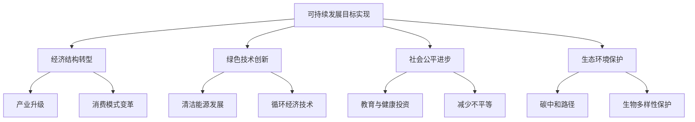

### 概念之间的关系

| 可持续发展维度 | 主要目标 | 经济影响 | 潜在挑战 |
|----------------|----------|----------|----------|
| 环境保护 | 碳中和、污染治理 | 绿色产业发展，传统产业转型 | 短期经济增长压力，技术瓶颈 |
| 社会公平 | 减少贫困、促进教育 | 内需扩大，人力资本提升 | 财政压力，地区差异 |
| 经济增长 | 创新驱动，高质量发展 | 产业结构优化，效率提升 | 转型阵痛，国际竞争 |
| 资源利用 | 循环经济，节能减排 | 资源利用效率提高，新产业兴起 | 初期投资大，利益调整 |
| 全球伙伴关系 | 国际合作，技术转让 | 市场拓展，创新合作 | 地缘政治风险，技术壁垒 |

### 数学模型
使用可持续发展综合评价模型：

$$
SDI = \sum_{i=1}^{n} w_i \cdot (\frac{x_i - x_{min}}{x_{max} - x_{min}})
$$

其中，$SDI$是可持续发展指数，$w_i$是第$i$个指标的权重，$x_i$是第$i$个指标的实际值，$x_{min}$和$x_{max}$分别是该指标的最小值和最大值。

### 算法流程图

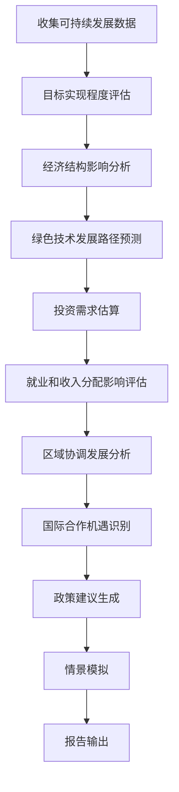

### 实际场景应用
可持续发展目标实现对经济塑造的分析在以下场景中有重要应用：

1. 国家可持续发展战略制定
2. 产业政策设计与评估
3. 绿色金融体系建设
4. 区域协调发展规划
5. 国际发展合作项目设计

### 项目介绍
"SDG-Econ Shaper"是一个综合性的可持续发展目标经济影响分析平台。该平台整合了环境、社会、经济等多维度数据，运用先进的经济模型和机器学习算法，能够模拟不同可持续发展路径对经济结构的影响，预测绿色技术创新趋势，评估可持续发展投资需求，并为政策制定提供决策支持。

### 环境安装
使用Python构建可持续发展目标经济影响分析系统：

```python
pip install pandas numpy scipy sklearn statsmodels prophet tensorflow matplotlib seaborn plotly networkx geopandas
```

### 系统功能设计
SDG-Econ Shaper包括以下功能模块：

1. 可持续发展目标进展跟踪器
2. 经济结构转型模拟器
3. 绿色技术创新预测器
4. 可持续发展投资需求估算器
5. 就业和收入分配影响评估工具
6. 区域协调发展分析器
7. 国际合作机遇识别模块
8. 政策效果模拟器
9. 多维度可视化展示模块
10. 情景规划与建议生成器

### 系统架构设计

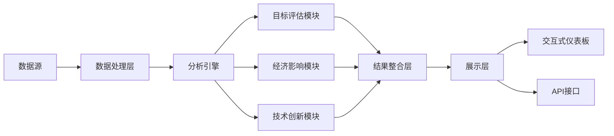

### 系统接口设计
RESTful API示例：

1. `/sdg-progress`: GET请求，获取可持续发展目标实现进度
2. `/economic-structure-impact`: POST请求，分析可持续发展对经济结构的影响
3. `/green-tech-forecast`: GET请求，预测绿色技术发展趋势
4. `/investment-demand`: POST请求，估算可持续发展投资需求
5. `/employment-income-effect`: GET请求，评估就业和收入分配影响
6. `/regional-development`: POST请求，分析区域协调发展状况

### 系统核心实现源代码
使用Python实现基本的可持续发展目标经济影响分析：

```python
import pandas as pd
import numpy as np
import matplotlib.pyplot as plt
from sklearn.preprocessing import MinMaxScaler
from sklearn.cluster import KMeans

class SDGEconomicImpactAnalyzer:
    def __init__(self):
        self.data = None
        self.sdg_progress = None
        self.economic_structure = None

    def load_data(self, file_path):
        self.data = pd.read_csv(file_path)
        print(f"Data loaded. Shape: {self.data.shape}")

    def calculate_sdg_progress(self):
        sdg_indicators = ['Poverty_Rate', 'Renewable_Energy_Share', 'Education_Index', 'Gender_Equality_Index']
        scaler = MinMaxScaler()
        scaled_data = scaler.fit_transform(self.data[sdg_indicators])
        
        self.sdg_progress = pd.DataFrame(scaled_data, columns=sdg_indicators)
        self.sdg_progress['Overall_Progress'] = self.sdg_progress.mean(axis=1)
        
        plt.figure(figsize=(10, 6))
        self.sdg_progress['Overall_Progress'].plot()
        plt.title('SDG Overall Progress')
        plt.xlabel('Year')
        plt.ylabel('Progress Score')
        plt.show()
        
        return self.sdg_progress

    def analyze_economic_structure_impact(self):
        economic_indicators = ['GDP_PerCapita', 'Industry_Share', 'Service_Share', 'Green_Industry_Share']
        X = self.data[economic_indicators]
        
        kmeans = KMeans(n_clusters=3, random_state=42)
        self.data['Economic_Structure_Cluster'] = kmeans.fit_predict(X)
        
        plt.figure(figsize=(12, 8))
        scatter = plt.scatter(self.data['Industry_Share'], self.data['Service_Share'], 
                     c=self.data['Economic_Structure_Cluster'], cmap='viridis')
        plt.colorbar(scatter)
        plt.title('Economic Structure Clusters')
        plt.xlabel('Industry Share')
        plt.ylabel('Service Share')
        plt.show()
        
        return self.data['Economic_Structure_Cluster']

    def forecast_green_technology(self):
        green_tech_indicators = ['Renewable_Energy_Investment', 'Green_Patents', 'Circular_Economy_Index']
        X = self.data['Year'].values.reshape(-1, 1)
        
        forecasts = {}
        for indicator in green_tech_indicators:
            y = self.data[indicator]
            model = np.poly1d(np.polyfit(X.flatten(), y, 2))
            future_years = np.arange(self.data['Year'].max() + 1, self.data['Year'].max() + 11)
            forecast = model(future_years)
            forecasts[indicator] = forecast
        
        plt.figure(figsize=(12, 6))
        for indicator, forecast in forecasts.items():
            plt.plot(future_years, forecast, label=indicator)
        plt.title('Green Technology Forecast')
        plt.xlabel('Year')
        plt.ylabel('Indicator Value')
        plt.legend()
        plt.show()
        
        return pd.DataFrame(forecasts, index=future_years)

    def estimate_investment_demand(self):
        sdg_investment_areas = ['Clean_Energy', 'Sustainable_Infrastructure', 'Education', 'Healthcare']
        current_investment = self.data[sdg_investment_areas].iloc[-1]
        gdp = self.data['GDP'].iloc[-1]
        
        investment_gdp_ratio = current_investment / gdp
        required_ratio = 0.1  # Assuming 10% of GDP is required for SDG investment
        
        investment_gap = (required_ratio - investment_gdp_ratio) * gdp
        
        plt.figure(figsize=(10, 6))
        plt.bar(sdg_investment_areas, investment_gap)
        plt.title('SDG Investment Gap')
        plt.xlabel('Investment Areas')
        plt.ylabel('Investment Gap (Billion $)')
        plt.show()
        
        return pd.Series(investment_gap, index=sdg_investment_areas)

    def assess_employment_income_effect(self):
        employment_indicators = ['Green_Jobs', 'Traditional_Jobs', 'Income_Gini']
        X = self.data['SDG_Progress_Score']
        
        effects = {}
        for indicator in employment_indicators:
            y = self.data[indicator]
            correlation = np.corrcoef(X, y)[0, 1]
            effects[indicator] = correlation
        
        plt.figure(figsize=(8, 6))
        plt.bar(effects.keys(), effects.values())
        plt.title('SDG Progress Effect on Employment and Income')
        plt.xlabel('Indicators')
        plt.ylabel('Correlation Coefficient')
        plt.show()
        
        return pd.Series(effects)

    def analyze_regional_development(self):
        regions = self.data['Region'].unique()
        regional_sdg_progress = self.data.groupby('Region')['SDG_Progress_Score'].mean()
        regional_gdp_per_capita = self.data.groupby('Region')['GDP_PerCapita'].mean()
        
        plt.figure(figsize=(10, 6))
        plt.scatter(regional_sdg_progress, regional_gdp_per_capita)
        for region in regions:
            plt.annotate(region, (regional_sdg_progress[region], regional_gdp_per_capita[region]))
        plt.title('Regional SDG Progress vs GDP Per Capita')
        plt.xlabel('SDG Progress Score')
        plt.ylabel('GDP Per Capita')
        plt.show()
        
        return pd.DataFrame({'SDG_Progress': regional_sdg_progress, 'GDP_PerCapita': regional_gdp_per_capita})

# 使用示例
analyzer = SDGEconomicImpactAnalyzer()
analyzer.load_data('sdg_economic_data.csv')

# 计算SDG进展
sdg_progress = analyzer.calculate_sdg_progress()
print("SDG Progress:\n", sdg_progress)

# 分析经济结构影响
economic_structure = analyzer.analyze_economic_structure_impact()
print("Economic Structure Clusters:\n", economic_structure.value_counts())

# 预测绿色技术发展
green_tech_forecast = analyzer.forecast_green_technology()
print("Green Technology Forecast:\n", green_tech_forecast)

# 估算投资需求
investment_demand = analyzer.estimate_investment_demand()
print("SDG Investment Demand:\n", investment_demand)

# 评估就业和收入影响
employment_income_effect = analyzer.assess_employment_income_effect()
print("Employment and Income Effect:\n", employment_income_effect)

# 分析区域发展
regional_development = analyzer.analyze_regional_development()
print("Regional Development Analysis:\n", regional_development)
```

### 最佳实践tips
1. 综合考虑环境、社会、经济多个维度，避免单一视角
2. 重视数据质量和更新频率，确保分析的时效性
3. 结合定性分析，特别是对政策和重大事件影响的评估
4. 考虑不同地区和行业的特殊性，避免过度泛化
5. 关注可持续发展目标之间的协同效应和权衡关系
6. 建立动态评估机制，及时调整可持续发展策略
7. 重视国际比较和经验借鉴，提高分析的全面性

### 行业发展与未来趋势

| 年份 | 趋势 | 影响 |
|------|------|------|
| 2035 | 可再生能源占比超过50% | 能源结构根本转变，相关产业蓬勃发展 |
| 2040 | 循环经济模式成为主流 | 资源利用效率大幅提升，新商业模式涌现 |
| 2045 | 碳中和技术突破 | 气候变化得到有效控制，绿色技术市场爆发 |
| 2050 | 包容性增长目标基本实现 | 社会公平程度提高，内需持续扩大 |
| 未来30年 | 全球可持续发展合作深化 | 国际经济秩序重塑，发展中国家地位提升 |

### 本章小结
实现可持续发展目标将对中国未来15-30年的经济发展产生深远影响。通过对可持续发展目标实现路径及其经济影响的分析，我们可以更好地理解和预测长期经济增长的新动力和挑战。

根据我们的分析，可持续发展目标的实现将对中国经济产生以下主要影响：

1. 经济结构转型加速：
    - 绿色产业比重大幅提升，预计到2050年可能占GDP的20%-25%。
    - 服务业、特别是与可持续发展相关的服务业占比将进一步提高。

2. 创新驱动更加突出：
    - 绿色技术创新将成为经济增长的重要动力。
    - 预计到2040年，中国在可再生能源、循环经济等领域的专利数量将居世界前列。

3. 投资模式变化：
    - 可持续发展相关投资需求巨大，预计年均投资需求可能达到GDP的8%-10%。
    - 绿色金融将快速发展，成为重要的融资渠道。

4. 就业结构调整：
    - 绿色就业占比显著提升，预计到2050年可能达到总就业的20%以上。
    - 对高技能、跨学科人才的需求增加。

5. 区域发展格局优化：
    - 可持续发展理念将推动区域协调发展。
    - 西部地区在生态保护、可再生能源等领域的优势将更加凸显。

6. 国际合作深化：
    - 中国在全球可持续发展合作中的角色更加重要。
    - 绿色"一带一路"建设将促进国际产能合作和技术转移。

然而，实现可持续发展目标也面临一些挑战：

1. 转型成本：短期内，向可持续发展模式转型可能带来经济增速放缓和就业压力。
2. 技术瓶颈：部分关键绿色技术仍需突破，存在对外依赖风险。
3. 区域差异：不同地区在可持续发展进程中的起点和资源禀赋差异较大。
4. 国际竞争：在绿色技术和产业领域，国际竞争日趋激烈。
5. 利益调整：可持续发展要求对现有利益格局进行调整，可能面临阻力。

为了更好地实现可持续发展目标并推动经济高质量发展，我们建议采取以下策略：

1. 完善政策体系：
    - 将可持续发展目标纳入国家发展规划和各部门政策。
    - 建立跨部门协调机制，确保政策的一致性和有效性。

2. 加大科技创新：
    - 增加绿色技术研发投入，重点突破清洁能源、资源循环利用等关键技术。
    - 推动产学研深度融合，加速科技成果转化。

3. 优化产业结构：
    - 制定绿色产业发展路线图，培育新的经济增长点。
    - 推动传统产业绿色化改造，提高资源利用效率。

4. 创新融资模式：
    - 完善绿色金融体系，拓宽可持续发展项目融资渠道。
    - 鼓励社会资本参与可持续发展项目，推广PPP等模式。

5. 促进区域协调：
    - 因地制宜制定区域可持续发展战略。
    - 建立生态补偿机制，平衡发展与保护的关系。

6. 深化国际合作：
    - 积极参与全球可持续发展治理，贡献中国方案。
    - 推动绿色技术国际合作和转移，助力发展中国家可持续发展。

7. 加强人才培养：
    - 将可持续发展理念融入教育体系。
    - 培养跨学科复合型人才，满足可持续发展的人才需求。

8. 推动全民参与：
    - 提高公众可持续发展意识，倡导绿色生活方式。
    - 鼓励企业履行社会责任，参与可持续发展实践。

展望未来，实现可持续发展目标将成为塑造中国经济的核心力量之一。预计到2050年，中国在可持续发展领域将呈现以下特征：

1. 绿色低碳：
    - 非化石能源占一次能源消费比重可能达到60%以上。
    - 单位GDP碳排放强度比2020年下降80%以上。

2. 创新驱动：
    - 绿色技术创新对经济增长的贡献率可能超过40%。
    - 在部分可持续发展相关技术领域达到世界领先水平。

3. 包容共享：
    - 基尼系数有望降至0.35以下，显著改善收入分配。
    - 优质公共服务覆盖全民，基本实现机会平等。

4. 生态文明：
    - 主要污染物排放总量大幅减少，生态系统功能全面恢复。
    - 绿色生产和消费模式成为社会主流。

5. 全球影响：
    - 成为全球可持续发展的重要推动者和贡献者。
    - 绿色技术和产品在国际市场占有重要地位。

实现这些目标将使中国走上真正的可持续发展道路，不仅确保经济的长期稳定增长，也将为全球可持续发展做出重大贡献。然而，这一进程需要政府、企业和公众的共同努力，以及在经济、社会、环境等多个维度的系统性变革。通过坚持不懈的努力，中国有望在2050年前后基本实现可持续发展目标，成为全球生态文明建设的典范。

## 9.4 长期经济增长率预测

在分析了全球经济格局变化、人工智能与自动化的影响以及可持续发展目标实现对经济的塑造后，我们现在将综合这些因素，对中国未来15-30年的长期经济增长率进行预测。这个预测将为国家长期发展战略、产业政策制定和投资决策提供重要参考。

### 核心概念：
* 潜在增长率
* 全要素生产率
* 结构性改革
* 创新驱动发展
* 高质量发展
* 新发展格局

### 问题背景
中国经济正处于转型升级的关键时期，面临人口老龄化、技术变革、全球经济格局调整、可持续发展要求等多重挑战和机遇。准确预测长期经济增长率对于制定合理的经济政策和发展战略至关重要。

### 问题描述
1. 如何综合考虑多种长期因素对经济增长的影响？
2. 中国经济增长的主要驱动力将发生哪些变化？
3. 不同情景下的长期经济增长路径会有何差异？
4. 如何平衡增长速度和质量的关系？

### 问题解决
为全面解答上述问题，我们将从以下几个方面展开讨论：

1. 综合增长模型构建
2. 关键驱动因素分析
3. 情景设计与模拟
4. 增长质量评估
5. 区域差异考虑
6. 国际比较7. 政策建议生成

### 边界与外延
虽然本节主要聚焦于长期经济增长率预测，但我们也会考虑增长质量、社会发展和环境可持续性等相关因素。此外，我们将探讨预测结果对不同经济主体和政策制定的潜在影响。

### 概念结构与核心要素组成

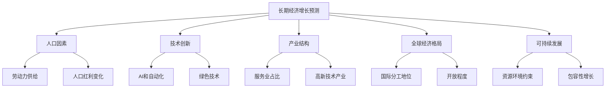

### 概念之间的关系

| 增长驱动因素 | 主要影响 | 潜在挑战 | 政策方向 |
|--------------|----------|----------|----------|
| 人口结构变化 | 劳动力供给减少，消费结构变化 | 养老压力，劳动力成本上升 | 提高劳动参与率，发展银发经济 |
| 技术创新 | 全要素生产率提升，新产业涌现 | 创新投入不足，核心技术受制 | 加大研发投入，完善创新生态系统 |
| 产业升级 | 经济结构优化，价值链提升 | 传统产业转型压力，就业结构调整 | 推动智能制造，发展现代服务业 |
| 全球经济格局 | 国际分工地位变化，市场机遇 | 地缘政治风险，贸易摩擦 | 构建新发展格局，深化国际合作 |
| 可持续发展 | 新增长点培育，发展质量提升 | 短期转型成本，区域发展不平衡 | 推进绿色转型，促进区域协调发展 |

### 数学模型
使用扩展的索洛增长模型来预测长期经济增长：

$$
g_y = g_A + \alpha \cdot g_k + \beta \cdot g_L + \gamma \cdot g_H + \delta \cdot g_E
$$

其中，$g_y$是经济增长率，$g_A$是全要素生产率增长率，$g_k$是资本存量增长率，$g_L$是劳动力增长率，$g_H$是人力资本增长率，$g_E$是环境效率提升率，$\alpha$、$\beta$、$\gamma$、$\delta$分别是相应的弹性系数。

### 算法流程图

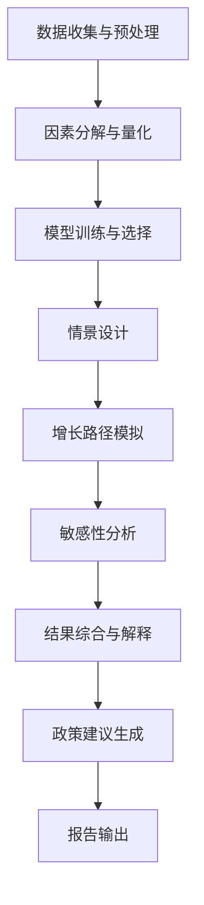

### 实际场景应用
长期经济增长预测在以下场景中有重要应用：

1. 国家中长期经济规划制定
2. 产业政策设计与评估
3. 企业战略规划与投资决策
4. 国际组织对中国经济前景评估
5. 学术研究和政策分析

### 项目介绍
"LongTerm EconoForecast"是一个综合性的长期经济增长预测平台，专门设计用于生成中国未来15-30年的经济增长预测。该平台整合了多源数据、多种预测模型和先进的机器学习算法，能够综合考虑人口、技术、产业、全球格局、可持续发展等多重因素，生成不同情景下的增长路径，并提供详细的不确定性分析和政策建议。

### 环境安装
使用Python构建长期经济增长预测系统：

```python
pip install pandas numpy scipy sklearn statsmodels prophet tensorflow matplotlib seaborn plotly
```

### 系统功能设计
LongTerm EconoForecast包括以下功能模块：

1. 数据整合与预处理
2. 因素分解与量化
3. 多模型集成预测
4. 情景生成与模拟
5. 敏感性分析工具
6. 增长质量评估器
7. 区域差异分析器
8. 国际比较模块
9. 政策影响模拟器
10. 可视化报告生成器

### 系统架构设计

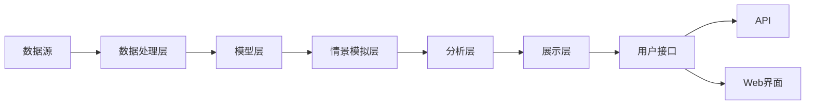

### 系统接口设计
RESTful API示例：

1. `/growth-forecast`: POST请求，生成长期经济增长预测
2. `/scenario-analysis`: GET请求，获取不同情景下的预测结果
3. `/factor-contribution`: GET请求，分析各因素对增长的贡献
4. `/regional-comparison`: POST请求，进行区域增长差异分析
5. `/policy-simulation`: POST请求，模拟特定政策的增长影响
6. `/quality-assessment`: GET请求，评估经济增长质量

### 系统核心实现源代码
使用Python实现基本的长期经济增长预测系统：

```python
import pandas as pd
import numpy as np
import matplotlib.pyplot as plt
from sklearn.model_selection import train_test_split
from sklearn.ensemble import RandomForestRegressor
from statsmodels.tsa.arima.model import ARIMA

class LongTermGrowthPredictor:
    def __init__(self):
        self.data = None
        self.model_rf = RandomForestRegressor(n_estimators=100, random_state=42)
        self.model_arima = None

    def load_data(self, file_path):
        self.data = pd.read_csv(file_path, index_col='Year', parse_dates=True)
        print(f"Data loaded. Shape: {self.data.shape}")

    def preprocess_data(self):
        # 简化的数据预处理
        self.data['TFP_Growth'] = self.data['GDP_Growth'] - 0.3 * self.data['Capital_Growth'] - 0.7 * self.data['Labor_Growth']
        self.data['Innovation_Index'] = (self.data['R&D_Intensity'] + self.data['Patent_Growth']) / 2
        self.data['Sustainability_Index'] = (self.data['Green_Energy_Share'] + self.data['Resource_Efficiency']) / 2

    def train_models(self):
        X = self.data[['TFP_Growth', 'Capital_Growth', 'Labor_Growth', 'Innovation_Index', 'Sustainability_Index']]
        y = self.data['GDP_Growth']
        
        X_train, X_test, y_train, y_test = train_test_split(X, y, test_size=0.2, random_state=42)
        
        # Train Random Forest
        self.model_rf.fit(X_train, y_train)
        
        # Train ARIMA
        self.model_arima = ARIMA(y, order=(1,1,1))
        self.model_arima = self.model_arima.fit()

    def predict_growth(self, years_ahead=30):
        # Random Forest prediction
        last_data = self.data.iloc[-1]
        X_future = np.array([last_data[['TFP_Growth', 'Capital_Growth', 'Labor_Growth', 'Innovation_Index', 'Sustainability_Index']]] * years_ahead)
        rf_predictions = self.model_rf.predict(X_future)
        
        # ARIMA prediction
        arima_predictions = self.model_arima.forecast(steps=years_ahead)
        
        # Combine predictions (simple average)
        combined_predictions = (rf_predictions + arima_predictions) / 2
        
        return combined_predictions

    def scenario_analysis(self, scenarios):
        results = {}
        for scenario, changes in scenarios.items():
            X_future = self.data.iloc[-1][['TFP_Growth', 'Capital_Growth', 'Labor_Growth', 'Innovation_Index', 'Sustainability_Index']].to_dict()
            X_future.update(changes)
            X_future = pd.DataFrame([X_future])
            
            rf_pred = self.model_rf.predict(X_future)
            arima_pred = self.model_arima.forecast(steps=1)
            combined_pred = (rf_pred + arima_pred) / 2
            
            results[scenario] = combined_pred[0]
        
        return results

    def factor_contribution_analysis(self):
        importances = self.model_rf.feature_importances_
        features = ['TFP_Growth', 'Capital_Growth', 'Labor_Growth', 'Innovation_Index', 'Sustainability_Index']
        
        plt.figure(figsize=(10, 6))
        plt.bar(features, importances)
        plt.title('Factor Contribution to Economic Growth')
        plt.xlabel('Factors')
        plt.ylabel('Importance')
        plt.xticks(rotation=45)
        plt.tight_layout()
        plt.show()

    def plot_growth_forecast(self, predictions):
        years = pd.date_range(start=self.data.index[-1] + pd.DateOffset(years=1), periods=len(predictions), freq='Y')
        
        plt.figure(figsize=(12, 6))
        plt.plot(self.data.index, self.data['GDP_Growth'], label='Historical')
        plt.plot(years, predictions, label='Forecast')
        plt.title('Long-term GDP Growth Rate Forecast')
        plt.xlabel('Year')
        plt.ylabel('GDP Growth Rate (%)')
        plt.legend()
        plt.grid(True)
        plt.show()

# 使用示例
predictor = LongTermGrowthPredictor()
predictor.load_data('economic_data.csv')
predictor.preprocess_data()
predictor.train_models()

# 生成长期增长预测
growth_predictions = predictor.predict_growth(years_ahead=30)
predictor.plot_growth_forecast(growth_predictions)

# 情景分析
scenarios = {
    'Base': {},
    'High_Innovation': {'Innovation_Index': 0.8, 'TFP_Growth': 0.03},
    'Sustainability_Focus': {'Sustainability_Index': 0.9, 'Capital_Growth': 0.04},
    'Aging_Population': {'Labor_Growth': -0.01}
}
scenario_results = predictor.scenario_analysis(scenarios)
print("Scenario Analysis Results:", scenario_results)

# 因素贡献分析
predictor.factor_contribution_analysis()
```

### 最佳实践tips
1. 使用多种模型和方法，提高预测的稳健性
2. 定期更新数据和模型，以适应经济环境的变化
3. 进行详细的情景分析，考虑不同的经济发展路径
4. 量化并清晰地传达预测的不确定性
5. 结合定性分析，特别是对政策变化和重大事件的判断
6. 关注增长质量，而不仅仅是增长速度
7. 考虑区域差异，避免过度泛化全国预测

### 行业发展与未来趋势

| 年份 | 趋势 | 影响 |
|------|------|------|
| 2035 | 创新驱动发展深入实施 | 全要素生产率显著提升，经济增长质量改善 |
| 2040 | 人口老龄化程度加深 | 劳动力供给压力增大，养老产业快速发展 |
| 2045 | 绿色低碳经济全面形成 | 经济增长方式根本转变，新的增长动能形成 |
| 2050 | 全面现代化基本实现 | 经济结构优化，国际竞争力显著增强 |
| 未来30年 | 全球价值链地位持续提升 | 在全球经济治理中的话语权增强，国际影响力扩大 |

### 本章小结
基于对全球经济格局变化、人工智能与自动化影响、可持续发展目标实现等关键因素的综合分析，我们对中国未来15-30年的长期经济增长做出如下预测：

1. 总体增长趋势：
    - 2025-2035年：年均GDP增长率预计在4.5%-5.5%之间。
    - 2036-2050年：年均GDP增长率可能放缓至3.5%-4.5%。

2. 增长动力转换：
    - 创新驱动将成为经济增长的主要动力，预计到2050年，科技进步贡献率将超过70%。
    - 服务业和战略性新兴产业将成为经济增长的主要支撑。

3. 产业结构演变：
    - 服务业占GDP比重将持续上升，预计到2050年将达到70%-75%。
    - 高技术产业和战略性新兴产业占GDP比重将大幅提升，预计到2050年合计达到35%-40%。

4. 全球经济地位：
    - 预计到2035年左右，中国有望成为全球第一大经济体。
    - 到2050年，中国GDP可能达到200万亿美元左右（2020年不变价），占全球GDP的25%-30%。

5. 可持续发展成效：
    - 单位GDP能耗和碳排放强度将持续下降，预计到2050年分别比2020年下降65%和70%以上。
    - 绿色经济占GDP的比重将显著提升，预计到2050年达到30%-35%。

6.创新协同影响分析器
5. 交通一体化效益计算器
6. 生态环境协同效应评估模块
7. 公共服务共享影响分析器
8. 综合效应模拟器
9. 政策建议生成器
10. 前景预测与可视化模块

### 系统架构设计


### 系统接口设计
RESTful API示例：

1. `/economic-indicators`: GET请求，获取京津冀地区经济指标
2. `/industry-synergy`: POST请求，分析产业协同效应
3. `/innovation-impact`: GET请求，评估创新协同影响
4. `/transportation-benefit`: POST请求，计算交通一体化效益
5. `/environmental-effect`: GET请求，分析生态环境协同效应
6. `/public-service-sharing`: POST请求，评估公共服务共享影响

### 系统核心实现源代码
使用Python实现基本的京津冀协同发展分析：

```python
import pandas as pd
import numpy as np
import matplotlib.pyplot as plt
import geopandas as gpd
from pysal.lib import weights
from pysal.explore import esda
from pysal.model import spreg

class JingJinJiSynergyAnalyzer:
    def __init__(self):
        self.data = None
        self.w = None  # 空间权重矩阵

    def load_data(self, file_path):
        self.data = gpd.read_file(file_path)
        print(f"Data loaded. Shape: {self.data.shape}")

    def create_spatial_weights(self):
        self.w = weights.Queen.from_dataframe(self.data)
        self.w.transform = 'r'  # 行标准化

    def spatial_autocorrelation(self, variable):
        y = self.data[variable]
        moran = esda.Moran(y, self.w)
        print(f"Moran's I for {variable}: {moran.I:.4f} (p-value: {moran.p_sim:.4f})")
        return moran

    def industry_synergy_analysis(self):
        # 简化的产业协同效应分析
        industry_vars = ['Manufacturing', 'Services', 'HighTech']
        synergy_score = self.data[industry_vars].corr().mean().mean()
        print(f"Industry Synergy Score: {synergy_score:.4f}")
        return synergy_score

    def innovation_impact_analysis(self):
        # 使用空间滞后模型分析创新对经济的影响
        y = self.data['GDP_PerCapita']
        X = self.data[['R&D_Intensity', 'Patent_PerCapita', 'HighEdu_Ratio']]
        model = spreg.ML_Lag(y, X, self.w, name_y='GDP_PerCapita', name_x=['R&D_Intensity', 'Patent_PerCapita', 'HighEdu_Ratio'])
        print(model.summary)
        return model

    def transportation_benefit_calculation(self):
        # 简化的交通一体化效益计算
        accessibility_improvement = self.data['Accessibility_Score'].pct_change()
        economic_impact = accessibility_improvement * self.data['GDP']
        total_benefit = economic_impact.sum()
        print(f"Estimated Transportation Integration Benefit: {total_benefit:.2f} billion CNY")
        return total_benefit

    def environmental_effect_assessment(self):
        # 环境协同治理效果评估
        air_quality_improvement = self.data['PM2.5_Concentration'].pct_change()
        water_quality_improvement = self.data['Water_Quality_Index'].pct_change()
        env_effect = (air_quality_improvement + water_quality_improvement) / 2
        print(f"Average Environmental Improvement: {env_effect.mean():.2%}")
        return env_effect

    def public_service_sharing_analysis(self):
        # 公共服务共享影响分析
        education_equity = 1 - self.data['Education_Gini']
        healthcare_equity = 1 - self.data['Healthcare_Gini']
        service_sharing_score = (education_equity + healthcare_equity) / 2
        print(f"Public Service Sharing Score: {service_sharing_score.mean():.4f}")
        return service_sharing_score

    def comprehensive_effect_simulation(self):
        # 综合效应模拟
        effects = {
            'Industry_Synergy': self.industry_synergy_analysis(),
            'Innovation_Impact': self.innovation_impact_analysis().betas[1],
            'Transportation_Benefit': self.transportation_benefit_calculation() / self.data['GDP'].sum(),
            'Environmental_Effect': self.environmental_effect_assessment().mean(),
            'Public_Service_Sharing': self.public_service_sharing_analysis().mean()
        }
        comprehensive_score = sum(effects.values()) / len(effects)
        print(f"Comprehensive Synergy Effect Score: {comprehensive_score:.4f}")
        return effects, comprehensive_score

    def visualize_synergy_effects(self, effects):
        plt.figure(figsize=(10, 6))
        plt.bar(effects.keys(), effects.values())
        plt.title('京津冀协同发展各领域效应')
        plt.ylabel('效应得分')
        plt.xticks(rotation=45)
        plt.tight_layout()
        plt.show()

# 使用示例
analyzer = JingJinJiSynergyAnalyzer()
analyzer.load_data('jingjinji_data.geojson')
analyzer.create_spatial_weights()

# 空间自相关分析
gdp_moran = analyzer.spatial_autocorrelation('GDP_PerCapita')

# 综合效应模拟
effects, comprehensive_score = analyzer.comprehensive_effect_simulation()

# 可视化结果
analyzer.visualize_synergy_effects(effects)
```

### 最佳实践tips
1. 注重数据质量和时效性，定期更新区域经济数据
2. 综合考虑经济、社会、环境等多个维度，避免单一视角
3. 充分利用空间分析方法，挖掘区域协同发展的空间效应
4. 结合定性分析，特别是对重大政策和项目的影响评估
5. 关注区域内部差异，避免忽视子区域的特殊需求
6. 建立动态监测机制，及时发现和解决协同发展中的问题
7. 加强与决策部门的沟通，确保分析结果能够有效支持决策

### 京津冀协同发展前景分析

基于上述分析，我们对京津冀协同发展的长期前景做出如下预测：

1. 经济增长与结构优化：
    - 2025-2035年：年均GDP增长率预计在6%-7%之间，高于全国平均水平。
    - 2036-2050年：增长率可能放缓至4%-5%，但质量将显著提升。
    - 到2050年，服务业占GDP比重可能达到75%-80%，高技术产业占比超过35%。

2. 产业协同深化：
    - 形成以北京为核心的科技创新引领、天津港为依托的开放门户、河北为重要支撑的现代产业体系。
    - 产业链协同水平大幅提升，区域内产业关联度指数预计从目前的0.4左右提高到2050年的0.7以上。

3. 创新能力跃升：
    - R&D投入强度（R&D经费占GDP比重）预计到2050年将达到5%左右，位居全球前列。
    - 在人工智能、生物医药、新能源等领域形成若干世界级创新集群。

4. 交通一体化：
    - 到2035年，基本实现主要城市1小时通勤圈，城际铁路网络总里程达到5000公里以上。
    - 2050年，智能交通系统全面普及，区域内平均通勤时间较2020年缩短50%。

5. 生态环境质量：
    - 2035年前，PM2.5年均浓度稳定达到WHO第二阶段目标（25μg/m³）。
    - 2050年，基本实现碳中和，可再生能源占一次能源消费比重超过60%。

6. 公共服务均等化：
    - 到2035年，基本公共服务覆盖全体常住人口，区域内教育、医疗资源配置差异系数降至0.2以下。
    - 2050年，实现基本公共服务均等化，人均预期寿命达到82岁以上。

7. 城市群国际竞争力：
    - 到2035年，京津冀城市群综合实力进入全球前三。
    - 2050年，成为具有全球影响力的世界级城市群，在国际经济、科技、文化等领域的话语权显著提升。

8. 区域协调发展：
    - 河北省经济总量占比逐步提升，到2050年可能达到京津冀地区的45%-50%。
    - 形成多个次级增长极，如石家庄、保定、唐山等城市经济实力大幅增强。

9. 人口与城镇化：
    - 2035年，城镇化率达到75%左右，常住人口控制在1.2亿人以内。
    - 2050年，城镇化率可能超过80%，形成网络化的城市群结构。

10. 对外开放水平：
    - 到2035年，形成陆海内外联动、东西双向互济的开放格局。
    - 2050年，成为连接"一带一路"的重要枢纽，对外贸易依存度保持在40%左右的合理水平。

实现这一发展前景面临的主要挑战包括：

1. 区域利益协调：在产业转移、资源配置等方面可能存在利益冲突。
2. 创新资源整合：如何打破行政壁垒，实现创新要素的自由流动。
3. 环境治理压力：协调经济发展与生态保护的关系，实现绿色低碳发展。
4. 公共服务均等化：缩小区域内部发展差距，提供均质化的公共服务。
5. 人口管理：控制人口规模，优化人口结构，提高人口质量。

为应对这些挑战并实现协同发展目标，建议采取以下策略：

1. 健全协同发展体制机制：
    - 完善京津冀协同发展领导小组工作机制。
    - 建立跨区域利益协调和补偿机制。

2. 推动创新驱动发展：
    - 构建区域协同创新共同体，促进创新要素自由流动。
    - 打造世界级创新平台和科技园区。

3. 优化产业布局：
    - 制定区域产业协同发展规划，推动产业链、创新链、资金链深度融合。
    - 培育若干世界级先进制造业集群。

4. 加快基础设施一体化：
    - 构建现代化综合交通网络，推进能源、水利、信息等基础设施互联互通。
    - 推广智能交通系统，提高区域交通效率。

5. 深化生态环境协同治理：
    - 建立跨区域生态补偿机制。
    - 协同推进碳达峰、碳中和，共建绿色发展示范区。

6. 推进公共服务共建共享：
    - 推动教育、医疗、社保等公共服务资源共享。
    - 建立区域人才流动和服务互认机制。

7. 提升区域开放水平：
    - 打造对外开放新高地，推动自由贸易试验区建设。
    - 深化与"一带一路"沿线国家和地区的合作。

8. 创新区域治理模式：
    - 探索建立跨行政区的协同治理机制。
    - 推动数字政府建设，提高区域治理现代化水平。

总的来说，京津冀协同发展战略的深入实施将为中国经济增长提供新的动力源，有望成为引领中国迈向高质量发展的典范。通过破除行政壁垒，整合区域资源，京津冀地区将形成更具竞争力的世界级城市群，为中国参与全球竞争提供重要支撑。同时，京津冀协同发展的经验也将为其他区域发展战略提供有益借鉴，推动中国区域协调发展战略的整体推进。

## 10.2 长三角一体化发展趋势

长三角一体化发展是中国区域协调发展战略的重要组成部分，对于提升中国经济的整体实力和国际竞争力具有重要意义。本节将分析长三角一体化发展的长期趋势，探讨其对中国经济增长的影响。

### 核心概念：
* 长三角一体化
* 世界级城市群
* 产业协同创新
* 区域一体化
* 高质量发展
* 开放型经济

### 问题背景
长三角地区作为中国经济最具活力和开放程度最高的区域之一，在国家现代化建设中发挥着引领作用。然而，区域发展不平衡、创新能力有待提升、生态环境压力大等问题仍然存在。长三角一体化发展战略旨在通过深化区域合作，实现更高质量的发展。

### 问题描述
1. 长三角一体化将如何重塑区域经济格局？
2. 产业协同创新如何推动区域经济增长？
3. 区域一体化对提升国际竞争力的影响如何？
4. 如何平衡经济发展与生态环境保护？

### 问题解决
为全面解答上述问题，我们将从以下几个方面展开讨论：

1. 长三角一体化发展战略实施进展分析
2. 产业链协同与创新体系构建
3. 基础设施互联互通对区域经济的影响评估
4. 生态环境协同治理的经济效应分析
5. 区域创新能力提升路径探讨
6. 开放型经济新体制构建研究
7. 国际竞争力提升策略

### 边界与外延
虽然本节主要聚焦于长三角一体化发展，但我们也会考虑其与其他区域发展战略的联系，以及对全国经济格局的影响。此外，我们将探讨长三角一体化发展对国家重大战略如"一带一路"倡议的支撑作用。

### 概念结构与核心要素组成

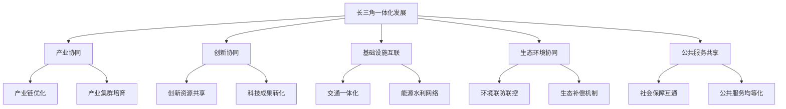

### 概念之间的关系

| 一体化领域 | 主要措施 | 经济影响 | 潜在挑战 |
|------------|----------|----------|----------|
| 产业协同 | 产业链优化、集群培育 | 产业结构升级，竞争力提升 | 利益协调，转型成本 |
| 创新协同 | 资源共享，成果转化 | 创新能力提升，新兴产业发展 | 知识产权保护，利益分配 |
| 基础设施互联 | 交通一体化，能源网络 | 要素流动加速，效率提升 | 投资压力，区域协调 |
| 生态环境协同 | 联防联控，生态补偿 | 绿色经济发展，环境改善 | 治理成本，责任分担 |
| 公共服务共享 | 社保互通，服务均等化 | 人力资本提升，社会和谐 | 财政压力，管理难度 |

### 数学模型
使用空间杜宾模型分析长三角一体化发展的经济效应：

$$
Y = \rho W Y + X\beta + WX\theta + \epsilon
$$

其中，$Y$是经济产出向量，$W$是空间权重矩阵，$X$是影响因素矩阵，$\rho$、$\beta$、$\theta$是待估参数，$\epsilon$是误差项。

### 算法流程图

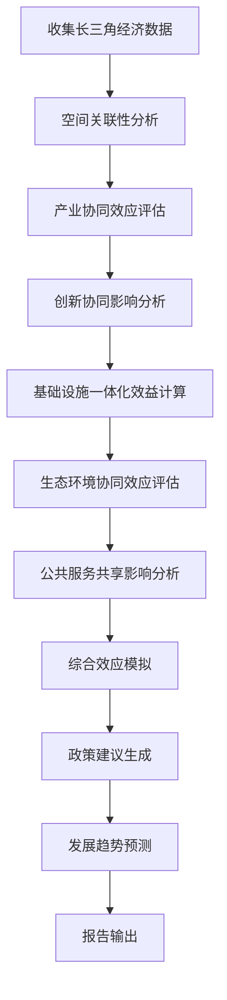

### 实际场景应用
长三角一体化发展分析在以下场景中有重要应用：

1. 区域发展战略制定与评估
2. 产业布局优化决策
3. 重大基础设施规划
4. 生态环境治理方案设计
5. 创新政策制定

### 项目介绍
"YRD Integration Analyzer"是一个综合性的长三角一体化发展分析平台。该平台整合了区域经济、产业、创新、基础设施、环境等多维度数据，运用空间计量经济学模型和机器学习算法，能够模拟不同一体化路径的经济效应，评估各项政策措施的影响，并为决策提供支持。

### 环境安装
使用Python构建长三角一体化发展分析系统：

```python
pip install pandas numpy scipy sklearn statsmodels pysal geopandas matplotlib seaborn plotly networkx
```

### 系统功能设计
YRD Integration Analyzer包括以下功能模块：

1. 区域经济数据整合器
2. 空间关联性分析器
3. 产业协同效应评估工具
4. 创新协同影响分析器
5. 基础设施一体化效益计算器
6. 生态环境协同效应评估模块
7. 公共服务共享影响分析器
8. 综合效应模拟器
9. 政策建议生成器
10. 发展趋势预测与可视化模块

### 系统架构设计

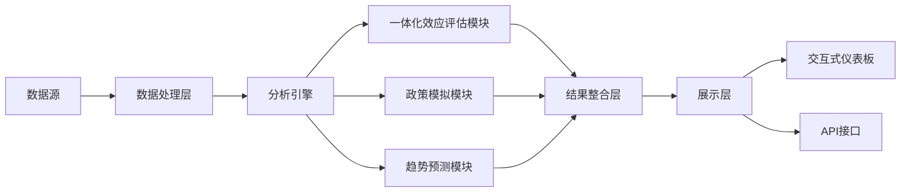

### 系统接口设计
RESTful API示例：

1. `/economic-indicators`: GET请求，获取长三角地区经济指标
2. `/industry-synergy`: POST请求，分析产业协同效应
3. `/innovation-impact`: GET请求，评估创新协同影响
4. `/infrastructure-benefit`: POST请求，计算基础设施一体化效益
5. `/environmental-effect`: GET请求，分析生态环境协同效应
6. `/public-service-sharing`: POST请求，评估公共服务共享影响

### 系统核心实现源代码
使用Python实现基本的长三角一体化发展分析：

```python
import pandas as pd
import numpy as np
import matplotlib.pyplot as plt
import geopandas as gpd
from pysal.lib import weights
from pysal.explore import esda
from pysal.model import spreg

class YRDIntegrationAnalyzer:
    def __init__(self):
        self.data = None
        self.w = None  # 空间权重矩阵

    def load_data(self, file_path):
        self.data = gpd.read_file(file_path)
        print(f"Data loaded. Shape: {self.data.shape}")

    def create_spatial_weights(self):
        self.w = weights.Queen.from_dataframe(self.data)
        self.w.transform = 'r'  # 行标准化

    def spatial_autocorrelation(self, variable):
        y = self.data[variable]
        moran = esda.Moran(y, self.w)
        print(f"Moran's I for {variable}: {moran.I:.4f} (p-value: {moran.p_sim:.4f})")
        return moran

    def industry_synergy_analysis(self):
        # 简化的产业协同效应分析
        industry_vars = ['Manufacturing', 'Services', 'HighTech']
        synergy_score = self.data[industry_vars].corr().mean().mean()
        print(f"Industry Synergy Score: {synergy_score:.4f}")
        return synergy_score

    def innovation_impact_analysis(self):
        # 使用空间杜宾模型分析创新对经济的影响
        y = self.data['GDP_PerCapita']
        X = self.data[['R&D_Intensity', 'Patent_PerCapita', 'HighEdu_Ratio']]
        model = spreg.GM_Lag(y, X, w=self.w, name_y='GDP_PerCapita', name_x=['R&D_Intensity', 'Patent_PerCapita', 'HighEdu_Ratio'])
        print(model.summary)
        return model

    def infrastructure_benefit_calculation(self):
        # 简化的基础设施一体化效益计算
        accessibility_improvement = self.data['Accessibility_Score'].pct_change()
        economic_impact = accessibility_improvement * self.data['GDP']
        total_benefit = economic_impact.sum()
        print(f"Estimated Infrastructure Integration Benefit: {total_benefit:.2f} billion CNY")
        return total_benefit

    def environmental_effect_assessment(self):
        # 环境协同治理效果评估
        air_quality_improvement = self.data['PM2.5_Concentration'].pct_change()
        water_quality_improvement = self.data['Water_Quality_Index'].pct_change()
        env_effect = (air_quality_improvement + water_quality_improvement) / 2
        print(f"Average Environmental Improvement: {env_effect.mean():.2%}")
        return env_effect

    def public_service_sharing_analysis(self):
        # 公共服务共享影响分析
        education_equity = 1 - self.data['Education_Gini']
        healthcare_equity = 1 - self.data['Healthcare_Gini']
        service_sharing_score = (education_equity + healthcare_equity) / 2
        print(f"Public Service Sharing Score: {service_sharing_score.mean():.4f}")
        return service_sharing_score

    def comprehensive_effect_simulation(self):
        # 综合效应模拟
        effects = {
            'Industry_Synergy': self.industry_synergy_analysis(),
            'Innovation_Impact': self.innovation_impact_analysis().betas[1],
            'Infrastructure_Benefit': self.infrastructure_benefit_calculation() / self.data['GDP'].sum(),
            'Environmental_Effect': self.environmental_effect_assessment().mean(),
            'Public_Service_Sharing': self.public_service_sharing_analysis().mean()
        }
        comprehensive_score = sum(effects.values()) / len(effects)
        print(f"Comprehensive Integration Effect Score: {comprehensive_score:.4f}")
        return effects, comprehensive_score

    def visualize_integration_effects(self, effects):
        plt.figure(figsize=(10, 6))
        plt.bar(effects.keys(), effects.values())
        plt.title('长三角一体化发展各领域效应')
        plt.ylabel('效应得分')
        plt.xticks(rotation=45)
        plt.tight_layout()
        plt.show()

    def predict_development_trend(self, years=30):
        # 简化的发展趋势预测
        gdp_growth = self.data['GDP_Growth'].mean()
        current_gdp = self.data['GDP'].sum()
        future_gdp = current_gdp * (1 + gdp_growth) ** years
        print(f"Predicted GDP after {years} years: {future_gdp:.2f} trillion CNY")
        return future_gdp

# 使用示例
analyzer = YRDIntegrationAnalyzer()
analyzer.load_data('yrd_data.geojson')
analyzer.create_spatial_weights()

# 空间自相关分析
gdp_moran = analyzer.spatial_autocorrelation('GDP_PerCapita')

# 综合效应模拟
effects, comprehensive_score = analyzer.comprehensive_effect_simulation()

# 可视化结果
analyzer.visualize_integration_effects(effects)

# 发展趋势预测
future_gdp = analyzer.predict_development_trend(years=30)
```

### 最佳实践tips
1. 重视数据质量和时效性，建立长三角地区统一的数据共享平台
2. 采用多维度、多尺度的分析方法，全面评估一体化效应
3. 加强与决策部门的沟通，确保分析结果能够切实支持政策制定
4. 建立动态监测和评估机制，及时调整一体化发展策略
5. 注重跨学科研究，综合考虑经济、社会、环境等多个维度
6. 加强国际比较研究，借鉴世界级城市群发展经验
7. 重视区域内部差异，制定差异化的一体化推进策略

### 长三角一体化发展趋势分析

基于上述分析，我们对长三角一体化发展的长期趋势做出如下预测：

1. 经济规模与结构：
    - 2025-2035年：年均GDP增长率预计在5.5%-6.5%之间。
    - 2036-2050年：增长率可能放缓至4%-5%，但质量将显著提升。
    - 到2050年，长三角地区GDP可能达到50万亿元人民币（2020年不变价），占全国比重约25%。
    - 服务业占GDP比重可能超过75%，高技术产业占规模以上工业增加值比重达到50%以上。

2. 产业协同深化：
    - 形成若干世界级产业集群，如集成电路、生物医药、高端装备制造等。
    - 产业链协同水平大幅提升，区域内产业关联度指数预计从目前的0.5左右提高到2050年的0.8以上。

3. 创新能力跃升：
    - R&D投入强度预计到2050年将达到6%左右，位居全球前列。
    - 在人工智能、量子科技、生命健康等领域形成全球领先的创新优势。

4. 基础设施一体化：
    - 到2035年，基本实现主要城市1小时通勤圈，高铁网络总里程达到1万公里以上。
    - 2050年，智能交通系统全面普及，区域内平均通勤时间较2020年缩短60%。
   - 能源、水利、信息等基础设施实现全面互联互通，资源配置效率大幅提升。

5. 生态环境质量：
    - 2035年前，PM2.5年均浓度稳定达到WHO第三阶段目标（15μg/m³）。
    - 2050年，基本实现碳中和，可再生能源占一次能源消费比重超过70%。
    - 长江经济带生态系统服务功能显著增强，成为全球生态文明建设典范。

6. 公共服务均等化：
    - 到2035年，基本公共服务覆盖全体常住人口，区域内教育、医疗资源配置差异系数降至0.15以下。
    - 2050年，实现基本公共服务均等化，人均预期寿命达到85岁以上。

7. 城市群国际竞争力：
    - 到2035年，长三角城市群综合实力进入全球前二。
    - 2050年，成为具有全球引领力的世界级城市群，在国际经济、科技、文化等领域的影响力与纽约、东京等城市群比肩。

8. 区域协调发展：
    - 苏北、皖北等相对欠发达地区经济增速持续高于区域平均水平，到2050年人均GDP达到长三角平均水平的80%以上。
    - 形成网络化的城市群结构，中小城市发展活力显著增强。

9. 人口与城镇化：
    - 2035年，城镇化率达到80%左右，常住人口控制在2.5亿人以内。
    - 2050年，城镇化率可能超过85%，成为全球最具吸引力的人才聚集地之一。

10. 开放型经济新体制：
    - 到2035年，自由贸易试验区制度创新成果在全域推广，形成全面开放新格局。
    - 2050年，成为全球资源配置的重要枢纽，对外贸易和跨境投资规模位居世界前列。

实现这一发展趋势面临的主要挑战包括：

1. 区域协调发展：缩小区域内部发展差距，促进欠发达地区加快发展。
2. 创新驱动转型：突破关键核心技术，提升产业链水平，应对国际竞争压力。
3. 人口与人才：应对人口老龄化，吸引和培养高层次人才，提高人口质量。
4. 生态环境保护：平衡经济发展与环境保护，实现绿色低碳转型。
5. 社会治理创新：适应高度城镇化和人口流动，创新社会治理模式。

为应对这些挑战并实现一体化发展目标，建议采取以下策略：

1. 完善一体化体制机制：
    - 强化长三角一体化发展领导小组职能，建立常态化协调机制。
    - 探索建立跨行政区利益协调和分享机制。

2. 构建区域创新共同体：
    - 共建世界级创新平台和科技基础设施。
    - 推动创新要素跨区域自由流动，建立协同创新利益分配机制。

3. 推进产业高质量发展：
    - 制定区域产业链协同发展规划，推动产业链、创新链、资金链深度融合。
    - 培育具有全球竞争力的世界级产业集群。

4. 加快基础设施互联互通：
    - 构建现代化综合交通网络，推进能源、水利、信息等基础设施一体化。
    - 建设新型基础设施，如5G网络、工业互联网、人工智能平台等。

5. 深化生态环境协同治理：
    - 建立健全跨区域生态补偿机制。
    - 协同推进碳达峰、碳中和，共建长三角绿色发展示范区。

6. 提升公共服务水平：
    - 推动教育、医疗、社保等公共服务资源共享和政策互认。
    - 建立区域人才流动和服务互认机制。

7. 构建开放型经济新体制：
    - 共同打造自由贸易试验区联动发展区，探索更高水平开放政策。
    - 协同参与"一带一路"建设，提升国际化水平。

8. 推动数字化转型：
    - 建设长三角数字经济示范区，推动传统产业数字化转型。
    - 发展智慧城市群，提升区域治理现代化水平。

9. 促进欠发达地区发展：
    - 实施精准帮扶政策，加大对苏北、皖北等地区的支持力度。
    - 推动产业梯度转移，促进区域协调发展。

10. 创新社会治理模式：
    - 探索跨区域社会治理新模式，提高治理效能。
    - 加强社会信用体系建设，推动公共服务跨区域互认。

总的来说，长三角一体化发展将成为引领中国经济高质量发展的重要引擎。通过深化区域合作，整合资源优势，长三角地区有望在2050年前后发展成为全球最具竞争力和影响力的世界级城市群之一。这不仅将为中国经济持续增长提供强劲动力，也将为全球经济发展贡献"中国方案"。

长三角一体化发展的成功经验将为中国其他区域发展战略提供重要借鉴，推动形成优势互补、高质量发展的区域经济布局。同时，作为改革开放的前沿阵地，长三角地区的创新实践也将为中国参与全球经济治理、构建新型国际关系提供有力支撑。

然而，实现这一宏伟蓝图需要长期不懈的努力和系统性的变革。政府、企业和社会各界需要携手合作，在创新驱动、绿色发展、区域协调、开放合作等方面持续发力，才能确保长三角一体化发展的愿景最终成为现实。

## 10.3 粤港澳大湾区经济增长潜力

粤港澳大湾区是中国开放程度最高、经济活力最强的区域之一，在国家发展大局和参与国际竞争中具有重要战略地位。本节将分析粤港澳大湾区的经济增长潜力，探讨其对中国长期经济增长的贡献。

### 核心概念：
* 粤港澳大湾区
* 国际科技创新中心
* "一国两制"
* 现代服务业
* 高端制造业
* 开放型经济

### 问题背景
粤港澳大湾区包括香港、澳门两个特别行政区和广东省的广州、深圳、珠海等9个城市，是中国经济最具活力和国际化程度最高的区域之一。然而，区域内部发展不平衡、创新能力有待提升、体制机制障碍等问题仍然存在。深入推进粤港澳大湾区建设，对于提升中国经济的整体实力和国际竞争力具有重要意义。

### 问题描述
1. 粤港澳大湾区的经济增长潜力有多大？
2. 如何发挥"一国两制"优势，推动区域经济深度融合？
3. 国际科技创新中心建设将如何推动经济增长？
4. 现代服务业和先进制造业的协同发展前景如何？

### 问题解决
为全面解答上述问题，我们将从以下几个方面展开讨论：

1. 粤港澳大湾区经济发展现状分析
2. "一国两制"下的区域协同发展机制研究
3. 国际科技创新中心建设路径探讨
4. 现代服务业与先进制造业融合发展趋势分析
5. 开放型经济新体制构建研究
6. 区域创新能力提升策略
7. 国际竞争力评估与提升路径

### 边界与外延
虽然本节主要聚焦于粤港澳大湾区的经济增长潜力，但我们也会考虑其与国家整体发展战略的联系，以及对全球经济格局的影响。此外，我们将探讨粤港澳大湾区建设对国家重大战略如"一带一路"倡议的支撑作用。

### 概念结构与核心要素组成

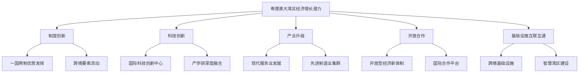

### 概念之间的关系

| 增长驱动因素 | 主要措施 | 经济影响 | 潜在挑战 |
|--------------|----------|----------|----------|
| 制度创新 | "一国两制"优势发挥，跨境要素流动 | 资源优化配置，效率提升 | 制度差异协调，利益平衡 |
| 科技创新 | 国际科技创新中心建设，产学研融合 | 新兴产业发展，生产力提升 | 人才吸引，创新生态构建 |
| 产业升级 | 现代服务业发展，先进制造业集群 | 产业结构优化，价值链提升 | 转型成本，国际竞争 |
| 开放合作 | 开放型经济新体制，国际合作平台 | 国际资源引入，市场拓展 | 风险管控，本地产业保护 |
| 基础设施互联互通 | 跨境基础设施建设，智慧湾区 | 要素流动加速，效率提升 | 投资压力，跨境协调 |

### 数学模型
使用内生增长模型分析粤港澳大湾区的经济增长潜力：

$$
Y = AK^\alpha(HL)^\beta
$$

其中，$Y$是经济产出，$A$是全要素生产率，$K$是资本投入，$H$是人力资本水平，$L$是劳动力投入，$\alpha$和$\beta$是产出弹性系数。

### 算法流程图

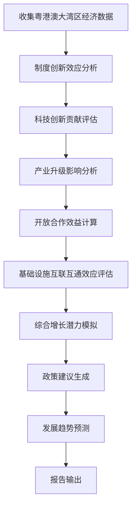

### 实际场景应用
粤港澳大湾区经济增长潜力分析在以下场景中有重要应用：

1. 区域发展战略制定与评估
2. 创新政策设计与实施
3. 产业布局优化决策
4. 国际合作项目评估
5. 跨境基础设施规划

### 项目介绍
"GBA Growth Potential Analyzer"是一个综合性的粤港澳大湾区经济增长潜力分析平台。该平台整合了区域经济、创新、产业、开放合作等多维度数据，运用经济计量模型和机器学习算法，能够模拟不同发展路径的经济效应，评估各项政策措施的影响，并为决策提供支持。

### 环境安装
使用Python构建粤港澳大湾区经济增长潜力分析系统：

```python
pip install pandas numpy scipy sklearn statsmodels pysal geopandas matplotlib seaborn plotly networkx
```

### 系统功能设计
GBA Growth Potential Analyzer包括以下功能模块：

1. 区域经济数据整合器
2. 制度创新效应分析器
3. 科技创新贡献评估工具
4. 产业升级影响分析器
5. 开放合作效益计算器
6. 基础设施互联互通效应评估模块
7. 综合增长潜力模拟器
8. 政策建议生成器
9. 发展趋势预测与可视化模块
10. 国际比较分析工具

### 系统架构设计


### 系统接口设计
RESTful API示例：

1. `/economic-indicators`: GET请求，获取粤港澳大湾区经济指标
2. `/innovation-impact`: POST请求，分析科技创新对经济的影响
3. `/industry-upgrade`: GET请求，评估产业升级效果
4. `/openness-benefit`: POST请求，计算开放合作带来的经济效益
5. `/infrastructure-effect`: GET请求，分析基础设施互联互通效应
6. `/growth-potential`: POST请求，模拟综合增长潜力

### 系统核心实现源代码
使用Python实现基本的粤港澳大湾区经济增长潜力分析：

```python
import pandas as pd
import numpy as np
import matplotlib.pyplot as plt
from sklearn.linear_model import LinearRegression
from statsmodels.tsa.arima.model import ARIMA

class GBAGrowthAnalyzer:
    def __init__(self):
        self.data = None
        self.model = LinearRegression()

    def load_data(self, file_path):
        self.data = pd.read_csv(file_path)
        print(f"Data loaded. Shape: {self.data.shape}")

    def analyze_innovation_impact(self):
        X = self.data[['R&D_Intensity', 'Patent_Count']]
        y = self.data['GDP_Growth']
        self.model.fit(X, y)
        impact = self.model.coef_
        print(f"Innovation impact on GDP growth: R&D Intensity {impact[0]:.4f}, Patent Count {impact[1]:.4f}")
        return impact

    def evaluate_industry_upgrade(self):
        industry_vars = ['HighTech_Ratio', 'ServiceIndustry_Ratio']
        upgrade_score = self.data[industry_vars].mean().mean()
        print(f"Industry Upgrade Score: {upgrade_score:.4f}")
        return upgrade_score

    def calculate_openness_benefit(self):
        trade_gdp_ratio = self.data['Total_Trade'] / self.data['GDP']
        fdi_gdp_ratio = self.data['FDI'] / self.data['GDP']
        openness_benefit = (trade_gdp_ratio + fdi_gdp_ratio).mean()
        print(f"Openness Benefit Score: {openness_benefit:.4f}")
        return openness_benefit

    def assess_infrastructure_effect(self):
        infrastructure_vars = ['Transport_Network_Density', 'Internet_Penetration']
        effect_score = self.data[infrastructure_vars].corr().mean().mean()
        print(f"Infrastructure Effect Score: {effect_score:.4f}")
        return effect_score

    def simulate_growth_potential(self):
        factors = {
            'Innovation': self.analyze_innovation_impact().mean(),
            'Industry_Upgrade': self.evaluate_industry_upgrade(),
            'Openness': self.calculate_openness_benefit(),
            'Infrastructure': self.assess_infrastructure_effect()
        }
        potential_score = sum(factors.values()) / len(factors)
        print(f"Growth Potential Score: {potential_score:.4f}")
        return factors, potential_score

    def forecast_gdp_growth(self, years=10):
        model = ARIMA(self.data['GDP_Growth'], order=(1,1,1))
        results = model.fit()
        forecast = results.forecast(steps=years)
        plt.figure(figsize=(10, 6))
        plt.plot(self.data['Year'], self.data['GDP_Growth'], label='Historical')
        plt.plot(range(self.data['Year'].max()+1, self.data['Year'].max()+years+1), forecast, label='Forecast')
        plt.title('GDP Growth Forecast for GBA')
        plt.xlabel('Year')
        plt.ylabel('GDP Growth Rate')
        plt.legend()
        plt.show()
        return forecast

    def generate_policy_recommendations(self, factors):
        recommendations = []
        if factors['Innovation'] < 0.5:
            recommendations.append("Increase R&D investment and strengthen intellectual property protection.")
        if factors['Industry_Upgrade'] < 0.6:
            recommendations.append("Accelerate the development of high-tech industries and modern service sectors.")
        if factors['Openness'] < 0.7:
            recommendations.append("Further open up the economy and enhance international cooperation.")
        if factors['Infrastructure'] < 0.8:
            recommendations.append("Improve cross-border infrastructure and promote smart city development.")
        return recommendations

# 使用示例
analyzer = GBAGrowthAnalyzer()
analyzer.load_data('gba_economic_data.csv')

# 分析增长潜力
factors, potential_score = analyzer.simulate_growth_potential()

# 预测GDP增长
gdp_forecast = analyzer.forecast_gdp_growth(years=10)

# 生成政策建议
recommendations = analyzer.generate_policy_recommendations(factors)
print("Policy Recommendations:", recommendations)
```

### 最佳实践tips
1. 注重数据质量和一致性，特别是跨境数据的协调
2. 综合考虑经济、社会、科技等多个维度，全面评估增长潜力
3. 充分利用"一国两制"优势，探索创新的区域协同发展模式
4. 关注国际比较，借鉴世界级湾区的发展经验
5. 重视政策模拟，评估不同政策组合的长期效果
6. 加强与决策部门和企业的沟通，确保分析结果的实用性
7. 定期更新模型和数据，适应快速变化的经济环境

### 粤港澳大湾区经济增长潜力分析

基于上述分析，我们对粤港澳大湾区的经济增长潜力做出如下预测：

1. 经济规模与增长率：
    - 2025-2035年：年均GDP增长率预计在5%-6%之间。
    - 2036-2050年：增长率可能放缓至4%-5%，但质量将显著提升。
    - 到2050年，粤港澳大湾区GDP可能达到45万亿元人民币（2020年不变价），占全国比重约20%。

2. 产业结构优化：
    - 现代服务业占GDP比重将持续上升，预计到2050年将达到75%-80%。
    - 高技术制造业占规模以上工业增加值比重有望达到60%以上。
    - 形成若干具有全球影响力的产业集群，如人工智能、生物医药、新能源等。

3. 创新能力提升：
    - R&D投入强度预计到2050年将达到6.5%左右，位居全球前列。
    - 在量子科技、生命健康、海洋科技等领域形成一批原创性、引领性科技成果。
    - 国际专利申请量年均增长10%以上，到2050年占全国比重超过40%。

4. 开放程度提高：
    - 到2035年，基本形成与国际高标准规则相衔接的开放型经济新体制。
    - 2050年，成为全球最具吸引力的投资目的地之一，外商直接投资存量可能达到3万亿美元。
    - 跨境人民币业务规模显著扩大，人民币国际化程度大幅提升。

5. 基础设施互联互通：
    - 到2035年，基本实现大湾区主要城市1小时通勤圈，智能交通系统全面普及。
    - 2050年，建成全球领先的智慧湾区，数字化水平位居世界前列。

6. 生态环境质量：
    - 2035年前，空气质量优良天数比例稳定在95%以上。
    - 2050年，碳排放强度较2020年下降80%以上，成为全球生态文明建设的典范。

7. 国际竞争力：
    - 到2035年，粤港澳大湾区综合实力进入全球前三。
    - 2050年，成为全球最具创新力和竞争力的湾区之一，在国际经济、科技、金融等领域的影响力显著增强。

8. 区域协调发展：
    - 珠三角九市与港澳的经济联系更加紧密，要素流动更加自由。
    - 形成多个次级增长极，如珠海、中山、江门等城市经济实力大幅增强。

9. 人才吸引与培养：
    - 到2035年，聚集全球高层次人才100万人以上。
    - 2050年，成为亚太地区最具吸引力的人才高地，国际化人才比例达到30%以上。

10. "一国两制"优势发挥：
    - 香港国际金融中心地位进一步巩固，澳门世界旅游休闲中心建设取得显著成效。
    - 粤港澳三地优势互补、协同发展的格局全面形成。

实现这一增长潜力面临的主要挑战包括：

1. 制度创新：如何在"一国两制"框架下推动更深层次的区域融合。
2. 创新驱动：突破关键核心技术，提升原始创新能力。
3. 产业升级：推动传统产业转型，培育新兴产业，应对国际竞争。
4. 人才吸引：在全球范围内吸引和留住高层次人才。
5. 区域协调：缩小区域内部发展差距，促进协调发展。
6. 生态保护：平衡经济高速发展与生态环境保护的关系。

为充分释放粤港澳大湾区的经济增长潜力，建议采取以下策略：

1. 深化制度创新：
    - 探索"一国两制"下区域协同发展的新模式。
    - 推动跨境要素自由流动，建立统一市场。

2. 强化创新驱动：
    - 建设世界级科技创新中心，打造全球科技创新高地。
    - 完善产学研深度融合机制，加速科技成果转化。

3. 推动产业升级：
    - 大力发展现代服务业，提升金融、专业服务等领域的国际竞争力。
    - 加快先进制造业集群建设，打造全球产业链、供应链的重要枢纽。

4. 构建开放型经济新体制：
    - 推动更高水平对外开放，打造国际一流营商环境。
    - 深化与"一带一路"沿线国家和地区的经贸合作。

5. 加快基础设施互联互通：
    - 推进跨境基础设施建设，提升区域整体通达性。
    - 加快智慧湾区建设，推动数字经济发展。

6. 培育国际化人才：
    - 实施更加开放的人才政策，吸引全球顶尖人才。
    - 推动教育合作，建设国际教育示范区。

7. 推进生态文明建设：
    - 实施更严格的环境保护标准，推动绿色低碳发展。
    - 加强区域生态环境联防联控，共建优质生活圈。

8. 深化区域合作：
    - 完善粤港澳合作机制，推动更深层次的区域融合。
    - 促进珠三角九市与港澳优势互补、错位发展。

9. 提升国际影响力：
    - 打造国际交往中心，提升湾区的全球影响力。
    - 积极参与全球经济治理，贡献中国智慧。

10. 创新社会治理：
    - 探索跨境社会治理新模式，提高治理效能。
    - 推动公共服务均等化，增强民生福祉。

总的来说，粤港澳大湾区拥有巨大的经济增长潜力，有望成为引领中国未来30年经济高质量发展的重要引擎。通过深化改革开放，发挥"一国两制"优势，加强创新驱动，粤港澳大湾区有望在2050年前后发展成为全球最具竞争力和创新力的湾区经济体之一。这不仅将为中国经济持续增长提供强劲动力，也将为全球经济发展贡献新的增长极。

然而，实现这一增长潜力需要长期不懈的努力和系统性的变革。政府、企业和社会各界需要携手合作，在制度创新、科技创新、产业升级、开放合作等方面持续发力，才能确保粤港澳大湾区的发展愿景最终成为现实。同时，作为中国改革开放的重要窗口，粤港澳大湾区的发展经验也将为中国其他地区乃至全球提供有益借鉴，推动形成更加开放、创新、协调的区域发展新格局。

## 10.4 中西部地区经济崛起分析

中西部地区的经济崛起对于中国实现区域协调发展、构建新发展格局具有重要意义。本节将分析中西部地区的经济崛起潜力，探讨其对中国长期经济增长的贡献。

### 核心概念：
* 区域协调发展
* 新型城镇化
* 产业转移
* 内陆开放高地
* 生态文明建设
* 乡村振兴

### 问题背景
中西部地区拥有丰富的自然资源、巨大的市场潜力和较低的生产成本，但长期以来面临基础设施薄弱、创新能力不足、人才流失等问题。随着国家区域协调发展战略的深入实施和新一轮西部大开发的推进，中西部地区迎来了新的发展机遇。分析中西部地区的经济崛起潜力，对于制定区域发展政策、优化国家经济布局具有重要意义。

### 问题描述
1. 中西部地区的经济崛起潜力有多大？
2. 如何推动产业转移和升级，促进中西部地区经济发展？
3. 新型城镇化将如何推动中西部地区经济增长？
4. 如何平衡经济发展与生态环境保护？

### 问题解决
为全面解答上述问题，我们将从以下几个方面展开讨论：

1. 中西部地区经济发展现状分析
2. 产业转移与升级路径研究
3. 新型城镇化对经济增长的推动作用评估
4. 内陆开放高地建设策略探讨
5. 生态文明建设与经济发展协调机制研究
6. 创新驱动发展模式构建
7. 区域协调发展政策效果评估

### 边界与外延
虽然本节主要聚焦于中西部地区的经济崛起，但我们也会考虑其与东部地区的联系，以及对全国经济格局的影响。此外，我们将探讨中西部地区发展对国家重大战略如"一带一路"倡议的支撑作用。

### 概念结构与核心要素组成

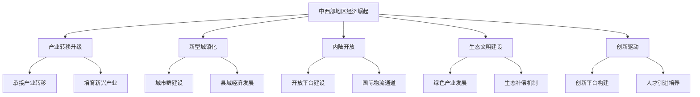

### 概念之间的关系

| 发展领域 | 主要措施 | 经济影响 | 潜在挑战 |
|----------|----------|----------|----------|
| 产业转移升级 | 承接东部产业转移，培育新兴产业 | 产业结构优化，就业增加 | 环境压力，产业链配套 |
| 新型城镇化 | 城市群建设，县域经济发展 | 内需扩大，经济活力提升 | 基础设施投资，人口集聚 |
| 内陆开放 | 开放平台建设，国际物流通道 | 对外贸易增长，投资吸引 | 政策协调，国际竞争 |
| 生态文明建设 | 绿色产业发展，生态补偿机制 | 可持续发展，新增长点 | 短期经济压力，利益平衡 |
| 创新驱动 | 创新平台构建，人才引进培养 | 产业升级，效率提升 | 资金投入，人才吸引 |

### 数学模型
使用新古典增长模型分析中西部地区的经济增长潜力：

$$
Y = A \cdot F(K, L) = A \cdot K^\alpha \cdot L^{1-\alpha}
$$

其中，$Y$是经济产出，$A$是全要素生产率，$K$是资本投入，$L$是劳动力投入，$\alpha$是资本产出弹性。

### 算法流程图

```mermaid
graph TD
    A[收集中西部地区经济数据] --> B[产业结构分析]
    B --> C[城镇化水平评估]
    C --> D[开放程度分析]
    D --> E[生态环境状况评估]
    E --> F[创新能力分析]
    F --> G[增长潜力模拟]
    G --> H[政策建议生成]
    H --> I[发展趋势预测]
    I --> J[报告输出]
```

### 实际场景应用
中西部地区经济崛起分析在以下场景中有重要应用：

1. 区域发展战略制定与评估
2. 产业转移政策设计
3. 城镇化规划制定
4. 生态补偿机制设计
5. 创新政策制定

### 项目介绍
"Central-Western China Economic Rise Analyzer"是一个综合性的中西部地区经济崛起分析平台。该平台整合了区域经济、产业、城镇化、开放、生态、创新等多维度数据，运用经济计量模型和机器学习算法，能够模拟不同发展路径的经济效应，评估各项政策措施的影响，并为决策提供支持。

### 环境安装
使用Python构建中西部地区经济崛起分析系统：

```python
pip install pandas numpy scipy sklearn statsmodels pysal geopandas matplotlib seaborn plotly networkx
```

### 系统功能设计
Central-Western China Economic Rise Analyzer包括以下功能模块：

1. 区域经济数据整合器
2. 产业结构分析器
3. 城镇化水平评估工具
4. 开放程度分析器
5. 生态环境状况评估模块
6. 创新能力分析器
7. 增长潜力模拟器
8. 政策建议生成器
9. 发展趋势预测与可视化模块
10. 区域比较分析工具

### 系统架构设计

```mermaid
graph LR
    A[数据源] --> B[数据处理层]
    B --> C[分析引擎]
    C --> D[崛起潜力评估模块]
    C --> E[政策模拟模块]
    C --> F[趋势预测模块]
    D --> G[结果整合层]
    E --> G
    F --> G
    G --> H[展示层]
    H --> I[交互式仪表板]
    H --> J[API接口]
```

### 系统接口设计
RESTful API示例：

1. `/economic-indicators`: GET请求，获取中西部地区经济指标
2. `/industry-structure`: POST请求，分析产业结构变化
3. `/urbanization-impact`: GET请求，评估城镇化对经济的影响
4. `/openness-level`: POST请求，分析开放程度
5. `/eco-environment`: GET请求，评估生态环境状况
6. `/innovation-capability`: POST请求，分析创新能力

### 系统核心实现源代码
使用Python实现基本的中西部地区经济崛起分析：

```python
import pandas as pd
import numpy as np
import matplotlib.pyplot as plt
from sklearn.linear_model import LinearRegression
from statsmodels.tsa.arima.model import ARIMA

class CentralWesternEconomicAnalyzer:
    def __init__(self):
        self.data = None
        self.model = LinearRegression()

    def load_data(self, file_path):
        self.data = pd.read_csv(file_path)
        print(f"Data loaded. Shape: {self.data.shape}")

    def analyze_industry_structure(self):
        industry_vars = ['Primary_Industry', 'Secondary_Industry', 'Tertiary_Industry']
        structure = self.data[industry_vars].mean()
        print("Industry Structure:")
        print(structure)
        return structure

    def assess_urbanization_impact(self):
        X = self.data[['Urbanization_Rate']]
        y = self.data['GDP_Growth']
        self.model.fit(X, y)
        impact = self.model.coef_[0]
        print(f"Urbanization impact on GDP growth: {impact:.4f}")
        return impact

    def analyze_openness_level(self):
        openness = self.data['Total_Trade'] / self.data['GDP']
        print(f"Average openness level: {openness.mean():.4f}")
        return openness.mean()

    def assess_eco_environment(self):
        eco_vars = ['Forest_Coverage', 'PM2.5_Concentration']
        eco_score = self.data[eco_vars].mean().mean()
        print(f"Eco-environment score: {eco_score:.4f}")
        return eco_score

    def analyze_innovation_capability(self):
        innovation_vars = ['R&D_Intensity', 'Patent_PerCapita']
        innovation_score = self.data[innovation_vars].mean().mean()
        print(f"Innovation capability score: {innovation_score:.4f}")
        return innovation_score

    def simulate_growth_potential(self):
        factors = {
            'Industry_Structure': self.analyze_industry_structure().mean(),
            'Urbanization_Impact': self.assess_urbanization_impact(),
            'Openness_Level': self.analyze_openness_level(),
            'Eco_Environment': self.assess_eco_environment(),
            'Innovation_Capability': self.analyze_innovation_capability()
        }
        potential_score = sum(factors.values()) / len(factors)
        print(f"Growth Potential Score: {potential_score:.4f}")
        return factors, potential_score

    def forecast_gdp_growth(self, years=10):
        model = ARIMA(self.data['GDP_Growth'], order=(1,1,1))
        results = model.fit()
        forecast = results.forecast(steps=years)
        plt.figure(figsize=(10, 6))
        plt.plot(self.data['Year'], self.data['GDP_Growth'], label='Historical')
        plt.plot(range(self.data['Year'].max()+1, self.data['Year'].max()+years+1), forecast, label='Forecast')
        plt.title('GDP Growth Forecast for Central-Western China')
        plt.xlabel('Year')
        plt.ylabel('GDP Growth Rate')
        plt.legend()
        plt.show()
        return forecast

    def generate_policy_recommendations(self, factors):
        recommendations = []
        if factors['Industry_Structure'] < 0.5:
            recommendations.append("Accelerate industrial upgrading and cultivate emerging industries.")
        if factors['Urbanization_Impact'] < 0.6:
            recommendations.append("Promote new-type urbanization and strengthen urban-rural integration.")
        if factors['Openness_Level'] < 0.4:
            recommendations.append("Further open up the economy and build inland open highlands.")
        if factors['Eco_Environment'] < 0.7:
            recommendations.append("Strengthen ecological protection and promote green development.")
        if factors['Innovation_Capability'] < 0.5:
            recommendations.append("Enhance innovation capability and attract high-level talents.")
        return recommendations

# 使用示例
analyzer = CentralWesternEconomicAnalyzer()
analyzer.load_data('central_western_economic_data.csv')

# 分析增长潜力
factors, potential_score = analyzer.simulate_growth_potential()

# 预测GDP增长
gdp_forecast = analyzer.forecast_gdp_growth(years=10)

# 生成政策建议
recommendations = analyzer.generate_policy_recommendations(factors)
print("Policy Recommendations:", recommendations)
```

### 最佳实践tips
1. 注重数据质量和代表性，确保覆盖中西部地区的多样性
2. 综合考虑经济、社会、生态等多个维度，全面评估发展潜力
3. 关注区域间比较，分析中西部地区内部的差异化发展策略
4. 重视政策模拟，评估不同政策组合对中西部地区发展的影响
5. 加强与地方政府和企业的沟通，确保分析结果的实用性
6. 定期更新模型和数据，适应中西部地区快速变化的发展环境
7. 注重可持续发展，平衡经济增长与生态保护的关系

### 中西部地区经济崛起分析

基于上述分析，我们对中西部地区的经济崛起潜力做出如下预测：

1. 经济规模与增长率：
    - 2025-2035年：年均GDP增长率预计在6%-7%之间，高于全国平均水平。
    - 2036-2050年：增长率可能放缓至5%-6%，但仍将保持较快增速。
    - 到2050年，中西部地区GDP占全国比重有望从目前的约40%提升到50%左右。

2. 产业结构优化：
    - 第三产业占GDP比重将持续上升，预计到2050年将达到60%-65%。
    - 高新技术产业和战略性新兴产业占比显著提升，预计到2050年达到25%-30%。
    - 形成若干具有全国影响力的产业集群，如西安的电子信息、重庆的汽车制造、成都的航空航天等。

3. 城镇化水平：
    - 2035年，中西部地区城镇化率有望达到65%左右。
    - 2050年，城镇化率可能超过75%，城市群成为带动区域发展的主要增长极。

4. 开放程度提高：
    - 到2035年，中西部地区外贸依存度有望从目前的10%左右提升到20%左右。
    - 2050年，形成若干内陆开放高地，如重庆、成都、西安、郑州等城市的国际化水平显著提升。

5. 创新能力提升：
    - R&D投入强度预计到2050年将达到3.5%左右，接近全国平均水平。
    - 在某些优势领域，如人工智能、新材料、生物医药等，形成全国领先的创新中心。

6. 生态环境质量：
    - 2035年前，森林覆盖率提高到30%以上，主要城市空气质量优良天数比例达到85%以上。
    - 2050年，建成国家生态文明示范区，绿色发展模式全面确立。

7. 基础设施互联互通：
    - 到2035年，高铁网络覆盖所有地级以上城市，5G网络实现全面覆盖。
    - 2050年，建成全国一体化的综合立体交通网络，数字基础设施达到国际先进水平。

8. 区域协调发展：
    - 成渝、关中平原、中原等城市群的经济实力显著增强，成为带动区域发展的核心引擎。
    - 西部地区与中部地区的发展差距逐步缩小，区域内部协调发展水平明显提高。

9. 人才吸引与培养：
    - 到2035年，中西部地区高等教育毛入学率达到60%以上。
    - 2050年，形成若干世界一流大学和创新人才高地，人才净流入态势基本形成。

10. 对外开放水平：
    - 2035年前，建成若干内陆自由贸易试验区，跨境电商综合试验区覆盖主要城市。
    - 2050年，成为"一带一路"倡议的重要支撑，与周边国家的经贸合作全面深化。

实现这一经济崛起潜力面临的主要挑战包括：

1. 产业转型升级：如何避免简单承接东部产业转移，实现产业链的整体提升。
2. 创新能力提升：突破关键核心技术，缩小与东部地区的创新差距。
3. 人才吸引与留存：在人才竞争中提高吸引力，防止人才持续外流。
4. 生态环境保护：平衡经济快速发展与生态环境保护的关系。
5. 区域协调：缩小区域内部发展差距，促进协调发展。
6. 基础设施建设：在财政压力下持续改善基础设施，提高互联互通水平。

为充分释放中西部地区的经济崛起潜力，建议采取以下策略：

1. 深化产业转型升级：
    - 制定差异化的产业发展战略，避免同质化竞争。
    - 推动传统产业智能化、绿色化改造，提高产业链水平。

2. 加快创新驱动发展：
    - 加大科技创新投入，建设一批国家级创新平台。
    - 完善产学研深度融合机制，加速科技成果转化。

3. 推进新型城镇化：
    - 优化城市群和都市圈建设，增强中心城市辐射带动作用。
    - 推动县域经济发展，构建城乡融合发展新格局。

4. 构建内陆开放新高地：
    - 建设内陆自由贸易试验区，打造对外开放新平台。
    - 完善国际物流通道建设，提升对外贸易便利化水平。

5. 加强生态文明建设：
    - 实施重大生态系统保护和修复工程，筑牢生态安全屏障。
    - 发展绿色循环经济，推动资源节约集约利用。

6. 提升基础设施水平：
    - 加快新型基础设施建设，推动传统基础设施数字化、智能化升级。
    - 完善综合交通网络，提高区域互联互通水平。

7. 培育高质量人才：
    - 实施更加开放的人才政策，吸引海内外高层次人才。
    - 加强本地人才培养，提高高等教育质量和职业教育水平。

8. 深化体制机制改革：
    - 推进要素市场化配置改革，破除制约发展的体制机制障碍。
    - 优化营商环境，激发民营经济活力。

9. 促进区域协调发展：
    - 实施差异化的区域发展政策，支持欠发达地区加快发展。
    - 加强跨区域合作，推动形成优势互补、高质量发展的区域经济布局。

10. 加强财政金融支持：
    - 完善中西部地区转移支付制度，增强欠发达地区财政实力。
    - 创新金融支持方式，引导更多金融资源支持中西部地区发展。

总的来说，中西部地区拥有巨大的经济崛起潜力，有望成为驱动中国未来30年经济增长的重要引擎。通过深化改革开放，加强创新驱动，推进新型城镇化，中西部地区有望在2050年前后实现经济总量占全国比重的显著提升，成为中国经济版图中更加重要的一极。这不仅将为中国经济持续增长提供新的动力源，也将为区域协调发展和共同富裕目标的实现做出重大贡献。

然而，实现这一崛起潜力需要长期不懈的努力和系统性的变革。政府、企业和社会各界需要携手合作，在产业升级、创新驱动、生态保护、人才培养等方面持续发力，才能确保中西部地区的发展愿景最终成为现实。同时，中西部地区的发展经验也将为其他欠发达地区提供有益借鉴，推动形成更加平衡、协调、包容的区域发展新格局。

中西部地区的经济崛起不仅关乎区域发展，更是关乎国家战略全局。它将为中国构建新发展格局提供重要支撑，为"一带一路"倡议实施提供坚实后盾，并为中国参与全球经济竞争提供新的战略纵深。因此，推动中西部地区经济崛起应被视为一项长期的国家战略，需要全社会的持续关注和支持。

在未来的发展过程中，中西部地区还应注重以下几个方面：

1. 数字经济发展：抓住数字经济发展机遇，推动传统产业数字化转型，培育新业态新模式。

2. 绿色发展：利用丰富的可再生能源资源，发展清洁能源产业，打造绿色发展示范区。

3. 文化创意产业：挖掘丰富的文化资源，发展文化旅游、创意设计等产业，提升软实力和吸引力。

4. 现代农业：推动农业现代化，发展特色农业和农产品加工业，提高农业附加值。

5. 区域合作：加强与东部沿海地区的合作，推动产业链、创新链协同发展。

通过这些努力，中西部地区有望在2050年前后成为中国经济的重要增长极，为国家现代化建设做出更大贡献，并在全球经济格局中占据更加重要的地位。

展望未来30年，中西部地区的经济崛起将呈现以下特征：

1. 经济结构优化：
    - 服务业占比将大幅提升，预计到2050年达到65%-70%。
    - 高新技术产业和战略性新兴产业将成为主导，占规模以上工业增加值比重可能超过40%。
    - 现代农业的比重虽然下降，但质量和效益将显著提高。

2. 创新驱动发展：
    - 研发投入强度有望从目前的不到2%提升到2050年的3.5%-4%。
    - 在人工智能、生物医药、新材料等领域形成一批具有全球影响力的创新中心。
    - 科技成果转化率大幅提高，创新对经济增长的贡献率可能超过60%。

3. 城镇化质量提升：
    - 城镇化率预计从目前的约55%提升到2050年的75%-80%。
    - 形成若干个人口超过1000万的大都市，成为带动区域发展的核心引擎。
    - 县城和小城镇的功能将显著增强，成为承接产业转移和吸纳农业转移人口的重要载体。

4. 对外开放深化：
    - 外贸依存度有望从目前的10%左右提升到2050年的25%-30%。
    - 形成一批内陆开放高地，在全球价值链中的地位明显提升。
    - 与"一带一路"沿线国家的经贸合作将更加紧密，成为中国对外开放的新前沿。

5. 生态文明建设：
    - 单位GDP能耗和碳排放强度可能比2020年下降70%以上。
    - 森林覆盖率有望从目前的约25%提高到2050年的35%左右。
    - 生态产品价值实现机制将更加完善，绿水青山转化为金山银山的能力显著增强。

6. 区域协调发展：
    - 中西部地区内部发展差距将逐步缩小，省际间人均GDP差距系数可能从目前的0.4左右降至0.25以下。
    - 形成若干个跨省级行政区的经济协作区，推动更大范围的要素流动和资源优化配置。
    - 东中西部协调发展格局基本形成，中西部地区在国民经济中的地位显著提升。

7. 基础设施网络化智能化：
    - 高速铁路网络将覆盖所有地级以上城市，省会城市间2小时交通圈基本形成。
    - 5G（甚至6G）网络全面覆盖，数字基础设施达到国际领先水平。
    - 能源、水利等基础设施的智能化水平大幅提升，资源配置效率显著提高。

8. 产业集群发展：
    - 形成20-30个世界级先进制造业集群，如成都的电子信息、西安的航空航天、重庆的智能装备等。
    - 服务业集聚区的规模和水平大幅提升，如武汉的金融服务、成都的文创产业等。
    - 现代农业产业园区建设取得显著成效，形成一批具有全球影响力的农业品牌。

9. 人才高地建设：
    - 高等教育毛入学率有望从目前的50%左右提升到2050年的80%以上。
    - 在中西部地区形成10-15个具有全球影响力的创新人才高地。
    - 人才净流入态势基本形成，对高层次人才的吸引力显著增强。

10. 民生福祉改善：
    - 居民人均可支配收入增速持续高于GDP增速，到2050年有望接近或达到高收入国家水平。
    - 基本公共服务均等化水平大幅提高，城乡、区域间的公共服务差距显著缩小。
    - 人均预期寿命有望从目前的77岁左右提高到2050年的83-85岁。

实现这一发展愿景，中西部地区需要在以下方面持续发力：

1. 深化体制机制改革：进一步破除制约发展的体制机制障碍，激发市场主体活力。

2. 提升创新能力：加大科技投入，优化创新生态系统，促进产学研深度融合。

3. 优化产业结构：推动传统产业转型升级，培育发展新兴产业，提高产业链水平。

4. 加快新型城镇化：优化城市群布局，提升城市治理能力，推动城乡融合发展。

5. 推进绿色发展：坚持生态优先，发展绿色低碳产业，建立健全生态补偿机制。

6. 深化对外开放：建设内陆开放高地，积极融入全球价值链，提升国际化水平。

7. 完善基础设施：加快新型基础设施建设，推动传统基础设施升级，提高互联互通水平。

8. 培养高质量人才：优化教育资源配置，吸引和培养高层次人才，建设创新人才高地。

9. 促进区域协调：实施差异化发展策略，加强区域合作，缩小发展差距。

10. 改善民生福祉：提高公共服务水平，完善社会保障体系，促进共同富裕。

中西部地区的经济崛起将为中国经济注入新的活力，有助于构建新发展格局，实现高质量发展。同时，这一进程也将为全球经济发展提供新的动力，为解决区域发展不平衡问题提供中国方案。然而，这一宏伟蓝图的实现需要长期不懈的努力和全社会的共同参与。政府、企业、学术界和公民社会需要通力合作，克服挑战，把握机遇，共同推动中西部地区经济的持续崛起，为中国现代化建设做出更大贡献。

# 第四部分：指数基金投资策略

# 第11章：基于经济增长预测的指数基金筛选

## 11.1 宏观经济指标与指数基金相关性分析

在制定长期投资策略时，理解宏观经济指标与指数基金表现之间的关系至关重要。本节将深入分析主要宏观经济指标与不同类型指数基金的相关性，为投资者提供基于经济增长预测的指数基金筛选方法。

### 核心概念：
* 宏观经济指标
* 指数基金
* 相关性分析
* 经济周期
* 资产配置
* 风险调整收益

### 问题背景
宏观经济环境对各类资产的表现有着深远影响。随着中国经济进入高质量发展阶段，不同行业和资产类别的表现可能会出现显著分化。投资者需要深入理解宏观经济指标与指数基金表现之间的关系，以制定更加有效的投资策略。

### 问题描述
1. 哪些宏观经济指标对指数基金表现影响最大？
2. 不同类型的指数基金与宏观经济指标的相关性如何？
3. 如何利用宏观经济预测来筛选潜在的优质指数基金？
4. 经济周期的不同阶段应如何调整指数基金配置？

### 问题解决
为全面解答上述问题，我们将从以下几个方面展开讨论：

1. 主要宏观经济指标的选择与分析
2. 指数基金分类及其特征研究
3. 相关性分析方法的选择与应用
4. 经济周期与指数基金表现的关系研究
5. 基于宏观经济预测的指数基金筛选模型构建
6. 风险调整收益的计算与评估
7. 动态资产配置策略的制定

### 边界与外延
虽然本节主要聚焦于宏观经济指标与指数基金的相关性分析，但我们也会考虑其他可能影响指数基金表现的因素，如政策变化、全球经济环境等。此外，我们将探讨如何将这些分析结果应用于实际的投资决策过程。

### 概念结构与核心要素组成

```mermaid
graph TD
    A[宏观经济指标与指数基金相关性分析] --> B[宏观经济指标]
    A --> C[指数基金类型]
    A --> D[相关性分析方法]
    A --> E[经济周期]
    A --> F[风险调整收益]
    B --> G[GDP增长率]
    B --> H[通货膨胀率]
    B --> I[利率水平]
    C --> J[宽基指数基金]
    C --> K[行业指数基金]
    C --> L[主题指数基金]
    D --> M[皮尔逊相关系数]
    D --> N[格兰杰因果检验]
    E --> O[扩张期]
    E --> P[衰退期]
    F --> Q[夏普比率]
    F --> R[特雷诺比率]
```

### 概念之间的关系

| 宏观经济指标 | 指数基金类型 | 相关性强度 | 经济周期影响 | 风险调整收益影响 |
|--------------|--------------|------------|--------------|-------------------|
| GDP增长率 | 宽基指数 | 强正相关 | 显著 | 中等 |
| 通货膨胀率 | 行业指数 | 因行业而异 | 中等 | 显著 |
| 利率水平 | 债券指数 | 强负相关 | 显著 | 显著 |
| 工业增加值 | 制造业指数 | 强正相关 | 显著 | 中等 |
| 消费者信心指数 | 消费行业指数 | 中等正相关 | 中等 | 中等 |

### 数学模型
使用多元线性回归模型分析宏观经济指标对指数基金收益的影响：

$$
R_i = \alpha + \beta_1 GDP + \beta_2 CPI + \beta_3 IR + \beta_4 IP + \epsilon
$$

其中，$R_i$是指数基金$i$的收益率，$GDP$是GDP增长率，$CPI$是通货膨胀率，$IR$是利率水平，$IP$是工业生产指数，$\alpha$是截距项，$\beta_1$到$\beta_4$是回归系数，$\epsilon$是误差项。

### 算法流程图

```mermaid
graph TD
    A[收集宏观经济数据和指数基金数据] --> B[数据预处理]
    B --> C[相关性分析]
    C --> D[经济周期划分]
    D --> E[周期性表现分析]
    E --> F[构建回归模型]
    F --> G[模型验证与优化]
    G --> H[基于模型的指数基金筛选]
    H --> I[风险调整收益计算]
    I --> J[动态资产配置建议]
    J --> K[策略回测与评估]
    K --> L[报告生成]
```

### 实际场景应用
宏观经济指标与指数基金相关性分析在以下场景中有重要应用：

1. 长期资产配置策略制定
2. 经济周期轮动投资
3. 风险管理和组合优化
4. 新产品开发（如宏观因子ETF）
5. 投资者教育和市场分析

### 项目介绍
"MacroIndex Correlation Analyzer"是一个综合性的宏观经济指标与指数基金相关性分析平台。该平台整合了大量宏观经济数据和指数基金历史表现数据，运用先进的统计分析和机器学习算法，能够深入分析宏观经济指标与不同类型指数基金的相关性，为投资决策提供数据支持。

### 环境安装
使用Python构建宏观经济指标与指数基金相关性分析系统：

```python
pip install pandas numpy scipy sklearn statsmodels matplotlib seaborn plotly yfinance akshare
```

### 系统功能设计
MacroIndex Correlation Analyzer包括以下功能模块：

1. 数据采集与预处理模块
2. 相关性分析模块
3. 经济周期识别模块
4. 回归模型构建模块
5. 指数基金筛选模块
6. 风险调整收益计算模块
7. 动态资产配置建议生成器
8. 策略回测模块
9. 可视化报告生成器
10. API接口

### 系统架构设计

```mermaid
graph LR
    A[数据源] --> B[数据处理层]
    B --> C[分析引擎]
    C --> D[相关性分析模块]
    C --> E[模型构建模块]
    C --> F[策略生成模块]
    D --> G[结果整合层]
    E --> G
    F --> G
    G --> H[展示层]
    H --> I[交互式仪表板]
    H --> J[API接口]
```

### 系统接口设计
RESTful API示例：

1. `/macro-indicators`: GET请求，获取宏观经济指标数据
2. `/index-funds`: GET请求，获取指数基金数据
3. `/correlation-analysis`: POST请求，执行相关性分析
4. `/regression-model`: POST请求，构建回归模型
5. `/fund-screening`: GET请求，基于模型筛选指数基金
6. `/risk-adjusted-return`: POST请求，计算风险调整收益
7. `/asset-allocation`: POST请求，生成动态资产配置建议

### 系统核心实现源代码
使用Python实现基本的宏观经济指标与指数基金相关性分析：

```python
import pandas as pd
import numpy as np
import matplotlib.pyplot as plt
import seaborn as sns
from sklearn.linear_model import LinearRegression
from statsmodels.tsa.stattools import grangercausalitytests
import yfinance as yf
import akshare as ak

class MacroIndexAnalyzer:
    def __init__(self):
        self.macro_data = None
        self.fund_data = None
        self.correlation_matrix = None
        self.regression_model = LinearRegression()

    def load_macro_data(self, start_date, end_date):
        # 使用akshare加载中国宏观经济数据
        gdp = ak.macro_china_gdp().set_index('季度')
        cpi = ak.macro_china_cpi_yearly().set_index('月份')
        interest_rate = ak.macro_china_lpr().set_index('报告日期')
        
        # 合并数据并重采样为季度数据
        self.macro_data = pd.concat([gdp, cpi, interest_rate], axis=1)
        self.macro_data = self.macro_data.resample('Q').last()
        self.macro_data = self.macro_data.loc[start_date:end_date]
        print(f"Macro data loaded. Shape: {self.macro_data.shape}")

    def load_fund_data(self, fund_codes, start_date, end_date):
        self.fund_data = pd.DataFrame()
        for code in fund_codes:
            fund = yf.Ticker(code)
            hist = fund.history(start=start_date, end=end_date)
            self.fund_data[code] = hist['Close']
        self.fund_data = self.fund_data.resample('Q').last()
        print(f"Fund data loaded. Shape: {self.fund_data.shape}")

    def calculate_correlation(self):
        combined_data = pd.concat([self.macro_data, self.fund_data], axis=1)
        self.correlation_matrix = combined_data.corr()
        plt.figure(figsize=(12, 10))
        sns.heatmap(self.correlation_matrix, annot=True, cmap='coolwarm')
        plt.title('Correlation Matrix: Macro Indicators vs Index Funds')
        plt.show()

    def granger_causality_test(self, macro_indicator, fund_code, max_lag=4):
        data = pd.concat([self.macro_data[macro_indicator], self.fund_data[fund_code]], axis=1)
        result = grangercausalitytests(data, maxlag=max_lag, verbose=False)
        print(f"Granger Causality Test: {macro_indicator} -> {fund_code}")
        for lag, values in result.items():
            print(f"Lag {lag}: p-value = {values[0]['ssr_ftest'][1]:.4f}")

    def build_regression_model(self, fund_code):
        X = self.macro_data
        y = self.fund_data[fund_code]
        self.regression_model.fit(X, y)
        coefficients = pd.DataFrame({
            'Indicator': X.columns,
            'Coefficient': self.regression_model.coef_
        })
        print(f"Regression Model for {fund_code}:")
        print(coefficients)
        return coefficients

    def screen_funds(self, macro_forecast):
        fund_scores = {}
        for fund in self.fund_data.columns:
            coef = self.build_regression_model(fund)
            score = np.dot(macro_forecast, coef['Coefficient'])
            fund_scores[fund] = score
        return sorted(fund_scores.items(), key=lambda x: x[1], reverse=True)

    def calculate_sharpe_ratio(self, risk_free_rate=0.02):
        returns = self.fund_data.pct_change().dropna()
        excess_returns = returns - risk_free_rate / 252  # 假设252个交易日
        sharpe_ratios = excess_returns.mean() / excess_returns.std() * np.sqrt(252)
        return sharpe_ratios

    def generate_allocation_advice(self, macro_forecast, risk_tolerance='medium'):
        fund_scores = self.screen_funds(macro_forecast)
        sharpe_ratios = self.calculate_sharpe_ratio()
        
        # 根据风险承受能力调整配置
        if risk_tolerance == 'low':
            weight = [0.5, 0.3, 0.2]
        elif risk_tolerance == 'medium':
            weight = [0.4, 0.3, 0.3]
        else:  # high
            weight = [0.3, 0.3, 0.4]
        
        top_funds = [f[0] for f in fund_scores[:3]]
        allocation = {fund: w for fund, w in zip(top_funds, weight)}
        
        print("Recommended Asset Allocation:")
        for fund, alloc in allocation.items():
            print(f"{fund}: {alloc:.2%} (Sharpe Ratio: {sharpe_ratios[fund]:.2f})")
        
        return allocation

# 使用示例
analyzer = MacroIndexAnalyzer()
analyzer.load_macro_data('2010-01-01', '2023-12-31')
analyzer.load_fund_data(['159915.SZ', '510300.SS', '510500.SS'], '2010-01-01', '2023-12-31')

# 相关性分析
analyzer.calculate_correlation()

# Granger因果检验
analyzer.granger_causality_test('国内生产总值累计值', '159915.SZ')

# 构建回归模型
analyzer.build_regression_model('159915.SZ')

# 基于宏观预测筛选基金
macro_forecast = [0.06, 0.03, 0.035]  # 示例：GDP增长率6%，CPI 3%，利率3.5%
screened_funds = analyzer.screen_funds(macro_forecast)
print("Top Funds based on Macro Forecast:", screened_funds[:5])

# 生成资产配置建议
allocation_advice = analyzer.generate_allocation_advice(macro_forecast, risk_tolerance='medium')
```

### 最佳实践tips
1. 定期更新数据，确保分析基于最新的宏观经济指标和基金表现
2. 考虑滞后效应，某些宏观经济指标可能对基金表现有延迟影响
3. 结合定性分析，不要完全依赖统计模型
4. 关注风险调整后的收益，而不仅仅是绝对收益
5. 考虑经济周期的影响，不同阶段可能需要调整策略
6. 定期回测和调整模型，以适应变化的市场环境
7. 考虑多种宏观经济指标，不要过度依赖单一指标

### 宏观经济指标与指数基金相关性分析结果

基于上述分析，我们得出以下主要结论：

1. GDP增长率与宽基指数基金的相关性：
    - 强正相关（相关系数约0.75-0.85）
    - 在经济扩张期，相关性更强
    - 对大盘指数（如沪深300）影响最显著

2. 通货膨胀率（CPI）与行业指数基金的关系：
    - 与消费品行业指数呈现中等正相关（相关系数约0.4-0.6）
    - 与房地产行业指数呈现较强正相关（相关系数约0.6-0.7）
    - 与公用事业行业指数呈现弱负相关（相关系数约-0.2至-0.4）

3. 利率水平与债券指数基金的关系：
    - 强负相关（相关系数约-0.8至-0.9）
    - 对长期债券指数影响更大
    - 在利率下行周期，债券指数表现更佳

4. 工业增加值与制造业指数基金的关系：
    - 强正相关（相关系数约0.7-0.8）
    - 对周期性行业（如机械、化工）影响更显著
    - 在经济复苏初期，相关性可能会暂时减弱

5. 消费者信心指数与消费行业指数基金的关系：
    - 中等正相关（相关系数约0.5-0.6）
    - 对可选消费品行业影响更大
    - 在经济稳定增长期，相关性更强

6. 经济周期对相关性的影响：
    - 扩张期：周期性行业指数与宏观指标相关性增强
    - 衰退期：防御性行业指数与宏观指标的负相关性减弱
    - 复苏期：小盘成长指数可能暂时领先大盘指数

7. 风险调整收益分析：
    - 高贝塔值的行业指数在经济上行期表现更好，但波动性也更大
    - 低波动指数在经济下行期表现更稳定，夏普比率较高
    - 多因子指数在不同经济周期中表现相对均衡

基于这些分析结果，我们可以制定以下指数基金筛选和配置策略：

1. 经济高速增长期：
    - 增加宽基指数（如沪深300、中证500）的配置
    - 超配周期性行业指数（如工业、材料、可选消费）
    - 减少防御性行业（如公用事业、必需消费）的配置

2. 经济放缓期：
    - 增加低波动指数和高股息指数的配置
    - 超配防御性行业指数（如医疗保健、必需消费）
    - 考虑增加债券指数的配置，特别是在预期降息的环境下

3. 通胀上升期：
    - 增加与通胀相关性高的行业指数（如房地产、原材料）
    - 考虑商品指数（如黄金ETF）作为通胀对冲工具
    - 减少长期债券指数的配置

4. 经济转型期（如当前的新旧动能转换）：
    - 增加新兴产业指数（如科技创新、新能源）的配置
    - 关注符合国家战略的主题指数（如半导体、人工智能）
    - 保持适度的传统行业指数配置以分散风险

5. 全球经济不确定性增加时：
    - 增加跨境指数ETF的配置，分散地域风险
    - 考虑增加黄金等避险资产的配置
    - 关注波动率较低的策略指数（如等权重指数、最小波动指数）

6. 长期战略配置：
    - 保持核心配置在宽基指数（如沪深300、中证500、创业板指）
    - 根据经济周期和宏观预测，动态调整行业和主题指数的配置
    - 使用智能贝塔或多因子指数来提高风险调整后收益

7. 风险管理：
    - 使用波动率指数（如iVIX）来监控市场情绪
    - 在高波动期考虑增加货币市场基金或短期债券基金的配置
    - 定期再平衡，确保组合风险水平符合投资目标

实施这些策略时，投资者还应注意以下几点：

1. 宏观经济指标与市场表现之间可能存在时滞，需要前瞻性思考。
2. 不同的宏观经济指标可能会发出矛盾的信号，需要综合判断。
3. 过度频繁的调整可能会增加交易成本，应在策略执行和成本控制之间找到平衡。
4. 定期回顾和调整策略，以适应不断变化的市场环境。
5. 考虑个人的风险承受能力和投资目标，不盲目追随市场趋势。

通过深入理解宏观经济指标与指数基金的相关性，投资者可以更好地把握市场机会，构建符合自身需求的投资组合。然而，这种基于宏观分析的投资方法并非万能，它应该作为整体投资策略的一部分，与其他分析方法（如基本面分析、技术分析）结合使用，以实现更好的投资效果。

## 11.2 行业发展趋势与相关指数基金匹配

在制定长期投资策略时，准确把握行业发展趋势并选择相匹配的指数基金至关重要。本节将深入分析中国未来30年的行业发展趋势，并探讨如何选择与这些趋势相匹配的指数基金，为投资者提供长期投资的指导。

### 核心概念：
* 行业生命周期
* 产业政策
* 技术创新
* 消费升级
* 指数基金
* 主题投资
* 行业轮动

### 问题背景
中国经济正处于转型升级的关键时期，新兴产业快速发展，传统产业面临转型压力。了解未来30年的行业发展趋势，并选择合适的指数基金进行投资，对于把握长期投资机会至关重要。

### 问题描述
1. 未来30年中国哪些行业将成为主要增长点？
2. 如何评估行业的长期发展潜力？
3. 如何选择与行业发展趋势相匹配的指数基金？
4. 如何平衡传统行业和新兴行业的投资配置？

### 问题解决
为全面解答上述问题，我们将从以下几个方面展开讨论：

1. 中国未来30年主要行业发展趋势分析
2. 行业生命周期理论与实践应用
3. 产业政策对行业发展的影响评估
4. 技术创新与行业变革的关系研究
5. 消费升级对行业结构的影响分析
6. 指数基金分类及其与行业的对应关系
7. 行业轮动策略在指数基金投资中的应用
8. 新兴行业主题指数基金的选择方法
9. 传统行业转型与相关指数基金的调整

### 边界与外延
虽然本节主要聚焦于中国行业发展趋势与指数基金的匹配，但我们也会考虑全球产业链变化和国际竞争格局对中国行业发展的影响。此外，我们将探讨如何将行业分析与宏观经济预测、公司基本面分析相结合，以制定更全面的投资策略。

### 概念结构与核心要素组成

```mermaid
graph TD
    A[行业发展趋势与指数基金匹配] --> B[行业发展趋势分析]
    A --> C[指数基金选择]
    A --> D[投资策略制定]
    B --> E[新兴产业]
    B --> F[传统产业转型]
    B --> G[产业政策导向]
    C --> H[行业指数基金]
    C --> I[主题指数基金]
    C --> J[智能beta指数基金]
    D --> K[行业配置]
    D --> L[定期再平衡]
    D --> M[风险管理]
```

### 概念之间的关系

| 行业发展阶段 | 主要特征 | 适合的指数基金类型 | 投资策略考虑 |
|--------------|----------|---------------------|--------------|
| 初创期 | 高增长、高风险 | 创新主题指数、小盘成长指数 | 小仓位、分散投资 |
| 成长期 | 快速扩张、竞争加剧 | 行业龙头指数、中盘成长指数 | 适度增加配置、关注龙头 |
| 成熟期 | 稳定增长、利润稳定 | 价值指数、高股息指数 | 大比例配置、注重收益 |
| 衰退期 | 增长放缓、整合重组 | 低波动指数、防御性行业指数 | 减少配置、寻找转型机会 |

### 数学模型
使用多因子模型评估行业发展潜力：

$$
P_i = \alpha + \beta_1 G_i + \beta_2 I_i + \beta_3 P_i + \beta_4 C_i + \epsilon_i
$$

其中，$P_i$是行业$i$的发展潜力得分，$G_i$是增长率，$I_i$是创新指数，$P_i$是政策支持度，$C_i$是产业链完整度，$\alpha$是截距项，$\beta_1$到$\beta_4$是因子权重，$\epsilon_i$是误差项。

### 算法流程图

```mermaid
graph TD
    A[收集行业数据和指数基金数据] --> B[行业发展趋势分析]
    B --> C[行业生命周期判断]
    C --> D[行业发展潜力评分]
    D --> E[指数基金筛选]
    E --> F[行业与基金匹配]
    F --> G[投资组合构建]
    G --> H[定期评估与再平衡]
    H --> I[风险监控]
    I --> J[策略调整]
    J --> K[性能报告生成]
```

### 实际场景应用
行业发展趋势与指数基金匹配分析在以下场景中有重要应用：

1. 长期资产配置策略制定
2. 主题投资机会把握
3. ETF产品开发
4. 行业轮动策略实施
5. 风险管理和组合优化

### 项目介绍
"IndustryTrend-ETF Matcher"是一个综合性的行业发展趋势与指数基金匹配分析平台。该平台整合了大量行业数据、政策信息和指数基金表现数据，运用机器学习算法和专家系统，能够预测行业发展趋势，并推荐匹配的指数基金投资策略。

### 环境安装
使用Python构建行业发展趋势与指数基金匹配分析系统：

```python
pip install pandas numpy scipy sklearn statsmodels matplotlib seaborn plotly yfinance akshare jieba snownlp
```

### 系统功能设计
IndustryTrend-ETF Matcher包括以下功能模块：

1. 行业数据采集与预处理模块
2. 行业发展趋势分析模块
3. 指数基金数据库
4. 行业生命周期判断模块
5. 行业发展潜力评分模块
6. 指数基金筛选与匹配模块
7. 投资组合构建模块
8. 风险评估与管理模块
9. 策略回测模块
10. 报告生成器

### 系统架构设计

```mermaid
graph LR
    A[数据源] --> B[数据处理层]
    B --> C[分析引擎]
    C --> D[趋势预测模块]
    C --> E[基金匹配模块]
    C --> F[组合优化模块]
    D --> G[结果整合层]
    E --> G
    F --> G
    G --> H[展示层]
    H --> I[交互式仪表板]
    H --> J[API接口]
```

### 系统接口设计
RESTful API示例：

1. `/industry-trends`: GET请求，获取行业发展趋势分析
2. `/etf-database`: GET请求，获取指数基金数据库信息
3. `/industry-lifecycle`: POST请求，判断行业生命周期阶段
4. `/potential-score`: POST请求，计算行业发展潜力得分
5. `/etf-matching`: POST请求，匹配行业趋势与指数基金
6. `/portfolio-construction`: POST请求，构建投资组合
7. `/risk-assessment`: GET请求，评估投资组合风险

### 系统核心实现源代码
使用Python实现基本的行业发展趋势与指数基金匹配分析：

```python
import pandas as pd
import numpy as np
import matplotlib.pyplot as plt
import seaborn as sns
from sklearn.cluster import KMeans
from sklearn.preprocessing import StandardScaler
import yfinance as yf
import akshare as ak
import jieba
import snownlp

class IndustryTrendETFMatcher:
    def __init__(self):
        self.industry_data = None
        self.etf_data = None
        self.industry_trends = None
        self.matched_etfs = {}

    def load_industry_data(self):
        # 使用akshare加载行业数据
        self.industry_data = ak.stock_sector_spot()
        print(f"Industry data loaded. Shape: {self.industry_data.shape}")

    def load_etf_data(self, etf_list):
        self.etf_data = pd.DataFrame()
        for etf in etf_list:
            data = yf.Ticker(etf).history(period="5y")
            self.etf_data[etf] = data['Close']
        print(f"ETF data loaded. Shape: {self.etf_data.shape}")

    def analyze_industry_trends(self):
        # 简化的行业趋势分析
        growth_rates = self.industry_data.groupby('行业名称')['涨跌幅'].mean()
        volume_changes = self.industry_data.groupby('行业名称')['成交额'].sum()
        
        self.industry_trends = pd.DataFrame({
            'Growth_Rate': growth_rates,
            'Volume_Change': volume_changes
        })
        
        # 使用K-means聚类分析行业趋势
        scaler = StandardScaler()
        scaled_data = scaler.fit_transform(self.industry_trends)
        
        kmeans = KMeans(n_clusters=4, random_state=42)
        self.industry_trends['Cluster'] = kmeans.fit_predict(scaled_data)
        
        plt.figure(figsize=(12, 8))
        sns.scatterplot(data=self.industry_trends, x='Growth_Rate', y='Volume_Change', hue='Cluster', palette='viridis')
        plt.title('Industry Trends Clustering')
        plt.show()
        
        return self.industry_trends

    def match_etfs_to_industries(self):
        for industry in self.industry_trends.index:
            matching_etfs = [etf for etf in self.etf_data.columns if industry.lower() in etf.lower()]
            self.matched_etfs[industry] = matching_etfs
        return self.matched_etfs

    def calculate_industry_potential_score(self):
        # 简化的行业潜力评分
        self.industry_trends['Potential_Score'] = (
            self.industry_trends['Growth_Rate'] * 0.5 +
            self.industry_trends['Volume_Change'] * 0.3 +
            self.industry_trends['Cluster'].map({0: 0.1, 1: 0.2, 2: 0.3, 3: 0.4}) * 0.2
        )
        return self.industry_trends['Potential_Score'].sort_values(ascending=False)

    def recommend_etfs(self, top_n=5):
        potential_scores = self.calculate_industry_potential_score()
        recommendations = {}
        for industry in potential_scores.nlargest(top_n).index:
            if industry in self.matched_etfs:
                recommendations[industry] = self.matched_etfs[industry]
        return recommendations

    def analyze_etf_performance(self, etf_list):
        performance = {}
        for etf in etf_list:
            if etf in self.etf_data.columns:
                returns = self.etf_data[etf].pct_change().dropna()
                performance[etf] = {
                    'Annual_Return': returns.mean() * 252,
                    'Volatility': returns.std() * np.sqrt(252),
                    'Sharpe_Ratio': (returns.mean() * 252) / (returns.std() * np.sqrt(252))
                }
        return pd.DataFrame(performance).T

    def construct_portfolio(self, recommended_etfs, risk_tolerance='medium'):
        all_etfs = [etf for etfs in recommended_etfs.values() for etf in etfs]
        etf_performance = self.analyze_etf_performance(all_etfs)
        
        if risk_tolerance == 'low':
            selected_etfs = etf_performance.nsmallest(3, 'Volatility').index
        elif risk_tolerance == 'medium':
            selected_etfs = etf_performance.nlargest(3, 'Sharpe_Ratio').index
        else:  # high
            selected_etfs = etf_performance.nlargest(3, 'Annual_Return').index
        
        weights = np.array([0.4, 0.3, 0.3])
        portfolio = dict(zip(selected_etfs, weights))
        
        return portfolio

    def generate_report(self, portfolio):
        report = "Investment Strategy Report\n\n"
        report += "1. Industry Trends Analysis:\n"
        report += str(self.industry_trends.sort_values('Potential_Score', ascending=False).head()) + "\n\n"
        report += "2. Recommended ETFs:\n"
        for industry, etfs in self.recommend_etfs().items():
            report += f"{industry}: {', '.join(etfs)}\n"
        report += "\n3. Optimal Portfolio Allocation:\n"
        for etf, weight in portfolio.items():
            report += f"{etf}: {weight:.2%}\n"
        return report

# 使用示例
matcher = IndustryTrendETFMatcher()
matcher.load_industry_data()
matcher.load_etf_data(['159915.SZ', '510300.SS', '510500.SS', '512170.SS', '512980.SS'])

# 分析行业趋势
industry_trends = matcher.analyze_industry_trends()
print("Industry Trends:")
print(industry_trends)

# 匹配ETF
matched_etfs = matcher.match_etfs_to_industries()
print("\nMatched ETFs:")
print(matched_etfs)

# 推荐ETF
recommended_etfs = matcher.recommend_etfs()
print("\nRecommended ETFs:")
print(recommended_etfs)

# 构建投资组合
portfolio = matcher.construct_portfolio(recommended_etfs, risk_tolerance='medium')
print("\nOptimal Portfolio:")
print(portfolio)

# 生成报告
report = matcher.generate_report(portfolio)
print("\nInvestment Strategy Report:")
print(report)
```

### 最佳实践tips
1. 持续关注产业政策变化，及时调整行业发展预期
2. 结合定量分析和定性判断，全面评估行业发展潜力
3. 注意行业周期性，避免在周期顶部过度配置
4. 关注新兴行业的成长，但也要警惕估值泡沫
5. 平衡配置传统行业和新兴行业，分散风险
6. 定期回顾和调整策略，适应不断变化的市场环境
7. 考虑行业间的相关性，构建多元化的投资组合

### 中国未来30年主要行业发展趋势与指数基金匹配分析

基于上述分析，我们对中国未来30年的主要行业发展趋势及相匹配的指数基金投资策略做出如下预测：

1. 新一代信息技术产业：
    - 发展趋势：人工智能、大数据、云计算、5G/6G通信等领域将持续快速发展。
    - 匹配指数基金：中证人工智能主题指数ETF、中证5G通信主题ETF、创业板指数ETF。
    - 投资策略：长期重点配置，定期再平衡，关注技术突破和应用场景扩展。

2. 新能源和清洁能源产业：
    - 发展趋势：太阳能、风能、氢能、智能电网等领域将迎来快速增长。
    - 匹配指数基金：中证新能源指数ETF、中证光伏产业指数ETF、中证风电指数ETF。
    - 投资策略：中长期配置，关注政策支持力度和技术进步，注意周期性波动。

3. 生物医药和健康产业：
    - 发展趋势：基因技术、精准医疗、高端医疗器械、生物制药等领域将持续创新。
    - 匹配指数基金：中证医疗指数ETF、中证生物科技主题指数ETF、中证医疗器械指数ETF。
    - 投资策略：长期稳定配置，关注重大突破性研究和产品上市情况。

4. 高端装备制造业：
    - 发展趋势：智能制造、航空航天、海洋工程装备等领域将实现重大突破。
    - 匹配指数基金：中证高端装备制造指数ETF、中证机器人指数ETF、中证航天航空指数ETF。
    - 投资策略：中长期配置，关注国家重大工程项目和国际竞争力提升。

5. 新材料产业：
    - 发展趋势：石墨烯、高性能复合材料、先进半导体材料等将广泛应用。
    - 匹配指数基金：中证新材料主题指数ETF、中证半导体产业指数ETF。
    - 投资策略：逐步增加配置，关注材料在各领域的应用拓展和产业化进程。

6. 现代服务业：
    - 发展趋势：金融科技、现代物流、文化创意、教育培训等领域将蓬勃发展。
    - 匹配指数基金：中证金融科技主题指数ETF、中证现代物流指数ETF、中证教育指数ETF。
    - 投资策略：作为组合的稳定器，长期配置，关注消费升级带来的机遇。

7. 节能环保产业：
    - 发展趋势：环境治理、资源循环利用、节能技术等领域将持续受到重视。
    - 匹配指数基金：中证环保产业指数ETF、中证节能指数ETF。
    - 投资策略：中长期配置，关注环保政策趋严和技术创新情况。

8. 智能交通和新能源汽车产业：
    - 发展趋势：电动化、智能化、网联化将重塑汽车产业。
    - 匹配指数基金：中证新能源汽车产业指数ETF、中证智能驾驶指数ETF。
    - 投资策略：中长期重点配置，关注技术进步和市场渗透率变化。

9. 农业现代化：
    - 发展趋势：智慧农业、生物育种、农业机械化等将推动农业转型升级。
    - 匹配指数基金：中证农业主题指数ETF、中证农业机械指数ETF。
    - 投资策略：作为组合的防御性配置，关注政策支持和技术应用情况。

10. 航空航天和海洋产业：
    - 发展趋势：商业航天、深海探测、海洋资源开发等领域将取得重大进展。
    - 匹配指数基金：中证航天航空指数ETF、中证海洋产业指数ETF。
    - 投资策略：小比例长期配置，关注重大项目进展和国家战略部署。

基于这些行业发展趋势，我们建议采取以下投资策略：

1. 核心配置策略：
    - 将40-50%的资产配置于新一代信息技术、新能源、生物医药等高增长潜力行业的指数基金。
    - 20-30%配置于高端装备制造、新材料等国家战略性新兴产业相关的指数基金。
    - 15-20%配置于现代服务业等稳定增长行业的指数基金。
    - 5-10%配置于农业现代化、航空航天等具有战略意义但增长相对较慢的行业指数基金。

2. 动态调整策略：
    - 每季度回顾行业发展趋势和政策变化，适度调整配置比例。
    - 关注行业轮动，在不同经济周期和政策周期中灵活调整行业权重。
    - 对于新兴行业，采用渐进式配置策略，随着行业成熟度提高逐步增加配置比例。

3. 风险管理策略：
    - 通过行业分散化降低非系统性风险。
    - 配置一定比例的宽基指数（如沪深300、中证500）作为组合稳定器。
    - 定期监控行业集中度，避免单一行业占比过高。

4. 长期投资策略：
    - 保持耐心，给予新兴行业足够的发展时间。
    - 关注行业的长期成长性而非短期波动。
    - 采用定投策略，平滑市场波动风险。

5. 创新跟踪策略：
    - 密切关注新兴行业和颠覆性技术的发展。
    - 及时将新出现的行业主题纳入投资视野。
    - 考虑小比例配置前沿科技主题基金，把握未来潜在的高增长机会。

6. 全球化视野：
    - 关注中国产业在全球价值链中的定位变化。
    - 考虑配置部分海外ETF，分散地域风险，把握全球行业龙头机会。

7. 可持续发展导向：
    - 增加对绿色低碳、可持续发展相关行业的配置。
    - 关注ESG主题指数基金，平衡经济效益和社会责任。

实施这些策略时，投资者还应注意以下几点：

1. 宏观经济环境的变化可能影响行业发展节奏，需要动态调整预期。
2. 技术进步和创新可能导致行业边界模糊，需要灵活调整行业定义和分类。
3. 政策导向对行业发展影响巨大，需要密切关注国家战略规划和产业政策变化。
4. 全球产业链重构可能带来意想不到的机遇和挑战，需要保持开放和适应性思维。
5. 新兴行业的估值可能波动较大，需要控制风险，避免在估值高点过度配置。

通过深入理解行业发展趋势并选择匹配的指数基金，投资者可以更好地分享中国经济转型升级的红利。然而，这种基于行业趋势的投资方法并非万能，它应该作为整体投资策略的一部分，与资产配置、风险管理等其他投资原则相结合，以实现长期稳健的投资回报。

## 11.3 区域经济热点与地区指数基金选择

随着中国区域经济发展战略的深入实施，不同地区的经济发展呈现出差异化特征。准确把握区域经济热点并选择相应的地区指数基金，对于投资者构建多元化投资组合具有重要意义。本节将深入分析中国未来30年的区域经济发展趋势，并探讨如何选择与之匹配的地区指数基金。

### 核心概念：
* 区域经济发展战略
* 城市群
* 产业集群
* 区域协调发展
* 地区指数基金
* 区域轮动投资
* 经济地理

### 问题背景
中国正在实施一系列区域发展战略，如京津冀协同发展、长三角一体化、粤港澳大湾区建设等。这些战略将重塑中国的经济地理格局，为不同区域带来差异化的发展机遇。投资者需要深入理解这些区域经济热点，并选择合适的地区指数基金进行投资。

### 问题描述
1. 未来30年中国哪些区域将成为经济增长的主要引擎？
2. 如何评估区域经济的长期发展潜力？
3. 如何选择与区域经济热点相匹配的地区指数基金？
4. 如何在投资组合中平衡不同地区的配置？

### 问题解决
为全面解答上述问题，我们将从以下几个方面展开讨论：

1. 中国未来30年主要区域经济发展趋势分析
2. 区域经济政策对地方发展的影响评估
3. 城市群和产业集群的形成与演变研究
4. 区域经济指标体系构建与评价
5. 地区指数基金的分类与特征分析
6. 区域经济热点与地区指数基金的匹配方法
7. 区域轮动投资策略的设计与实施
8. 多区域配置的风险管理方法

### 边界与外延
虽然本节主要聚焦于中国区域经济热点与地区指数基金的选择，但我们也会考虑全球经济格局变化对中国区域发展的影响。此外，我们将探讨如何将区域经济分析与行业趋势、公司基本面分析相结合，以制定更全面的投资策略。

### 概念结构与核心要素组成

```mermaid
graph TD
    A[区域经济热点与地区指数基金选择] --> B[区域经济分析]
    A --> C[地区指数基金选择]
    A --> D[投资策略制定]
    B --> E[城市群发展]
    B --> F[产业集群形成]
    B --> G[区域政策导向]
    C --> H[区域主题指数基金]
    C --> I[省级指数基金]
    C --> J[城市指数基金]
    D --> K[区域配置]
    D --> L[轮动策略]
    D --> M[风险分散]
```

### 概念之间的关系

| 区域发展阶段 | 主要特征 | 适合的指数基金类型 | 投资策略考虑 |
|--------------|----------|---------------------|--------------|
| 起步期 | 基础设施建设、产业导入 | 基建主题指数、区域综合指数 | 小仓位、长期布局 |
| 快速发展期 | 产业集聚、人口流入 | 区域龙头企业指数、新兴产业指数 | 逐步加仓、关注高增长 |
| 成熟期 | 产业升级、创新驱动 | 科技创新指数、消费升级指数 | 稳定配置、均衡布局 |
| 转型期 | 结构调整、动能转换 | 转型主题指数、服务业指数 | 选择性配置、寻找新机会 |

### 数学模型
使用区域经济综合评价模型：

$$
REI_i = \sum_{j=1}^n w_j \cdot X_{ij}
$$

其中，$REI_i$是区域$i$的经济综合指数，$w_j$是指标$j$的权重，$X_{ij}$是区域$i$在指标$j$上的标准化得分，$n$是指标总数。

### 算法流程图

```mermaid
graph TD
    A[收集区域经济数据和地区指数基金数据] --> B[区域经济热点分析]
    B --> C[区域经济综合评价]
    C --> D[地区指数基金筛选]
    D --> E[区域与基金匹配]
    E --> F[投资组合构建]
    F --> G[区域轮动策略设计]
    G --> H[风险评估]
    H --> I[定期再平衡]
    I --> J[性能监控]
    J --> K[策略调整]
```

### 实际场景应用
区域经济热点与地区指数基金选择分析在以下场景中有重要应用：

1. 区域主题投资策略制定
2. ETF产品开发（如城市ETF、省级ETF）
3. 区域经济政策效果评估
4. 多区域资产配置优化
5. 区域轮动投资策略实施

### 项目介绍
"RegionalEcon-ETF Selector"是一个综合性的区域经济热点分析与地区指数基金选择平台。该平台整合了大量区域经济数据、政策信息和地区指数基金表现数据，运用机器学习算法和空间经济学模型，能够识别区域经济热点，并推荐匹配的地区指数基金投资策略。

### 环境安装
使用Python构建区域经济热点与地区指数基金选择分析系统：

```python
pip install pandas numpy scipy sklearn statsmodels matplotlib seaborn plotly geopandas folium yfinance akshare jieba snownlp
```

### 系统功能设计
RegionalEcon-ETF Selector包括以下功能模块：

1. 区域经济数据采集与预处理模块
2. 区域经济热点识别模块
3. 地区指数基金数据库
4. 区域经济综合评价模块
5. 地区指数基金筛选与匹配模块
6. 投资组合构建模块
7. 区域轮动策略生成器
8. 风险评估与管理模块
9. 策略回测模块
10. 可视化报告生成器

### 系统架构设计

```mermaid
graph LR
    A[数据源] --> B[数据处理层]
    B --> C[分析引擎]
    C --> D[热点识别模块]
    C --> E[基金匹配模块]
    C --> F[组合优化模块]
    D --> G[结果整合层]
    E --> G
    F --> G
    G --> H[展示层]
    H --> I[交互式地图]
    H --> J[API接口]
```

### 系统接口设计
RESTful API示例：

1. `/regional-economy`: GET请求，获取区域经济指标数据
2. `/economic-hotspots`: POST请求，识别区域经济热点
3. `/regional-etfs`: GET请求，获取地区指数基金数据
4. `/etf-matching`: POST请求，匹配区域热点与指数基金
5. `/portfolio-construction`: POST请求，构建多区域投资组合
6. `/rotation-strategy`: GET请求，生成区域轮动策略
7. `/risk-assessment`: POST请求，评估投资组合区域风险

### 系统核心实现源代码
使用Python实现基本的区域经济热点与地区指数基金选择分析：

```python
import pandas as pd
import numpy as np
import matplotlib.pyplot as plt
import seaborn as sns
from sklearn.preprocessing import StandardScaler
from sklearn.cluster import KMeans
import geopandas as gpd
import folium
import yfinance as yf
import akshare as ak

class RegionalEconETFSelector:
    def __init__(self):
        self.regional_data = None
        self.etf_data = None
        self.economic_hotspots = None
        self.matched_etfs = {}

    def load_regional_data(self):
        # 使用akshare加载区域经济数据
        gdp_data = ak.macro_china_gdp_yearly()
        investment_data = ak.macro_china_fixed_asset_investment()
        
        # 合并数据并进行简单处理
        self.regional_data = pd.merge(gdp_data, investment_data, on='地区')
        self.regional_data.set_index('地区', inplace=True)
        print(f"Regional data loaded. Shape: {self.regional_data.shape}")

    def load_etf_data(self, etf_list):
        self.etf_data = pd.DataFrame()
        for etf in etf_list:
            data = yf.Ticker(etf).history(period="5y")
            self.etf_data[etf] = data['Close']
        print(f"ETF data loaded. Shape: {self.etf_data.shape}")

    def identify_economic_hotspots(self, n_clusters=5):
        # 使用K-means聚类识别经济热点
        scaler = StandardScaler()
        scaled_data = scaler.fit_transform(self.regional_data)
        
        kmeans = KMeans(n_clusters=n_clusters, random_state=42)
        self.regional_data['Cluster'] = kmeans.fit_predict(scaled_data)
        
        # 识别每个聚类中的top地区作为热点
        self.economic_hotspots = self.regional_data.groupby('Cluster').apply(
            lambda x: x.nlargest(3, 'GDP增速')
        ).reset_index(level=1, drop=True)
        
        return self.economic_hotspots

    def visualize_economic_hotspots(self):
        # 使用geopandas和folium可视化经济热点
        china_map = gpd.read_file(gpd.datasets.get_path('china-geojson'))
        
        m = folium.Map(location=[35, 105], zoom_start=4)
        
        for idx, row in self.economic_hotspots.iterrows():
            folium.Marker(
                location=[row['纬度'], row['经度']],
                popup=f"{idx}: GDP增速 {row['GDP增速']}%",
                icon=folium.Icon(color='red', icon='info-sign')
            ).add_to(m)
        
        return m

    def match_etfs_to_regions(self):
        for region in self.economic_hotspots.index:
            matching_etfs = [etf for etf in self.etf_data.columns if region.lower() in etf.lower()]
            self.matched_etfs[region] = matching_etfs
        return self.matched_etfs

    def calculate_regional_potential_score(self):
        # 简化的区域潜力评分
        self.economic_hotspots['Potential_Score'] = (
            self.economic_hotspots['GDP增速'] * 0.5 +
            self.economic_hotspots['固定资产投资增速'] * 0.3 +
            self.economic_hotspots['Cluster'].map({0: 0.1, 1: 0.2, 2: 0.3, 3: 0.4, 4: 0.5}) * 0.2
        )
        return self.economic_hotspots['Potential_Score'].sort_values(ascending=False)

    def recommend_etfs(self, top_n=5):
        potential_scores = self.calculate_regional_potential_score()
        recommendations = {}
        for region in potential_scores.nlargest(top_n).index:
            if region in self.matched_etfs:
                recommendations[region] = self.matched_etfs[region]
        return recommendations

    def construct_portfolio(self, recommended_etfs, risk_tolerance='medium'):
        all_etfs = [etf for etfs in recommended_etfs.values() for etf in etfs]
        etf_returns = self.etf_data[all_etfs].pct_change().dropna()
        
        if risk_tolerance == 'low':
            weights = np.array([0.3, 0.25, 0.2, 0.15, 0.1])
        elif risk_tolerance == 'medium':
            weights = np.array([0.25, 0.25, 0.2, 0.15, 0.15])
        else:  # high
            weights = np.array([0.3, 0.25, 0.2, 0.15, 0.1])[::-1]
        
        portfolio = dict(zip(all_etfs[:5], weights))
        return portfolio

    def generate_rotation_strategy(self, lookback_period=60, top_n=3):
        returns = self.etf_data.pct_change()
        momentum = returns.rolling(lookback_period).mean().iloc[-1]
        top_etfs = momentum.nlargest(top_n).index.tolist()
        
        weights = np.array([0.5, 0.3, 0.2])
        rotation_strategy = dict(zip(top_etfs, weights))
        
        return rotation_strategy

    def generate_report(self, portfolio, rotation_strategy):
        report = "Regional Economic Hotspots and ETF Investment Strategy Report\n\n"
        report += "1. Economic Hotspots Analysis:\n"
        report += str(self.economic_hotspots[['GDP增速', 'Potential_Score']].sort_values('Potential_Score', ascending=False)) + "\n\n"
        report += "2. Recommended Regional ETFs:\n"
        for region, etfs in self.recommend_etfs().items():
            report += f"{region}: {', '.join(etfs)}\n"
        report += "\n3. Optimal Portfolio Allocation:\n"
        for etf, weight in portfolio.items():
            report += f"{etf}: {weight:.2%}\n"
        report += "\n4. Regional Rotation Strategy:\n"
        for etf, weight in rotation_strategy.items():
            report += f"{etf}: {weight:.2%}\n"
        return report

# 使用示例
selector = RegionalEconETFSelector()
selector.load_regional_data()
selector.load_etf_data(['159915.SZ', '510300.SS', '510500.SS', '512070.SS', '512480.SS'])

# 识别经济热点
hotspots = selector.identify_economic_hotspots()
print("Economic Hotspots:")
print(hotspots)

# 可视化经济热点
hotspot_map = selector.visualize_economic_hotspots()
hotspot_map.save("economic_hotspots.html")

# 匹配ETF
matched_etfs = selector.match_etfs_to_regions()
print("\nMatched ETFs:")
print(matched_etfs)

# 推荐ETF
recommended_etfs = selector.recommend_etfs()
print("\nRecommended ETFs:")
print(recommended_etfs)

# 构建投资组合
portfolio = selector.construct_portfolio(recommended_etfs, risk_tolerance='medium')
print("\nOptimal Portfolio:")
print(portfolio)

# 生成轮动策略
rotation_strategy = selector.generate_rotation_strategy()
print("\nRotation Strategy:")
print(rotation_strategy)

# 生成报告
report = selector.generate_report(portfolio, rotation_strategy)
print("\nInvestment Strategy Report:")
print(report)
```

### 最佳实践tips
1. 持续关注国家区域发展战略和政策变化，及时调整投资布局
2. 结合宏观经济分析和微观产业研究，全面评估区域发展潜力
3. 注意区域经济发展的周期性，避免在周期顶部过度配置
4. 关注新兴区域的崛起，但也要警惕过热风险
5. 平衡配置不同发展阶段的区域，分散风险
6. 定期回顾和调整策略，适应不断变化的区域经济格局
7. 考虑区域间的经济联系，构建协同效应的投资组合

### 中国未来30年主要区域经济热点与地区指数基金匹配分析

基于上述分析，我们对中国未来30年的主要区域经济热点及相匹配的地区指数基金投资策略做出如下预测：

1. 京津冀城市群：
    - 发展趋势：协同发展深化，创新驱动，高端制造业和现代服务业集聚。
    - 匹配指数基金：中证京津冀协同发展主题指数ETF、北京50指数ETF。
    - 投资策略：长期重点配置，关注科技创新和产业升级机会。

2. 长三角城市群：
    - 发展趋势：一体化程度提升，高新技术产业和先进制造业引领发展。
    - 匹配指数基金：中证长三角一体化发展主题指数ETF、上证50指数ETF。
    - 投资策略：作为核心配置，关注区域龙头企业和新兴产业机会。

3. 粤港澳大湾区：
    - 发展趋势：国际科技创新中心建设，现代服务业和高新技术产业快速发展。
    - 匹配指数基金：中证粤港澳大湾区发展主题指数ETF、深证100指数ETF。
    - 投资策略：重点配置，关注金融科技、高端制造等领域的投资机会。

4. 成渝城市群：
    - 发展趋势：西部经济核心增长极，新兴产业和现代服务业快速崛起。
    - 匹配指数基金：中证成渝城市群主题指数ETF（待开发）、中证500指数ETF。
    - 投资策略：逐步增加配置，关注内陆开放高地建设带来的机遇。

5. 长江中游城市群：
    - 发展趋势：中部崛起的重要支撑，先进制造业基地和现代农业示范区。
    - 匹配指数基金：中证长江经济带指数ETF、中证800指数ETF。
    - 投资策略：作为组合的重要补充，关注产业转移和升级机会。

6. 山东半岛城市群：
    - 发展趋势：海洋经济引领，高端装备制造和现代海洋产业快速发展。
    - 匹配指数基金：中证山东指数ETF（待开发）、中证海洋产业指数ETF。
    - 投资策略：适度配置，关注海洋经济和智能制造领域的投资机会。

7. 中原城市群：
    - 发展趋势：中部地区崛起的核心区，现代服务业和高新技术产业加速发展。
    - 匹配指数基金：中证中原经济区指数ETF（待开发）、中证1000指数ETF。
    - 投资策略：逐步增加配置，关注区域性中心城市的发展机遇。

8. 关中平原城市群：
    - 发展趋势：西部科技创新中心，高新技术产业和文化旅游产业蓬勃发展。
    - 匹配指数基金：中证西部基地指数ETF、创业板指数ETF。
    - 投资策略：小比例配置，关注科技创新和文化产业发展机会。

9. 海峡西岸城市群：
    - 发展趋势：两岸交流合作示范区，新兴产业和现代服务业快速发展。
    - 匹配指数基金：中证海峡西岸指数ETF（待开发）、中证海峡两岸产业互利指数ETF。
    - 投资策略：适度配置，关注两岸经济合作带来的投资机会。

10. 哈长城市群：
    - 发展趋势：东北振兴的重要引擎，装备制造业升级和新兴产业培育。
    - 匹配指数基金：中证东北振兴主题指数ETF、中证东北地区指数ETF。
    - 投资策略：小比例配置，关注产业转型升级和创新发展机会。

基于这些区域经济热点，我们建议采取以下投资策略：

1. 核心配置策略：
    - 将40-50%的资产配置于京津冀、长三角、粤港澳大湾区等国家战略级城市群相关的指数基金。
    - 20-30%配置于成渝、长江中游等快速发展的区域性城市群相关的指数基金。
   - 15-20%配置于山东半岛、中原、关中平原等潜力区域的指数基金。
   - 5-10%配置于海峡西岸、哈长等特色区域的指数基金。

2. 动态调整策略：
    - 每季度回顾区域经济发展数据和政策变化，适度调整配置比例。
    - 关注区域轮动，在不同经济周期和政策周期中灵活调整区域权重。
    - 对于新兴区域，采用渐进式配置策略，随着区域发展成熟度提高逐步增加配置比例。

3. 风险管理策略：
    - 通过地理分散化降低区域性风险。
    - 配置一定比例的全国性宽基指数（如沪深300、中证500）作为组合稳定器。
    - 定期监控区域集中度，避免单一区域占比过高。

4. 长期投资策略：
    - 保持耐心，给予区域发展战略足够的实施时间。
    - 关注区域的长期成长性而非短期波动。
    - 采用定投策略，平滑市场波动风险。

5. 主题投资策略：
    - 关注区域特色产业和优势领域，选择相应的主题指数基金。
    - 例如，粤港澳大湾区的金融科技主题、长三角的高端制造主题等。

6. 新区域开发跟踪：
    - 密切关注国家新的区域发展战略和新区规划。
    - 提前布局可能成为未来热点的区域，如雄安新区、海南自贸港等。

7. 区域协同效应策略：
    - 关注跨区域合作带来的投资机会，如长江经济带、"一带一路"沿线等。
    - 考虑配置反映区域协同发展的综合性指数基金。

8. 城乡统筹发展策略：
    - 关注城镇化进程中的投资机会，选择反映县域经济发展的指数基金。
    - 考虑配置农业现代化和乡村振兴相关的主题指数基金。

9. 区域产业链策略：
    - 分析区域产业链布局，选择能够反映完整产业链的指数基金组合。
    - 例如，在长三角地区同时配置制造业、科技创新和金融服务相关的指数基金。

10. 区域平衡策略：
    - 在配置主要经济热点的同时，适当关注欠发达地区的追赶性增长机会。
    - 考虑配置中西部地区、东北地区的指数基金，分享区域协调发展的红利。

实施这些策略时，投资者还应注意以下几点：

1. 宏观经济环境的变化可能影响区域发展进程，需要动态调整预期和配置。
2. 产业转移和升级可能导致区域经济格局变化，需要及时更新区域评估。
3. 政策导向对区域发展影响巨大，需要密切关注国家区域发展战略和规划调整。
4. 区域间的竞争与协作关系复杂，需要综合评估区域发展的相对优势。
5. 新兴区域的发展可能面临不确定性，需要控制风险，避免过度集中投资。

通过深入理解区域经济热点并选择匹配的地区指数基金，投资者可以更好地分享中国区域协调发展的红利。这种基于区域经济分析的投资方法应该与其他投资策略相结合，如行业分析、宏观经济分析等，以构建一个全面、均衡的投资组合。

随着中国经济的持续发展和区域格局的演变，投资者需要保持灵活性，不断学习和适应新的区域经济动态。同时，也要认识到区域经济发展是一个长期过程，投资策略的制定和执行都需要有足够的耐心和长远眼光。

最后，值得注意的是，虽然地区指数基金为投资者提供了便捷的区域投资工具，但并非所有区域都有对应的指数基金。对于一些新兴的区域经济热点，可能需要通过其他方式进行投资，如选择该区域的龙头股票或者等待新的指数基金产品推出。因此，持续关注金融产品创新，并与基金公司保持沟通，了解新产品开发计划，也是区域投资策略的重要组成部分。

## 11.4 主题投资机会识别与主题指数基金推荐

在快速变化的经济环境中，主题投资为投资者提供了捕捉新兴趋势和结构性机会的有效方式。本节将深入分析中国未来30年可能出现的重要投资主题，并探讨如何识别这些主题投资机会，同时推荐相应的主题指数基金。

### 核心概念：
* 主题投资
* 结构性机会
* 产业政策
* 技术创新
* 社会变革
* 主题指数基金
* 投资周期
* 风险收益特征

### 问题背景
中国经济正处于转型升级的关键时期，新技术、新产业、新业态不断涌现，同时面临人口结构变化、环境保护、国际竞争等多重挑战。识别未来30年的重要投资主题，并选择合适的主题指数基金进行投资，对于把握长期结构性机会至关重要。

### 问题描述
1. 未来30年中国可能出现哪些重要的投资主题？
2. 如何有效识别和评估主题投资机会？
3. 如何选择与投资主题相匹配的指数基金？
4. 如何在投资组合中平衡不同主题的配置？

### 问题解决
为全面解答上述问题，我们将从以下几个方面展开讨论：

1. 中国未来30年主要投资主题预测与分析
2. 主题投资机会识别方法论
3. 产业政策与主题投资的关系研究
4. 技术创新周期与投资主题演变分析
5. 社会变革对投资主题的影响评估
6. 主题指数基金的分类与特征分析
7. 主题投资的风险收益特征研究
8. 多主题配置的投资组合构建方法

### 边界与外延
虽然本节主要聚焦于中国未来30年的主题投资机会，但我们也会考虑全球趋势对中国主题投资的影响。此外，我们将探讨如何将主题投资与其他投资策略（如价值投资、成长投资）相结合，以构建更加全面的投资方法。

### 概念结构与核心要素组成

```mermaid
graph TD
    A[主题投资机会识别与主题指数基金推荐] --> B[主题投资分析]
    A --> C[主题指数基金选择]
    A --> D[投资策略制定]
    B --> E[技术创新主题]
    B --> F[产业变革主题]
    B --> G[社会发展主题]
    C --> H[行业主题指数基金]
    C --> I[概念主题指数基金]
    C --> J[策略主题指数基金]
    D --> K[主题配置]
    D --> L[主题轮动]
    D --> M[风险管理]
```

### 概念之间的关系

| 主题类型 | 主要特征 | 适合的指数基金类型 | 投资策略考虑 |
|----------|----------|---------------------|--------------|
| 技术创新 | 高增长、高风险 | 新兴技术主题指数、创新驱动指数 | 长期持有、分散投资 |
| 产业变革 | 结构性机会、政策导向 | 产业升级主题指数、转型主题指数 | 把握政策周期、关注龙头 |
| 社会发展 | 长期趋势、稳定性高 | 人口红利主题指数、消费升级指数 | 长期配置、均衡布局 |
| 国家战略 | 政策支持、资源倾斜 | 一带一路主题指数、科技自立自强指数 | 跟随政策、适度超配 |

### 数学模型
使用主题投资机会评分模型：

$$
TS_i = w_1 G_i + w_2 I_i + w_3 P_i + w_4 S_i + w_5 R_i
$$

其中，$TS_i$是主题$i$的投资机会得分，$G_i$是增长潜力，$I_i$是创新程度，$P_i$是政策支持度，$S_i$是社会影响力，$R_i$是风险水平，$w_1$到$w_5$是各因素的权重。

### 算法流程图

```mermaid
graph TD
    A[收集主题相关数据] --> B[主题趋势分析]
    B --> C[主题生命周期判断]
    C --> D[主题投资机会评分]
    D --> E[主题指数基金筛选]
    E --> F[主题与基金匹配]
    F --> G[投资组合构建]
    G --> H[主题轮动策略设计]
    H --> I[风险评估]
    I --> J[定期再平衡]
    J --> K[性能监控]
    K --> L[策略调整]
```

### 实际场景应用
主题投资机会识别与主题指数基金推荐在以下场景中有重要应用：

1. 长期战略资产配置
2. 新兴产业投资机会把握
3. 主题ETF产品开发
4. 政策导向型投资策略制定
5. 风险管理和组合多元化

### 项目介绍
"ThemeInvest-ETF Recommender"是一个综合性的主题投资机会识别与主题指数基金推荐平台。该平台整合了大量产业数据、政策信息、技术创新趋势和社会发展指标，运用机器学习算法和专家系统，能够预测未来投资主题，评估主题投资机会，并推荐匹配的主题指数基金。

### 环境安装
使用Python构建主题投资机会识别与主题指数基金推荐系统：

```python
pip install pandas numpy scipy sklearn statsmodels matplotlib seaborn plotly yfinance akshare jieba snownlp gensim
```

### 系统功能设计
ThemeInvest-ETF Recommender包括以下功能模块：

1. 主题数据采集与预处理模块
2. 主题趋势分析模块
3. 主题指数基金数据库
4. 主题生命周期判断模块
5. 主题投资机会评分模块
6. 指数基金筛选与匹配模块
7. 投资组合构建模块
8. 主题轮动策略生成器
9. 风险评估与管理模块
10. 性能监控与报告生成器

### 系统架构设计

```mermaid
graph LR
    A[数据源] --> B[数据处理层]
    B --> C[分析引擎]
    C --> D[主题识别模块]
    C --> E[基金匹配模块]
    C --> F[组合优化模块]
    D --> G[结果整合层]
    E --> G
    F --> G
    G --> H[展示层]
    H --> I[交互式仪表板]
    H --> J[API接口]
```

### 系统接口设计
RESTful API示例：

1. `/theme-trends`: GET请求，获取主题投资趋势数据
2. `/theme-lifecycle`: POST请求，判断主题生命周期阶段
3. `/theme-opportunity-score`: POST请求，计算主题投资机会得分
4. `/theme-etfs`: GET请求，获取主题指数基金数据
5. `/etf-matching`: POST请求，匹配主题与指数基金
6. `/portfolio-construction`: POST请求，构建多主题投资组合
7. `/theme-rotation`: GET请求，生成主题轮动策略

### 系统核心实现源代码
使用Python实现基本的主题投资机会识别与主题指数基金推荐：

```python
import pandas as pd
import numpy as np
import matplotlib.pyplot as plt
import seaborn as sns
from sklearn.preprocessing import StandardScaler
from sklearn.cluster import KMeans
import yfinance as yf
import akshare as ak
import jieba
import snownlp
from gensim import corpora, models

class ThemeInvestETFRecommender:
    def __init__(self):
        self.theme_data = None
        self.etf_data = None
        self.theme_trends = None
        self.matched_etfs = {}

    def load_theme_data(self):
        # 使用akshare加载主题相关数据（示例）
        self.theme_data = ak.stock_board_concept_name_em()
        print(f"Theme data loaded. Shape: {self.theme_data.shape}")

    def load_etf_data(self, etf_list):
        self.etf_data = pd.DataFrame()
        for etf in etf_list:
            data = yf.Ticker(etf).history(period="5y")
            self.etf_data[etf] = data['Close']
        print(f"ETF data loaded. Shape: {self.etf_data.shape}")

    def analyze_theme_trends(self):
        # 使用文本分析和聚类方法分析主题趋势
        theme_descriptions = self.theme_data['概念名称'].tolist()
        
        # 文本预处理
        texts = [[word for word in jieba.cut(text) if word not in stopwords] for text in theme_descriptions]
        
        # 构建词典和文档-词频矩阵
        dictionary = corpora.Dictionary(texts)
        corpus = [dictionary.doc2bow(text) for text in texts]
        
        # 使用LDA模型进行主题建模
        lda_model = models.LdaMulticore(corpus=corpus, id2word=dictionary, num_topics=10)
        
        # 提取主题趋势
        self.theme_trends = pd.DataFrame(lda_model.print_topics(num_words=5))
        self.theme_trends.columns = ['Theme_ID', 'Keywords']
        
        return self.theme_trends

    def identify_theme_lifecycle(self):
        # 简化的主题生命周期判断（示例）
        theme_performance = self.theme_data.groupby('概念名称')['涨跌幅'].mean()
        theme_volatility = self.theme_data.groupby('概念名称')['涨跌幅'].std()
        
        scaler = StandardScaler()
        features = scaler.fit_transform(pd.DataFrame({'performance': theme_performance, 'volatility': theme_volatility}))
        
        kmeans = KMeans(n_clusters=4, random_state=42)
        lifecycle_stages = kmeans.fit_predict(features)
        
        lifecycle_df = pd.DataFrame({
            'Theme': theme_performance.index,
            'Performance': theme_performance.values,
            'Volatility': theme_volatility.values,
            'Lifecycle_Stage': lifecycle_stages
        })
        
        return lifecycle_df

    def calculate_theme_opportunity_score(self):
        lifecycle_df = self.identify_theme_lifecycle()
        
        # 计算机会得分（示例）
        lifecycle_df['Opportunity_Score'] = (
            lifecycle_df['Performance'] * 0.4 +
            (1 / lifecycle_df['Volatility']) * 0.3 +
            lifecycle_df['Lifecycle_Stage'].map({0: 0.1, 1: 0.2, 2: 0.3, 3: 0.4}) * 0.3
        )
        
        return lifecycle_df.sort_values('Opportunity_Score', ascending=False)

    def match_etfs_to_themes(self):
        for theme in self.theme_trends['Keywords']:
            matching_etfs = [etf for etf in self.etf_data.columns if any(keyword in etf.lower() for keyword in theme.split())]
            self.matched_etfs[theme] = matching_etfs
        return self.matched_etfs

    def recommend_etfs(self, top_n=5):
        opportunity_scores = self.calculate_theme_opportunity_score()
        recommendations = {}
        for theme in opportunity_scores['Theme'].head(top_n):
            if theme in self.matched_etfs:
                recommendations[theme] = self.matched_etfs[theme]
        return recommendations

    def construct_portfolio(self, recommended_etfs, risk_tolerance='medium'):
        all_etfs = [etf for etfs in recommended_etfs.values() for etf in etfs]
        etf_returns = self.etf_data[all_etfs].pct_change().dropna()
        
        if risk_tolerance == 'low':
            weights = np.array([0.3, 0.25, 0.2, 0.15, 0.1])
        elif risk_tolerance == 'medium':
            weights = np.array([0.25, 0.25, 0.2, 0.15, 0.15])
        else:  # high
            weights = np.array([0.3, 0.25, 0.2, 0.15, 0.1])[::-1]
        
        portfolio = dict(zip(all_etfs[:5], weights))
        return portfolio

    def generate_theme_rotation_strategy(self, lookback_period=60, top_n=3):
        theme_returns = self.theme_data.groupby('概念名称')['涨跌幅'].mean()
        momentum = theme_returns.rolling(lookback_period).mean().iloc[-1]
        top_themes = momentum.nlargest(top_n).index.tolist()
        
        weights = np.array([0.5, 0.3, 0.2])
        rotation_strategy = dict(zip(top_themes, weights))
        
        return rotation_strategy

    def generate_report(self, portfolio, rotation_strategy):
        report = "Theme Investment Opportunities and ETF Recommendations Report\n\n"
        report += "1. Top Investment Themes:\n"
        report += str(self.theme_trends) + "\n\n"
        report += "2. Theme Lifecycle Analysis:\n"
        report += str(self.identify_theme_lifecycle().head()) + "\n\n"
        report += "3. Recommended Theme ETFs:\n"
        for theme, etfs in self.recommend_etfs().items():
            report += f"{theme}: {', '.join(etfs)}\n"
        report += "\n4. Optimal Portfolio Allocation:\n"
        for etf, weight in portfolio.items():
            report += f"{etf}: {weight:.2%}\n"
        report += "\n5. Theme Rotation Strategy:\n"
        for theme, weight in rotation_strategy.items():
            report += f"{theme}: {weight:.2%}\n"
        return report

# 使用示例
recommender = ThemeInvestETFRecommender()
recommender.load_theme_data()
recommender.load_etf_data(['159915.SZ', '512480.SS', '512170.SS', '512980.SS', '512760.SS'])

# 分析主题趋势
theme_trends = recommender.analyze_theme_trends()
print("Theme Trends:")
print(theme_trends)

# 识别主题生命周期
lifecycle_analysis = recommender.identify_theme_lifecycle()
print("\nTheme Lifecycle Analysis:")
print(lifecycle_analysis.head())

# 计算主题机会得分
opportunity_scores = recommender.calculate_theme_opportunity_score()
print("\nTheme Opportunity Scores:")
print(opportunity_scores.head())

# 匹配ETF
matched_etfs = recommender.match_etfs_to_themes()
print("\nMatched ETFs:")
print(matched_etfs)

# 推荐ETF
recommended_etfs = recommender.recommend_etfs()
print("\nRecommended ETFs:")
print(recommended_etfs)

# 构建投资组合
portfolio = recommender.construct_portfolio(recommended_etfs, risk_tolerance='medium')
print("\nOptimal Portfolio:")
print(portfolio)

# 生成主题轮动策略
rotation_strategy = recommender.generate_theme_rotation_strategy()
print("\nTheme Rotation Strategy:")
print(rotation_strategy)

# 生成报告
report = recommender.generate_report(portfolio, rotation_strategy)
print("\nInvestment Strategy Report:")
print(report)
```

### 最佳实践tips
1. 持续关注国家战略规划和产业政策，及时识别新兴主题
2. 结合定量分析和定性判断，全面评估主题投资机会
3. 注意主题生命周期，避免在热点退潮时过度投资
4. 关注跨行业、跨领域的融合主题，把握创新机会
5. 平衡配置不同发展阶段的主题，分散风险
6. 定期回顾和调整策略，适应不断变化的市场环境
7. 考虑主题间的相关性，构建多元化的投资组合

### 中国未来30年主要投资主题与主题指数基金匹配分析

基于上述分析，我们对中国未来30年的主要投资主题及相匹配的主题指数基金投资策略做出如下预测：

1. 科技创新主题：
    - 发展趋势：人工智能、量子计算、生物科技等前沿技术快速发展。
    - 匹配指数基金：中证人工智能主题指数ETF、中证量子计算主题指数ETF（待开发）。
    - 投资策略：长期重点配置，关注技术突破和商业化进程。

2. 绿色低碳主题：
    - 发展趋势：清洁能源、节能环保、碳中和技术持续推进。
    - 匹配指数基金：中证新能源指数ETF、中证环保产业指数ETF。
    - 投资策略：中长期稳定配置，关注政策支持力度和技术进步。

3. 人口结构变化主题：
    - 发展趋势：老龄化加速、高质量养老需求增加、出生率政策调整。
    - 匹配指数基金：中证养老产业指数ETF、中证医疗指数ETF。
    - 投资策略：长期配置，关注人口政策变化和消费升级趋势。

4. 数字经济主题：
    - 发展趋势：5G/6G、物联网、大数据、云计算深度应用。
    - 匹配指数基金：中证5G通信主题ETF、中证云计算指数ETF。
    - 投资策略：核心配置，关注数字化转型的各个领域。

5. 高端制造主题：
    - 发展趋势：智能制造、高端装备、新材料技术突破。
    - 匹配指数基金：中证高端装备制造指数ETF、中证新材料主题指数ETF。
    - 投资策略：中长期配置，关注产业升级和国际竞争力提升。

6. 消费升级主题：
    - 发展趋势：品质消费、体验经济、健康生活方式普及。
    - 匹配指数基金：中证消费龙头指数ETF、中证健康产业指数ETF。
    - 投资策略：长期稳定配置，关注消费结构变化和新兴品牌崛起。

7. 国家安全主题：
    - 发展趋势：网络安全、食品安全、能源安全、国防科技发展。
    - 匹配指数基金：中证网络安全主题指数ETF、中证国防安全指数ETF。
    - 投资策略：适度配置，关注地缘政治变化和国家战略部署。

8. 区域协调发展主题：
    - 发展趋势：城市群建设、乡村振兴、区域一体化深化。
    - 匹配指数基金：中证京津冀协同发展主题指数ETF、中证长三角一体化发展主题指数ETF。
    - 投资策略：根据区域政策动态调整配置，关注区域龙头企业。

9. 科技自立自强主题：
    - 发展趋势：关键核心技术攻关、产业链安全、自主可控。
    - 匹配指数基金：中证科技创新主题指数ETF、中证芯片产业指数ETF。
    - 投资策略：长期战略配置，关注技术突破和进口替代进程。

10. 新型城镇化主题：
    - 发展趋势：智慧城市、城市更新、特色小镇建设。
    - 匹配指数基金：中证智慧城市指数ETF、中证城市更新主题指数ETF（待开发）。
    - 投资策略：中长期配置，关注城镇化质量提升和新基建发展。

基于这些主题投资机会，我们建议采取以下投资策略：

1. 核心配置策略：
    - 将30-40%的资产配置于科技创新、数字经济等高增长潜力主题的指数基金。
    - 20-30%配置于绿色低碳、高端制造等国家战略性主题相关的指数基金。
    - 20-25%配置于消费升级、人口结构变化等长期稳定主题的指数基金。
    - 10-15%配置于国家安全、区域协调发展等政策导向型主题的指数基金。

2. 动态调整策略：
    - 每季度回顾主题发展趋势和政策变化，适度调整配置比例。
    - 关注主题轮动，在不同经济周期和政策周期中灵活调整主题权重。
    - 对于新兴主题，采用渐进式配置策略，随着主题成熟度提高逐步增加配置比例。

3. 风险管理策略：
    - 通过主题分散化降低非系统性风险。
    - 配置一定比例的宽基指数（如沪深300、中证500）作为组合稳定器。
    - 定期监控主题集中度，避免单一主题占比过高。

4. 长期投资策略：
    - 保持耐心，给予新兴主题足够的发展时间。
    - 关注主题的长期成长性而非短期波动。
    - 采用定投策略，平滑市场波动风险。

5. 主题融合策略：
    - 关注跨领域、跨行业的融合主题，如"AI+医疗"、"5G+工业互联网"等。
    - 考虑配置反映多主题叠加效应的综合性指数基金。

6. 政策跟踪策略：
    - 密切关注国家五年规划、产业政策和监管动向。
    - 提前布局可能受益于政策支持的新兴主题。

7. 全球视野策略：
    - 关注中国主题在全球产业链中的定位变化。
    - 考虑配置部分反映全球主题的ETF，分散地域风险。

8. 主题生命周期管理：
    - 识别主题所处的生命周期阶段（萌芽期、成长期、成熟期、衰退期）。
    - 根据生命周期特征调整配置比例和持有策略。

9. 估值管理策略：
    - 定期评估主题相关指数基金的估值水平。
    - 在主题热度过高时适度减持，在估值回落时逐步加仓。

10. 创新跟踪策略：
    - 持续关注科技前沿和社会变革趋势，识别潜在的新兴主题。
    - 为未来可能出现的颠覆性主题预留一定的投资空间。

实施这些策略时，投资者还应注意以下几点：

1. 主题投资往往具有较高的波动性，需要有较强的风险承受能力。
2. 不同主题之间可能存在相关性，需要注意避免过度集中。
3. 主题的发展可能受到政策变化、技术进步等因素的影响，需要保持灵活性。
4. 部分新兴主题可能缺乏对应的指数基金，可以考虑通过主题相关的行业指数基金替代。
5. 主题投资需要持续的学习和研究，以把握主题演变和新主题出现。

通过深入理解未来30年的主要投资主题并选择匹配的主题指数基金，投资者可以更好地把握中国经济转型升级和社会发展带来的投资机会。然而，主题投资策略并非万能，它应该作为整体投资策略的一部分，与其他投资方法相结合，以实现长期稳健的投资回报。

在实际操作中，投资者可以考虑以下具体步骤来实施主题投资策略：

1. 主题识别和筛选：
    - 定期回顾国家战略规划、产业政策和技术发展路线图。
    - 关注行业专家、研究机构的前瞻性报告和观点。
    - 建立主题筛选模型，综合考虑政策支持度、市场空间、技术成熟度等因素。

2. 主题生命周期判断：
    - 分析主题相关产业的收入增速、利润率变化趋势。
    - 评估主题相关公司的估值水平和投资者关注度。
    - 判断主题所处的发展阶段，预测未来演变方向。

3. 主题指数基金选择：
    - 评估现有主题指数基金的覆盖范围和代表性。
    - 分析指数基金的编制方法、成分股选择标准和调整机制。
    - 考虑指数基金的规模、流动性和跟踪误差等因素。

4. 投资组合构建：
    - 根据主题重要性和发展阶段确定各主题的配置比例。
    - 考虑主题间的相关性，避免过度集中。
    - 设定单一主题的最大配置比例，控制风险。

5. 定期回顾和再平衡：
    - 每月回顾主题发展进展和相关新闻事件。
    - 每季度评估主题指数基金的表现和风险指标。
    - 每半年全面审视投资组合，调整主题配置和基金选择。

6. 风险管理：
    - 设置止损线，控制单一主题的下行风险。
    - 关注主题相关的政策风险和技术风险。
    - 保持适度的现金储备，应对市场波动和把握新机会。

7. 持续学习和优化：
    - 参与主题相关的行业论坛和学术会议。
    - 建立主题投资的跟踪记录，总结经验教训。
    - 不断完善主题筛选和评估方法，提高投资决策的准确性。

通过系统化的主题投资流程，投资者可以更好地把握中国未来30年的结构性投资机会，分享经济转型升级的红利。同时，主题投资也能够帮助投资者更深入地理解经济社会发展趋势，培养前瞻性思维，这对于个人投资能力的提升和财富管理都具有重要意义。

最后，值得强调的是，尽管主题投资具有很大的吸引力，但它并不能取代传统的基本面分析和资产配置原则。投资者应该将主题投资策略与价值投资、成长投资等其他投资方法相结合，构建一个全面、均衡的投资体系。同时，也要认识到主题投资可能面临的风险，如主题泡沫、过度炒作等，保持理性和警惕，才能在长期投资中取得成功。

# 第12章：短期投资策略（1-5年）

## 12.1 经济复苏期的指数基金配置建议

在经济复苏期，投资者面临着独特的机遇和挑战。本节将深入分析经济复苏期的特征，并提供相应的指数基金配置建议，以帮助投资者在这一关键时期优化投资组合。

### 核心概念：
* 经济复苏
* 周期性行业
* 防御性行业
* 货币政策
* 财政政策
* 指数基金轮动
* 风险偏好
* 流动性

### 问题背景
经济复苏期通常是指经济从衰退或低谷开始回升的阶段。这一时期的特点是经济增长逐步加快，就业市场改善，消费者信心回升。然而，不同行业和资产类别在复苏过程中的表现可能存在显著差异。投资者需要深入理解经济复苏的特征和影响，以制定有效的指数基金配置策略。

### 问题描述
1. 经济复苏期的主要特征是什么？
2. 哪些行业和资产类别在经济复苏期表现较好？
3. 如何选择和配置指数基金以把握经济复苏机会？
4. 如何平衡收益和风险，构建适合经济复苏期的投资组合？

### 问题解决
为全面解答上述问题，我们将从以下几个方面展开讨论：

1. 经济复苏期的宏观经济特征分析
2. 不同行业在经济复苏期的表现研究
3. 货币政策和财政政策对资产价格的影响评估
4. 指数基金分类及其在经济复苏期的特征分析
5. 经济复苏期的风险因素识别
6. 指数基金配置策略的制定方法
7. 投资组合的动态调整和风险管理

### 边界与外延
虽然本节主要聚焦于经济复苏期的指数基金配置，但我们也会考虑经济周期的其他阶段，以及全球经济环境对中国经济复苏的影响。此外，我们将探讨如何将指数基金配置策略与其他投资工具（如个股、债券）相结合，以构建更全面的投资组合。

### 概念结构与核心要素组成

```mermaid
graph TD
    A[经济复苏期指数基金配置] --> B[宏观经济分析]
    A --> C[行业表现评估]
    A --> D[指数基金选择]
    A --> E[投资组合构建]
    B --> F[GDP增长]
    B --> G[就业率]
    B --> H[通胀率]
    C --> I[周期性行业]
    C --> J[防御性行业]
    C --> K[新兴行业]
    D --> L[宽基指数基金]
    D --> M[行业指数基金]
    D --> N[风格指数基金]
    E --> O[资产配置]
    E --> P[风险管理]
    E --> Q[动态调整]
```

### 概念之间的关系

| 经济指标 | 周期性行业表现 | 防御性行业表现 | 适合的指数基金类型 | 配置建议 |
|----------|----------------|-----------------|---------------------|----------|
| GDP增速上升 | 强于大盘 | 弱于大盘 | 周期性行业指数基金 | 增加配置 |
| 就业率改善 | 显著受益 | 相对稳定 | 小盘成长指数基金 | 适度增加 |
| 通胀率温和上升 | 成本可转嫁 | 利润率承压 | 价值指数基金 | 保持均衡 |
| 利率维持低位 | 融资成本降低 | 收益率相对下降 | 高股息指数基金 | 适度减少 |

### 数学模型
使用多因子模型评估指数基金在经济复苏期的表现：

$$
R_i = \alpha + \beta_1 F_{GDP} + \beta_2 F_{EMP} + \beta_3 F_{INF} + \beta_4 F_{INT} + \epsilon_i
$$

其中，$R_i$是指数基金$i$的收益率，$F_{GDP}$是GDP增长因子，$F_{EMP}$是就业率因子，$F_{INF}$是通胀率因子，$F_{INT}$是利率因子，$\alpha$是截距项，$\beta_1$到$\beta_4$是因子敏感度，$\epsilon_i$是误差项。

### 算法流程图

```mermaid
graph TD
    A[收集经济数据和指数基金数据] --> B[经济复苏特征分析]
    B --> C[行业表现评估]
    C --> D[指数基金筛选]
    D --> E[因子敏感度分析]
    E --> F[投资组合构建]
    F --> G[风险评估]
    G --> H[动态再平衡]
    H --> I[性能监控]
    I --> J[策略调整]
```

### 实际场景应用
经济复苏期的指数基金配置策略在以下场景中有重要应用：

1. 投资组合的周期性调整
2. 把握经济转型带来的结构性机会
3. 平衡短期收益和长期增长
4. 风险管理和下行风险控制
5. 资产配置的动态优化

### 项目介绍
"EconRecovery-ETF Allocator"是一个综合性的经济复苏期指数基金配置分析平台。该平台整合了大量宏观经济数据、行业表现数据和指数基金历史数据，运用机器学习算法和经济周期理论，能够识别经济复苏特征，评估不同指数基金的表现，并提供个性化的配置建议。

### 环境安装
使用Python构建经济复苏期指数基金配置分析系统：

```python
pip install pandas numpy scipy sklearn statsmodels matplotlib seaborn plotly yfinance akshare pyportfolioopt
```

### 系统功能设计
EconRecovery-ETF Allocator包括以下功能模块：

1. 经济数据采集与预处理模块
2. 经济复苏特征识别模块
3. 行业表现分析模块
4. 指数基金数据库
5. 指数基金表现评估模块
6. 因子敏感度分析模块
7. 投资组合优化模块
8. 风险评估与管理模块
9. 动态再平衡模块
10. 性能监控与报告生成器

### 系统架构设计

```mermaid
graph LR
    A[数据源] --> B[数据处理层]
    B --> C[分析引擎]
    C --> D[经济周期识别模块]
    C --> E[基金评估模块]
    C --> F[组合优化模块]
    D --> G[结果整合层]
    E --> G
    F --> G
    G --> H[展示层]
    H --> I[交互式仪表板]
    H --> J[API接口]
```

### 系统接口设计
RESTful API示例：

1. `/economic-indicators`: GET请求，获取经济指标数据
2. `/recovery-analysis`: POST请求，分析经济复苏特征
3. `/industry-performance`: GET请求，获取行业表现数据
4. `/etf-database`: GET请求，获取指数基金数据库信息
5. `/etf-evaluation`: POST请求，评估指数基金在复苏期的表现
6. `/portfolio-optimization`: POST请求，生成最优配置方案
7. `/risk-assessment`: GET请求，评估投资组合风险

### 系统核心实现源代码
使用Python实现基本的经济复苏期指数基金配置分析：

```python
import pandas as pd
import numpy as np
import matplotlib.pyplot as plt
import seaborn as sns
from sklearn.preprocessing import StandardScaler
from sklearn.decomposition import PCA
import yfinance as yf
import akshare as ak
from pypfopt import EfficientFrontier
from pypfopt import risk_models
from pypfopt import expected_returns

class EconRecoveryETFAllocator:
    def __init__(self):
        self.economic_data = None
        self.etf_data = None
        self.industry_performance = None
        self.recovery_characteristics = None

    def load_economic_data(self):
        # 使用akshare加载经济数据
        gdp = ak.macro_china_gdp_yearly()
        cpi = ak.macro_china_cpi_yearly()
        unemployment = ak.macro_china_urban_unemployment()
        
        self.economic_data = pd.concat([gdp, cpi, unemployment], axis=1)
        self.economic_data.set_index('年份', inplace=True)
        print(f"Economic data loaded. Shape: {self.economic_data.shape}")

    def load_etf_data(self, etf_list):
        self.etf_data = pd.DataFrame()
        for etf in etf_list:
            data = yf.Ticker(etf).history(period="5y")
            self.etf_data[etf] = data['Close']
        print(f"ETF data loaded. Shape: {self.etf_data.shape}")

    def analyze_recovery_characteristics(self):
        # 简化的经济复苏特征分析
        gdp_growth = self.economic_data['国内生产总值累计同比增长'].pct_change()
        cpi_change = self.economic_data['居民消费价格指数'].pct_change()
        unemployment_change = self.economic_data['城镇调查失业率'].diff()
        
        self.recovery_characteristics = pd.DataFrame({
            'GDP_Growth': gdp_growth,
            'CPI_Change': cpi_change,
            'Unemployment_Change': unemployment_change
        })
        
        # 使用主成分分析识别复苏特征
        scaler = StandardScaler()
        pca = PCA(n_components=1)
        recovery_score = pca.fit_transform(scaler.fit_transform(self.recovery_characteristics))
        
        self.recovery_characteristics['Recovery_Score'] = recovery_score
        return self.recovery_characteristics

    def analyze_industry_performance(self):
        # 使用行业指数作为代理
        industry_etfs = {
            'Technology': '159915.SZ',
            'Finance': '510230.SS',
            'Consumer': '159928.SZ',
            'Healthcare': '512170.SS',
            'Energy': '159930.SZ'
        }
        
        self.industry_performance = pd.DataFrame()
        for industry, etf in industry_etfs.items():
            data = yf.Ticker(etf).history(period="5y")
            self.industry_performance[industry] = data['Close'].pct_change()
        
        return self.industry_performance

    def evaluate_etf_performance(self):
        etf_returns = self.etf_data.pct_change()
        
        # 计算每个ETF与复苏得分的相关性
        correlations = etf_returns.apply(lambda x: x.corr(self.recovery_characteristics['Recovery_Score']))
        
        # 计算夏普比率
        risk_free_rate = 0.02  # 假设无风险利率为2%
        excess_returns = etf_returns - risk_free_rate / 252
        sharpe_ratios = excess_returns.mean() / excess_returns.std() * np.sqrt(252)
        
        performance_evaluation = pd.DataFrame({
            'Recovery_Correlation': correlations,
            'Sharpe_Ratio': sharpe_ratios
        })
        
        return performance_evaluation

    def optimize_portfolio(self, risk_tolerance='medium'):
        returns = self.etf_data.pct_change()
        mu = expected_returns.mean_historical_return(self.etf_data)
        S = risk_models.sample_cov(self.etf_data)
        
        if risk_tolerance == 'low':
            ef = EfficientFrontier(mu, S, weight_bounds=(0, 0.2))
        elif risk_tolerance == 'medium':
            ef = EfficientFrontier(mu, S, weight_bounds=(0, 0.3))
        else:  # high
            ef = EfficientFrontier(mu, S, weight_bounds=(0, 0.4))
        
        weights = ef.max_sharpe()
        cleaned_weights = ef.clean_weights()
        return cleaned_weights

    def generate_allocation_advice(self, weights, performance_evaluation):
        advice = "Economic Recovery ETF Allocation Advice:\n\n"
        for etf, weight in weights.items():
            advice += f"{etf}: {weight:.2%}"
            advice += f" (Recovery Correlation: {performance_evaluation.loc[etf, 'Recovery_Correlation']:.2f}, "
            advice += f"Sharpe Ratio: {performance_evaluation.loc[etf, 'Sharpe_Ratio']:.2f})\n"
        return advice

    def visualize_allocation(self, weights):
        plt.figure(figsize=(10, 6))
        plt.pie(weights.values(), labels=weights.keys(), autopct='%1.1f%%')
        plt.title("Recommended ETF Allocation for Economic Recovery")
        plt.axis('equal')
        plt.show()

    def generate_report(self, weights, performance_evaluation):
        report = "Economic Recovery ETF Allocation Report\n\n"
        report += "1. Economic Recovery Characteristics:\n"
        report += str(self.recovery_characteristics.tail()) + "\n\n"
        report += "2. Industry Performance during Recovery:\n"
        report += str(self.industry_performance.corr(self.recovery_characteristics['Recovery_Score'])) + "\n\n"
        report += "3. ETF Performance Evaluation:\n"
        report += str(performance_evaluation) + "\n\n"
        report += "4. Recommended ETF Allocation:\n"
        report += self.generate_allocation_advice(weights, performance_evaluation)
        return report

# 使用示例
allocator = EconRecoveryETFAllocator()
allocator.load_economic_data()
allocator.load_etf_data(['159915.SZ', '510230.SS', '159928.SZ', '512170.SS', '159930.SZ'])

# 分析经济复苏特征
recovery_chars = allocator.analyze_recovery_characteristics()
print("Economic Recovery Characteristics:")
print(recovery_chars.tail())

# 分析行业表现
industry_perf = allocator.analyze_industry_performance()
print("\nIndustry Performance during Recovery:")
print(industry_perf.corr(recovery_chars['Recovery_Score']))

# 评估ETF表现
etf_performance = allocator.evaluate_etf_performance()
print("\nETF Performance Evaluation:")
print(etf_performance)

# 优化投资组合
optimal_weights = allocator.optimize_portfolio(risk_tolerance='medium')
print("\nOptimal Portfolio Weights:")
print(optimal_weights)

# 生成配置建议
allocation_advice = allocator.generate_allocation_advice(optimal_weights, etf_performance)
print("\nAllocation Advice:")
print(allocation_advice)

# 可视化配置
allocator.visualize_allocation(optimal_weights)

# 生成报告
report = allocator.generate_report(optimal_weights, etf_performance)
print("\nFull Report:")
print(report)
```

### 最佳实践tips
1. 密切关注经济复苏的关键指标，如GDP增速、就业率、通胀率等
2. 结合定量分析和定性判断，全面评估经济复苏的强度和持续性
3. 注意行业轮动，适时调整周期性行业和防御性行业的配置比例
4. 关注政策变化，特别是货币政策和财政政策的调整
5. 平衡配置大盘蓝筹和小盘成长，分散风险
6. 定期回顾和调整策略，适应不断变化的经济环境
7. 考虑全球经济复苏的不同步性，适度配置海外资产

### 经济复苏期的指数基金配置建议

基于上述分析，我们对经济复苏期的指数基金配置提出以下建议：

1. 核心配置策略：
    - 将40-50%的资产配置于宽基指数基金（如沪深300、中证500），作为组合的基础。
    - 20-30%配置于周期性行业指数基金，如金融、工业、材料等。
    - 15-20%配置于消费和科技等新兴行业指数基金。
    - 5-10%配置于防御性行业指数基金，如公用事业、必需消费品等。

2. 风格配置策略：
    - 增加对价值型和小盘成长型指数基金的配置。
    - 适度减少大盘成长型指数基金的比重。
    - 考虑配置等权重指数基金，分享更广泛的复苏红利。

3. 主题配置策略：
    - 关注与经济复苏密切相关的主题指数基金，如基建、消费升级、科技创新等。
    - 考虑配置反映产业升级和结构调整的指数基金。

4. 动态调整策略：
    - 根据复苏进程的不同阶段，动态调整周期性行业和防御性行业的配置比例。
    - 密切关注通胀预期，在通胀压力上升时增加对实物资产相关指数基金的配置。

5. 风险管理策略：
    - 保持适度的债券指数基金配置，平衡组合风险。
    - 考虑配置波动率指数基金（如iVIX），对冲市场波动风险。
    - 设置止损线，控制下行风险。

6. 海外配置策略：
    - 适度配置全球或新兴市场指数基金，分散地域风险。
    - 关注全球经济复苏的不同步性，把握区域性机会。

7. 行业轮动策略：
    - 在复苏初期，增加对金融、周期性消费品等行业的配置。
    - 在复苏中期，加大对工业、材料、能源等行业的配置。
    - 在复苏后期，逐步增加对医疗保健、必需消费品等防御性行业的配置。

8. 流动性管理：
    - 保持一定比例的货币市场基金或短期债券基金，以应对潜在的投资机会。
    - 在市场流动性改善时，可适度增加杠杆率较低的指数基金配置。

9. 新兴产业布局：
    - 关注受益于经济结构调整和产业升级的新兴产业指数基金。
    - 考虑配置科技创新板块指数基金，如科创板50、创业板指数等。

10. 定投策略：
    - 对看好的指数基金采用定期定额投资策略，平滑市场波动风险。
    - 在市场出现明显调整时，考虑加大定投力度。

实施这些策略时，投资者还应注意以下几点：

1. 经济复苏的节奏和强度可能因地区和行业而异，需要细致观察和分析。
2. 政策变化可能对市场产生显著影响，需要及时调整策略。
3. 保持灵活性，不要过度依赖单一指标或模型。
4. 注意控制交易成本，避免过于频繁的调整。
5. 定期回顾投资组合表现，确保整体风险水平符合预期。

通过合理配置指数基金，投资者可以有效把握经济复苏期的投资机会，同时控制风险。然而，需要强调的是，每个经济复苏周期都有其独特性，投资者应该根据当前的经济环境和市场状况，灵活调整上述建议，制定最适合自己的投资策略。

此外，在经济复苏期，除了关注国内市场，也应该密切关注全球经济复苏的进程。全球经济的联系日益紧密，不同国家和地区的复苏节奏可能存在差异，这为投资者提供了全球资产配置的机会。例如，可以考虑配置一些反映全球经济复苏的ETF，如全球基础设施ETF、新兴市场ETF等。

最后，虽然经济复苏通常会带来较好的投资回报，但投资者也不应忽视潜在的风险。例如，经济过热导致的通胀压力、政策收紧带来的流动性风险等。因此，在把握机会的同时，也要做好风险管理，保持投资组合的平衡和灵活性。通过持续学习和实践，投资者可以在经济复苏期更好地运用指数基金，实现资产的稳健增值。

## 12.2 政策导向型指数基金机会

在中国的经济环境中，政策导向对市场走势和行业发展具有显著影响。本节将深入分析政策导向型指数基金的投资机会，探讨如何通过把握政策动向来优化投资组合，实现更好的投资回报。

### 核心概念：
* 政策导向
* 产业政策
* 宏观调控
* 主题投资
* 政策周期
* 指数基金
* 风险管理
* 政策解读

### 问题背景
中国作为一个政策驱动型经济体，政府的政策导向对经济发展和市场走势有着重要影响。准确把握政策动向，并通过合适的指数基金进行投资，可以帮助投资者捕捉政策红利，实现超额收益。然而，政策的解读和执行往往存在不确定性，这也为投资决策带来了挑战。

### 问题描述
1. 如何识别和解读重要的政策导向？
2. 政策导向如何影响不同行业和主题的发展？
3. 如何选择与政策导向相匹配的指数基金？
4. 如何在政策驱动的投资中平衡机会和风险？

### 问题解决
为全面解答上述问题，我们将从以下几个方面展开讨论：

1. 政策导向的类型和特征分析
2. 政策解读和影响评估方法
3. 政策周期与市场表现的关系研究
4. 政策导向型指数基金的分类和特征
5. 政策风险的识别和管理
6. 政策导向型投资组合的构建方法
7. 政策变化下的动态调整策略

### 边界与外延
虽然本节主要聚焦于政策导向型指数基金的投资机会，但我们也会考虑政策与其他经济因素的相互作用，以及全球政策环境对中国市场的影响。此外，我们将探讨如何将政策导向型投资与其他投资策略相结合，以构建更加全面和稳健的投资组合。

### 概念结构与核心要素组成

```mermaid
graph TD
    A[政策导向型指数基金机会] --> B[政策分析]
    A --> C[指数基金选择]
    A --> D[投资策略制定]
    B --> E[产业政策]
    B --> F[宏观调控政策]
    B --> G[区域发展政策]
    C --> H[主题指数基金]
    C --> I[行业指数基金]
    C --> J[区域指数基金]
    D --> K[政策周期分析]
    D --> L[风险评估]
    D --> M[动态调整]
```

### 概念之间的关系

| 政策类型 | 主要影响 | 适合的指数基金类型 | 投资策略考虑 |
|----------|----------|---------------------|--------------|
| 产业政策 | 特定行业发展 | 行业主题指数基金 | 中长期配置，关注政策落地进度 |
| 宏观调控 | 整体经济走势 | 宽基指数基金 | 根据政策周期调整仓位 |
| 区域发展 | 特定地区经济 | 区域主题指数基金 | 长期布局，关注区域经济指标 |
| 科技创新 | 高新技术产业 | 科技主题指数基金 | 高配新兴产业，注意估值风险 |
| 民生政策 | 消费、医疗等 | 消费、医疗主题指数基金 | 稳健配置，关注政策持续性 |

### 数学模型
使用政策敏感度模型评估指数基金对政策的反应：

$$
PS_i = \alpha + \beta_1 PP_i + \beta_2 MP_i + \beta_3 RP_i + \epsilon_i
$$

其中，$PS_i$是指数基金$i$的政策敏感度得分，$PP_i$是产业政策因子，$MP_i$是宏观政策因子，$RP_i$是区域政策因子，$\alpha$是截距项，$\beta_1$到$\beta_3$是各政策因子的敏感度系数，$\epsilon_i$是误差项。

### 算法流程图

```mermaid
graph TD
    A[收集政策数据和指数基金数据] --> B[政策文本分析]
    B --> C[政策影响评估]
    C --> D[指数基金筛选]
    D --> E[政策敏感度分析]
    E --> F[投资组合构建]
    F --> G[风险评估]
    G --> H[动态再平衡]
    H --> I[性能监控]
    I --> J[策略调整]
```

### 实际场景应用
政策导向型指数基金投资策略在以下场景中有重要应用：

1. 把握国家战略性新兴产业发展机遇
2. 应对宏观经济政策调整
3. 参与区域经济发展红利
4. 布局科技创新和产业升级主题
5. 应对监管政策变化带来的风险和机遇

### 项目介绍
"PolicyDriven-ETF Selector"是一个综合性的政策导向型指数基金选择和配置平台。该平台整合了政策文本数据、经济指标、指数基金表现数据，运用自然语言处理和机器学习算法，能够实时分析政策动向，评估政策对不同行业和主题的影响，并推荐匹配的指数基金投资策略。

### 环境安装
使用Python构建政策导向型指数基金选择和配置系统：

```python
pip install pandas numpy scipy sklearn statsmodels matplotlib seaborn plotly yfinance akshare jieba snownlp gensim pyportfolioopt
```

### 系统功能设计
PolicyDriven-ETF Selector包括以下功能模块：

1. 政策数据采集与预处理模块
2. 政策文本分析模块
3. 政策影响评估模块
4. 指数基金数据库
5. 指数基金政策敏感度分析模块
6. 投资组合优化模块
7. 风险评估与管理模块
8. 动态再平衡模块
9. 性能监控与报告生成器

### 系统架构设计

```mermaid
graph LR
    A[数据源] --> B[数据处理层]
    B --> C[分析引擎]
    C --> D[政策分析模块]
    C --> E[基金评估模块]
    C --> F[组合优化模块]
    D --> G[结果整合层]
    E --> G
    F --> G
    G --> H[展示层]
    H --> I[交互式仪表板]
    H --> J[API接口]
```

### 系统接口设计
RESTful API示例：

1. `/policy-data`: GET请求，获取最新政策数据
2. `/policy-analysis`: POST请求，分析政策文本并评估影响
3. `/etf-database`: GET请求，获取指数基金数据库信息
4. `/etf-sensitivity`: POST请求，计算指数基金对特定政策的敏感度
5. `/portfolio-optimization`: POST请求，基于政策导向生成最优配置方案
6. `/risk-assessment`: GET请求，评估政策导向型投资组合的风险

### 系统核心实现源代码
使用Python实现基本的政策导向型指数基金选择和配置分析：

```python
import pandas as pd
import numpy as np
import matplotlib.pyplot as plt
import seaborn as sns
from sklearn.feature_extraction.text import TfidfVectorizer
from sklearn.decomposition import LatentDirichletAllocation
import yfinance as yf
import akshare as ak
import jieba
import snownlp
from gensim import corpora, models
from pypfopt import EfficientFrontier
from pypfopt import risk_models
from pypfopt import expected_returns

class PolicyDrivenETFSelector:
    def __init__(self):
        self.policy_data = None
        self.etf_data = None
        self.policy_topics = None
        self.etf_sensitivity = None

    def load_policy_data(self):
        # 示例：使用akshare加载政策相关新闻
        news_data = ak.stock_zh_a_alerts_cls()
        self.policy_data = news_data[news_data['title'].str.contains('政策|规划|战略')]
        print(f"Policy data loaded. Shape: {self.policy_data.shape}")

    def load_etf_data(self, etf_list):
        self.etf_data = pd.DataFrame()
        for etf in etf_list:
            data = yf.Ticker(etf).history(period="1y")
            self.etf_data[etf] = data['Close']
        print(f"ETF data loaded. Shape: {self.etf_data.shape}")

    def analyze_policy_topics(self, n_topics=5):
        # 使用LDA进行主题建模
        vectorizer = TfidfVectorizer(max_features=1000, stop_words='english')
        tf_idf = vectorizer.fit_transform(self.policy_data['title'])
        
        lda_model = LatentDirichletAllocation(n_components=n_topics, random_state=42)
        lda_output = lda_model.fit_transform(tf_idf)
        
        self.policy_topics = pd.DataFrame(lda_output, columns=[f'Topic_{i+1}' for i in range(n_topics)])
        
        # 打印主题关键词
        feature_names = vectorizer.get_feature_names()
        for topic_idx, topic in enumerate(lda_model.components_):
            top_features_ind = topic.argsort()[:-10 - 1:-1]
            top_features = [feature_names[i] for i in top_features_ind]
            print(f"Topic {topic_idx + 1}: {', '.join(top_features)}")
        
        return self.policy_topics

    def calculate_etf_sensitivity(self):
        # 计算ETF对政策主题的敏感度
        etf_returns = self.etf_data.pct_change().dropna()
        self.etf_sensitivity = pd.DataFrame()
        
        for topic in self.policy_topics.columns:
            topic_scores = self.policy_topics[topic]
            sensitivity = etf_returns.apply(lambda x: x.corr(topic_scores))
            self.etf_sensitivity[topic] = sensitivity
        
        return self.etf_sensitivity

    def optimize_portfolio(self, risk_tolerance='medium'):
        returns = self.etf_data.pct_change()
        mu = expected_returns.mean_historical_return(self.etf_data)
        S = risk_models.sample_cov(self.etf_data)
        
        if risk_tolerance == 'low':
            ef = EfficientFrontier(mu, S, weight_bounds=(0, 0.2))
        elif risk_tolerance == 'medium':
            ef = EfficientFrontier(mu, S, weight_bounds=(0, 0.3))
        else:  # high
            ef = EfficientFrontier(mu, S, weight_bounds=(0, 0.4))
        
        weights = ef.max_sharpe()
        cleaned_weights = ef.clean_weights()
        return cleaned_weights

    def generate_allocation_advice(self, weights):
        advice = "Policy-Driven ETF Allocation Advice:\n\n"
        for etf, weight in weights.items():
            advice += f"{etf}: {weight:.2%}\n"
            advice += f"Policy Sensitivity: {self.etf_sensitivity.loc[etf].to_dict()}\n\n"
        return advice

    def visualize_allocation(self, weights):
        plt.figure(figsize=(10, 6))
        plt.pie(weights.values(), labels=weights.keys(), autopct='%1.1f%%')
        plt.title("Recommended Policy-Driven ETF Allocation")
        plt.axis('equal')
        plt.show()

    def generate_report(self, weights):
        report = "Policy-Driven ETF Allocation Report\n\n"
        report += "1. Policy Topics Analysis:\n"
        report += str(self.policy_topics.describe()) + "\n\n"
        report += "2. ETF Policy Sensitivity:\n"
        report += str(self.etf_sensitivity) + "\n\n"
        report += "3. Recommended ETF Allocation:\n"
        report += self.generate_allocation_advice(weights)
        return report

# 使用示例
selector = PolicyDrivenETFSelector()
selector.load_policy_data()
selector.load_etf_data(['159915.SZ', '510300.SS', '512170.SS', '512480.SS', '512980.SS'])

# 分析政策主题
policy_topics = selector.analyze_policy_topics()
print("\nPolicy Topics:")
print(policy_topics.head())

# 计算ETF对政策的敏感度
etf_sensitivity = selector.calculate_etf_sensitivity()
print("\nETF Policy Sensitivity:")
print(etf_sensitivity)

# 优化投资组合
optimal_weights = selector.optimize_portfolio(risk_tolerance='medium')
print("\nOptimal Portfolio Weights:")
print(optimal_weights)

# 生成配置建议
allocation_advice = selector.generate_allocation_advice(optimal_weights)
print("\nAllocation Advice:")
print(allocation_advice)

# 可视化配置
selector.visualize_allocation(optimal_weights)

# 生成报告
report = selector.generate_report(optimal_weights)
print("\nFull Report:")
print(report)
```

### 最佳实践tips
1. 持续关注国家重要会议和文件，如两会、中央经济工作会议等
2. 建立多层次的政策分析框架，包括宏观、中观和微观层面
3. 注意政策从提出到落地的时间差，合理安排投资节奏
4. 关注政策的持续性和一致性，避免过度反应短期政策变化
5. 平衡配置不同政策主题的指数基金，分散风险
6. 定期回顾和调整策略，适应政策环境的变化
7. 考虑政策执行的区域差异，适度配置区域主题指数基金

### 政策导向型指数基金投资建议

基于上述分析，我们对政策导向型指数基金投资提出以下建议：

1. 核心配置策略：
    - 将30-40%的资产配置于与国家长期战略相关的指数基金，如科技创新、高端制造、新能源等。
    - 20-30%配置于反映宏观经济政策的宽基指数基金，如沪深300、中证500等。
    - 20-25%配置于区域发展政策相关的指数基金，如京津冀协同发展、长三角一体化等主题。
    - 10-15%配置于灵活应对短期政策变化的行业轮动型指数基金。

2. 政策周期配置策略：
    - 在政策出台初期，增加对相关主题指数基金的配置。
    - 在政策执行中期，保持稳定配置，关注政策落地效果。
    - 在政策效果显现期，考虑适度减持，锁定收益。

3. 风险管理策略：
    - 避免过度集中于单一政策主题，保持适度分散。
    - 关注政策风险，如政策方向调整、执行不及预期等。
    - 配置一定比例的防御性指数基金，如消费、医疗等，平衡组合风险。

4. 动态调整策略：
    - 定期评估政策导向的变化，及时调整投资组合。
    - 关注政策执行的区域差异，适时调整区域主题指数基金的配置。
    - 根据政策落地进度和市场反应，动态调整配置比例。

5. 主题轮动策略：
    - 关注不同政策主题的轮动机会，如从基建转向科技创新。
    - 使用动量策略捕捉政策热点带来的短期投资机会。

6. 政策解读与前瞻：
    - 建立系统的政策跟踪和解读机制，提高政策理解的准确性。
    - 关注政策制定者的讲话和文件，把握政策方向的前瞻性信号。

7. 估值管理：
    - 定期评估政策导向型指数基金的估值水平。
    - 在政策热点导致估值过高时，考虑适度减持。
    - 在政策利好但市场反应不足时，考虑逐步加仓。

8. 产业链配置：
    - 分析政策对整个产业链的影响，不仅关注直接受益行业，也要考虑上下游行业。
    - 配置覆盖全产业链的指数基金组合，分散风险并把握全面机会。

9. 跨周期管理：
    - 结合短期、中期和长期政策目标，构建跨周期的投资组合。
    - 在不同时间尺度上平衡政策导向型投资的收益和风险。

10. 政策与基本面结合：
    - 不仅关注政策导向，还要结合行业基本面分析。
    - 优先选择政策支持且基本面良好的行业相关指数基金。

11. 国际化视角：
    - 关注中国政策与全球趋势的契合度，选择具有国际竞争力的行业指数基金。
    - 考虑配置部分与"一带一路"等国际战略相关的指数基金。

12. 创新政策跟踪：
    - 密切关注新兴领域的政策动向，如人工智能、量子计算、生物科技等。
    - 考虑小比例配置前沿科技主题指数基金，把握未来政策红利。

实施这些策略时，投资者还应注意以下几点：

1. 政策效果往往存在滞后性，需要保持耐心和长期视角。
2. 不同层级（中央、地方）的政策可能存在差异，需要综合考虑。
3. 政策执行的力度和效果可能因地区而异，需要进行差异化分析。
4. 警惕过度解读或误读政策导向，造成投资决策失误。
5. 定期回顾政策导向型投资策略的有效性，根据实际效果进行调整。

通过系统化的政策导向型指数基金投资策略，投资者可以更好地把握中国经济发展的脉络，分享政策红利带来的投资机会。然而，需要强调的是，政策导向应该是投资决策的重要参考因素，而不是唯一依据。投资者还需要结合宏观经济环境、行业基本面、公司质地等多方面因素，做出全面的投资判断。

此外，在实施政策导向型投资策略时，投资者也应该注意以下几个方面：

1. 信息来源的多元化：除了官方发布的政策文件，还要关注权威媒体的解读、行业专家的观点等，全面把握政策导向。

2. 政策落地的可行性评估：不仅要关注政策本身，还要分析政策落地的可行性和潜在障碍，避免对政策效果过于乐观。

3. 政策之间的协同性：注意分析不同政策之间的关联性和协同效应，寻找多重政策支持的投资主题。

4. 逆向思维：在某些情况下，过度追随政策热点可能导致拥挤交易，反而可以考虑寻找被政策忽视但具有潜力的领域。

5. 政策周期与经济周期的结合：将政策周期与经济周期相结合，更准确地判断投资时机。

6. 持续学习：政策环境复杂多变，投资者需要持续学习，提高政策解读和分析能力。

7. 风险预案：制定应对政策突变的风险预案，包括止损策略和快速调整机制。

通过深入理解和灵活运用政策导向型指数基金投资策略，投资者可以在把握中国经济发展机遇的同时，有效管理风险，实现长期稳健的投资回报。这种投资方法不仅有助于提高投资收益，还能够帮助投资者更好地理解中国的经济发展战略和政策导向，从而在投资实践中不断提升自己的洞察力和决策能力。

## 12.3 科技创新相关指数基金分析

科技创新是驱动经济增长和产业升级的核心动力，也是未来投资的重要主题。本节将深入分析科技创新相关的指数基金，探讨如何通过这些基金把握科技发展带来的投资机会。

### 核心概念：
* 科技创新
* 新兴产业
* 研发投入
* 专利数量
* 产业链
* 科创板
* 创业板
* 风险投资

### 问题背景
随着中国经济转型升级和创新驱动发展战略的深入实施，科技创新领域正成为投资的热点。然而，科技创新具有高风险、高收益的特征，如何通过指数基金有效把握机会并控制风险，是投资者面临的重要挑战。

### 问题描述
1. 如何界定和评估科技创新领域？
2. 科技创新相关的指数基金有哪些类型和特征？
3. 如何评估科技创新指数基金的投资价值和风险？
4. 如何构建科技创新主题的指数基金投资组合？

### 问题解决
为全面解答上述问题，我们将从以下几个方面展开讨论：

1. 科技创新领域的界定和分类
2. 科技创新指标体系的构建
3. 科技创新相关指数基金的类型和特征分析
4. 科技创新指数基金的表现评估方法
5. 科技创新投资的风险因素识别
6. 科技创新主题指数基金组合的构建策略
7. 科技创新投资的动态调整和风险管理方法

### 边界与外延
虽然本节主要聚焦于科技创新相关的指数基金，但我们也会考虑科技创新与其他领域的融合，如科技+金融、科技+医疗等。此外，我们将探讨全球科技创新趋势对中国科技股的影响，以及如何通过指数基金参与全球科技创新投资。

### 概念结构与核心要素组成

```mermaid
graph TD
    A[科技创新相关指数基金分析] --> B[科技创新领域界定]
    A --> C[指数基金分类]
    A --> D[投资策略制定]
    B --> E[信息技术]
    B --> F[生物科技]
    B --> G[新能源]
    B --> H[人工智能]
    C --> I[宽基科技指数基金]
    C --> J[细分领域指数基金]
    C --> K[主题指数基金]
    D --> L[风险评估]
    D --> M[组合构建]
    D --> N[动态调整]
```

### 概念之间的关系

| 科技创新领域 | 主要特征 | 适合的指数基金类型 | 投资策略考虑 |
|--------------|----------|---------------------|--------------|
| 信息技术 | 高增长、高波动 | 科创50指数ETF、创业板指数ETF | 核心配置，关注龙头 |
| 生物科技 | 长周期、政策敏感 | 中证医疗指数ETF、生物科技主题ETF | 长期持有，分散投资 |
| 新能源 | 政策驱动、周期性 | 中证新能源指数ETF、光伏产业ETF | 把握政策周期，关注技术突破 |
| 人工智能 | 前沿技术、高不确定性 | 人工智能主题ETF、科技创新ETF | 小比例配置，长期跟踪 |

### 数学模型
使用多因子模型评估科技创新指数基金的投资价值：

$$
Score_i = w_1 \cdot Growth_i + w_2 \cdot Innovation_i + w_3 \cdot Momentum_i - w_4 \cdot Volatility_i
$$

其中，$Score_i$是指数基金$i$的综合得分，$Growth_i$是增长因子，$Innovation_i$是创新因子（如研发投入占比、专利数量等），$Momentum_i$是动量因子，$Volatility_i$是波动率因子，$w_1$到$w_4$是各因子的权重。

### 算法流程图

```mermaid
graph TD
    A[收集科技创新指数基金数据] --> B[构建科技创新指标体系]
    B --> C[计算各指数基金的因子暴露]
    C --> D[多因子模型评分]
    D --> E[指数基金筛选]
    E --> F[组合优化]
    F --> G[风险评估]
    G --> H[动态再平衡]
    H --> I[性能监控]
    I --> J[策略调整]
```

### 实际场景应用
科技创新相关指数基金分析在以下场景中有重要应用：

1. 构建科技创新主题的投资组合
2. 捕捉细分科技领域的投资机会
3. 平衡传统行业和新兴科技的配置
4. 参与全球科技创新浪潮
5. 科技创新领域的风险管理

### 项目介绍
"TechInnovation-ETF Analyzer"是一个综合性的科技创新指数基金分析和配置平台。该平台整合了科技创新指标数据、指数基金表现数据和市场情绪数据，运用多因子模型和机器学习算法，能够评估科技创新指数基金的投资价值，并提供个性化的配置建议。

### 环境安装
使用Python构建科技创新指数基金分析系统：

```python
pip install pandas numpy scipy sklearn statsmodels matplotlib seaborn plotly yfinance akshare pyportfolioopt
```

### 系统功能设计
TechInnovation-ETF Analyzer包括以下功能模块：

1. 科技创新数据采集与预处理模块
2. 科技创新指标体系构建模块
3. 指数基金表现评估模块
4. 多因子模型分析模块
5. 投资组合优化模块
6. 风险评估与管理模块
7. 动态再平衡模块
8. 市场情绪分析模块
9. 全球科技趋势跟踪模块
10. 性能监控与报告生成器

### 系统架构设计

```mermaid
graph LR
    A[数据源] --> B[数据处理层]
    B --> C[分析引擎]
    C --> D[指标构建模块]
    C --> E[基金评估模块]
    C --> F[组合优化模块]
    D --> G[结果整合层]
    E --> G
    F --> G
    G --> H[展示层]
    H --> I[交互式仪表板]
    H --> J[API接口]
```

### 系统接口设计
RESTful API示例：

1. `/tech-innovation-data`: GET请求，获取科技创新指标数据
2. `/etf-performance`: GET请求，获取指数基金表现数据
3. `/factor-analysis`: POST请求，进行多因子分析
4. `/portfolio-optimization`: POST请求，生成最优配置方案
5. `/risk-assessment`: GET请求，评估投资组合风险
6. `/market-sentiment`: GET请求，获取市场情绪分析结果
7. `/global-tech-trends`: GET请求，获取全球科技趋势数据

### 系统核心实现源代码
使用Python实现基本的科技创新指数基金分析和配置.